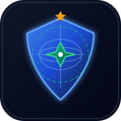

# 🗺️ AppSec Atlas

### *The World's Most Comprehensive Open-Source Security Knowledge Base*

**Map the entire security landscape. One repo. Zero excuses.**

 

[🌐 Website](https://appsecatlas.com) · [📚 Browse Guides](#-guides) · [🗺️ Learning Paths](#-learning-paths) · [🤝 Contribute](CONTRIBUTING.md) · [💬 Discord](https://discord.gg/appsecatlas) · [💝 Sponsor](https://github.com/sponsors/AnimeshShaw)

---

## 🌟 Why AppSec Atlas?

AppSec Atlas is the **only** open-source security knowledge base that covers the **full spectrum** of modern security — from timeless application security fundamentals to the bleeding edge of AI/LLM security.

| Feature | AppSec Atlas | Other Resources |
|---------|:---:|:---:|
| Covers AI/LLM Security deeply | ✅ | ❌ |
| Real code — exploits AND fixes | ✅ | Partial |
| MCP & Agentic AI Security | ✅ | ❌ |
| Hands-on Docker labs | ✅ | Partial |
| Role-based learning paths | ✅ | Partial |
| 100% Free, no paywalls | ✅ | ✅ |
| Active community & Discord | ✅ | Varies |

> **45 guides. 9 security domains. One atlas.**

---

## 📚 Guides

### 🏗️ [Section 1: Foundational Security](docs/01-foundational/)
> Core concepts every security professional and developer must know

| Guide | Status | Level |
|-------|--------|-------|
| [OWASP Top 10 Deep Dive](docs/01-foundational/owasp-top-10/) | ✅ Available | Beginner |
| [Secure Coding Practices](docs/01-foundational/secure-coding/) | ✅ Available | Beginner |
| [Cryptography for Developers](docs/01-foundational/cryptography/) | ✅ Available | Intermediate |
| [Authentication & Authorization Masterclass](docs/01-foundational/auth-and-authz/) | ✅ Available | Intermediate |
| [Zero Trust Architecture Guide](docs/01-foundational/zero-trust/) | ✅ Available | Advanced |
| [Security Design Patterns](docs/01-foundational/security-design-patterns/) | ✅ Available | Intermediate |

### 🌐 [Section 2: Web & API Security](docs/02-web-and-api/)
> From classic web vulnerabilities to modern API attack surfaces

| Guide | Status | Level |
|-------|--------|-------|
| [Web Application Security Handbook](docs/02-web-and-api/web-application-security/) | ✅ Available | Intermediate |
| [API Security Guide](docs/02-web-and-api/api-security/) | ✅ Available | Intermediate |
| [Frontend Security Playbook](docs/02-web-and-api/frontend-security/) | ✅ Available | Intermediate |
| [Mobile App Security Guide](docs/02-web-and-api/mobile-security/) | ✅ Available | Intermediate |
| [CORS & Same-Origin Policy Explained](docs/02-web-and-api/cors-and-sop/) | ✅ Available | Beginner |

### ☁️ [Section 3: Cloud & Infrastructure Security](docs/03-cloud-and-infra/)
> Securing modern cloud-native and infrastructure environments

| Guide | Status | Level |
|-------|--------|-------|
| [Cloud Security Fundamentals](docs/03-cloud-and-infra/cloud-security/) | ✅ Available | Intermediate |
| [Container & Kubernetes Security](docs/03-cloud-and-infra/container-kubernetes/) | ✅ Available | Intermediate |
| [Infrastructure as Code Security](docs/03-cloud-and-infra/iac-security/) | ✅ Available | Intermediate |
| [Serverless Security Guide](docs/03-cloud-and-infra/serverless-security/) | ✅ Available | Intermediate |
| [CI/CD Pipeline Security](docs/03-cloud-and-infra/cicd-pipeline-security/) | ✅ Available | Intermediate |
| [Secrets Management Guide](docs/03-cloud-and-infra/secrets-management/) | ✅ Available | Intermediate |

### 🤖 [Section 4: AI/ML Security](docs/04-ai-ml-security/) ⭐ *Our Flagship*
> The most comprehensive open-source AI security resource — from LLMs to agentic systems

| Guide | Status | Level |
|-------|--------|-------|
| [Agentic AI Security Guide](docs/04-ai-ml-security/agentic-ai-security/) | ✅ Available | Advanced |
| [LLM Security & Prompt Injection](docs/04-ai-ml-security/llm-prompt-injection/) | ✅ Available | Intermediate |
| [ML Model Security & Adversarial Attacks](docs/04-ai-ml-security/ml-model-security/) | ✅ Available | Advanced |
| [RAG Security Guide](docs/04-ai-ml-security/rag-security/) | ✅ Available | Advanced |
| [AI Red Teaming Playbook](docs/04-ai-ml-security/ai-red-teaming/) | ✅ Available | Advanced |
| [MCP & Tool-Use Security](docs/04-ai-ml-security/mcp-tool-security/) | ✅ Available | Advanced |

### 🔴 [Section 5: Offensive Security](docs/05-offensive/)
> Red team techniques, penetration testing, and ethical hacking

| Guide | Status | Level |
|-------|--------|-------|
| [Penetration Testing Methodology](docs/05-offensive/penetration-testing/) | ✅ Available | Intermediate |
| [Social Engineering & Phishing](docs/05-offensive/social-engineering/) | ✅ Available | Beginner |
| [Network Security & Attack Techniques](docs/05-offensive/network-attacks/) | ✅ Available | Intermediate |
| [Bug Bounty Hunting Guide](docs/05-offensive/bug-bounty/) | 📋 Planned | Intermediate |
| [CTF Learning Guide](docs/05-offensive/ctf-guide/) | 📋 Planned | Beginner |

### 🔵 [Section 6: Defensive Security](docs/06-defensive/)
> Blue team operations, incident response, and threat detection

| Guide | Status | Level |
|-------|--------|-------|
| [Incident Response Playbook](docs/06-defensive/incident-response/) | ✅ Available | Intermediate |
| [Security Logging & Monitoring](docs/06-defensive/logging-and-monitoring/) | ✅ Available | Intermediate |
| [Digital Forensics Basics](docs/06-defensive/digital-forensics/) | 📋 Planned | Intermediate |
| [Vulnerability Management Guide](docs/06-defensive/vulnerability-management/) | 📋 Planned | Intermediate |
| [SOC Operations Guide](docs/06-defensive/soc-operations/) | 📋 Planned | Advanced |

### 🔐 [Section 7: Specialized Domains](docs/07-specialized/)
> Niche but critical security domains

| Guide | Status | Level |
|-------|--------|-------|
| [Software Supply Chain Security](docs/07-specialized/supply-chain-security/) | ✅ Available | Advanced |
| [Blockchain & Smart Contract Security](docs/07-specialized/blockchain-security/) | 📋 Planned | Advanced |
| [IoT Security Guide](docs/07-specialized/iot-security/) | 📋 Planned | Intermediate |
| [Privacy Engineering Guide](docs/07-specialized/privacy-engineering/) | 📋 Planned | Intermediate |
| [Hardware Security Basics](docs/07-specialized/hardware-security/) | 📋 Planned | Advanced |
| [Browser Extension Security](docs/07-specialized/browser-extension-security/) | 📋 Planned | Intermediate |

### 📋 [Section 8: Compliance & Governance](docs/08-compliance/)
> Frameworks, standards, and regulatory compliance

| Guide | Status | Level |
|-------|--------|-------|
| [NIST Cybersecurity Framework Guide](docs/08-compliance/nist-csf/) | 📋 Planned | Intermediate |
| [SOC 2 Compliance Guide](docs/08-compliance/soc2-guide/) | 📋 Planned | Intermediate |
| [GDPR Technical Implementation](docs/08-compliance/gdpr-technical/) | 📋 Planned | Intermediate |
| [DevSecOps Handbook](docs/08-compliance/devsecops-handbook/) | ✅ Available | Intermediate |

### 🧪 [Section 9: Hands-On Labs](docs/09-hands-on/)
> Practice makes perfect — build your skills with real exercises

| Guide | Status | Level |
|-------|--------|-------|
| [CTF Challenge Set](docs/09-hands-on/ctf-challenges/) | 📋 Planned | All Levels |
| [Vulnerable App Lab](docs/09-hands-on/vulnerable-app-lab/) | 📋 Planned | All Levels |
| [Security Code Review Guide](docs/09-hands-on/code-review-guide/) | 📋 Planned | Intermediate |

---

## 🗺️ Learning Paths

Not sure where to start? Pick your role:

| I am a... | Start here |
|-----------|-----------|
| 🧑‍💻 **Developer** wanting to write secure code | [Secure Coding](docs/01-foundational/secure-coding/) → [OWASP Top 10](docs/01-foundational/owasp-top-10/) → [API Security](docs/02-web-and-api/api-security/) |
| ☁️ **Cloud Engineer** | [Secrets Management](docs/03-cloud-and-infra/secrets-management/) → [CI/CD Security](docs/03-cloud-and-infra/cicd-pipeline-security/) → [Cloud Security](docs/03-cloud-and-infra/cloud-security/) |
| 🤖 **AI/ML Engineer** | [Agentic AI Security](docs/04-ai-ml-security/agentic-ai-security/) → [LLM Security](docs/04-ai-ml-security/llm-prompt-injection/) → [RAG Security](docs/04-ai-ml-security/rag-security/) |
| 🔴 **Aspiring Pentester** | [OWASP Top 10](docs/01-foundational/owasp-top-10/) → [Web App Security](docs/02-web-and-api/web-application-security/) → [Pentest Methodology](docs/05-offensive/penetration-testing/) |
| 🔵 **Blue Teamer / SOC Analyst** | [Logging & Monitoring](docs/06-defensive/logging-and-monitoring/) → [IR Playbook](docs/06-defensive/incident-response/) → [Vulnerability Management](docs/06-defensive/vulnerability-management/) |
| 🎓 **Complete Beginner** | [OWASP Top 10](docs/01-foundational/owasp-top-10/) → [Auth & AuthZ](docs/01-foundational/auth-and-authz/) → [CTF Guide](docs/05-offensive/ctf-guide/) |

---

## 📋 Checklists

Quick-reference printable checklists for common security tasks:

- 📄 [Web Application Security Checklist](checklists/web-app-checklist.md)
- 📄 [API Security Checklist](checklists/api-security-checklist.md)
- 📄 [Cloud Deployment Checklist](checklists/cloud-deployment-checklist.md)
- 📄 [Code Review Security Checklist](checklists/code-review-checklist.md)
- 📄 [Incident Response Checklist](checklists/incident-response-checklist.md)

---

## 🤝 Contributing

AppSec Atlas is built by the community, for the community. Every contribution matters.

**Ways to contribute:**
- ✍️ Write or improve a guide
- 🐛 Fix errors, typos, outdated information
- 🧪 Add lab exercises or CTF challenges
- 🌍 Translate guides to other languages
- ⭐ Star the repo and spread the word

Read [CONTRIBUTING.md](CONTRIBUTING.md) to get started. First-time contributors: look for issues labeled [`good first issue`](https://github.com/AnimeshShaw/AppSec-Atlas/issues?q=label%3A%22good+first+issue%22).

---

## 💝 Support This Project

AppSec Atlas is 100% free and open-source. If it helps you, consider supporting it:

- ⭐ **Star this repo** — it helps more people discover the Atlas
- 💝 **[GitHub Sponsors](https://github.com/sponsors/AnimeshShaw)** — sustain ongoing development
- ☕ **[Ko-fi](https://ko-fi.com/appsecatlas)** — buy the team a coffee
- 🏢 **[Corporate Sponsorship](https://appsecatlas.com/sponsor)** — logo in README + more

---

## 📜 License

All guides and content in this repository are licensed under [Creative Commons Attribution 4.0 International (CC BY 4.0)](LICENSE).

You are free to share and adapt the material for any purpose, even commercially, as long as you give appropriate credit.

---

**Built with ❤️ by the security community, for the security community.**

[🌐 appsecatlas.com](https://appsecatlas.com) · [Discord](https://discord.gg/appsecatlas) · [Twitter](https://twitter.com/appsecatlas)

*If AppSec Atlas helped you, please ⭐ star it to help others find it.*

