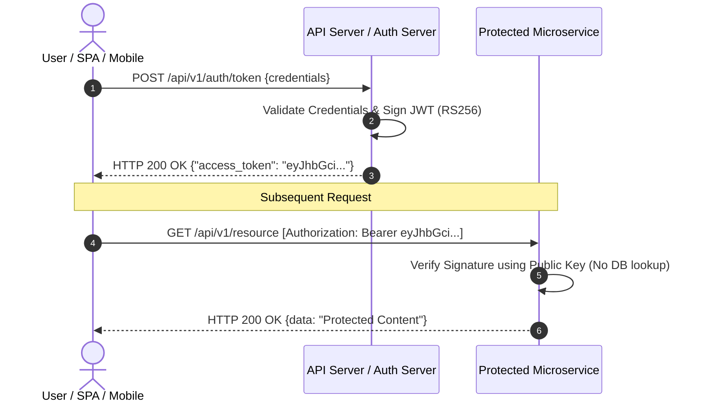

# 01 - Introduction to Authentication & Authorization

Identity management is the fundamental pillar of modern application security. In any computing ecosystem, securing system boundaries begins by separating two distinct operations: **Authentication (AuthN)** and **Authorization (AuthZ)**.

> [!IMPORTANT]
> **Authentication precedes Authorization:** Authentication establishes *who* an entity is. Authorization determines *what* actions that authenticated entity is permitted to execute. Conflating these two concepts leads to critical security design flaws, such as using identity tokens for access control or trusting unverified user assertions.

---

## 1. AuthN vs AuthZ: Comprehensive Comparison

Understanding the exact boundary between AuthN and AuthZ is necessary for building resilient access control systems.

| Attribute | Authentication (AuthN) | Authorization (AuthZ) |
| :--- | :--- | :--- |
| **Core Question** | *"Who are you?"* | *"What are you allowed to do?"* |
| **Primary Objective** | Establish and verify entity identity | Enforce access rules and policy constraints |
| **Data Handled** | Credentials, Passwords, Biometrics, Keys, Id Tokens | Roles, Permissions, Attributes, Relationships, Scope |
| **Protocol Standards** | OpenID Connect (OIDC), SAML 2.0, FIDO2/WebAuthn | OAuth 2.0 (Scopes), XACML, Rego/OPA, Cedar |
| **Timing** | Performed upon initial login or session establishment | Evaluated continuously on every API/resource request |
| **Failure Mode** | `401 Unauthorized` (Unauthenticated) | `403 Forbidden` (Authenticated but unprivileged) |
| **Common Vulnerabilities** | Credential Stuffing, Brute Force, Session Hijacking | BOLA/IDOR, BFLA, Privilege Escalation |

---

## 2. Authentication (AuthN) Mechanics & Factors

Authentication relies on presenting proof of identity across one or more **Authentication Factors**:

```
                  ┌───────────────────────────────────────────┐
                  │          AUTHENTICATION FACTORS           │
                  └─────────────────────┬─────────────────────┘
                                        │
         ┌──────────────────────────────┼──────────────────────────────┐
         ▼                              ▼                              ▼
┌──────────────────┐           ┌──────────────────┐           ┌──────────────────┐
│    KNOWLEDGE     │           │    POSSESSION    │           │    INHERENCE     │
│  "Something You  │           │  "Something You  │           │  "Something You  │
│      Know"       │           │      Have"       │           │       Are"       │
├──────────────────┤           ├──────────────────┤           ├──────────────────┤
│ • Password / PIN │           │ • Hardware Key   │           │ • Fingerprint    │
│ • Security Qs    │           │   (YubiKey/FIDO2)│           │ • Facial Recog   │
│ • Passphrase     │           │ • Authenticator  │           │ • Retina Scan    │
│                  │           │   App (TOTP)     │           │ • Voice Pattern  │
│                  │           │ • SMS / Push     │           │                  │
└──────────────────┘           └──────────────────┘           └──────────────────┘
```

### NIST SP 800-63B Authenticator Assurance Levels (AAL)
The National Institute of Standards and Technology (NIST) classifies identity verification into three assurance levels:
- **AAL1 (Single-Factor):** Requires single-factor authentication (e.g., password only). High vulnerability to credential theft.
- **AAL2 (Multi-Factor):** Requires two distinct authentication factors (e.g., password + TOTP authenticator app). Protects against automated mass attacks.
- **AAL3 (Hardware MFA):** Requires key-based hardware authenticators (e.g., FIDO2 YubiKey) with cryptographic proof of possession. Fully phishing-resistant.

---

## 3. Session-based vs Token-based Architecture

Web and API applications generally implement one of two paradigm models for maintaining authentication state across requests: **Stateful Session-based** or **Stateless Token-based**.

### A. Session-based Authentication (Stateful)

In traditional stateful architecture, the server maintains identity state in server memory or a centralized session store (e.g., Redis).

```mermaid
sequenceDiagram
    autonumber
    actor Client as User / Browser
    participant App as Web Server
    participant DB as Session Store (Redis)

    Client->>App: POST /login {username, password}
    App->>App: Validate Credentials
    App->>DB: Store Session ID -> {user_id: 101, role: "admin"}
    App-->>Client: HTTP 200 OK [Set-Cookie: session_id=xyz123; HttpOnly; Secure; SameSite=Strict]
    
    Note over Client,App: Subsequent Request
    Client->>App: GET /dashboard [Cookie: session_id=xyz123]
    App->>DB: Query Session ID "xyz123"
    DB-->>App: Return {user_id: 101, role: "admin"}
    App-->>Client: HTTP 200 OK (Render Dashboard)
```

### B. Token-based Authentication (Stateless)

In stateless token architecture, identity state is cryptographically signed and encapsulated inside a self-contained token (e.g., JSON Web Token) held by the client.



---

## 4. Deep Technical Tradeoff Matrix

Choosing between Stateful Sessions and Stateless Tokens involves critical security and architectural tradeoffs:

| Dimension | Stateful Sessions (Cookies + Server Store) | Stateless Tokens (Bearer JWTs) |
| :--- | :--- | :--- |
| **State Location** | Centralized server side (Redis / Database) | Distributed client side (LocalStorage / Cookies) |
| **Server Overhead** | RAM/Storage lookup per request | Cryptographic verification (CPU) per request |
| **Revocation Capability** | **Instantaneous**: Delete key from Redis store | **Difficult**: Token valid until `exp` unless revoking via CRL/Redis blacklists |
| **Cross-Site Attack Vector** | Susceptible to **CSRF** if missing `SameSite` flags | Susceptible to **XSS** token theft if stored in `LocalStorage` |
| **Scalability** | Requires session replication or centralized fast key-value store | **Infinite Horizontal Scale**: Microservices verify signatures independently |
| **Payload Overhead** | Tiny cookie footprint (~32 bytes Session ID) | Large payload (500+ bytes carrying claims & signatures) |
| **Microservice Fit** | High database coupling across services | Decoupled; microservices consume identity claims natively |

> [!WARNING]
> **The Stateless Revocation Myth:** Purely stateless JWTs cannot be revoked instantly without maintaining state on the backend (such as a Token Revocation List or Redis cache). If immediate session termination is a strict business requirement, pure statelessness must be compromised.

---

## 5. Threat Landscape & OWASP Mapping

Flaws in authentication and authorization represent the most critical vulnerabilities in application security today.

```
┌─────────────────────────────────────────────────────────────────────────────┐
│                       IDENTITY THREAT LANDSCAPE MATRIX                      │
├────────────────────────────────┬────────────────────────────────────────────┤
│ OWASP Category                 │ Failure Mode & Attack Vector               │
├────────────────────────────────┼────────────────────────────────────────────┤
│ A01:2021 - Broken Access       │ • BOLA / IDOR (User access to /user/102)   │
│ Control                        │ • BFLA (Regular user hits POST /admin/delete)│
│                                │ • Missing CORS / Improper Scope Checking   │
├────────────────────────────────┼────────────────────────────────────────────┤
│ A07:2021 - Identification &    │ • Credential Stuffing / Password Spraying  │
│ Authentication Failures        │ • Session Fixation (Reusing pre-login ID)  │
│                                │ • Weak Password Policy / Lack of MFA       │
│                                │ • Permissive JWT verification (alg: none)  │
└────────────────────────────────┴────────────────────────────────────────────┘
```

---

## 6. Identity Defense-in-Depth Architecture

To build a resilient identity architecture, enforce defense-in-depth across every boundary:

1. **Edge Enforcer (API Gateway):** Terminate SSL/TLS, enforce rate limits against brute force, reject malformed HTTP requests, validate TLS client certificates.
2. **Authentication Layer (IdP):** Enforce phishing-resistant MFA (WebAuthn/FIDO2), risk-based step-up auth, session timeout policies, and secure cookie attributes.
3. **Authorization Layer (Policy Decision Engine):** Decouple authorization logic using Policy-as-Code (OPA), validating context, resource ownership, and tenant isolation on every API request.
4. **Data Layer (Storage & Audit):** Store password hashes using memory-hard algorithms (Argon2id), salt every password, and maintain tamper-evident audit logs.

