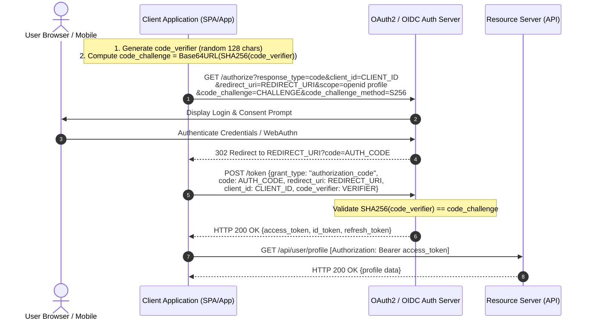

# 02 - Modern Authentication Protocols & Session Security

Modern authentication eliminates vulnerable, single-factor static password schemes in favor of standardized identity protocols (OAuth 2.0, OpenID Connect), phishing-resistant multi-factor authentication (FIDO2/WebAuthn), and secure session management patterns.

---

## 1. OAuth 2.0 & OpenID Connect (OIDC)

### Distinguishing OAuth 2.0 and OIDC
- **OAuth 2.0 (RFC 6749):** An **Authorization** framework enabling third-party applications to request limited access to user resources without sharing user credentials. OAuth 2.0 issues `access_tokens`.
- **OpenID Connect (OIDC Core 1.0):** An **Authentication** identity layer built directly on top of OAuth 2.0. OIDC introduces the `id_token` (a JWT), providing cryptographic assertions about the authenticated user's identity.

| Token Type | Purpose | Intended Recipient | Structure | Security Guidance |
| :--- | :--- | :--- | :--- | :--- |
| `access_token` | Grants access to API resources | Resource Server (API Gateway/Microservice) | Opaque or JWT | Never parse/validate on client side; send in HTTP Authorization Header |
| `id_token` | Proves user identity | Client Application (SPA/Mobile/Web) | JWT | Client must validate `iss`, `aud`, `exp`, and cryptographic signature |
| `refresh_token` | Obtains new access tokens | Authorization Server | Opaque String | Store securely; rotate on every exchange; bind to client ID |

---

### OAuth 2.0 Authorization Code Flow with PKCE

Proof Key for Code Exchange (**PKCE**, RFC 7636) is mandatory for both public clients (SPAs, Mobile Apps) and confidential clients to eliminate authorization code injection attacks.



> [!CAUTION]
> **Deprecated OAuth Grant Types:**
> - **Implicit Grant (`response_type=token`):** Deprecated due to token leakage in URL fragments and referrer headers.
> - **Resource Owner Password Credentials (ROPC):** Deprecated because it forces users to share raw passwords with client applications, bypassing MFA.

---

## 2. Multi-Factor Authentication (MFA) & Passkeys

To satisfy NIST AAL2/AAL3 requirements, applications must mandate secondary authentication factors.

```
                      ┌─────────────────────────────────────────┐
                      │    MULTI-FACTOR AUTHENTICATION (MFA)    │
                      └────────────────────┬────────────────────┘
                                           │
                    ┌──────────────────────┴──────────────────────┐
                    ▼                                             ▼
       ┌──────────────────────────┐                  ┌──────────────────────────┐
       │   TIME-BASED ONE-TIME    │                  │      FIDO2 / WEBAUTHN    │
       │     PASSWORDS (TOTP)     │                  │        (PASSKEYS)        │
       ├──────────────────────────┤                  ├──────────────────────────┤
       │ • RFC 6238 Standard       │                  │ • W3C / FIDO Alliance    │
       │ • Shared HMAC Secret Key │                  │ • Asymmetric Key Pairs   │
       │ • 30-Second Time Windows │                  │ • Hardware Secure Element│
       │ • Vulnerable to Real-Time │                  │ • Origin-Bound (Phishing │
       │   Phishing / Reverse Proxy│                  │   Resistant AAL3)        │
       └──────────────────────────┘                  └──────────────────────────┘
```

### TOTP Mechanics (RFC 6238)
TOTP computes a one-time code based on a shared secret key `K` and current unix time `T`:

```text
T_0 = 0, X = 30 seconds, T = floor((Current Time - T_0) / X)
TOTP = Truncate(HMAC-SHA1(K, T)) mod 10^6
```

### FIDO2 / WebAuthn (Passkeys)
WebAuthn provides asymmetric public-key cryptography bound strictly to the origin domain (`rpId`).
1. **Registration:** Device generates a unique public/private keypair. The public key is sent to the server. The private key remains locked inside the device hardware (TPM/Secure Enclave).
2. **Authentication:** The server sends a random cryptographic challenge. The client device signs the challenge using the private key after user biometric/PIN verification. The server verifies the signature using the stored public key.

---

## 3. Session Management & Cookie Security

When building web applications utilizing HTTP cookies for session persistence, specific security flags must be configured.

### Production Cookie Attribute Reference

| Cookie Attribute | Security Value | Mitigation Function |
| :--- | :--- | :--- |
| `HttpOnly` | `true` | Prevents JavaScript (`document.cookie`) from accessing the cookie, neutralizing XSS session theft. |
| `Secure` | `true` | Ensures cookies are transmitted exclusively over encrypted HTTPS connections. |
| `SameSite` | `Strict` or `Lax` | Restricts cross-site cookie transmission, defending against Cross-Site Request Forgery (CSRF). |
| `Domain` | Exact FQDN | Restricting domain scope prevents subdomains from reading parent cookies. |
| `Path` | `/` | Restricts cookie availability to specified URI paths. |
| Prefix `__Host-` | Must prepend name | Mandates `Secure`, no `Domain` attribute set, and `Path=/`. Highest security isolation. |

```http
Set-Cookie: __Host-sessionId=e83a9f02c41d; Secure; HttpOnly; SameSite=Strict; Path=/; Max-Age=3600
```

> [!TIP]
> **Session Fixation Defense:** Always generate a completely new session identifier immediately upon successful user credential verification (`session.regenerate()`). Never preserve pre-login session IDs.

---

## 4. Multi-Language Secure Session Implementation

Below are production-grade implementations of secure session management across major runtime environments.

### A. Python (Flask + Redis + Secure Cookies)

```python
import os
from flask import Flask, request, session, jsonify
from flask_session import Session
import redis

app = Flask(__name__)

# Enforce secure session storage in Redis
app.config.update(
    SECRET_KEY=os.environ.get('SESSION_SECRET_KEY', 'super-secret-random-32-byte-key'),
    SESSION_TYPE='redis',
    SESSION_REDIS=redis.from_url(os.environ.get('REDIS_URL', 'redis://localhost:6379/0')),
    SESSION_COOKIE_NAME='__Host-session',
    SESSION_COOKIE_HTTPONLY=True,
    SESSION_COOKIE_SECURE=True,
    SESSION_COOKIE_SAMESITE='Strict',
    SESSION_PERMANENT=False,
    PERMANENT_SESSION_LIFETIME=1800  # 30 minute timeout
)

Session(app)

@app.route('/api/login', methods=['POST'])
def login():
    data = request.get_json()
    # Authenticate credentials against DB (Argon2id validation)
    if data.get('username') == 'admin' and data.get('password') == 'SecurePass123!':
        # Regenerate session ID to prevent Session Fixation
        session.clear()
        session['user_id'] = 'usr_102938'
        session['role'] = 'administrator'
        return jsonify({"status": "authenticated"}), 200
    return jsonify({"error": "Invalid credentials"}), 401

@app.route('/api/logout', methods=['POST'])
def logout():
    session.clear()  # Destroy session in Redis
    return jsonify({"status": "logged_out"}), 200
```

---

### B. Node.js (Express + Redis Session Store)

```javascript
const express = require('express');
const session = require('express-session');
const RedisStore = require('connect-redis').default;
const redis = require('redis');

const app = express();
app.use(express.json());

const redisClient = redis.createClient({ url: process.env.REDIS_URL || 'redis://localhost:6379' });
redisClient.connect().catch(console.error);

app.use(session({
  store: new RedisStore({ client: redisClient }),
  name: '__Host-sessionId',
  secret: process.env.SESSION_SECRET || 'complex-production-secret-key-32chars',
  resave: false,
  saveUninitialized: false,
  cookie: {
    httpOnly: true,
    secure: true,
    sameSite: 'strict',
    path: '/',
    maxAge: 1800000 // 30 minutes
  }
}));

app.post('/api/login', (req, res, next) => {
  const { username, password } = req.body;
  // Authenticate user credentials...
  if (username === 'admin' && password === 'ValidPassword123!') {
    // Regenerate session to prevent session fixation
    req.session.regenerate((err) => {
      if (err) return next(err);
      req.session.userId = 'usr_102938';
      req.session.role = 'admin';
      res.json({ message: 'Login successful' });
    });
  } else {
    res.status(401).json({ error: 'Unauthorized' });
  }
});
```

---

### C. Go (`net/http` + Gorilla Sessions + Cookie Hardening)

```go
package main

import (
	"net/http"
	"os"

	"github.com/gorilla/sessions"
)

var store = sessions.NewCookieStore([]byte(os.Getenv("SESSION_SECRET")))

func init() {
	store.Options = &sessions.Options{
		Path:     "/",
		MaxAge:   1800, // 30 minutes
		HttpOnly: true,
		Secure:   true,
		SameSite: http.SameSiteStrictMode,
	}
}

func loginHandler(w http.ResponseWriter, r *http.Request) {
	if r.Method != http.MethodPost {
		http.Error(w, "Method not allowed", http.StatusMethodNotAllowed)
		return
	}

	// Validate credentials...
	session, _ := store.Get(r, "__Host-session")
	
	// Set session claims
	session.Values["authenticated"] = true
	session.Values["user_id"] = "usr_102938"

	// Save session cookie with strict flags
	err := session.Save(r, w)
	if err != nil {
		http.Error(w, err.Error(), http.StatusInternalServerError)
		return
	}
	w.WriteHeader(http.StatusOK)
	w.Write([]byte(`{"status":"success"}`))
}
```

---

### D. Java (Spring Security 6 Session Hardening Configuration)

```java
package com.appsec.config;

import org.springframework.context.annotation.Bean;
import org.springframework.context.annotation.Configuration;
import org.springframework.security.config.annotation.web.builders.HttpSecurity;
import org.springframework.security.config.http.SessionCreationPolicy;
import org.springframework.security.web.SecurityFilterChain;
import org.springframework.security.web.authentication.session.ChangeSessionIdAuthenticationStrategy;

@Configuration
public class SecurityConfig {

    @Bean
    public SecurityFilterChain filterChain(HttpSecurity http) throws Exception {
        http
            .csrf(csrf -> csrf.csrfTokenRepository(CookieCsrfTokenRepository.withHttpOnlyFalse()))
            .sessionManagement(session -> session
                .sessionCreationPolicy(SessionCreationPolicy.IF_REQUIRED)
                .sessionFixation(sessionFixation -> sessionFixation.changeSessionId()) // Session Fixation Protection
                .maximumSessions(1) // Limit single concurrent session per user
                .maxSessionsPreventsLogin(true)
            );

        return http.build();
    }
}
```

