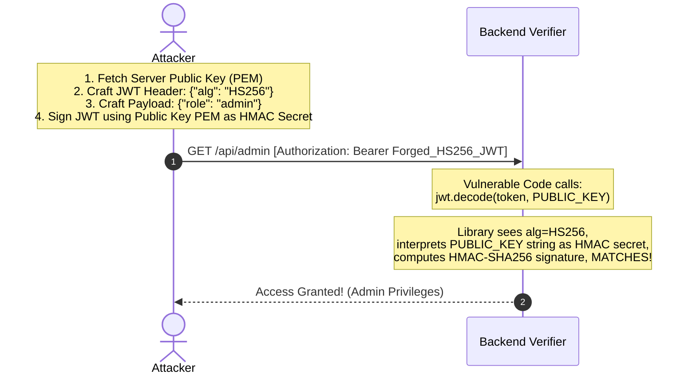
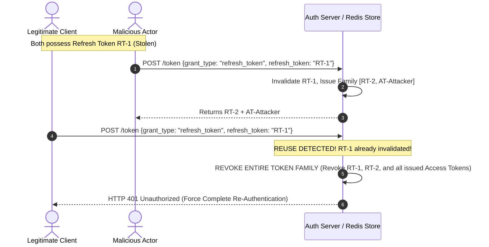

# 03 - JWT Security Masterclass & Cryptographic Exploitation

JSON Web Tokens (**JWT**, RFC 7519) are compact, URL-safe tokens widely utilized for stateless authentication and authorization. However, subtle flaws in token verification logic, key management, or header parsing can completely bypass authentication controls.

---

## 1. JWT Architecture & Standard Claims

A JSON Web Signature (**JWS**) consists of three Base64URL-encoded components separated by periods (`.`):

```
┌─────────────────────────┐   ┌─────────────────────────┐   ┌─────────────────────────┐
│         HEADER          │   │         PAYLOAD         │   │        SIGNATURE        │
├─────────────────────────┤   ├─────────────────────────┤   ├─────────────────────────┤
│ {                       │   │ {                       │   │ HMACSHA256(             │
│   "alg": "RS256",       │ . │   "sub": "usr_102938",  │ . │   base64Url(Header) +   │
│   "typ": "JWT",         │   │   "role": "admin",      │   │   "." +                 │
│   "kid": "key-2026-v1"  │   │   "exp": 1774500000     │   │   base64Url(Payload),   │
│ }                       │   │ }                       │   │   Secret / PrivateKey   │
└─────────────────────────┘   └─────────────────────────┘   │ )                       │
                                                            └─────────────────────────┘
```

### Registered Standard Claims (RFC 7519)
- `iss` (Issuer): Identifies the principal that issued the JWT (e.g., `https://auth.example.com`).
- `sub` (Subject): Identifies the principal subject of the JWT (e.g., User ID `usr_102938`).
- `aud` (Audience): Identifies the recipient services the JWT is intended for (e.g., `https://api.example.com`).
- `exp` (Expiration Time): Unix timestamp after which the token must be rejected.
- `nbf` (Not Before): Unix timestamp before which the token must not be accepted.
- `iat` (Issued At): Unix timestamp when the token was created.
- `jti` (JWT ID): Unique identifier for the token, used for replay prevention.

---

## 2. Cryptographic Vulnerabilities & Exploitation

### A. The `alg: none` Signature Bypass

The JWS specification permits an algorithm header value of `none` for unsigned tokens (used in debugging). If a backend verifier fails to explicitly specify allowed algorithms, attackers can alter the payload and set `alg: "none"`, bypassing signature checks.

**Forged Exploit Token Payload:**
```text
eyJhbGciOiJub25lIiwidHlwIjoiSldUIn0.eyJzdWIiOiJ1c3JfMTAyOTM4Iiwicm9sZSI6ImFkbWluIn0.
```

> [!CAUTION]
> **Case Sensitivity Bypasses:** Some outdated JWT libraries check for `alg != "none"` via case-sensitive string comparison. Attackers bypass this check using case variations such as `"alg": "None"`, `"nOnE"`, or `"NONE"`.

---

### B. RSA-to-HMAC Algorithm Confusion Attack (RS256 `$\rightarrow$` HS256)

When an application expects an asymmetric RS256 token (signed with a private key and verified with a public key), an attacker can change the algorithm header to **`HS256`** (symmetric HMAC).



**Mitigation:** The verification function MUST enforce the algorithm parameter dynamically or statically (e.g., hardcode `algorithms=["RS256"]`).

---

### C. `kid` (Key ID) Header Injections

The `kid` header tells the server which key to fetch from a database or file path to verify the token.

1. **Path Traversal in `kid`:**
   Setting `"kid": "../../../../../dev/null"` forces the server to use an empty file as the secret key. The attacker then signs the token using an empty key (`""`) via HMAC.
2. **SQL Injection in `kid`:**
   Setting `"kid": "' UNION SELECT 'my_secret_key' --"` injects an SQL payload. If the backend queries `SELECT key FROM keys WHERE id = 'kid'`, it returns `'my_secret_key'`, which the attacker used to sign the forged payload.
3. **Command Injection in `kid`:**
   If the backend passes `kid` to an unescaped shell script (e.g., `exec("keytool -list -alias " + kid)`), remote code execution occurs.

---

### D. Header Injection via `jku` and `x5u`

- `jku` (JWK Set URL): Points to a set of public keys in JSON format.
- `x5u` (X.509 URL): Points to an X.509 public key certificate.

**Attack Vector:** If the server automatically fetches keys from the `jku` URL specified in an untrusted JWT header, an attacker can host their own key set (`https://attacker.com/jwks.json`) and sign tokens using their own private key.

**Mitigation:** Whitelist allowed domains for `jku`/`x5u` URLs or disable remote key resolution entirely.

---

## 3. Refresh Token Rotation Architecture

Because access tokens should be short-lived (e.g., 15 minutes), applications use long-lived Refresh Tokens. If a refresh token is stolen, an attacker could maintain persistent access. **Refresh Token Rotation** revokes the entire token family if token reuse is detected.



---

## 4. Multi-Language Secure Verification Patterns

### A. Python (PyJWT Production Pattern)

```python
import jwt

PUBLIC_KEY = """-----BEGIN PUBLIC KEY-----
MIIBIjANBgkqhkiG9w0BAQEFAAOCAQ8AMIIBCgKCAQEAz5...
-----END PUBLIC KEY-----"""

def verify_access_token(token_string: str) -> dict:
    try:
        # Enforce exact algorithm, issuer, and audience
        payload = jwt.decode(
            token_string,
            PUBLIC_KEY,
            algorithms=["RS256"],  # Strict whitelist (mitigates alg:none and Key Confusion)
            options={
                "verify_signature": True,
                "verify_exp": True,
                "verify_iss": True,
                "verify_aud": True,
                "require": ["exp", "iss", "aud", "sub"]
            },
            issuer="https://auth.example.com",
            audience="https://api.example.com"
        )
        return payload
    except jwt.ExpiredSignatureError:
        raise Exception("Token has expired")
    except jwt.InvalidTokenError as e:
        raise Exception(f"Cryptographic verification failed: {str(e)}")
```

---

### B. Node.js (`jose` Library Pattern)

```javascript
const { jwtVerify, createRemoteJWKSet } = require('jose');

// Remote JWKS fetching with strict caching and domain verification
const JWKS = createRemoteJWKSet(new URL('https://auth.example.com/.well-known/jwks.json'));

async function verifyToken(jwtString) {
  try {
    const { payload, protectedHeader } = await jwtVerify(jwtString, JWKS, {
      issuer: 'https://auth.example.com',
      audience: 'https://api.example.com',
      algorithms: ['RS256'] // Explicit algorithm enforcement
    });
    return payload;
  } catch (error) {
    console.error('JWT Verification Failed:', error.message);
    throw new Error('Unauthorized Token');
  }
}
```

---

### C. Go (`golang-jwt/jwt/v5` Pattern)

```go
package main

import (
	"crypto/rsa"
	"fmt"
	"github.com/golang-jwt/jwt/v5"
)

var verifyKey *rsa.PublicKey

func VerifyJWT(tokenString string) (*jwt.MapClaims, error) {
	token, err := jwt.Parse(tokenString, func(token *jwt.Token) (interface{}, error) {
		// Enforce signature method explicitly (Mitigates Key Confusion Attack)
		if _, ok := token.Method.(*jwt.SigningMethodRSA); !ok {
			return nil, fmt.Errorf("unexpected signing algorithm: %v", token.Header["alg"])
		}
		return verifyKey, nil
	}, jwt.WithIssuer("https://auth.example.com"),
	   jwt.WithAudience("https://api.example.com"),
	   jwt.WithExpirationRequired())

	if err != nil || !token.Valid {
		return nil, fmt.Errorf("invalid token: %v", err)
	}

	claims, ok := token.Claims.(jwt.MapClaims)
	if !ok {
		return nil, fmt.Errorf("invalid claims type")
	}

	return &claims, nil
}
```

---

### D. Java (Nimbus JOSE + JWT Pattern)

```java
package com.appsec.jwt;

import com.nimbusds.jose.JWSAlgorithm;
import com.nimbusds.jose.jwk.source.RemoteJWKSet;
import com.nimbusds.jose.proc.JWSVerificationKeySelector;
import com.nimbusds.jose.proc.SecurityContext;
import com.nimbusds.jwt.JWTClaimsSet;
import com.nimbusds.jwt.proc.DefaultJWTProcessor;

import java.net.URL;

public class JWTVerifier {

    private final DefaultJWTProcessor<SecurityContext> jwtProcessor;

    public JWTVerifier() throws Exception {
        jwtProcessor = new DefaultJWTProcessor<>();
        // Fetch remote JWKS
        URL jwksURL = new URL("https://auth.example.com/.well-known/jwks.json");
        RemoteJWKSet<SecurityContext> jwkSource = new RemoteJWKSet<>(jwksURL);
        
        // Require RS256 algorithm explicitly
        JWSVerificationKeySelector<SecurityContext> keySelector =
                new JWSVerificationKeySelector<>(JWSAlgorithm.RS256, jwkSource);
        jwtProcessor.setJWSKeySelector(keySelector);
    }

    public JWTClaimsSet validate(String token) throws Exception {
        SecurityContext ctx = null;
        JWTClaimsSet claims = jwtProcessor.process(token, ctx);
        
        if (!"https://auth.example.com".equals(claims.getIssuer())) {
            throw new SecurityException("Invalid Issuer");
        }
        return claims;
    }
}
```

