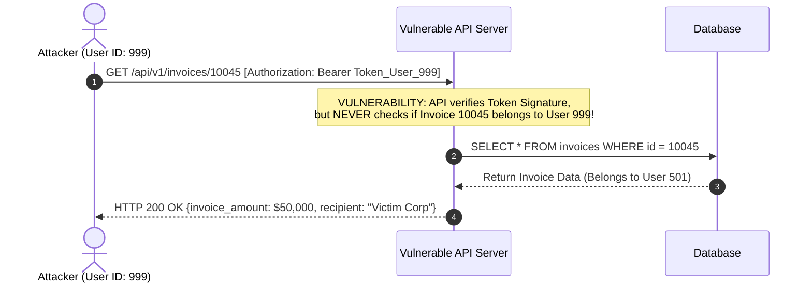

# 04 - Authorization Models & Policy-as-Code Architecture

Authorization enforces fine-grained security policies on every request. While authentication verifies *who* an actor is, authorization determines *what* operations that actor may execute on specific resources within defined context boundaries.

---

## 1. Authorization Paradigms: RBAC, ABAC, & ReBAC

```
                      ┌─────────────────────────────────────────┐
                      │          AUTHORIZATION MODELS           │
                      └────────────────────┬────────────────────┘
                                           │
         ┌─────────────────────────────────┼─────────────────────────────────┐
         ▼                                 ▼                                 ▼
┌──────────────────┐              ┌──────────────────┐              ┌──────────────────┐
│   ROLE-BASED     │              │  ATTRIBUTE-BASED │              │ RELATIONSHIP-BASE│
│  CONTROL (RBAC)  │              │  CONTROL (ABAC)  │              │   CONTROL (ReBAC)│
├──────────────────┤              ├──────────────────┤              ├──────────────────┤
│ • User -> Roles  │              │ • Subject, Action│              │ • Graph tuples   │
│ • Roles -> Perms │              │   Resource, Env  │              │ • Entity Rel     │
│ • Static groups  │              │ • Dynamic logic  │              │ • Google Zanzibar│
└──────────────────┘              └──────────────────┘              └──────────────────┘
```

### A. Role-Based Access Control (RBAC)
Permissions are assigned to abstract roles (e.g., `Admin`, `BillingManager`, `Auditor`), and users are assigned to one or more roles.
- **Hierarchical RBAC:** Roles inherit permissions from parent roles (e.g., `SuperAdmin` inherits all `OrgAdmin` permissions).
- **Limitation (Role Explosion):** RBAC cannot natively handle instance-level ownership. Creating roles like `Document_12_Editor` leads to unmanageable role proliferation.

---

### B. Attribute-Based Access Control (ABAC)
Access decisions are computed dynamically by evaluating boolean logic across four attribute categories:
1. **Subject Attributes:** User age, department, clearance level, IP subnet.
2. **Resource Attributes:** Resource sensitivity level, project ID, owner ID, file creation date.
3. **Action Attributes:** HTTP method (`GET`, `POST`, `DELETE`), Operation (`read`, `write`, `export`).
4. **Environment Attributes:** Time of request, geographic location, current threat level.

*Example ABAC Policy:* "Allow `read` if `Subject.department == Resource.department` AND `Resource.confidentiality == 'medium'` AND `Environment.time BETWEEN 09:00 AND 17:00`."

---

### C. Relationship-Based Access Control (ReBAC)
Based on Google's **Zanzibar** whitepaper (powering Google Drive/Cloud IAM), ReBAC models access as a directed graph of relationship tuples:

$$\text{tuple} = \langle \text{object} \rangle \# \langle \text{relation} \rangle @ \langle \text{user} \rangle$$

*Example tuples:*
- `doc:roadmap.pdf#owner@user:alice`
- `folder:strategy#parent@doc:roadmap.pdf`
- `folder:strategy#viewer@user:bob`

ReBAC resolves permissions dynamically by traversing relation graphs (e.g., "Bob can view `doc:roadmap.pdf` because Bob is a viewer of `folder:strategy`, which is the parent of `doc:roadmap.pdf`").

---

### Model Comparison Matrix

| Evaluation Dimension | Role-Based (RBAC) | Attribute-Based (ABAC) | Relationship-Based (ReBAC) |
| :--- | :--- | :--- | :--- |
| **Granularity Level** | Coarse-grained (Group level) | Fine-grained (Contextual) | Ultra Fine-grained (Object graph) |
| **Complexity** | Low | High (Complex rule engines) | High (Graph traversal stores) |
| **Performance Overhead** | $O(1)$ constant key lookup | $O(N)$ rule evaluation cost | $O(D)$ graph depth traversal |
| **Instance Ownership** | Poor (Requires role per object) | Excellent (Evaluates `user.id == doc.owner_id`) | Native (`doc#owner@user`) |
| **Industry Adoption** | Enterprise IT, Traditional Web | High-security financial/health systems | Modern SaaS platforms (Authzed, OpenFGA) |

---

## 2. Critical Access Control Flaws: BOLA & BFLA

### A. Broken Object Level Authorization (BOLA / IDOR)
BOLA occurs when an API exposes resource identifiers (e.g., `/api/v1/accounts/102938`) without verifying that the authenticated user owns or has explicit permission to access that specific object identifier.



**Remediation:** Always couple identity assertions with explicit database ownership queries or Policy Enforcement Point checks:
```python
# SECURE: Explicit ownership scope check
invoice = Invoice.query.filter_by(id=invoice_id, tenant_id=current_user.tenant_id).first_or_404()
```

---

### B. Broken Function Level Authorization (BFLA)
BFLA occurs when an application restricts administrative UI elements (hiding a "Delete User" button) but fails to enforce authorization checks on the backend API endpoints processing those operations (`DELETE /api/v1/users/501`).

---

## 3. Policy-as-Code with Open Policy Agent (OPA)

Decoupling authorization logic from application source code into a centralized Policy Decision Point (**PDP**) prevents fragmented access controls.

```mermaid
flowchart LR
    Client["Client / User Agent"] -->|"1. HTTP Request"| PEP["Policy Enforcement Point\n(API Gateway / Web Service)"]
    PEP -->|"2. Query Input JSON\n(user, action, resource, env)"| PDP["Policy Decision Point\n(OPA Engine)"]
    PDP -->|"3. Evaluate Rego Policy"| PolicyStore["Rego Policy Store"]
    PDP -->>|"4. Decision: {allow: true}"| PEP
    PEP -->|"5. Execute Request"| Microservice["Protected Microservice"]
```

---

### Production Rego Policy (`policy.rego`)

The following Rego policy enforces a combination of **RBAC**, **ABAC ownership**, and **Time Window** constraints:

```rego
package app.authz

import future.keywords.in
import future.keywords.every

# Default deny all access
default allow = false

# 1. SuperAdmin role can perform any action
allow {
    "super_admin" in input.user.roles
}

# 2. Document Owners can read/write their own documents
allow {
    input.action in ["read", "write"]
    input.resource.type == "document"
    input.resource.owner_id == input.user.id
}

# 3. Department Managers can read documents within their department during business hours
allow {
    input.action == "read"
    "manager" in input.user.roles
    input.user.department == input.resource.department
    is_business_hours
}

# Helper rule: Validate operational time window (08:00 to 18:00 UTC)
is_business_hours {
    ns_per_hour := 3600000000000
    current_hour := (input.time_ns / ns_per_hour) % 24
    current_hour >= 8
    current_hour < 18
}
```

---

## 4. Multi-Language OPA Client Integration

### A. Python Client Integration

```python
import requests
from flask import Flask, request, jsonify, g

app = Flask(__name__)
OPA_URL = "http://localhost:8181/v1/data/app/authz/allow"

def check_opa_authorization(user: dict, action: str, resource: dict) -> bool:
    import time
    payload = {
        "input": {
            "user": user,
            "action": action,
            "resource": resource,
            "time_ns": time.time_ns()
        }
    }
    try:
        response = requests.post(OPA_URL, json=payload, timeout=2.0)
        response.raise_for_status()
        result = response.json()
        return result.get("result", False) is True
    except requests.RequestException as e:
        # Fail closed on policy decision point error
        app.logger.error(f"OPA authorization lookup failed: {e}")
        return False

@app.route('/api/v1/documents/<doc_id>', methods=['GET'])
def get_document(doc_id):
    # Simulated request context
    current_user = {"id": "usr_102", "roles": ["user"], "department": "engineering"}
    document = {"id": doc_id, "type": "document", "owner_id": "usr_102", "department": "engineering"}

    if not check_opa_authorization(current_user, "read", document):
        return jsonify({"error": "Forbidden: Policy decision denied access"}), 403

    return jsonify({"document_id": doc_id, "content": "Sensitive Engineering Spec"}), 200
```

---

### B. Node.js Client Integration

```javascript
const axios = require('axios');

const OPA_URL = process.env.OPA_URL || 'http://localhost:8181/v1/data/app/authz/allow';

async function evaluatePolicy(user, action, resource) {
  try {
    const response = await axios.post(OPA_URL, {
      input: {
        user,
        action,
        resource,
        time_ns: Date.now() * 1000000
      }
    }, { timeout: 1500 });

    return response.data.result === true;
  } catch (error) {
    console.error('OPA Policy Evaluation Error:', error.message);
    return false; // Fail closed
  }
}

// Express Middleware Example
const authorizeMiddleware = (action) => async (req, res, next) => {
  const user = req.user; // Set by AuthN middleware
  const resource = { type: 'document', owner_id: req.params.ownerId, department: 'sales' };

  const isAllowed = await evaluatePolicy(user, action, resource);
  if (!isAllowed) {
    return res.status(403).json({ error: 'Access Denied by Policy Decision Engine' });
  }
  next();
};
```

---

### C. Go Client Integration (`opa/sdk`)

```go
package main

import (
	"context"
	"fmt"
	"github.com/open-policy-agent/opa/rego"
)

type Authorizer struct {
	query rego.PreparedEvalQuery
}

func NewAuthorizer(ctx context.Context, regoPolicy string) (*Authorizer, error) {
	r := rego.New(
		rego.Query("data.app.authz.allow"),
		rego.Module("policy.rego", regoPolicy),
	)
	query, err := r.PrepareForEval(ctx)
	if err != nil {
		return nil, err
	}
	return &Authorizer{query: query}, nil
}

func (a *Authorizer) IsAllowed(ctx context.Context, input map[string]interface{}) bool {
	results, err := a.query.Eval(ctx, rego.EvalInput(input))
	if err != nil || len(results) == 0 || len(results[0].Expressions) == 0 {
		return false // Fail closed
	}
	allowed, ok := results[0].Expressions[0].Value.(bool)
	return ok && allowed
}
```

