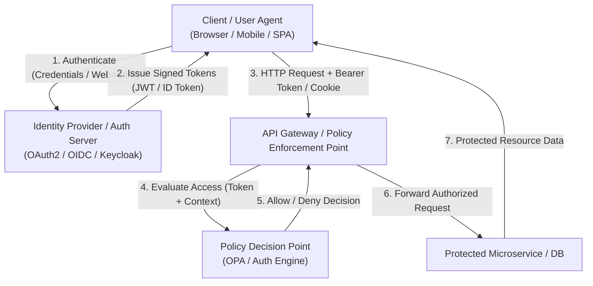

# Authentication & Authorization Masterclass

Welcome to the **Authentication & Authorization Masterclass**, an authoritative, engineering-focused guide designed to equip Application Security Engineers, Software Architects, and Developers with deep domain expertise in identity security.

> [!IMPORTANT]
> **Identity is the New Perimeter:** In modern cloud-native, microservice, and zero-trust architectures, traditional network perimeter defenses are insufficient. Authentication (AuthN) and Authorization (AuthZ) form the root trust layer for every request entering your infrastructure.

---

## Core Architecture Overview

The interaction between client applications, identity providers, and authorization decision engines follows a structured trust lifecycle:

---

## Module Roadmap & Navigation

| Chapter | Focus Area | Core Topics Covered | Practical Artifacts |
| :--- | :--- | :--- | :--- |
| **[01 - Introduction](01-introduction.md)** | Foundations & Threat Landscape | AuthN vs AuthZ, Stateful Sessions vs Stateless Tokens, NIST SP 800-63B, Threat Modeling | Comparative Tradeoff Matrix, Threat Vector Mapping |
| **[02 - Modern Authentication](02-modern-authentication.md)** | Protocols & Session Security | OAuth 2.0 PKCE, OIDC Core 1.0, FIDO2/WebAuthn, TOTP, Secure Cookie Flags, Session Revocation | Python, Node.js, Go, Java Production Code Patterns |
| **[03 - JWT Security Masterclass](03-jwt-security-masterclass.md)** | Cryptography & Exploitation | JWS/JWE Mechanics, `alg: none`, Key Confusion (RS256->HS256), `kid` Injection, JWKS Rotation, Refresh Token Rotation | Vulnerable vs Secure Code Patterns, PoC Exploits |
| **[04 - Authorization Models](04-authorization-models.md)** | Access Control Systems | RBAC, ABAC, ReBAC (Zanzibar), BOLA/IDOR Defenses, Policy-as-Code with Open Policy Agent (OPA) | Production Rego Policies & Multi-Language Client Integration |
| **[05 - Security Tools](05-auth-security-tools.md)** | Security Operations & Tooling | Keycloak Setup, ORY Hydra, OPA CLI/Sidecar, OAuth2-Proxy, Semgrep SAST Rules, `jwt_tool` CLI | Docker Compose Stack, Automated Audit Scripts |
| **[06 - Hands-on Lab](06-hands-on-lab.md)** | Offensive & Defensive Lab | Exploiting `alg: none` JWTs, Insecure Session Cookies, IDOR Attack Vectors, Hardened Backend Fixes | Self-Contained Flask Lab App & `exploit.py` Automation |
| **[07 - References](07-references.md)** | Industry Standards & Specs | RFC 6749, RFC 7519, RFC 7636, OWASP Cheat Sheets, NIST Guidelines, CVE Case Studies | Reference Index & Recommended Reading |

---

## Prerequisites

To gain maximum value from this guide, you should possess:
- **Networking Foundations:** Solid understanding of HTTP/HTTPS semantics, HTTP headers, request methods, status codes, and cookie management.
- **Architectural Concepts:** Basic understanding of client-server, REST API, SPA, and microservice architectures.
- **Programming Proficiency:** Ability to read and execute basic code snippets in Python, JavaScript/Node.js, Go, or Java.

## Learning Objectives

By completing this module, you will be able to:
1. **Dissect and Design Auth Systems:** Differentiate between AuthN and AuthZ mechanisms, selecting optimal architectures (Stateful Sessions vs Stateless JWTs) based on security and operational constraints.
2. **Implement Hardened Authentication:** Deploy OAuth 2.0 with PKCE, OpenID Connect, and phishing-resistant FIDO2/WebAuthn authentication flows.
3. **Audit & Exploit Token Flaws:** Identify cryptographic weaknesses in JWT implementations (e.g., `alg: none`, key confusion, signature stripping, header injections) and engineer robust verifiers.
4. **Enforce Fine-Grained Authorization:** Model access policies using RBAC, ABAC, and ReBAC, preventing BOLA/IDOR vulnerabilities using Policy-as-Code (OPA/Rego).
5. **Operate Security Tooling:** Leverage open-source tools (Keycloak, OPA, `jwt_tool`, Semgrep) to audit and defend production identity infrastructure.
