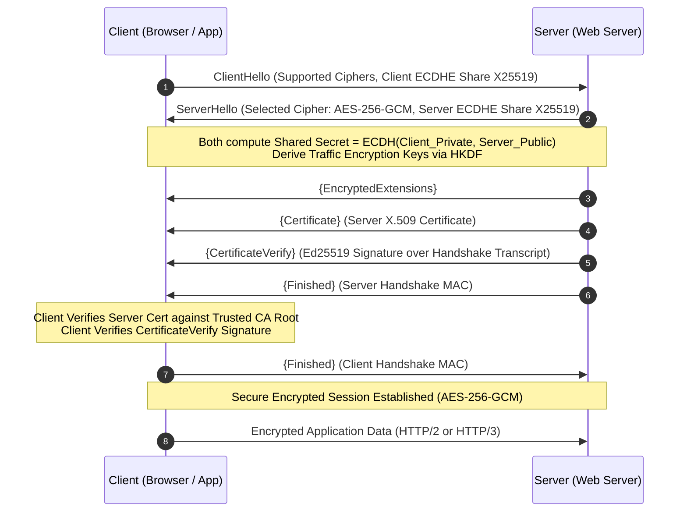

# 03 - Asymmetric Encryption and Signatures

Asymmetric cryptography (Public-Key Cryptography) uses a mathematically linked key pair:
- **Public Key**: Shared publicly with anyone. Used to encrypt data for the recipient or verify digital signatures created by the recipient.
- **Private Key**: Kept strictly secret by the owner. Used to decrypt received ciphertexts or generate digital signatures.

---

## 📊 RSA vs Elliptic Curve Cryptography (ECC)

Asymmetric algorithms rely on hard mathematical problems. While RSA relies on the difficulty of integer factorization, ECC relies on the Elliptic Curve Discrete Logarithm Problem (ECDLP).

| Feature | RSA (RSA-3072 / RSA-4096) | ECC (NIST P-256 / secp256r1) | Edwards-curve ECC (Ed25519) |
| :--- | :--- | :--- | :--- |
| **Mathematical Basis** | Prime Factorization (`$N = p \cdot q`$`) | Discrete Log over Elliptic Curves | Twisted Edwards Curves (`$`ax^2 + y^2 = 1 + dx^2y^2$`) |
| **Key Size for 128-bit Security** | **3072 bits** (384 bytes) | **256 bits** (32 bytes) | **256 bits** (32 bytes) |
| **Key Size for 256-bit Security** | **15360 bits** (1,920 bytes!) | **521 bits** (66 bytes) | **512 bits** (Ed448) |
| **Performance Overhead** | Very Slow (Key generation & signing) | Fast | **Extremely Fast** |
| **Signature Randomness** | Requires RNG for RSA-PSS | **Requires CSPRNG `$k$`** (Vulnerable to RNG failure) | **Deterministic** (Immune to RNG failures) |
| **Modern Recommendation** | Legacy Compatibility Only | Standard Corporate Infrastructure | **Gold Standard for Apps & API Signing** |

---

## ✒️ Digital Signatures & Determinism (Ed25519 vs ECDSA)

A digital signature provides **Authentication**, **Integrity**, and **Non-repudiation**.

```
                           SENDER (Alice)
  [ Message M ] + [ Private Key Key_priv ] ---- Ed25519 Sign ----> [ Signature S ]

                         RECEIVER (Bob)
  [ Message M ] + [ Signature S ] + [ Public Key Key_pub ] ---- Ed25519 Verify ----> [ VALID / INVALID ]
```

### The ECDSA Nonce Leak Catastrophe (Sony PlayStation 3 Attack)
Standard ECDSA (ANSI X9.62) generates a secret random nonce `$k$` for every signature:
`r = (k * G)_x mod n`
`s = k^-1(H(m) + r * d) mod n`

> [!CAUTION]
> **Sony PS3 Private Key Recovery:** In 2010, Sony implemented ECDSA for PS3 firmware signing but reused the exact same nonce `$k`$` across multiple signatures! If an attacker obtains two signatures `$`(r, s_1)`$` and `$`(r, s_2)`$` generated with the same nonce `$`k`$`, simple modular arithmetic recovers the secret private key `$`d$` instantly:
> `k = (H(m_1) - H(m_2)) / (s_1 - s_2) mod n  =>  d = (s_1 * k - H(m_1)) / r mod n`

### Why Ed25519 is Superior
Ed25519 (EdDSA RFC 8032) eliminates this vulnerability entirely by deriving the per-message nonce deterministically:
```math
k = \text{SHA-512}(\text{PrivateKeyPrefix} \parallel \text{Message})
```
Because `$k$` is deterministically generated from the private key and the message, Ed25519 is **completely immune to bad random number generators** and nonce-reuse attacks.

---

## 🤝 Key Exchange & Perfect Forward Secrecy (ECDHE)

Elliptic-Curve Diffie-Hellman Ephemeral (ECDHE / X25519) allows two parties to calculate a shared symmetric secret key over an unencrypted network without ever transmitting the secret key itself.

### Perfect Forward Secrecy (PFS)
"Ephemeral" means key pairs are generated fresh for **every single session** and destroyed immediately afterward.

> [!IMPORTANT]
> **Why PFS Matters:** If an adversary records encrypted TLS traffic for years and later steals the server's long-term Private Key, PFS guarantees they **cannot decrypt past sessions** because the session keys were derived from ephemeral keys that no longer exist!

---

## 🌐 TLS 1.3 Handshake Protocol

TLS 1.3 drastically reduced latency (1-RTT) and eliminated insecure cipher suites (RSA key exchange, CBC ciphers, RC4).



---

## 💻 Multi-Language Digital Signatures (Ed25519)

Below are production implementations for generating Ed25519 key pairs, signing messages, and verifying signatures across Python, Node.js, Go, and Java.

### 1. Python (`cryptography`)

```python
from cryptography.hazmat.primitives.asymmetric import ed25519
from cryptography.exceptions import InvalidSignature

class Ed25519Signer:
    @staticmethod
    def generate_keys():
        private_key = ed25519.Ed25519PrivateKey.generate()
        public_key = private_key.public_key()
        return private_key, public_key

    @staticmethod
    def sign(private_key: ed25519.Ed25519PrivateKey, message: bytes) -> bytes:
        return private_key.sign(message)

    @staticmethod
    def verify(public_key: ed25519.Ed25519PublicKey, signature: bytes, message: bytes) -> bool:
        try:
            public_key.verify(signature, message)
            return True
        except InvalidSignature:
            return False

# Usage
priv, pub = Ed25519Signer.generate_keys()
payload = b"TRANSFER_FUNDS_AMOUNT_1000000_USD"
sig = Ed25519Signer.sign(priv, payload)
print("Python Signature Valid:", Ed25519Signer.verify(pub, sig, payload))
```

### 2. Node.js (Built-in `crypto`)

```javascript
const crypto = require('crypto');

// Generate Ed25519 Keypair synchronously
const { publicKey, privateKey } = crypto.generateKeyPairSync('ed25519');

const message = Buffer.from("TRANSFER_FUNDS_AMOUNT_1000000_USD");

// Sign
const signature = crypto.sign(null, message, privateKey);

// Verify
const isValid = crypto.verify(null, message, publicKey, signature);
console.log("Node.js Ed25519 Signature Valid:", isValid);
```

### 3. Go (`crypto/ed25519`)

```go
package main

import (
	"crypto/ed25519"
	"crypto/rand"
	"fmt"
)

func main() {
	// Generate Keypair
	pubKey, privKey, err := ed25519.GenerateKey(rand.Reader)
	if err != nil {
		panic(err)
	}

	message := []byte("TRANSFER_FUNDS_AMOUNT_1000000_USD")

	// Sign
	signature := ed25519.Sign(privKey, message)

	// Verify
	isValid := ed25519.Verify(pubKey, message, signature)
	fmt.Printf("Go Ed25519 Signature Valid: %t\n", isValid)
}
```

### 4. Java (Java 15+ Native `EdEC`)

```java
import java.security.KeyPair;
import java.security.KeyPairGenerator;
import java.security.Signature;

public class Ed25519SignerJava {
    public static void main(String[] args) throws Exception {
        // Key pair generator for Ed25519 (Available natively in Java 15+)
        KeyPairGenerator kpg = KeyPairGenerator.getInstance("Ed25519");
        KeyPair keyPair = kpg.generateKeyPair();

        byte[] message = "TRANSFER_FUNDS_AMOUNT_1000000_USD".getBytes();

        // Sign
        Signature sig = Signature.getInstance("Ed25519");
        sig.initSign(keyPair.getPrivate());
        sig.update(message);
        byte[] signatureBytes = sig.sign();

        // Verify
        Signature verifier = Signature.getInstance("Ed25519");
        verifier.initVerify(keyPair.getPublic());
        verifier.update(message);
        boolean isValid = verifier.verify(signatureBytes);

        System.out.println("Java Ed25519 Signature Valid: " + isValid);
    }
}
```

---

## 💣 Key Asymmetric Attacks to Mitigate

1. **Bleichenbacher's RSA Padding Oracle Attack (Million Message Attack)**: Exploits PKCS#1 v1.5 padding error messages in RSA decryption to act as an oracle, decrypting ciphertexts byte-by-byte. **Mitigation**: Migrate to RSA-OAEP for encryption and RSA-PSS for signatures, or adopt ECC (Ed25519).
2. **Invalid Curve Attacks**: Adversaries send custom public keys containing points not residing on the agreed elliptic curve `$E$`. If the application fails to validate point membership, the scalar multiplication leaks private key bits. **Mitigation**: Use libraries that validate public key points automatically (such as `X25519` and `Ed25519`).

