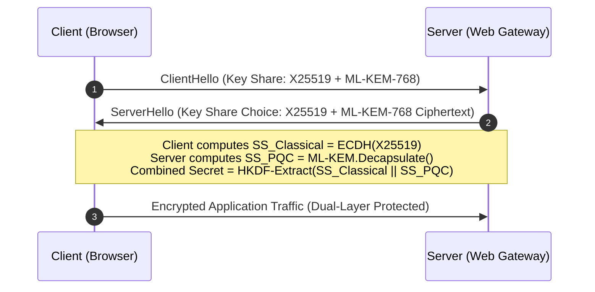

# 05 - Post-Quantum Cryptography (PQC)

Quantum computing leverages quantum mechanical phenomena—such as superposition and entanglement—to perform parallel computational operations that classical binary computers cannot execute. While fault-tolerant Cryptographically Relevant Quantum Computers (CRQCs) are still in development, they pose an **existential threat** to modern public-key infrastructure.

---

## ⚛️ Quantum Threat Mechanics: Shor's vs Grover's Algorithms

```
                                  QUANTUM THREAT LANDSCAPE
                                             |
           +---------------------------------+---------------------------------+
           |                                                                   |
           v                                                                   v
  [ SHOR'S ALGORITHM ]                                                [ GROVER'S ALGORITHM ]
  - Target: Asymmetric Cryptography                                   - Target: Symmetric Ciphers & Hashes
  - Speedup: Exponential (O(N^3) polynomial)                          - Speedup: Quadratic (O(sqrt(N)))
  - Impact: RSA, ECDSA, ECDHE Completely BROKEN                      - Impact: AES-128 effective key halved to 64-bit (Broken)
                                                                               AES-256 effective key halved to 128-bit (SECURE!)
```

### 1. Shor's Algorithm: Exponential Speedup
Shor's algorithm solves the Order-Finding Problem over finite abelian groups in polynomial time `$O((\log N)^3)$` using the Quantum Fourier Transform (QFT).
- **Impact**: Completely breaks all widely deployed public-key algorithms relying on Prime Factorization or Discrete Logarithms:
  - **RSA** (All key sizes)
  - **ECDSA** (secp256r1, secp256k1)
  - **Ed25519 / Ed448**
  - **Diffie-Hellman / ECDHE**
- **Timeline**: US National Security Memorandum 10 (NSM-10) mandates full migration of critical federal systems to post-quantum standards prior to **2035**.

### 2. Grover's Algorithm: Quadratic Speedup
Grover's algorithm searches an unsorted database of `$N`$` items in `$`O(\sqrt{N})`$` quantum operations rather than `$`O(N)$` classical evaluations.
- **Impact**: Effectively halves the bit-security of symmetric ciphers and hash collision resistance:
  - **AES-128**: Reduced to `$2^{64}`$` operations `$`\implies$` **Insecure**.
  - **AES-256**: Reduced to `$2^{128}`$` operations `$`\implies$` **Completely Secure**.
  - **SHA-256**: Collision resistance reduced to `$2^{128}`$` operations `$`\implies$` **Secure**.
  - **SHA-384 / SHA-512**: `$\implies$` **Quantum Safe**.

---

## 🏴‍☠️ "Harvest Now, Decrypt Later" (HNDL) Threat Model

Adversaries (including nation-state threat actors) are currently recording and storing vast volumes of encrypted internet traffic (TLS sessions, VPN tunnels, SSH connections).

```
  [ Present Day ]   ==== Adversaries Capture & Store Encrypted TLS Traffic ====>   [ Storage Vaults ]
                                                                                           |
  [ Future ~2030+ ] ===== CRQC Comes Online =====> [ Shor's Algorithm ] ===================+
                                                                                           |
                                                                                           v
                                                                             [ Decrypted Historic Data ]
```

> [!CAUTION]
> **Immediate Risk:** If your application transmits data with a confidentiality lifespan exceeding 5–10 years (such as medical records, trade secrets, national security intelligence, or master keys), **the threat is active right now**. Attackers will decrypt this captured data once a CRQC is operational.

---

## 📜 Official NIST Post-Quantum Cryptography Standards (2024 Release)

The National Institute of Standards and Technology (NIST) finalized its official post-quantum standards, transitioning from legacy algorithms to **Module Lattice-Based Cryptography**:

| Standard | Algorithm Name | Original Competition Name | Cryptographic Primitive | Primary Replacement Target |
| :--- | :--- | :--- | :--- | :--- |
| **FIPS 203** | **ML-KEM** | CRYSTALS-Kyber | Key Encapsulation Mechanism (KEM) | ECDHE / RSA Key Exchange |
| **FIPS 204** | **ML-DSA** | CRYSTALS-Dilithium | Digital Signature Algorithm | ECDSA / RSA Signatures / Ed25519 |
| **FIPS 205** | **SLH-DSA** | SPHINCS+ | Stateless Hash-Based Signature | Fallback Non-Lattice Signatures |
| **FIPS 206** | **FN-DSA** | Falcon | FFT Lattice-Based Signature | High-Performance Compact Signatures |

---

## 🔀 Hybrid Key Exchange Architecture (Classical + PQC)

Because newly standardized PQC algorithms have not undergone decades of production stress testing, the global industry consensus (Google Chrome, Cloudflare, OpenSSL 3.2, AWS KMS) mandates a **Hybrid Approach**.

A Hybrid Key Exchange combines a trusted classical key exchange (e.g., X25519 or P-256) with a PQC Key Encapsulation Mechanism (e.g., ML-KEM-768).



> [!TIP]
> **Security Advantage:** An attacker must break **BOTH** the classical elliptic curve math AND the lattice-based ML-KEM algorithm to decrypt the session traffic.

---

## 🚀 Cryptographic Agility & Migration Framework

Organizations must transition from static cryptographic implementations to **Cryptographic Agility**—the architectural capacity to swap out cryptographic algorithms seamlessly without refactoring core application logic.

### 4-Phase Migration Roadmap

```
+------------------+     +------------------+     +------------------+     +------------------+
| Phase 1: CBOM    | --> | Phase 2: Layer   | --> | Phase 3: Hybrid  | --> | Phase 4: Full    |
| Discovery        |     | Abstraction      |     | Deployment       |     | PQC Transition   |
+------------------+     +------------------+     +------------------+     +------------------+
```

1. **Phase 1: Cryptographic Bill of Materials (CBOM) Audit**
   - Catalog all encryption keys, certificates, signature algorithms, and hardcoded ciphers across microservices, databases, and third-party dependencies using automated SAST scanners.
2. **Phase 2: Architectural Abstraction**
   - Wrap cryptographic calls in abstract interface modules (e.g., `CryptoProvider` pattern). Applications must interact with high-level functions (`EncryptData`, `SignPayload`) rather than directly invoking cipher primitives.
3. **Phase 3: Hybrid TLS & Dual Signing**
   - Enable hybrid TLS 1.3 key exchange (`x25519_mlkem768`) on external load balancers (Nginx, Envoy, Cloudflare).
   - Issue dual-signed digital certificates (ECDSA + ML-DSA).
4. **Phase 4: Deprecate Legacy Primitives**
   - Disable RSA-2048, SHA-1, and standalone ECDH across all internal and external communication endpoints.

