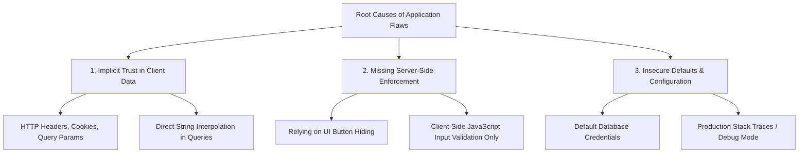
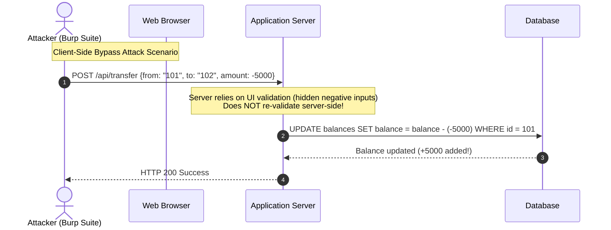
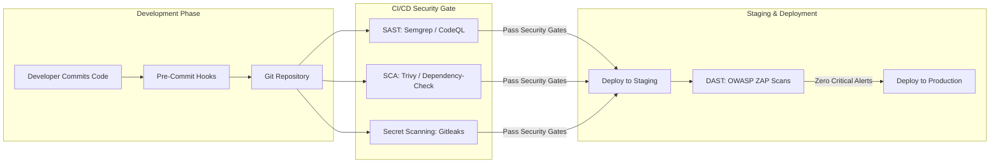

# 01. Overview & Threat Landscape

The **Open Web Application Security Project (OWASP) Top 10** represents the globally recognized standard awareness document for application security. Understanding how vulnerabilities arise and how to systematically detect them throughout the software development lifecycle (SDLC) is the first step toward building resilient web applications.

---

> [!IMPORTANT]
> **Shift-Left Philosophy:** Fixing a security flaw during design or coding costs up to **30x less** than remediating a breach in production. Early integration of security controls into CI/CD pipelines is critical.

---

## 1. The OWASP Risk Evaluation Methodology

OWASP ranks vulnerabilities using a multi-factor risk rating methodology. Each category is assessed across four primary criteria:

1. **Exploitability (Likelihood):** How accessible and easy is it for an attacker to craft a working payload?
2. **Prevalence:** How frequently is this flaw detected across millions of audited real-world applications?
3. **Detectability:** How easily can automated tools or human code reviewers uncover the vulnerability?
4. **Technical & Business Impact:** What level of damage occurs upon successful exploitation (e.g., full system compromise, data leak, financial loss)?

### OWASP 2021 Top 10 Risk Matrix & CWE Mapping

| Rank | Category Name | Primary Root Cause | Core CWEs | Detectability | Impact |
|---|---|---|---|---|---|
| **A01** | **Broken Access Control** | Missing server-side authorization | CWE-200, CWE-639 | Moderate | Critical |
| **A02** | **Cryptographic Failures** | Weak algorithms / unencrypted data | CWE-259, CWE-327 | Easy | High |
| **A03** | **Injection** | Concatenating untrusted data into interpreters | CWE-89, CWE-78 | Easy | Critical |
| **A04** | **Insecure Design** | Architectural security gaps & logic flaws | CWE-209, CWE-256 | Difficult | High |
| **A05** | **Security Misconfiguration** | Unhardened defaults, verbose error logs | CWE-16, CWE-611 | Easy | Medium |
| **A06** | **Vulnerable Components** | Outdated third-party dependencies | CWE-1104, CWE-937 | Easy | High |
| **A07** | **Identification & Auth Failures** | Weak session management / weak passwords | CWE-287, CWE-384 | Moderate | High |
| **A08** | **Software & Data Integrity** | Unsigned updates, insecure CI/CD pipelines | CWE-502, CWE-829 | Moderate | Critical |
| **A09** | **Security Logging & Monitoring** | Missing audit logs & alert triggers | CWE-778, CWE-117 | Difficult | Medium |
| **A10** | **Server-Side Request Forgery** | Server fetches user-controlled URLs | CWE-918 | Moderate | High |

---

## 2. Fundamental Root Causes of Application Flaws

Virtually all application-level security vulnerabilities stem from three core software design mistakes:

### A. Implicit Trust in User Input
Developers frequently assume data received via `GET` parameters, POST request bodies, HTTP headers (`User-Agent`, `Referer`, `Host`), or cookies is safe. **Rule of zero trust:** *All data originating from outside the application boundary must be treated as hostile until strictly validated.*

### B. Lack of Server-Side Enforcement
Relying on client-side controls (e.g., hiding HTML elements, restricting inputs in HTML forms, or client-side JavaScript checks) offers **zero security**. Attackers bypass client-side validation using tools like Burp Suite, OWASP ZAP, or `curl`. Server-side validation and authorization are mandatory.

### C. Insecure Defaults & System Misconfigurations
Deploying applications with default configuration settings (e.g., admin passwords, enabled debug flags, verbose error messages exposing stack traces) creates immediate vectors for automated exploitation.

---

## 3. DevSecOps & Shift-Left Tooling Pipeline

Modern application security integrates automated security gates directly into the CI/CD pipeline.

### Security Testing Categories

1. **SAST (Static Application Security Testing):**
   - **Mechanism:** Analyzes source code without execution. Builds Abstract Syntax Trees (AST) and data-flow graphs to identify taint propagation (e.g., untrusted input flowing into SQL queries).
   - **Tools:** Semgrep, SonarQube, CodeQL, Bandit (Python), SpotBugs (Java).

2. **SCA (Software Composition Analysis):**
   - **Mechanism:** Scans manifest files (`package.json`, `requirements.txt`, `pom.xml`, `go.mod`) against vulnerability databases (NVD, GitHub Security Advisory).
   - **Tools:** Trivy, OWASP Dependency-Check, Snyk, npm audit.

3. **DAST (Dynamic Application Security Testing):**
   - **Mechanism:** Interrogates running applications over HTTP/HTTPS, sending malicious payloads to discover runtime vulnerabilities (e.g., SQLi, XSS, CORS misconfigurations).
   - **Tools:** OWASP ZAP, Burp Suite Enterprise, Nuclei.

4. **Secret Scanning:**
   - **Mechanism:** Detects hardcoded API keys, private RSA keys, and passwords before code reaches remote repositories.
   - **Tools:** Gitleaks, Trufflehog, Git-secrets.

---

## 4. Threat Modeling with STRIDE

Aligning the OWASP Top 10 with the **STRIDE** threat model helps security teams identify architectural threats early during design phases:

| STRIDE Threat Category | OWASP Top 10 Mapping | Primary Mitigation Strategy |
|---|---|---|
| **Spoofing** (Identity) | A07: Auth & ID Failures | Strong MFA, OAuth 2.0 / OIDC, secure session tokens |
| **Tampering** (Data Integrity) | A03: Injection / A08: Software Integrity | Parameterized queries, cryptographic signatures (HMAC), input sanitization |
| **Repudiation** (Action Denial) | A09: Security Logging Failures | Immutable audit logging, centralized SIEM (Elastic/Splunk) |
| **Information Disclosure** | A01: Broken Access Control / A02: Crypto | Server-side authorization (RBAC/ABAC), TLS 1.3, AES-256-GCM |
| **Denial of Service** | A04: Insecure Design / A05: Misconfig | Rate limiting (Token Bucket / Redis), input length limits |
| **Elevation of Privilege** | A01: Broken Access Control | Principle of Least Privilege, server-side context validation |

---

> [!TIP]
> **Best Practice:** Combine **SAST** for fast feedback on every pull request, **SCA** for continuous dependency vulnerability monitoring, and **DAST** on staging environments before production releases.

---

*Next Chapter: [02. A01: Broken Access Control & IDOR →](02-a01-broken-access-control.md)*
