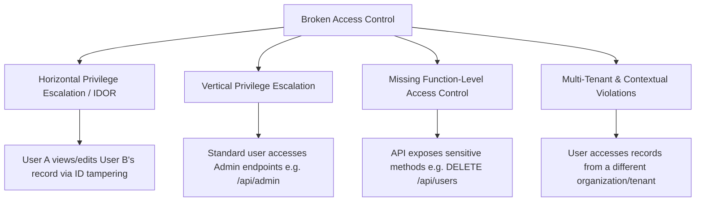
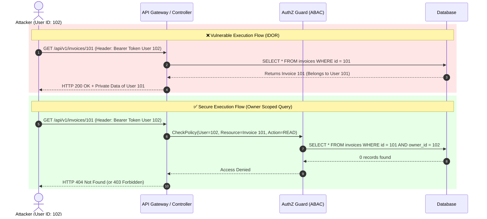

# 02. A01: Broken Access Control & IDOR

**Broken Access Control** holds the **#1 position in the OWASP Top 10**. It occurs when an application fails to properly enforce authorization policies, allowing authenticated or unauthenticated users to perform unauthorized actions, access restricted endpoints, or exfiltrate private data.

---

> [!CAUTION]
> **Core Rule of Authorization:** Never trust client-side identifiers or permissions. Every single API request that accesses, updates, or deletes data MUST be authenticated and authorized on the server.

---

## 1. Vulnerability Mechanics & Taxonomy

Access control flaws generally fall into four primary architectural categories:



### A. Horizontal Privilege Escalation (IDOR / BOLA)
Insecure Direct Object Reference (IDOR) — or Broken Object-Level Authorization (BOLA) — happens when an application uses input parameters (e.g. database primary keys in URL paths or request bodies) to directly reference database objects without verifying that the requesting user owns or has permission to access that specific object.

### B. Vertical Privilege Escalation
Occurs when a lower-privileged user gains access to functionality or data reserved for higher-privileged users (e.g., standard user modifying their JWT claim or calling `/api/v1/admin/deleteUser`).

---

## 2. Attack Sequence: IDOR vs. Secure Authorization



---

## 3. Practical Edge Cases & Nuances

### Nuance 1: UUIDs vs. Sequential IDs (The "Obscurity" Trap)
Replacing sequential integer IDs (`/users/104`) with UUIDv4 (`/users/a8f3b2c1-...`) **does NOT fix IDOR**. While UUIDs prevent trivial sequential enumeration, they rely on secrecy (Security through Obscurity). If a UUID leaks in logs, browser history, referral headers, or public APIs, an attacker can still exploit the missing authorization check.

> [!WARNING]
> Using UUIDs makes resource IDs unguessable, but it is **NOT** a replacement for server-side authorization checks!

### Nuance 2: Mass Assignment & Parameter Pollution
When binding incoming JSON request bodies directly to internal database models, attackers can inject hidden fields:
```json
// Attacker sends POST /api/register
{
  "username": "attacker",
  "password": "Password123!",
  "is_admin": true,         // Mass assignment vulnerability!
  "role": "SuperAdmin"
}
```

### Nuance 3: 403 Forbidden vs. 404 Not Found Strategy
Returning `HTTP 403 Forbidden` confirms to an attacker that resource `#101` exists but is restricted, enabling **user/resource enumeration**. Returning `HTTP 404 Not Found` for unauthorized object requests hides resource existence from malicious probes.

---

## 4. Multi-Language Insecure vs. Secure Code Examples

### A. Python (Flask & SQLAlchemy)

#### ❌ Vulnerable Code (Python)
```python
# VULNERABLE: Fetches object directly by URL parameter without checking session owner
@app.route('/api/v1/profile/<int:user_id>', methods=['GET'])
@jwt_required()
def get_user_profile(user_id):
    # Attacker passes user_id = 999 to read any profile!
    user = User.query.get(user_id)
    if not user:
        return jsonify({"error": "User not found"}), 404
    return jsonify({"email": user.email, "ssn": user.ssn, "phone": user.phone})
```

#### ✅ Secure Code (Python)
```python
# SECURE: Strict session-scoped ownership verification & DTO response filtering
@app.route('/api/v1/profile/<int:user_id>', methods=['GET'])
@jwt_required()
def get_user_profile(user_id):
    current_user_id = get_jwt_identity()
    is_admin = get_jwt_claims().get("is_admin", False)
    
    # AuthZ Check: Require identity match or explicit admin privilege
    if current_user_id != user_id and not is_admin:
        # Return 404 to prevent resource existence enumeration
        return jsonify({"error": "Resource not found"}), 404

    user = User.query.filter_by(id=user_id).first()
    if not user:
        return jsonify({"error": "Resource not found"}), 404

    # Safe DTO (Data Transfer Object) - Never return raw DB models
    return jsonify({
        "id": user.id,
        "username": user.username,
        "email": user.email
    }), 200
```

---

### B. Node.js (Express & MongoDB / Mongoose)

#### ❌ Vulnerable Code (Node.js)
```javascript
// VULNERABLE: Direct deletion based solely on client-supplied ID parameter
app.delete('/api/v1/documents/:id', authenticateToken, async (req, res) => {
  // Any valid authenticated user can delete ANY document in the database!
  const doc = await Document.findByIdAndDelete(req.params.id);
  res.json({ message: "Document deleted" });
});
```

#### ✅ Secure Code (Node.js)
```javascript
// SECURE: Enforce owner ID directly in the database query predicate
app.delete('/api/v1/documents/:id', authenticateToken, async (req, res) => {
  const doc = await Document.findOneAndDelete({
    _id: req.params.id,
    ownerId: req.user.id // Query condition guarantees ownership!
  });

  if (!doc) {
    // 404 hides whether document exists or belongs to another user
    return res.status(404).json({ error: "Document not found" });
  }

  return res.status(200).json({ message: "Document successfully deleted" });
});
```

---

### C. Go (Gin & GORM)

#### ❌ Vulnerable Code (Go)
```go
// VULNERABLE: Query lacks session owner constraint
func GetInvoice(c *gin.Context) {
    invoiceID := c.Param("id")
    var invoice Invoice
    
    // Direct lookup ignores authenticated user context!
    if err := db.First(&invoice, invoiceID).Error; err != nil {
        c.JSON(http.StatusNotFound, gin.H{"error": "Invoice not found"})
        return
    }
    c.JSON(http.StatusOK, invoice)
}
```

#### ✅ Secure Code (Go)
```go
// SECURE: Bind query parameter to authenticated context user ID
func GetInvoice(c *gin.Context) {
    userID := c.GetString("authenticated_user_id")
    invoiceID := c.Param("id")

    var invoice Invoice
    // Enforce dual condition in SQL clause: invoice.id AND invoice.user_id
    result := db.Where("id = ? AND user_id = ?", invoiceID, userID).First(&invoice)
    if result.Error != nil {
        c.JSON(http.StatusNotFound, gin.H{"error": "Invoice not found"})
        return
    }

    c.JSON(http.StatusOK, invoice)
}
```

---

### D. Java (Spring Boot & Spring Data JPA)

#### ❌ Vulnerable Code (Java)
```java
// VULNERABLE: Controller fetches record without validating user security context
@GetMapping("/api/v1/orders/{orderId}")
public ResponseEntity<Order> getOrder(@PathVariable Long orderId) {
    Order order = orderRepository.findById(orderId)
            .orElseThrow(() -> new ResourceNotFoundException("Order not found"));
    return ResponseEntity.ok(order);
}
```

#### ✅ Secure Code (Java - Spring Security ABAC)
```java
// SECURE: Use Spring Security @PreAuthorize or custom service-level ownership check
@GetMapping("/api/v1/orders/{orderId}")
public ResponseEntity<OrderDTO> getOrder(@PathVariable Long orderId, Authentication authentication) {
    String currentUsername = authentication.getName();
    
    Order order = orderRepository.findByIdAndUserUsername(orderId, currentUsername)
            .orElseThrow(() -> new ResourceNotFoundException("Order not found"));
            
    OrderDTO dto = new OrderDTO(order.getId(), order.getTotalAmount(), order.getStatus());
    return ResponseEntity.ok(dto);
}
```

---

## 5. Practical Exploit Verification & CLI Commands

You can test endpoints for Broken Access Control using `curl` and `jq`:

```bash
# 1. Login as Low-Privilege User Alice (User ID: 102)
ALICE_TOKEN=$(curl -s -X POST http://localhost:5000/api/v1/auth/login \
  -H "Content-Type: application/json" \
  -d '{"username":"alice", "password":"Password123!"}' | jq -r '.token')

# 2. Exploit IDOR: Attempt to access Bob's private invoice (ID: 101) using Alice's Token
curl -i -X GET http://localhost:5000/api/v1/invoices/101 \
  -H "Authorization: Bearer $ALICE_TOKEN"

# --- EXPECTED RESULTS ---
# Vulnerable Response: HTTP 200 OK with Bob's private financial data
# Secure Response:     HTTP 404 Not Found (or 403 Forbidden)
```

---

> [!TIP]
> **Architecture Best Practice:** Implement a centralized authorization engine (e.g., Open Policy Agent (OPA) or CASBIN) rather than scattering `if user.id != owner.id` logic across controllers.

---

*Next Chapter: [03. A02: Cryptographic Failures →](03-a02-cryptographic-failures.md)*
