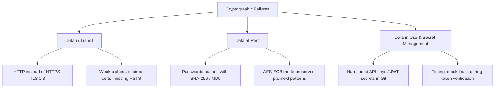
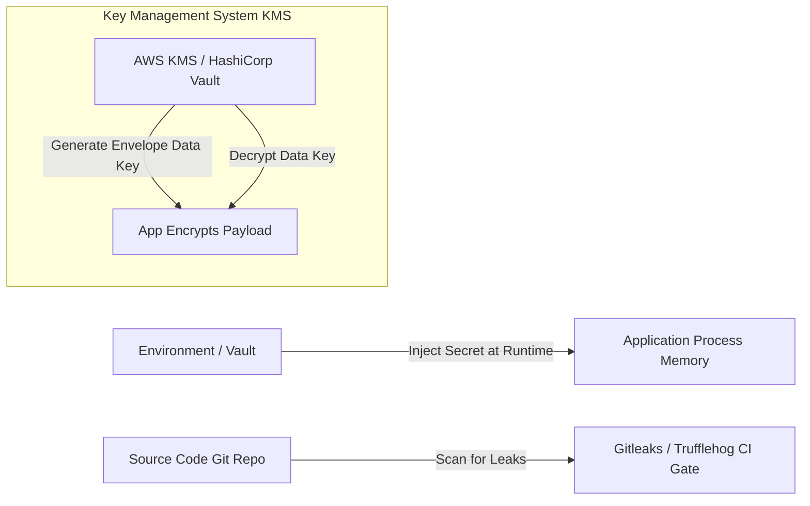

# 03. A02: Cryptographic Failures

**Cryptographic Failures** (formerly titled *Sensitive Data Exposure*) focus on failures related to cryptography (or lack thereof) which frequently lead to exposure of sensitive data such as passwords, credit card numbers, health records, personally identifiable information (PII), and authentication tokens.

---

> [!WARNING]
> **Never Roll Your Own Crypto:** Always use standard, peer-reviewed, industry-proven cryptographic primitives and libraries. Custom encryption algorithms almost always contain subtle design flaws.

---

## 1. Vulnerability Mechanics & Core Causes

Cryptographic flaws occur across three primary data states:



### Key Failure Categories

1. **Transmission of Plaintext Data:** Exposing credentials, session tokens, or API keys over unencrypted HTTP protocol.
2. **Weak Password Hashing:** Using fast hashing algorithms (MD5, SHA1, SHA256) without salt or memory-hardness, making passwords vulnerable to rainbow table and GPU cracking.
3. **Electronic Codebook (ECB) Cipher Mode:** Encrypting data blocks independently without an Initialization Vector (IV). Identical plaintext blocks result in identical ciphertext blocks, preserving structural patterns.
4. **Hardcoded Secrets:** Embedding API credentials, database strings, or encryption keys in source code repositories.

---

## 2. AES-ECB Flaw vs. AES-256-GCM Authenticated Encryption

```mermaid
flowchart TD
    subgraph ❌ Insecure: AES-ECB Mode
        P1[Plaintext Block A] -->|Key| C1[Ciphertext Block X]
        P2[Plaintext Block A] -->|Key| C2[Ciphertext Block X]
        Note1[Identical Plaintext produces Identical Ciphertext!<br/>Leaks structural patterns e.g. Tux bitmap image]
    end

    subgraph ✅ Secure: AES-256-GCM Mode
        P3[Plaintext Block A] -->|Key + Unique IV| C3[Ciphertext Block Y]
        P4[Plaintext Block A] -->|Key + Unique IV| C4[Ciphertext Block Z]
        C3 & C4 --> AuthTag[128-bit Authentication Tag]
        Note2[Unique IV per message + Auth Tag prevents tampering & pattern analysis]
    end
```

---

## 3. Password Hashing Algorithm Comparison

| Algorithm | Algorithm Type | Salt Support | GPU / ASIC Resistance | Recommended for New Apps? |
|---|---|---|---|---|
| **Argon2id** | Memory-hard Key Derivation | Automatic (Unique per hash) | Extremely High | ✅ **Yes (OWASP Winner)** |
| **bcrypt** | Adaptive Blowfish-based | Automatic 128-bit salt | High | ✅ **Yes (Industry Standard)** |
| **PBKDF2-HMAC-SHA256** | Iterative HMAC | Manual / Framework | Moderate (High iteration count needed) | ⚠️ Acceptable (Compliance legacy) |
| **SHA-256 / SHA-512** | Fast Cryptographic Hash | Optional | Zero (Billions/sec on GPU) | ❌ **Strictly Forbidden** |
| **MD5 / SHA-1** | Obsolete Hash | Obsolete | Zero (Broken collisions) | ❌ **Strictly Forbidden** |

---

## 4. Multi-Language Secure Implementations

### A. Password Hashing (Argon2id & bcrypt)

#### ❌ Vulnerable Code (Python - Fast SHA-256 Hashing)
```python
import hashlib

# VULNERABLE: SHA-256 is extremely fast. GPUs can compute >100 billion SHA-256 hashes/sec!
def hash_password_vulnerable(password: str) -> str:
    return hashlib.sha256(password.encode('utf-8')).hexdigest()
```

#### ✅ Secure Code (Python - Argon2id)
```python
from argon2 import PasswordHasher
from argon2.exceptions import VerifyMismatchError

# SECURE: Memory-hard Argon2id algorithm (Time Cost: 3, Memory Cost: 64MB, Parallelism: 4)
ph = PasswordHasher(
    time_cost=3,
    memory_cost=65536, # 64MB RAM hardness
    parallelism=4,
    hash_len=32,
    salt_len=16
)

def hash_password_secure(password: str) -> str:
    return ph.hash(password)

def verify_password_secure(hash_str: str, password: str) -> bool:
    try:
        return ph.verify(hash_str, password)
    except VerifyMismatchError:
        return False
```

---

### B. Authenticated Encryption at Rest (AES-256-GCM)

#### ❌ Vulnerable Code (Node.js - AES-128-ECB Mode)
```javascript
const crypto = require('crypto');

// VULNERABLE: AES ECB mode does NOT use an IV. Data patterns are exposed!
function encryptBad(text, keyHex) {
  const key = Buffer.from(keyHex, 'hex');
  const cipher = crypto.createCipheriv('aes-128-ecb', key, null);
  return cipher.update(text, 'utf8', 'hex') + cipher.final('hex');
}
```

#### ✅ Secure Code (Node.js - AES-256-GCM)
```javascript
const crypto = require('crypto');

// SECURE: AES-256-GCM with unique 12-byte IV and 16-byte Authentication Tag
function encryptSecure(plaintext, keyHex) {
  const key = Buffer.from(keyHex, 'hex'); // Must be 32 bytes (256 bits)
  const iv = crypto.randomBytes(12);     // 12-byte IV for GCM
  
  const cipher = crypto.createCipheriv('aes-256-gcm', key, iv);
  let encrypted = cipher.update(plaintext, 'utf8', 'hex');
  encrypted += cipher.final('hex');
  
  const authTag = cipher.getAuthTag().toString('hex');
  
  return {
    iv: iv.toString('hex'),
    ciphertext: encrypted,
    tag: authTag
  };
}

function decryptSecure(payload, keyHex) {
  const key = Buffer.from(keyHex, 'hex');
  const iv = Buffer.from(payload.iv, 'hex');
  const authTag = Buffer.from(payload.tag, 'hex');
  
  const decipher = crypto.createDecipheriv('aes-256-gcm', key, iv);
  decipher.setAuthTag(authTag);
  
  let decrypted = decipher.update(payload.ciphertext, 'hex', 'utf8');
  decrypted += decipher.final('utf8');
  return decrypted; // Throws error if payload/tag was tampered with!
}
```

---

### C. Password Hashing & Crypto in Go

```go
package main

import (
    "golang.org/x/crypto/bcrypt"
    "fmt"
)

// SECURE: bcrypt password hashing with work factor 12
func HashPassword(password str) (string, error) {
    bytes, err := bcrypt.GenerateFromPassword([]byte(password), 12)
    return string(bytes), err
}

func CheckPasswordHash(password, hash string) bool {
    err := bcrypt.CompareHashAndPassword([]byte(hash), []byte(password))
    return err == nil
}
```

---

### D. Secure Token Comparison (Preventing Timing Attacks)

When comparing secrets (API keys, HMAC signatures), standard string equality `if token_a == token_b:` short-circuits on the first mismatched byte, leaking execution time information to attackers.

```python
import secrets

# VULNERABLE: Standard string comparison leaks execution time
def check_api_key_bad(client_key: str, real_key: str) -> bool:
    return client_key == real_key

# SECURE: Constant-time comparison prevents timing attacks
def check_api_key_secure(client_key: str, real_key: str) -> bool:
    return secrets.compare_digest(client_key.encode('utf-8'), real_key.encode('utf-8'))
```

---

## 5. Secret Management & Key Architecture



### Production Checklist for Secrets:
1. **Never commit secrets to Git:** Use `.gitignore` for `.env` files.
2. **Use Key Management Systems (KMS):** Utilize HashiCorp Vault, AWS KMS, or Azure Key Vault to manage master encryption keys.
3. **Envelope Encryption:** Encrypt application data using a local Data Encryption Key (DEK), and encrypt the DEK using a KMS Key Encryption Key (KEK).
4. **Enforce TLS 1.3:** Disable SSLv3, TLS 1.0, and TLS 1.1 on load balancers. Enforce `HTTP Strict Transport Security (HSTS)`.

---

> [!TIP]
> **HSTS Header Configuration (Nginx):**
> ```nginx
> add_header Strict-Transport-Security "max-age=63072000; includeSubDomains; preload" always;
> ```

---

*Next Chapter: [04. A03: Injection (SQLi & Command Injection) →](04-a03-injection.md)*
