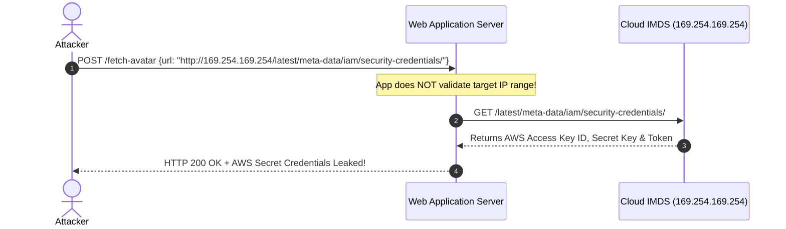

# 04. A03: Injection (SQLi, Command Injection & SSRF)

**Injection** vulnerabilities occur when untrusted data is sent to an interpreter as part of a command or query. The attacker's hostile data tricks the interpreter into executing unintended commands or accessing data without proper authorization.

---

> [!CAUTION]
> **The Golden Rule of Injection Prevention:** Never construct commands or database queries by concatenating, formatting, or interpolating untrusted user input directly into executable code strings. Always separate data from code!

---

## 1. SQL Injection (SQLi)

### Vulnerability Mechanics
SQL Injection occurs when user input alters the abstract syntax tree (AST) of a database query.

```mermaid
flowchart TD
    subgraph ❌ Vulnerable: Direct String Interpolation
        A[Input: ' OR '1'='1] --> B["Query: SELECT * FROM users WHERE name = '' OR '1'='1'"]
        B --> C[SQL Parser parses '1'='1' as executable boolean logic]
        C --> D[Returns ALL rows in database table!]
    end

    subgraph ✅ Secure: Parameterized Query
        E[Input: ' OR '1'='1] --> F["Query Template: SELECT * FROM users WHERE name = ?"]
        F --> G[SQL Engine treats entire input as literal string literal value]
        G --> H[Searches for user literally named: '' OR '1'='1']
    end
```

### Types of SQL Injection
1. **In-Band (Classic):** Results returned directly in HTTP response.
   - *Error-Based:* Forces database to display internal error stack containing sensitive data.
   - *UNION-Based:* Appends `UNION SELECT` to retrieve data from arbitrary tables.
2. **Inferential (Blind):** No data returned in HTTP response body.
   - *Boolean-Based:* Infers data by observing true/false response variations.
   - *Time-Based:* Infers data by injecting delay commands (e.g. `pg_sleep(5)` or `WAITFOR DELAY '0:0:5'`).
3. **Out-of-Band (OOB):** Data exfiltrated via DNS or HTTP requests triggered by the database (e.g. `xp_dirtree` in MSSQL).

---

### Multi-Language SQLi Code Fixes

#### A. Python (psycopg2 / PostgreSQL)

##### ❌ Vulnerable Code (Python)
```python
# VULNERABLE: f-string string interpolation modifies SQL AST
def search_user_bad(cursor, username: str):
    query = f"SELECT id, role, email FROM users WHERE username = '{username}'"
    cursor.execute(query) # Vulnerable to SQLi!
    return cursor.fetchall()
```

##### ✅ Secure Code (Python)
```python
# SECURE: Parameterized query sends SQL statement and parameters separately
def search_user_secure(cursor, username: str):
    query = "SELECT id, role, email FROM users WHERE username = %s"
    cursor.execute(query, (username,)) # Safe! Driver handles string escaping.
    return cursor.fetchall()
```

---

#### B. Node.js (PostgreSQL / pg)

##### ❌ Vulnerable Code (Node.js)
```javascript
// VULNERABLE: Direct string concatenation
app.get('/api/users/search', async (req, res) => {
  const name = req.query.name;
  const sql = "SELECT * FROM users WHERE name = '" + name + "'";
  const result = await db.query(sql); // Vulnerable!
  res.json(result.rows);
});
```

##### ✅ Secure Code (Node.js)
```javascript
// SECURE: Positional parameters (`$1, $`2)
app.get('/api/users/search', async (req, res) => {
  const name = req.query.name;
  const sql = "SELECT * FROM users WHERE name = $1";
  const result = await db.query(sql, [name]); // Safe!
  res.json(result.rows);
});
```

---

#### C. Go (database/sql)

##### ❌ Vulnerable Code (Go)
```go
// VULNERABLE: fmt.Sprintf query generation
func GetUserBad(db *sql.DB, name string) (*User, error) {
    query := fmt.Sprintf("SELECT id, email FROM users WHERE name = '%s'", name)
    row := db.QueryRow(query) // Vulnerable!
    // ...
}
```

##### ✅ Secure Code (Go)
```go
// SECURE: Parameterized placeholder (?)
func GetUserSecure(db *sql.DB, name string) (*User, error) {
    query := "SELECT id, email FROM users WHERE name = ?"
    row := db.QueryRow(query, name) // Safe!
    // ...
}
```

---

#### D. Java (Spring JDBC / JPA)

##### ❌ Vulnerable Code (Java)
```java
// VULNERABLE: String concatenation in Statement
public User getUserBad(String username) throws SQLException {
    String sql = "SELECT * FROM users WHERE username = '" + username + "'";
    Statement stmt = connection.createStatement();
    ResultSet rs = stmt.executeQuery(sql); // Vulnerable!
    // ...
}
```

##### ✅ Secure Code (Java)
```java
// SECURE: PreparedStatement binding
public User getUserSecure(String username) throws SQLException {
    String sql = "SELECT id, email, role FROM users WHERE username = ?";
    PreparedStatement stmt = connection.prepareStatement(sql);
    stmt.setString(1, username);
    ResultSet rs = stmt.executeQuery(); // Safe!
    // ...
}
```

---

## 2. Command Injection

Command Injection occurs when application code executes system shell commands (`bash`, `sh`, `cmd.exe`) using untrusted input.

### Exploit Mechanics
Attacker input containing shell operators (`;`, `&&`, `|`, `` ` ``) executes arbitrary OS commands:
- **Payload:** `8.8.8.8; cat /etc/passwd`
- **Executed Command:** `ping -c 1 8.8.8.8; cat /etc/passwd`

### Multi-Language Command Execution Safeguards

#### ❌ Vulnerable Python Implementation
```python
import os

# VULNERABLE: Invokes system shell (/bin/sh) with unsanitized user input
def check_host_bad(target: str):
    os.system(f"ping -c 1 {target}")
```

#### ✅ Secure Python Implementation
```python
import subprocess
import ipaddress

# SECURE: Strict input validation + no shell invocation context
def check_host_secure(target: str) -> str:
    # 1. Input format validation
    try:
        valid_ip = str(ipaddress.ip_address(target))
    except ValueError:
        raise ValueError("Invalid IP address format")
        
    # 2. Execute process without shell (shell=False by default)
    # Pass arguments as a rigid array to prevent shell command parsing
    result = subprocess.run(
        ["ping", "-c", "1", valid_ip],
        capture_output=True,
        text=True,
        timeout=5,
        check=True
    )
    return result.stdout
```

---

## 3. Server-Side Request Forgery (SSRF)

SSRF occurs when a web application fetches a remote resource (e.g. fetching a profile picture from a URL) without validating whether the target IP address resolves to an internal or restricted network.



---

### SSRF Bypasses & Nuances
1. **Cloud IMDS Exploitation:** Accessing `169.254.169.254` to steal AWS/GCP/Azure instance metadata credentials.
2. **Alternate IP Formats:** Attackers bypass simple string matching using:
   - Hexadecimal: `0x7f000001` (127.0.0.1)
   - Decimal: `2130706433` (127.0.0.1)
   - IPv6 Mapped IPv4: `[::ffff:127.0.0.1]`
3. **DNS Rebinding:** A domain initially resolves to a safe public IP during validation, but shifts to `127.0.0.1` during the actual HTTP fetch.

---

### Production-Grade SSRF Defense (Python)

```python
import socket
import urllib.parse
import ipaddress
import requests

BLOCKED_NETWORKS = [
    ipaddress.ip_network('127.0.0.0/8'),      # Loopback
    ipaddress.ip_network('10.0.0.0/8'),       # Private class A
    ipaddress.ip_network('172.16.0.0/12'),    # Private class B
    ipaddress.ip_network('192.168.0.0/16'),   # Private class C
    ipaddress.ip_network('169.254.0.0/16'),   # AWS/Cloud Metadata IMDS
    ipaddress.ip_network('0.0.0.0/8'),
]

def validate_and_fetch_url(url: str, timeout: int = 3) -> bytes:
    # 1. Scheme Check
    parsed = urllib.parse.urlparse(url)
    if parsed.scheme not in ('http', 'https'):
        raise ValueError("Invalid URL scheme")

    hostname = parsed.hostname
    if not hostname:
        raise ValueError("Invalid hostname")

    # 2. DNS Resolution & IP Range Verification
    try:
        ip_addresses = socket.getaddrinfo(hostname, None)
    except socket.gaierror:
        raise ValueError("Domain resolution failed")

    for family, socktype, proto, canonname, sockaddr in ip_addresses:
        ip = ipaddress.ip_address(sockaddr[0])
        # Check against blocked private/internal networks
        for blocked_net in BLOCKED_NETWORKS:
            if ip in blocked_net:
                raise SecurityError(f"Access to private IP range ({ip}) is forbidden!")

    # 3. Safe HTTP Request with Disabled Redirects (Prevents SSRF via 302 Redirect)
    response = requests.get(url, allow_redirects=False, timeout=timeout)
    return response.content
```

---

> [!TIP]
> **Cloud Defense Best Practice:** Enforce **AWS IMDSv2**, which requires a session token fetched via `PUT` header (`X-aws-ec2-metadata-token`), preventing simple GET-based SSRF attacks from accessing instance metadata!

---

*Next Chapter: [05. A04 & A05: Insecure Design & Misconfiguration →](05-a04-insecure-design-and-misconfig.md)*
