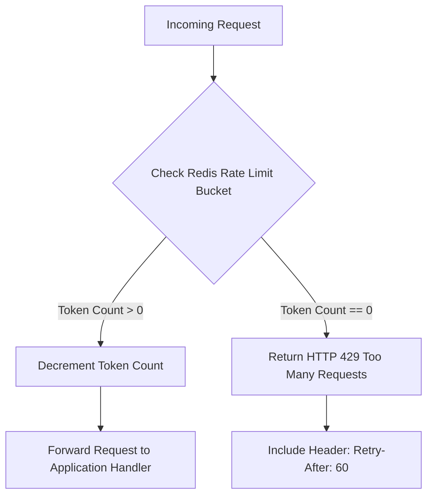
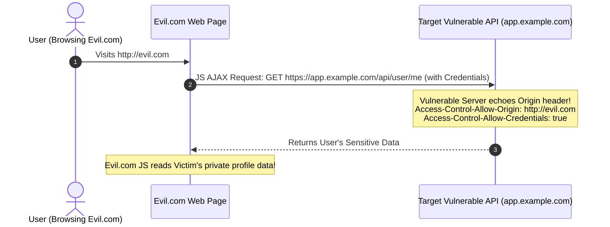

# 05. A04 & A05: Insecure Design & Security Misconfiguration

This chapter covers **A04: Insecure Design** (architectural security flaws, missing rate limiting, business logic gaps) and **A05: Security Misconfiguration** (unhardened defaults, permissive CORS headers, XXE parser exposure, missing security headers).

---

> [!IMPORTANT]
> **Design vs. Implementation:** You cannot fix insecure design with a code patch or secure coding standard; the flaw exists at the architectural level. Secure design requires threat modeling, rate limiting, and defensive architectural patterns.

---

## 1. A04: Insecure Design & Rate Limiting

Missing anti-automation controls allow attackers to perform brute force password attacks, credential stuffing, carding, or trigger Denial of Service (DoS) against computationally expensive endpoints (e.g. password hashing or PDF generation).

### Token Bucket Rate Limiting Architecture



---

### Rate Limiting Nuance: Proxy IP Spoofing
Relying solely on `request.remote_addr` when behind a reverse proxy (Nginx, Cloudflare) is dangerous. Attackers can send fake `X-Forwarded-For` HTTP headers to rotate their IP address and bypass rate limits unless the proxy configuration overwrites the header securely.

#### ✅ Secure Rate Limiting Implementation (Express.js + Redis)
```javascript
const rateLimit = require('express-rate-limit');
const RedisStore = require('rate-limit-redis');
const { createClient } = require('redis');

const redisClient = createClient({ url: process.env.REDIS_URL });
redisClient.connect();

// SECURE: Enforce strict rate limit on sensitive authentication endpoints
const loginLimiter = rateLimit({
  windowMs: 15 * 60 * 1000, // 15 minutes window
  max: 5,                   // Limit each IP/user to 5 attempts per window
  standardHeaders: true,    // Return RateLimit-* headers
  legacyHeaders: false,
  store: new RedisStore({
    sendCommand: (...args) => redisClient.sendCommand(args),
  }),
  message: { error: "Too many login attempts. Please try again in 15 minutes." }
});

app.post('/api/v1/auth/login', loginLimiter, async (req, res) => {
  // Safe authentication handler
});
```

---

## 2. A05: CORS Misconfigurations

Cross-Origin Resource Sharing (CORS) allows browsers to send cross-domain AJAX requests. Misconfiguring CORS headers allows untrusted third-party sites to read sensitive authenticated responses.



---

### The Dynamic Echo Antipattern

#### ❌ Vulnerable Node.js CORS Configuration
```javascript
// VULNERABLE: Reflects ANY Origin header dynamically and permits credentials!
app.use((req, res, next) => {
  res.header("Access-Control-Allow-Origin", req.headers.origin); // Dangerous echo!
  res.header("Access-Control-Allow-Credentials", "true");
  next();
});
```

#### ✅ Secure Node.js CORS Configuration
```javascript
const cors = require('cors');

const ALLOWED_ORIGINS = new Set([
  'https://app.example.com',
  'https://admin.example.com'
]);

// SECURE: Strict allowlist origin validation
app.use(cors({
  origin: (origin, callback) => {
    // Allow non-browser requests (mobile apps/curl) where origin is undefined
    if (!origin || ALLOWED_ORIGINS.has(origin)) {
      callback(null, true);
    } else {
      callback(new Error('CORS Policy Restriction: Origin blocked'));
    }
  },
  credentials: true,
  methods: ['GET', 'POST', 'PUT', 'DELETE'],
  allowedHeaders: ['Content-Type', 'Authorization']
}));
```

---

## 3. A05: XML External Entity (XXE) Prevention

XXE occurs when an XML parser evaluates external entity references (`<!ENTITY xxe SYSTEM "file:///etc/passwd">`) inside untrusted XML documents, allowing attackers to exfiltrate local files, perform SSRF, or trigger Denial of Service ("Billion Laughs" entity expansion bomb).

### Multi-Language Safe XML Parsing

#### A. Python (Using `defusedxml`)

##### ❌ Vulnerable Python Code
```python
from lxml import etree

# VULNERABLE: Resolves external entities automatically
def parse_xml_bad(xml_payload: str):
    parser = etree.XMLParser(resolve_entities=True, dtd_validation=False)
    return etree.fromstring(xml_payload, parser)
```

##### ✅ Secure Python Code
```python
import defusedxml.ElementTree as ET

# SECURE: defusedxml explicitly blocks entity expansion and DTD bomb payloads
def parse_xml_secure(xml_payload: str):
    root = ET.fromstring(xml_payload)
    return root
```

---

#### B. Java (Safe `DocumentBuilderFactory`)

##### ✅ Secure Java Code
```java
import javax.xml.parsers.DocumentBuilderFactory;
import javax.xml.parsers.ParserConfigurationException;

public class XMLParserUtil {
    public static DocumentBuilderFactory createSecureParser() throws ParserConfigurationException {
        DocumentBuilderFactory dbf = DocumentBuilderFactory.newInstance();
        
        // SECURE: Disable DTDs and External Entities entirely
        dbf.setFeature("http://apache.org/xml/features/disallow-doctype-decl", true);
        dbf.setFeature("http://xml.org/sax/features/external-general-entities", false);
        dbf.setFeature("http://xml.org/sax/features/external-parameter-entities", false);
        dbf.setXIncludeAware(false);
        dbf.setExpandEntityReferences(false);
        
        return dbf;
    }
}
```

---

## 4. Production Security Headers (Nginx Hardening)

Properly configuring HTTP response headers protects users against Clickjacking, MIME-sniffing, and Cross-Site Scripting (XSS).

```nginx
# Nginx Production Security Headers Configuration
server {
    listen 443 ssl http2;
    server_name app.example.com;

    # 1. Enforce HSTS (2 years, include subdomains, preload)
    add_header Strict-Transport-Security "max-age=63072000; includeSubDomains; preload" always;

    # 2. Prevent Clickjacking framing
    add_header X-Frame-Options "DENY" always;

    # 3. Prevent MIME-type Sniffing
    add_header X-Content-Type-Options "nosniff" always;

    # 4. Strict Referrer Policy
    add_header Referrer-Policy "strict-origin-when-cross-origin" always;

    # 5. Content Security Policy (CSP)
    add_header Content-Security-Policy "default-src 'self'; script-src 'self'; object-src 'none'; frame-ancestors 'none';" always;

    # 6. Hide Server Information
    server_tokens off;
}
```

---

> [!WARNING]
> **Disable Debug Mode in Production:** Setting `DEBUG = True` in Django/Flask or leaving verbose stack traces enabled exposes environment variables, database structure, and source code directly to users!

---

*Next Chapter: [06. Defenses & Secure Coding Cheatsheet →](06-defenses-cheatsheet.md)*
