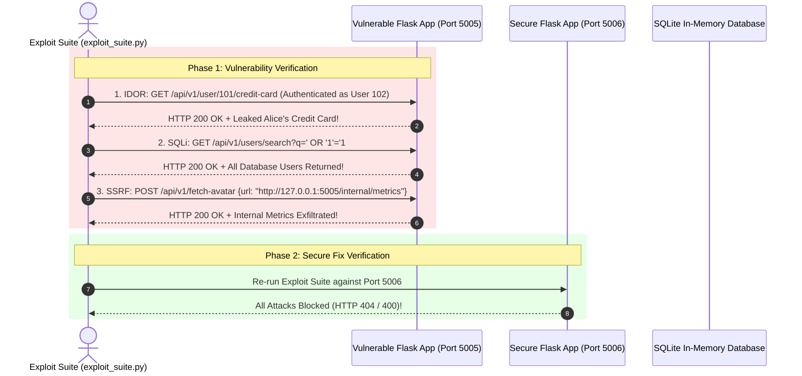

# 07. Hands-On Vulnerability Lab

In this hands-on lab, you will deploy a **vulnerable Flask web service**, run an **automated exploit suite** that demonstrates IDOR (A01), SQL Injection (A03), and SSRF (A10), and then deploy and verify a **production-grade secure fix**.

---

## 🧪 Lab Architecture & Attack Workflow



---

## 🛠️ Step 1: Environment Setup

Install the required minimal dependencies (Flask and requests):

```bash
# Create and activate virtual environment
python -m venv venv
# On Windows:
venv\Scripts\activate
# On Linux/macOS:
source venv/bin/activate

# Install dependencies
pip install flask requests
```

---

## 💻 Step 2: The Vulnerable API (`vulnerable_app.py`)

Create `vulnerable_app.py` in your working directory:

```python
# vulnerable_app.py
from flask import Flask, request, jsonify
import sqlite3
import requests

app = Flask(__name__)

def init_db():
    conn = sqlite3.connect(':memory:', check_same_thread=False)
    cursor = conn.cursor()
    cursor.execute('CREATE TABLE users (id INTEGER PRIMARY KEY, username TEXT, card_number TEXT, role TEXT)')
    cursor.execute("INSERT INTO users VALUES (101, 'alice', '4532-1111-2222-9811', 'user')")
    cursor.execute("INSERT INTO users VALUES (102, 'bob', '4111-3333-4444-1122', 'user')")
    cursor.execute("INSERT INTO users VALUES (999, 'admin', '5500-0000-0000-0000', 'admin')")
    conn.commit()
    return conn

conn = init_db()

# Simulated internal metric route (Internal SSRF Target)
@app.route('/internal/metrics', methods=['GET'])
def internal_metrics():
    return jsonify({"secret_system_status": "OK", "internal_key": "SECRET_SYSTEM_KEY_998877"}), 200

# ❌ VULNERABLE ENDPOINT 1: IDOR / Broken Access Control
@app.route('/api/v1/user/<int:user_id>/credit-card', methods=['GET'])
def get_user_card(user_id):
    # Simulated Session: Current logged-in user is 'bob' (ID: 102)
    logged_in_user_id = 102 
    
    # VULNERABLE: Fetches card by user_id parameter without checking if logged_in_user_id == user_id!
    cursor = conn.cursor()
    cursor.execute(f"SELECT username, card_number FROM users WHERE id = {user_id}")
    row = cursor.fetchone()
    
    if not row:
        return jsonify({"error": "User not found"}), 404
    return jsonify({"username": row[0], "card_number": row[1]}), 200

# ❌ VULNERABLE ENDPOINT 2: SQL Injection
@app.route('/api/v1/users/search', methods=['GET'])
def search_users():
    query_param = request.args.get('q', '')
    cursor = conn.cursor()
    # VULNERABLE: Direct string concatenation
    query = f"SELECT id, username, role FROM users WHERE username = '{query_param}'"
    cursor.execute(query)
    rows = cursor.fetchall()
    return jsonify({"results": rows}), 200

# ❌ VULNERABLE ENDPOINT 3: SSRF (Server-Side Request Forgery)
@app.route('/api/v1/fetch-avatar', methods=['POST'])
def fetch_avatar():
    data = request.get_json() or {}
    target_url = data.get('url', '')
    # VULNERABLE: App fetches arbitrary URLs without IP or scheme validation!
    resp = requests.get(target_url)
    return resp.text, resp.status_code

if __name__ == '__main__':
    print("🚀 Starting Vulnerable App on http://localhost:5005...")
    app.run(port=5005, debug=False)
```

---

## ⚡ Step 3: Automated Exploit Suite (`exploit_suite.py`)

Create `exploit_suite.py` to automate and demonstrate all three exploits:

```python
# exploit_suite.py
import requests
import sys

TARGET_URL = "http://localhost:5005"

def test_idor():
    print("\n[1] --- EXPLOITING A01: IDOR (Broken Access Control) ---")
    print("Bob (ID 102) requesting Alice's (ID 101) Credit Card...")
    res = requests.get(f"{TARGET_URL}/api/v1/user/101/credit-card")
    print(f"Status Code: {res.status_code}")
    print(f"Response: {res.text}")
    if res.status_code == 200 and "alice" in res.text:
        print("🚨 CRITICAL: IDOR Exploited! Alice's private card leaked to Bob.")
    else:
        print("✅ IDOR Attack Blocked!")

def test_sqli():
    print("\n[2] --- EXPLOITING A03: SQL Injection ---")
    sqli_payload = "' OR '1'='1"
    print(f"Sending Payload: {sqli_payload}")
    res = requests.get(f"{TARGET_URL}/api/v1/users/search", params={'q': sqli_payload})
    print(f"Status Code: {res.status_code}")
    print(f"Response: {res.text}")
    if res.status_code == 200 and len(res.json().get('results', [])) > 1:
        print("🚨 CRITICAL: SQL Injection Exploited! All user records dumped.")
    else:
        print("✅ SQL Injection Attack Blocked!")

def test_ssrf():
    print("\n[3] --- EXPLOITING A10: Server-Side Request Forgery (SSRF) ---")
    ssrf_target = f"{TARGET_URL}/internal/metrics"
    print(f"Requesting Server to fetch internal URL: {ssrf_target}")
    res = requests.post(f"{TARGET_URL}/api/v1/fetch-avatar", json={'url': ssrf_target})
    print(f"Status Code: {res.status_code}")
    print(f"Response Payload: {res.text}")
    if res.status_code == 200 and "SECRET_SYSTEM_KEY" in res.text:
        print("🚨 CRITICAL: SSRF Exploited! Internal system metrics exfiltrated.")
    else:
        print("✅ SSRF Attack Blocked!")

if __name__ == '__main__':
    if len(sys.argv) > 1:
        TARGET_URL = sys.argv[1]
    print(f"Running Exploit Suite against target: {TARGET_URL}")
    test_idor()
    test_sqli()
    test_ssrf()
```

---

## 🔒 Step 4: Secure Production Remediation (`secure_app.py`)

Create `secure_app.py` implementing all secure fixes:

```python
# secure_app.py
from flask import Flask, request, jsonify
import sqlite3
import urllib.parse
import ipaddress
import socket
import requests

app = Flask(__name__)

def init_db():
    conn = sqlite3.connect(':memory:', check_same_thread=False)
    cursor = conn.cursor()
    cursor.execute('CREATE TABLE users (id INTEGER PRIMARY KEY, username TEXT, card_number TEXT, role TEXT)')
    cursor.execute("INSERT INTO users VALUES (101, 'alice', '4532-1111-2222-9811', 'user')")
    cursor.execute("INSERT INTO users VALUES (102, 'bob', '4111-3333-4444-1122', 'user')")
    cursor.execute("INSERT INTO users VALUES (999, 'admin', '5500-0000-0000-0000', 'admin')")
    conn.commit()
    return conn

conn = init_db()

# ✅ SECURE ENDPOINT 1: IDOR Fixed with Server-Side Authorization
@app.route('/api/v1/user/<int:user_id>/credit-card', methods=['GET'])
def get_user_card_secure(user_id):
    logged_in_user_id = 102 # Authenticated Session Context (Bob)
    
    # AuthZ Check: Bob can ONLY request his own card!
    if logged_in_user_id != user_id:
        return jsonify({"error": "Resource not found"}), 404 # Hides resource existence
        
    cursor = conn.cursor()
    cursor.execute("SELECT username, card_number FROM users WHERE id = ?", (user_id,))
    row = cursor.fetchone()
    return jsonify({"username": row[0], "card_number": row[1]}), 200

# ✅ SECURE ENDPOINT 2: SQLi Fixed with Parameterized Query
@app.route('/api/v1/users/search', methods=['GET'])
def search_users_secure():
    query_param = request.args.get('q', '')
    cursor = conn.cursor()
    # Safe Parameterized Statement
    cursor.execute("SELECT id, username, role FROM users WHERE username = ?", (query_param,))
    rows = cursor.fetchall()
    return jsonify({"results": rows}), 200

# ✅ SECURE ENDPOINT 3: SSRF Fixed with IP Subnet Blocking
BLOCKED_NETWORKS = [
    ipaddress.ip_network('127.0.0.0/8'),
    ipaddress.ip_network('10.0.0.0/8'),
    ipaddress.ip_network('169.254.0.0/16'),
]

@app.route('/api/v1/fetch-avatar', methods=['POST'])
def fetch_avatar_secure():
    data = request.get_json() or {}
    url = data.get('url', '')
    
    parsed = urllib.parse.urlparse(url)
    if parsed.scheme not in ('http', 'https'):
        return jsonify({"error": "Invalid URL scheme"}), 400
        
    try:
        ip = ipaddress.ip_address(socket.gethostbyname(parsed.hostname))
        for net in BLOCKED_NETWORKS:
            if ip in net:
                return jsonify({"error": "Access to internal IP ranges is forbidden"}), 400
    except Exception:
        return jsonify({"error": "Host resolution failed"}), 400
        
    resp = requests.get(url, allow_redirects=False, timeout=3)
    return resp.text, resp.status_code

if __name__ == '__main__':
    print("🛡️ Starting Secure App on http://localhost:5006...")
    app.run(port=5006, debug=False)
```

---

## 📊 Verification & Execution Logs

Run the exploit suite against both applications in separate terminal windows:

### Terminal 1: Run Vulnerable App & Test Exploit
```bash
python vulnerable_app.py
# In another terminal window:
python exploit_suite.py http://localhost:5005
```

**Expected Output (Vulnerable State):**
```text
Running Exploit Suite against target: http://localhost:5005

[1] --- EXPLOITING A01: IDOR (Broken Access Control) ---
Status Code: 200
Response: {"card_number":"4532-1111-2222-9811","username":"alice"}
🚨 CRITICAL: IDOR Exploited! Alice's private card leaked to Bob.

[2] --- EXPLOITING A03: SQL Injection ---
Status Code: 200
Response: {"results":[[101,"alice","user"],[102,"bob","user"],[999,"admin","admin"]]}
🚨 CRITICAL: SQL Injection Exploited! All user records dumped.

[3] --- EXPLOITING A10: Server-Side Request Forgery (SSRF) ---
Status Code: 200
Response Payload: {"internal_key":"SECRET_SYSTEM_KEY_998877","secret_system_status":"OK"}
🚨 CRITICAL: SSRF Exploited! Internal system metrics exfiltrated.
```

### Terminal 2: Run Secure App & Test Exploit Verification
```bash
python secure_app.py
# In another terminal window:
python exploit_suite.py http://localhost:5006
```

**Expected Output (Remediated Secure State):**
```text
Running Exploit Suite against target: http://localhost:5006

[1] --- EXPLOITING A01: IDOR (Broken Access Control) ---
Status Code: 404
Response: {"error":"Resource not found"}
✅ IDOR Attack Blocked!

[2] --- EXPLOITING A03: SQL Injection ---
Status Code: 200
Response: {"results":[]}
✅ SQL Injection Attack Blocked!

[3] --- EXPLOITING A10: Server-Side Request Forgery (SSRF) ---
Status Code: 400
Response Payload: {"error":"Access to internal IP ranges is forbidden"}
✅ SSRF Attack Blocked!
```

---

> [!TIP]
> **Lab Challenge:** Try extending `secure_app.py` by adding rate limiting using `Flask-Limiter` on `/api/v1/fetch-avatar` to block automated URL scanning!

---

*Next Chapter: [08. References & Tooling →](08-references.md)*
