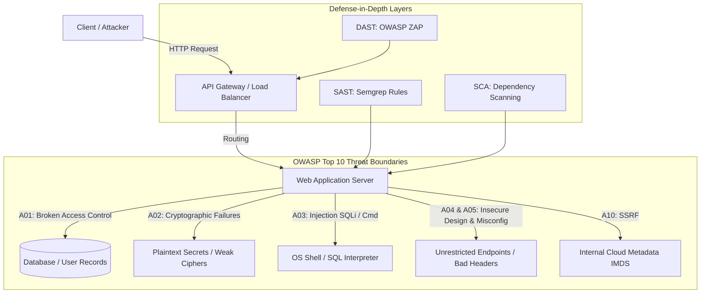

# OWASP Top 10 Deep Dive

> **Section:** 🏗️ Foundational Security  
> **Level:** Beginner to Intermediate  
> **Time to Complete:** ~120 minutes  
> **Prerequisites:** Basic understanding of Web Applications, HTTP protocol, REST APIs, and any programming language (Python, Node.js, Go, or Java)  
> **Status:** ✅ Complete & Production-Ready Guide

---

## 🎯 Overview & Learning Objectives

The **OWASP Top 10** represents the globally recognized consensus on the most critical security risks facing web applications. Maintained by the Open Web Application Security Project (OWASP), it serves as a foundational benchmark for developers, security engineers, and auditors.

> [!NOTE]
> The OWASP Top 10 is updated periodically (most recently in 2021) based on data gathered from thousands of organizations and analysis of millions of application security vulnerabilities.

By completing this module, you will be able to:
- [x] **Analyze** the root causes, attack mechanics, and business impacts of all OWASP Top 10 risk categories.
- [x] **Identify** insecure code patterns across **Python**, **Node.js**, **Go**, and **Java**.
- [x] **Exploit** flaws (IDOR, SQL Injection, Command Injection, SSRF, CORS misconfigurations) safely in controlled environments to verify risk impact.
- [x] **Implement** production-grade mitigations (RBAC/ABAC, parameterized queries, Argon2id password hashing, AES-256-GCM encryption, defused XML parsing).
- [x] **Automate** vulnerability detection in CI/CD using Static Application Security Testing (Semgrep SAST) and Dynamic Application Security Testing (OWASP ZAP).
- [x] **Solve** a hands-on end-to-end multi-vulnerability Python laboratory.

---

## 🗺️ Learning Path & Threat Model Architecture

---

## 📊 OWASP Top 10 Risk Matrix Summary

| Category ID | Vulnerability Name | Primary Root Cause | Common CWEs | Tech Impact |
|---|---|---|---|---|
| **A01:2021** | **Broken Access Control** | Missing/flawed authorization checks on server | CWE-200, CWE-639, CWE-284 | High / Critical |
| **A02:2021** | **Cryptographic Failures** | Plaintext transmission, weak algorithms, unencrypted storage | CWE-259, CWE-327, CWE-319 | High |
| **A03:2021** | **Injection** | Concatenating untrusted input into interpreters | CWE-89, CWE-78, CWE-79 | Critical |
| **A04:2021** | **Insecure Design** | Missing security controls in system architecture | CWE-209, CWE-522, CWE-256 | High |
| **A05:2021** | **Security Misconfiguration** | Unhardened defaults, verbose errors, permissive CORS | CWE-16, CWE-611, CWE-942 | Medium / High |
| **A06:2021** | **Vulnerable Components** | Outdated libraries with known CVEs | CWE-1104, CWE-937 | High / Critical |
| **A07:2021** | **Identification & Auth Failures** | Weak passwords, session hijacking, credential stuffing | CWE-287, CWE-384, CWE-798 | High |
| **A08:2021** | **Software & Data Integrity** | Unsigned updates, insecure deserialization, CI/CD risks | CWE-502, CWE-829 | Critical |
| **A09:2021** | **Security Logging & Monitoring** | Insufficient audit logging, delayed incident response | CWE-778, CWE-117 | Medium |
| **A10:2021** | **Server-Side Request Forgery** | Unchecked server-side remote URL fetching | CWE-918 | High / Critical |

---

## 📚 Module Navigation

1. **[01. Overview & Threat Landscape](01-introduction.md)** — OWASP risk methodology, shift-left DevSecOps pipelines, and SAST/DAST automation architecture.
2. **[02. A01: Broken Access Control & IDOR](02-a01-broken-access-control.md)** — IDOR/BOLA, privilege escalation, multi-tenant isolation, UUID vs sequential ID nuances, and RBAC/ABAC implementations.
3. **[03. A02: Cryptographic Failures](03-a02-cryptographic-failures.md)** — Data in transit vs at rest, Argon2id password hashing, AES-256-GCM authenticated encryption, TLS 1.3, and KMS key management.
4. **[04. A03: Injection (SQLi, Command Injection & SSRF)](04-a03-injection.md)** — Deep mechanics of SQL Injection, Command Injection, and SSRF (Cloud IMDSv2 protection) with multi-language code snippets.
5. **[05. A04 & A05: Insecure Design & Security Misconfiguration](05-a04-insecure-design-and-misconfig.md)** — Rate limiting architecture, CORS preflight policies, XXE safe parsing (`defusedxml`), and production security headers.
6. **[06. Defenses & Secure Coding Cheatsheet](06-defenses-cheatsheet.md)** — Multi-language defense matrix (Python, Node.js, Go, Java), production Semgrep SAST rules, and PR review checklists.
7. **[07. Hands-On Vulnerability Lab](07-hands-on-lab.md)** — Self-contained runnable Python lab featuring vulnerable API, automated exploit suite, and secure fix verification.
8. **[08. References & Tooling](08-references.md)** — Standards (NIST, ASVS, WSTG), CVE benchmarks, and security scanner documentation.

---

> [!TIP]
> **Getting Started:** Begin with [01. Overview & Threat Landscape →](01-introduction.md) or dive directly into specific vulnerability deep dives using the module links above.
