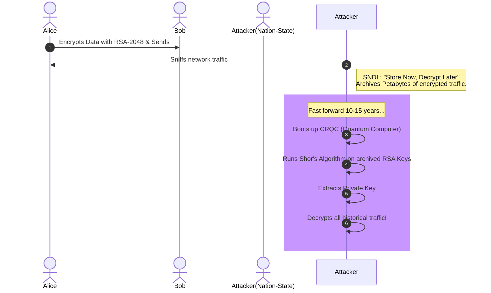

# Chapter 02: Quantum Threat Model & Shor's Algorithm

The most imminent threat to modern cryptography comes from Shor's Algorithm running on a Cryptographically Relevant Quantum Computer (CRQC). The concept of "Store Now, Decrypt Later" (SNDL) means the threat is already here.

## 1. The Concept (ELI5)

Imagine you wrote a secret message in a notebook and locked it in a strongbox (encryption). A thief steals the strongbox today. They can't open it because they don't have the key. But they just hide the box in their garage. 10 years later, someone invents an automatic laser-cutter that easily slices open any old strongbox. The thief takes your box out, cuts it open, and reads the secret message.

Shor's Algorithm is that laser-cutter. "Store Now, Decrypt Later" means attackers are stealing encrypted data right now, waiting for the day they get their hands on a quantum computer to break it.

## 2. The Visual



## 3. The Code

Let's look at how classical encryption keys are configured and how we start moving to hybrid mode to defend against SNDL.

### Python

**Vulnerable Code** ❌ (Standard TLS context without PQC)
```python
import ssl

context = ssl.create_default_context()
# By default, uses standard ECDHE or RSA key exchange
# Vulnerable to "Store Now, Decrypt Later"
```

**Production-Ready Secure Code** ✅ (Conceptual Hybrid PQC)
```python
import ssl

context = ssl.create_default_context()
# In the future/supported builds, you configure curves to include Kyber
# e.g., X25519Kyber768Draft00
context.set_ecdh_curve("X25519Kyber768Draft00")
# This provides classical ECC security + quantum resistance
```

### Go

**Vulnerable Code** ❌
```go
package main
import "crypto/tls"

func main() {
    config := &tls.Config{
        // Default CipherSuites and CurvePreferences
        // Vulnerable to SNDL quantum attacks
    }
    _ = config
}
```

**Production-Ready Secure Code** ✅
```go
package main
import "crypto/tls"

func main() {
    config := &tls.Config{
        // Go 1.23+ natively supports hybrid post-quantum key exchange (X25519Kyber768Draft00)
        CurvePreferences: []tls.CurveID{
            tls.X25519Kyber768Draft00,
            tls.CurveP256,
        },
    }
    _ = config
}
```

### TypeScript / Node.js

**Vulnerable Code** ❌
```typescript
import * as tls from 'tls';

const options: tls.TlsOptions = {
    // Default sigalgs and curves
};
```

**Production-Ready Secure Code** ✅
```typescript
import * as tls from 'tls';

const options: tls.TlsOptions = {
    // Ensuring specific secure curves and eventually hybrid KEMs
    // Node.js support for PQC in core TLS is evolving (depends on OpenSSL 3.x with OQS provider)
    ciphers: 'TLS_AES_256_GCM_SHA384', 
    sigalgs: 'dilithium3:rsa-pss-rsae-sha256' // Concept mapping for OQS-enabled Node
};
```

## 4. The Guardrail

**Semgrep Rule**: Detect lack of hybrid curve preference in Go TLS configurations.

```yaml
rules:
  - id: go-missing-pqc-curve
    message: "Consider updating CurvePreferences to include X25519Kyber768Draft00 for Quantum Resistance."
    severity: INFO
    languages:
      - go
    pattern: |
      &tls.Config{
        ...,
        CurvePreferences: []tls.CurveID{
          ...,
        },
        ...
      }
    pattern-not-inside: |
      &tls.Config{
        ...,
        CurvePreferences: []tls.CurveID{
          ...,
          tls.X25519Kyber768Draft00,
          ...,
        },
        ...
      }
```
