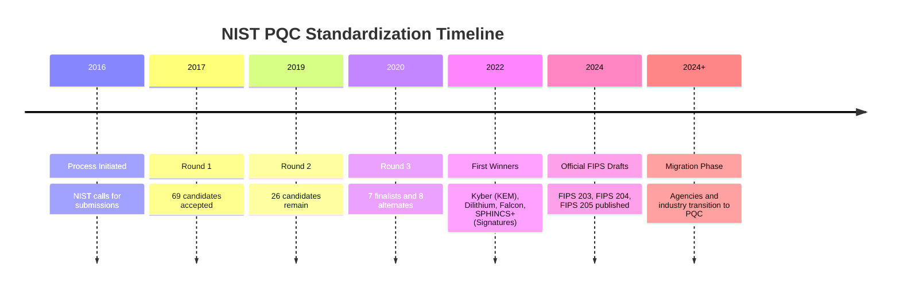

# Chapter 03: NIST PQC Standardization Process

The National Institute of Standards and Technology (NIST) initiated a process to solicit, evaluate, and standardize quantum-resistant public-key cryptographic algorithms. 

## 1. The Concept (ELI5)

Imagine if the world decided that our current locks on doors are too weak, so the government announces a giant contest. Inventors from all over the world submit their best, unbreakable lock designs. For years, the smartest lockpickers try to break them. The ones that survive round after round are eventually declared the "New Global Standard Lock." This is what NIST did for computer encryption, and the winners are finally being announced and formalized into standards!

## 2. The Visual



## 3. The Code

Selecting standard parameters matching the NIST standards.

### Go

**Vulnerable Code** ❌ (Using custom or non-standard cryptographic primitives)
```go
package main
import "fmt"
// Custom home-rolled lattice crypto (Never do this!)
func doCustomCrypto() {
    fmt.Println("Custom math")
}
```

**Production-Ready Secure Code** ✅ (Using NIST FIPS 203 ML-KEM / Kyber standard)
```go
package main

import (
	"fmt"
	// Circl implements NIST-standardized Kyber (ML-KEM)
	"github.com/cloudflare/circl/kem/kyber/kyber512" 
)

func main() {
	publicKey, privateKey, err := kyber512.GenerateKeyPair(nil)
	if err != nil {
		panic(err)
	}
	fmt.Printf("NIST ML-KEM-512 Public Key Size: %d\n", len(publicKey.Bytes()))
    _ = privateKey
}
```

### Python

**Vulnerable Code** ❌
```python
# Using outdated or non-standard algorithms
import hashlib
def weak_hash_signature(data):
    return hashlib.md5(data).digest() # Broken
```

**Production-Ready Secure Code** ✅
```python
import oqs

# Using NIST standardized algorithms ML-KEM (Kyber) and ML-DSA (Dilithium)
# oqs maps standard names
kem = oqs.KeyEncapsulation("Kyber512")
sig = oqs.Signature("Dilithium2")

print(f"ML-KEM algorithm details: {kem.details}")
```

### TypeScript / Node.js

**Vulnerable Code** ❌
```typescript
// Weak symmetric key generation relying on bad entropy
const badKey = Buffer.alloc(32, 'a');
```

**Production-Ready Secure Code** ✅
```typescript
import { KeyEncapsulation } from 'node-oqs';

// Target NIST level 1 (Kyber512) equivalent to AES-128 security
const kem = new KeyEncapsulation('Kyber512');
const keypair = kem.generateKeypair();
```

## 4. The Guardrail

**Terraform AWS Policy**:
Ensure AWS Key Management Service (KMS) uses PQC-compatible external key stores or relies on strictly managed FIPS 140-3 boundaries that will include PQC modules.

```terraform
# Terraform AWS Guardrail:
# While PQC keys are not fully native in KMS yet, ensure standard FIPS endpoints are used.

resource "aws_kms_key" "standard_key" {
  description             = "KMS key for data encryption"
  deletion_window_in_days = 10
  enable_key_rotation     = true
  # Always ensure rotation is enabled to facilitate future migration to PQC-backed keys
}

# Example Checkov/Rego rule to enforce rotation
# rule:
#   aws_kms_key_rotation_enabled: true
```
