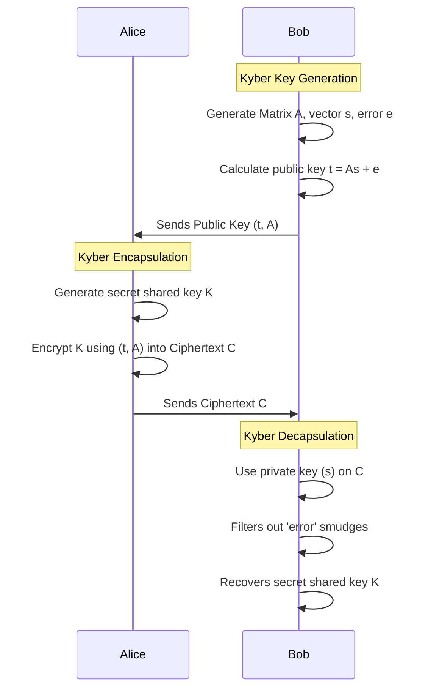

# Chapter 04: Kyber (ML-KEM) Key Encapsulation Mechanism

Kyber, standardized by NIST as **ML-KEM** (Module-Lattice-Based Key-Encapsulation Mechanism), is the primary public-key encryption and key establishment algorithm for the post-quantum era.

## 1. The Concept (ELI5)

Imagine you want to send a secret color to a friend over the mail, but a thief opens all your mail. 
In classical crypto, you mix your color with a "math lock."
In Kyber, you use a concept called "Learning With Errors." You take a base color, add some precise coordinates, and then intentionally **smudge** the ink a little bit. To the thief, the smudged ink looks completely random and impossible to reverse-engineer. But your friend has special "3D glasses" (the private key) that perfectly filters out the smudge, revealing the secret color underneath. A quantum computer tries to remove the smudge perfectly but fails because the errors are random and lattice-based.

## 2. The Visual



## 3. The Code

Here is how you actually perform Key Encapsulation with Kyber (ML-KEM).

### Go

**Vulnerable Code** ❌ (Basic RSA Key Exchange)
```go
package main
import (
	"crypto/rsa"
	"crypto/rand"
)
// RSA Encryption for Key Exchange is deprecated and quantum-vulnerable
func encryptKey(pub *rsa.PublicKey, secretKey []byte) []byte {
	ciphertext, _ := rsa.EncryptPKCS1v15(rand.Reader, pub, secretKey)
	return ciphertext
}
```

**Production-Ready Secure Code** ✅ (Kyber / ML-KEM)
```go
package main
import (
	"fmt"
	"github.com/cloudflare/circl/kem/kyber/kyber768"
)
func main() {
	// Bob generates keys
	pk, sk, _ := kyber768.GenerateKeyPair(nil)
	
	// Alice encapsulates a secret using Bob's Public Key
	ciphertext, sharedSecretAlice, _ := kyber768.Encapsulate(pk)
	
	// Bob decapsulates the ciphertext using his Secret Key
	sharedSecretBob, _ := kyber768.Decapsulate(sk, ciphertext)
	
	fmt.Printf("Secrets match: %t\n", string(sharedSecretAlice) == string(sharedSecretBob))
}
```

### Python

**Vulnerable Code** ❌
```python
# Assuming classical Diffie-Hellman or RSA KEM without quantum protection
pass
```

**Production-Ready Secure Code** ✅
```python
import oqs

kem = oqs.KeyEncapsulation("Kyber768")
public_key = kem.generate_keypair()

# Encapsulation
ciphertext, shared_secret_sender = kem.encap_secret(public_key)

# Decapsulation
shared_secret_receiver = kem.decap_secret(ciphertext)

assert shared_secret_sender == shared_secret_receiver
```

### TypeScript / Node.js

**Vulnerable Code** ❌
```typescript
import { publicEncrypt, constants } from 'crypto';
// Classic RSA Key Exchange
```

**Production-Ready Secure Code** ✅
```typescript
import { KeyEncapsulation } from 'node-oqs';

const kem = new KeyEncapsulation('Kyber768');
const pubKey = kem.generateKeypair();

const { ciphertext, sharedSecret: ssSender } = kem.encapSecret(pubKey);
const ssReceiver = kem.decapSecret(ciphertext);

console.log("Match:", ssSender.equals(ssReceiver));
```

## 4. The Guardrail

**Semgrep Rule**: Detect and flag usage of classical RSA encryption padding `PKCS1v15` which is bad both classically (Bleichenbacher attacks) and quantumly.

```yaml
rules:
  - id: avoid-rsa-pkcs1v15
    message: "RSA PKCS1v15 padding is highly vulnerable. Migrate to OAEP, or better yet, ML-KEM (Kyber) for quantum resistance."
    severity: ERROR
    languages:
      - go
    pattern: rsa.EncryptPKCS1v15(...)
```
