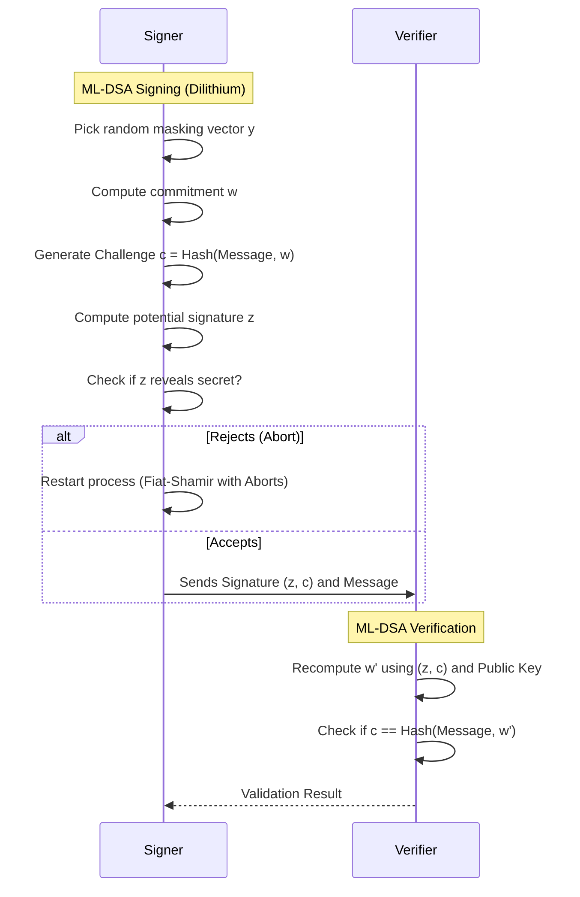

# Chapter 05: Dilithium (ML-DSA) Digital Signatures

While Kyber is for establishing secret keys, **Dilithium** (standardized as **ML-DSA** - Module-Lattice-Based Digital Signature Algorithm) is the NIST standard for digital signatures, ensuring data authenticity and non-repudiation in a post-quantum world.

## 1. The Concept (ELI5)

Imagine you want to sign a check, and you want to prove to the bank that you signed it, without showing anyone your actual signature technique. 
In classical cryptography (like ECDSA), you use mathematical curves. A quantum computer can reverse engineer the curve to forge your signature.
Dilithium uses a technique called "Fiat-Shamir with Aborts." Think of it as a complex dance. To sign the check, you perform a random, intricate 500-step dance (lattice math). If the dance gets too close to revealing your secret signature style, you immediately stop ("Abort") and start a slightly different dance from scratch. When you finally finish a safe dance, you record the steps. The bank can easily verify the steps match your public profile, but a quantum computer can't calculate a fake set of steps because of the deliberate randomness and "aborts."

## 2. The Visual



## 3. The Code

How to securely sign and verify data using ML-DSA.

### Go

**Vulnerable Code** ❌ (Classical ECDSA)
```go
package main
import (
	"crypto/ecdsa"
	"crypto/rand"
	"crypto/sha256"
)
// Quantum computers can derive the private key from the public key and signature
func signData(priv *ecdsa.PrivateKey, msg []byte) {
	hash := sha256.Sum256(msg)
	r, s, _ := ecdsa.Sign(rand.Reader, priv, hash[:])
	_ = r
	_ = s
}
```

**Production-Ready Secure Code** ✅ (Dilithium / ML-DSA)
```go
package main
import (
	"fmt"
	"github.com/cloudflare/circl/sign/dilithium/mode3"
)
func main() {
	// Generate Dilithium Keypair
	pk, sk, _ := mode3.GenerateKey(nil)
	msg := []byte("AppSec Atlas PQC Masterclass")
	
	// Sign Message
	signature := mode3.Sign(sk, msg)
	
	// Verify Message
	isValid := mode3.Verify(pk, msg, signature)
	fmt.Printf("Signature Valid: %t\n", isValid)
}
```

### Python

**Vulnerable Code** ❌
```python
from cryptography.hazmat.primitives.asymmetric import ec
# Classical ECC signing
```

**Production-Ready Secure Code** ✅
```python
import oqs

# Use Dilithium3 (NIST Security Level 3)
sig = oqs.Signature("Dilithium3")
public_key = sig.generate_keypair()

message = b"Strictly confidential data"

# Sign
signature = sig.sign(message)

# Verify
is_valid = sig.verify(message, signature, public_key)
print("Verified:", is_valid)
```

### TypeScript / Node.js

**Vulnerable Code** ❌
```typescript
import { sign } from 'crypto';
// Classic RSA/ECC sign
```

**Production-Ready Secure Code** ✅
```typescript
import { Signature } from 'node-oqs';

const signer = new Signature('Dilithium3');
const pubKey = signer.generateKeypair();
const msg = Buffer.from("Secure Payload");

const signature = signer.sign(msg);
const isValid = signer.verify(msg, signature, pubKey);

console.log("PQC Signature valid:", isValid);
```

## 4. The Guardrail

**Rego Rule (OPA)**:
If you are defining JWT signing algorithms in your API Gateway or Kubernetes configurations, strictly deny the use of 'none' and eventually enforce transitioning to PQC-enabled algorithms or hybrid setups.

```rego
package api.jwt_validation

deny[msg] {
  input.jwt_config.algorithm == "none"
  msg := "JWT algorithm 'none' is completely insecure."
}

warn[msg] {
  # Transition warning for classical algos
  classical_algs := {"RS256", "ES256"}
  classical_algs[input.jwt_config.algorithm]
  msg := "Consider preparing infrastructure for PQC signature algorithms (e.g., ML-DSA) in future iterations."
}
```
