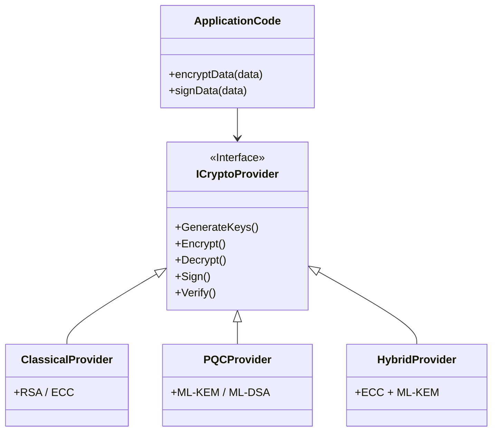

# Chapter 07: Crypto Agility and Future-Proofing

PQC algorithms have significantly different performance characteristics than classical algorithms. Keys are larger, and signatures are bulkier. To survive the transition, applications must be **Crypto Agile**.

## 1. The Concept (ELI5)

Imagine building a house and hardwiring all the lightbulbs directly into the walls, permanently soldering them to the wires. When a bulb burns out, or when a new energy-efficient LED is invented, you have to smash the wall with a sledgehammer to change it. 
Crypto Agility is like inventing the lightbulb socket. You don't care *what* kind of bulb goes in, as long as it fits the socket. If an encryption algorithm gets broken, you just "unscrew" it and "screw in" the new quantum-safe one. Your application code shouldn't need to be rewritten.

## 2. The Visual



## 3. The Code

Refactoring tightly coupled cryptography into a crypto-agile interface.

### TypeScript / Node.js

**Vulnerable Code** ❌ (Hardcoded algorithms deeply embedded in business logic)
```typescript
import { publicEncrypt } from 'crypto';

function processPayment(creditCard: Buffer, rsaPublicKey: string) {
    // Hardcoded RSA! Very difficult to migrate to PQC later.
    const encrypted = publicEncrypt(rsaPublicKey, creditCard);
    // ... send to gateway ...
}
```

**Production-Ready Secure Code** ✅ (Crypto Agile Interface)
```typescript
interface ICryptoService {
    encrypt(data: Buffer, publicKey: any): Buffer;
}

// The business logic only knows about the interface
function processPayment(creditCard: Buffer, cryptoService: ICryptoService, pubKey: any) {
    const encrypted = cryptoService.encrypt(creditCard, pubKey);
    // ...
}

// You can swap the implementation in the DI container without touching processPayment
class PQCCryptoService implements ICryptoService {
    encrypt(data: Buffer, publicKey: any): Buffer {
        // Implement Kyber/AES hybrid envelope encryption here
        return Buffer.alloc(0); // stub
    }
}
```

### Go

**Vulnerable Code** ❌
```go
package main

import "crypto/rsa"

type UserData struct {
    Key *rsa.PublicKey // Hardcoded to RSA
}
```

**Production-Ready Secure Code** ✅
```go
package main

// Crypto Agile: Use interfaces or generic byte slices
type UserData struct {
    PublicKeyID    string // Reference to KMS or Key Registry
    PublicKeyBytes []byte // Algorithm agnostic
    AlgorithmID    string // E.g., "ML-KEM-768"
}
```

### Python

**Vulnerable Code** ❌
```python
def generate_user_token():
    # Hardcoded algorithm choice inside the function
    import jwt
    return jwt.encode({"user": 123}, "secret", algorithm="RS256")
```

**Production-Ready Secure Code** ✅
```python
def generate_user_token(crypto_config: dict):
    # Agility: Configuration driven cryptography
    import jwt
    return jwt.encode(
        {"user": 123}, 
        crypto_config['private_key'], 
        algorithm=crypto_config['algorithm']
    )
```

## 4. The Guardrail

**Semgrep Rule**: Prevent hardcoding specific cryptographic algorithms in variables or struct definitions, encouraging the use of dynamic configuration.

```yaml
rules:
  - id: prevent-hardcoded-crypto-structs
    message: "Avoid hardcoding specific algorithms (like *rsa.PublicKey) in data structures. Use algorithm-agnostic types (like []byte or interfaces) to enable Crypto Agility."
    severity: WARNING
    languages:
      - go
    pattern: |
      type $NAME struct {
        ...
        $FIELD *rsa.PublicKey
        ...
      }
```

## Conclusion

By adopting Post-Quantum Cryptography now using Hybrid modes and Crypto Agility, you protect your users against "Store Now, Decrypt Later" attacks and future-proof your systems against the inevitability of Cryptographically Relevant Quantum Computers.
