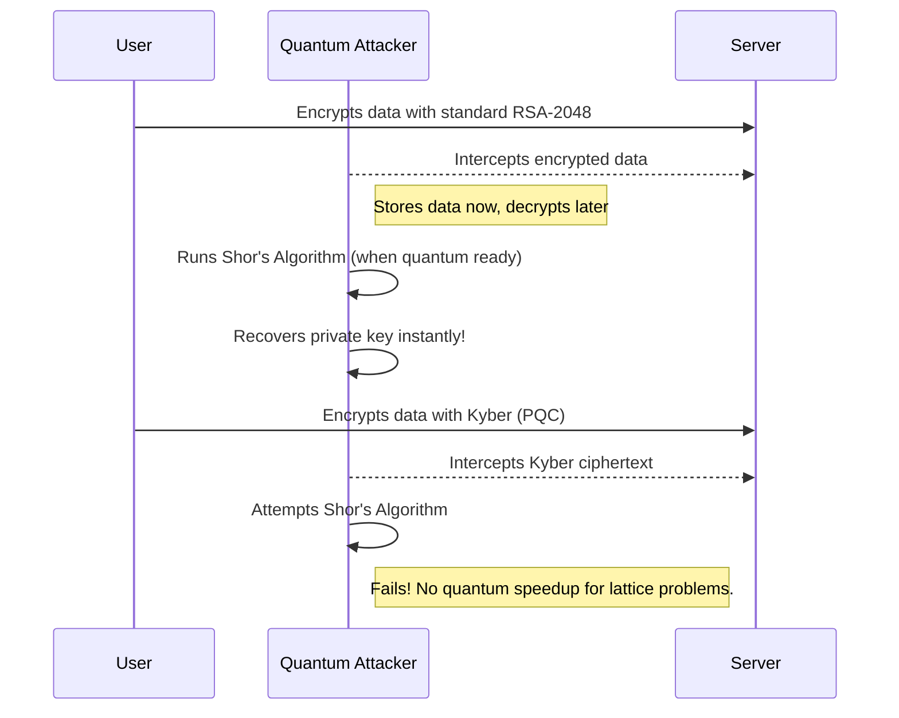

# Post-Quantum Cryptography (PQC) Masterclass

Welcome to the Masterclass on Post-Quantum Cryptography (PQC). In this guide, we dive deep into the quantum threat landscape and the next generation of cryptographic algorithms designed to withstand quantum attacks.

## 1. The Concept (ELI5)

Imagine you have a super-complicated combination lock on a safe. A normal computer tries combinations one by one and would take millions of years to open it. But a quantum computer is like a magical lockpick that can try multiple combinations at the exact same time, popping the lock open in minutes. Post-Quantum Cryptography is basically changing out that combination lock for a complex puzzle (like a multi-dimensional maze) that even the magical lockpick gets stuck in.

## 2. The Visual



## 3. The Code

Here is how you transition from classic vulnerable RSA to a quantum-resistant approach (conceptualized).

### Python

**Vulnerable Code** ❌ (Using classical RSA)
```python
from cryptography.hazmat.primitives.asymmetric import rsa

# Classic RSA: Vulnerable to Shor's algorithm on a quantum computer
private_key = rsa.generate_private_key(
    public_exponent=65537,
    key_size=2048,
)
```

**Production-Ready Secure Code** ✅ (Using PQC / Kyber - via wrapper libraries)
```python
import oqs # Open Quantum Safe library

# PQC Key Encapsulation: Resistant to quantum attacks
kem = oqs.KeyEncapsulation("Kyber512")
public_key = kem.generate_keypair()
# Use this public_key for quantum-safe encapsulation
```

### Go

**Vulnerable Code** ❌
```go
package main

import (
	"crypto/rsa"
	"crypto/rand"
)

func main() {
	// Classic RSA: Vulnerable to quantum computers
	privateKey, _ := rsa.GenerateKey(rand.Reader, 2048)
	_ = privateKey
}
```

**Production-Ready Secure Code** ✅
```go
package main

import (
	"fmt"
	"github.com/cloudflare/circl/kem/kyber/kyber512"
)

func main() {
	// PQC KEM: Quantum-safe lattice-based cryptography
	pk, sk, _ := kyber512.GenerateKeyPair(nil)
	fmt.Println("Generated Quantum-Safe Kyber512 Keys", pk, sk)
}
```

### TypeScript / Node.js

**Vulnerable Code** ❌
```typescript
import { generateKeyPairSync } from 'crypto';

// Classic RSA: Quantum-vulnerable
const { publicKey, privateKey } = generateKeyPairSync('rsa', {
  modulusLength: 2048,
});
```

**Production-Ready Secure Code** ✅
```typescript
// Conceptual: Using a Node wrapper for PQC (e.g., node-oqs)
import { KeyEncapsulation } from 'node-oqs';

// Quantum-safe Kyber KEM
const kem = new KeyEncapsulation('Kyber512');
const keypair = kem.generateKeypair();
```

## 4. The Guardrail

**Semgrep Rule**: Prevent usage of small RSA keys (which are weak classically, and completely broken quantumly).
```yaml
rules:
  - id: prevent-weak-rsa
    message: "Use of classical RSA keys. Migrate to hybrid PQC or at least RSA-3072 / ECC."
    severity: WARNING
    languages:
      - python
    pattern: rsa.generate_private_key(..., key_size=$SIZE, ...)
    metavariables:
      - metavariable: $SIZE
        type: int
        comparison: $SIZE < 3072
```

Navigate through the chapters to master PQC!
