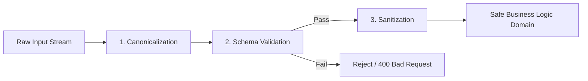

# Chapter 2: Input Validation & Sanitization

## Deep Mechanics: Validation vs Sanitization vs Canonicalization

Securing input requires understanding the distinct roles of **Canonicalization**, **Validation**, and **Sanitization**:



1. **Canonicalization (Decoding & Normalization):** Resolving input data to its simplest, standard representation (e.g., converting double-URL-encoded characters `%2527` to single `'`, or normalizing Unicode forms NFKC).
2. **Schema Validation (Allowlisting):** Verifying that canonicalized data strictly conforms to expected business rules (type, length, character set, numeric range, format).
3. **Sanitization (Modification):** Removing or transforming remaining unsafe or unwanted characters from valid data before downstream processing.

---

## Technical Edge Cases & Attack Vectors

### 1. Canonicalization & Unicode Normalization Attacks
Attackers utilize multi-byte Unicode or double-encoding to bypass standard string filters. When an application normalizes Unicode *after* validation, malicious characters can manifest inside trusted memory.

> [!CAUTION]
> **Unicode Bypasses (NFKC/NFD):** The Kelvin sign `\u212A` (`K`) normalizes to ASCII `K`. In JavaScript/Python, `\u017F` (`ſ`) normalizes to `s`. An attacker submitting `adm\u017F` may bypass an `admin` blocklist, but post-normalization string comparisons evaluate to `admin`!

```
Raw Payload: "adm\u017F"  ---> Validation Check (Does not match "admin") ---> Normalization (NFKC) ---> Evaluates to "admin" [BYPASS!]
```

* **Mitigation:** Always perform full URL decoding and Unicode Normalization (NFKC) **BEFORE** running validation filters.

### 2. Regular Expression Denial of Service (ReDoS)
Regex engines using Nondeterministic Finite Automata (NFA) are vulnerable to exponential backtracking when evaluating catastrophic patterns containing nested quantifiers like `(a+)+$`.

> [!WARNING]
> An unoptimized regex pattern like `/^([a-zA-Z0-9]+)+$/` evaluated against `aaaaaaaaaaaaaaaaaaaaaaaaaaaaaaaa!` can lock CPU utilization at 100% for minutes, causing Denial of Service.

* **Mitigation:** Avoid nested quantifiers (`(a+)+`). Use regex engines with linear time guarantees (e.g., Go's `regexp` package / Google's `re2`), or enforce atomic groups and regex timeouts.

---

## Multi-Language Production Code Implementations

### 1. Python (Pydantic v2)

#### ❌ Vulnerable (Loose manual checking & blocklists)
```python
# vulnerable_input.py
def process_user(data):
    username = data.get("username")
    # Vulnerable blocklist approach & no length enforcement
    if "<script>" in username or "'" in username:
        raise ValueError("Invalid input!")
    return f"User {username} processed."
```

#### ✅ Secure (Pydantic v2 Schema Allowlist)
```python
# secure_input.py
from pydantic import BaseModel, Field, EmailStr, field_validator
import unicodedata
import re

class UserRegistrationSchema(BaseModel):
    username: str = Field(..., min_length=3, max_length=20)
    email: EmailStr
    age: int = Field(..., ge=18, le=120)
    
    @field_validator("username")
    @classmethod
    def validate_username(cls, value: str) -> str:
        # 1. Canonicalize Unicode (NFKC)
        normalized = unicodedata.normalize("NFKC", value)
        
        # 2. Strict Allowlist Regex: Alphanumeric and underscores only
        if not re.match(r"^[a-zA-Z0-9_]+$", normalized):
            raise ValueError("Username contains unauthorized characters.")
        
        return normalized

# Execution Example
try:
    valid_user = UserRegistrationSchema(
        username="alice_2026",
        email="alice@sec.domain",
        age=28
    )
    print("Validated:", valid_user.model_dump())
except Exception as e:
    print("Validation Error:", e)
```

---

### 2. Node.js / TypeScript (Zod)

#### ❌ Vulnerable (Unvalidated req.body destructuring)
```javascript
// vulnerable.js
app.post('/register', (req, res) => {
    const { username, email, age } = req.body;
    // Trusting types blindly allows prototype pollution & injection
    db.query(`INSERT INTO users VALUES ('`${username}', '`$`{email}', $`{age})`); 
});
```

#### ✅ Secure (Zod Strict Schema Validation)
```typescript
// secure.ts
import { z } from "zod";
import express, { Request, Response } from "express";

const UserRegisterSchema = z.object({
  username: z
    .string()
    .min(3)
    .max(20)
    // Canonicalize string, allow only alphanumeric & underscores
    .transform((str) => str.normalize("NFKC"))
    .refine((val) => /^[a-zA-Z0-9_]+$/.test(val), {
      message: "Username must be alphanumeric and underscore only",
    }),
  email: z.string().email().max(255),
  age: z.number().int().min(18).max(120),
}).strict(); // Reject unexpected extra keys to prevent Parameter Pollution

type UserRegisterInput = z.infer<typeof UserRegisterSchema>;

export function handleRegistration(req: Request, res: Response) {
  const result = UserRegisterSchema.safeParse(req.body);
  if (!result.success) {
    return res.status(400).json({ errors: result.error.flatten() });
  }
  
  const safeData: UserRegisterInput = result.data;
  // Proceed with safeData...
}
```

---

### 3. Go (Validator v10 & Safe Regex)

#### ❌ Vulnerable (Raw string binding)
```go
// vulnerable.go
func createUser(w http.ResponseWriter, r *http.Request) {
    username := r.FormValue("username") // Unvalidated raw input
    db.Exec("INSERT INTO users (username) VALUES ('" + username + "')")
}
```

#### ✅ Secure (Go Playground Validator v10 + Custom Verification)
```go
// secure.go
package main

import (
	"fmt"
	"regexp"

	"github.com/go-playground/validator/v10"
)

type UserRequest struct {
	Username string `json:"username" validate:"required,min=3,max=20,alphanum_underscore"`
	Email    string `json:"email" validate:"required,email,max=255"`
	Age      int    `json:"age" validate:"required,gte=18,lte=120"`
}

var alphaNumUnderscore = regexp.MustCompile(`^[a-zA-Z0-9_]+$`)

func validateAlphaNumUnderscore(fl validator.FieldLevel) bool {
	return alphaNumUnderscore.MatchString(fl.Field().String())
}

func main() {
	validate := validator.New()
	_ = validate.RegisterValidation("alphanum_underscore", validateAlphaNumUnderscore)

	user := UserRequest{
		Username: "malicious_user;DROP TABLE users;--",
		Email:    "test@domain.com",
		Age:      25,
	}

	err := validate.Struct(user)
	if err != nil {
		fmt.Println("Validation failed securely:")
		for _, err := range err.(validator.ValidationErrors) {
			fmt.Printf(" Field '%s' failed on tag '%s'\n", err.Field(), err.Tag())
		}
	}
}
```

---

### 4. Java (Jakarta Bean Validation)

#### ❌ Vulnerable (Unchecked DTO)
```java
// VulnerableController.java
@PostMapping("/user")
public ResponseEntity<String> createUser(@RequestBody UserDto dto) {
    // dto contains completely untrusted, unvalidated values
    userService.save(dto);
    return ResponseEntity.ok("Saved");
}
```

#### ✅ Secure (Jakarta Validation Annotations)
```java
// UserDto.java
package com.appsec.dto;

import jakarta.validation.constraints.*;

public class UserDto {

    @NotNull(message = "Username cannot be null")
    @Size(min = 3, max = 20, message = "Username must be between 3 and 20 characters")
    @Pattern(regexp = "^[a-zA-Z0-9_]+$", message = "Username must be alphanumeric and underscore only")
    private String username;

    @NotNull(message = "Email cannot be null")
    @Email(message = "Must be a valid email address")
    @Size(max = 255)
    private String email;

    @Min(value = 18, message = "Age must be at least 18")
    @Max(value = 120, message = "Age cannot exceed 120")
    private int age;

    // Getters and Setters...
}

// Controller.java
@RestController
@RequestMapping("/api/users")
public class UserController {

    @PostMapping
    public ResponseEntity<String> createUser(@Valid @RequestBody UserDto dto) {
        // Automatically validates DTO before execution enters method body
        return ResponseEntity.ok("User created successfully");
    }
}
```

---

## Validation Techniques Comparison Matrix

| Feature / Technique | Allowlisting (Good) | Blocklisting (Bad) | Schema Typing | Sanitization |
| :--- | :--- | :--- | :--- | :--- |
| **Resilience to Bypasses** | **High** (Rejects unknown patterns) | **Low** (Attackers bypass filters) | **High** (Enforces strict types) | **Medium** (Risk of mangling valid data) |
| **Maintenance Cost** | Low | Extremely High (Constant update) | Low | Medium |
| **Primary Use Case** | Text inputs, filenames, choices | Legacy filtering fallback | JSON payloads, API endpoints | HTML rich text, comments |
| **Performance Impact** | Minimal | High (Multiple regex evaluations) | Minimal | Medium |

---

> [!TIP]
> **Production Best Practice:** Never write custom regex for complex formats like Email, IPv6, or URLs. Always rely on maintained standard library/framework validators (`EmailStr` in Pydantic, `z.string().email()` in Zod, `validator/v10` in Go).
