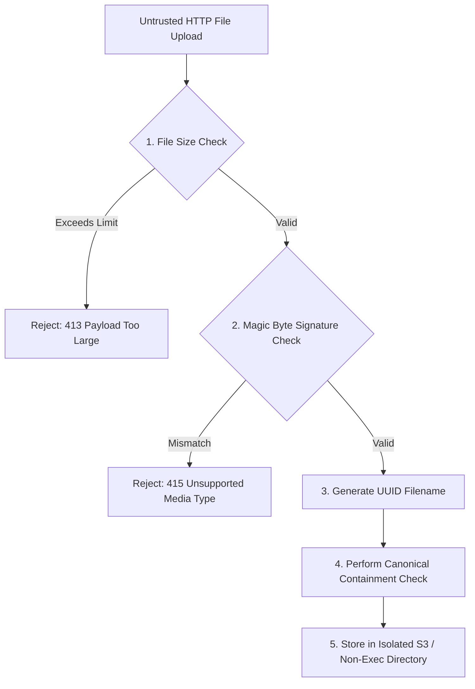

# Chapter 4: Memory Safety & File Handling

## Memory Safety Fundamentals

Memory corruption flaws continue to represent a significant class of critical vulnerabilities (CVEs). 

### Key Memory Safety Risk Classes
1. **Buffer Overflows / Out-of-Bounds Writes:** Writing data beyond allocated memory buffer boundaries, overwriting execution flow pointers (stack/heap corruption).
2. **Use-After-Free (UAF):** Referencing memory after it has been deallocated, enabling arbitrary code execution.
3. **Integer Overflows:** Arithmetic operations exceeding variable storage limits, leading to undersized memory allocations.

While modern high-level managed languages (Python, Node.js, Go, Java) automatically handle dynamic memory allocation and garbage collection, memory issues still manifest in modern stacks via native extensions (C/C++ bindings), unsafe blocks, or unmanaged file handle buffer exhaustion.

---

## Secure File Upload Architecture

Accepting file uploads from untrusted clients is one of the highest-risk application features, frequently leading to Remote Code Execution (RCE), Stored XSS, or Server-Side Request Forgery (SSRF).



### The 5 Rules of Production File Upload Hardening

1. **Ignore User Extension & Content-Type Headers:** Clients can easily forge `Content-Type: image/png` while transmitting a malicious PHP/JSP shell payload.
2. **Inspect Magic Bytes (File Signatures):** Verify the initial byte sequence of the payload against known binary headers.
3. **Randomize Target Filenames:** Re-assign all filenames to randomly generated UUIDs (e.g., `f47ac10b-58cc-4372-a567-0e02b2c3d479.png`).
4. **Enforce Absolute Directory Isolation:** Ensure files are stored outside the web root or stored in dedicated cloud object storage (S3/GCS) with no public execution permissions.
5. **Serve with Hardened Headers:** Deliver user files using `Content-Type: application/octet-stream` and `Content-Disposition: attachment; filename="..."` to block browser HTML/SVG rendering.

---

## Magic Bytes (Binary Signatures) Table

| File Format | Header Hex Signature | ASCII Representation |
| :--- | :--- | :--- |
| **JPEG** | `FF D8 FF E0` or `FF D8 FF E1` | `....` |
| **PNG** | `89 50 4E 47 0D 0A 1A 0A` | `.PNG....` |
| **GIF** | `47 49 46 38 37 61` or `47 49 46 38 39 61` | `GIF87a` / `GIF89a` |
| **PDF** | `25 50 44 46 2D` | `%PDF-` |
| **ZIP / JAR** | `50 4B 03 04` | `PK..` |

---

## Path Traversal (`../`) Mechanics & Zip Slip

Path Traversal (CWE-22) occurs when user-supplied input is used in file system operations without canonicalization, allowing attackers to navigate outside the intended upload directory using sequence characters (`../` or `..\`).

> [!CAUTION]
> **Zip Slip Vulnerability:** When extracting compressed archives (ZIP, TAR), archive entries can contain relative paths (`../../shell.php`). If unpacked naively without canonical checks, files will be written to arbitrary file system locations!

---

## Multi-Language Production Implementations

### 1. Node.js (Secure Download & Traversal Defense)

#### ❌ Vulnerable (Direct Path Concatenation)
```javascript
// vulnerable_file.js
app.get('/download', (req, res) => {
    const filename = req.query.file; 
    // Attack payload: ?file=../../../../etc/passwd
    const filePath = path.join(__dirname, 'public', filename);
    res.sendFile(filePath); // Exposes sensitive OS files!
});
```

#### ✅ Secure (Canonical Containment Verification)
```javascript
// secure_file.js
const path = require('path');
const fs = require('fs');

app.get('/download', (req, res) => {
    const userFile = req.query.file;
    if (!userFile) return res.status(400).send("File parameter required");

    // 1. Define strict base upload directory
    const UPLOAD_BASE = path.resolve(__dirname, 'safe_uploads');

    // 2. Resolve absolute target path
    const safeTargetPath = path.resolve(UPLOAD_BASE, userFile);

    // 3. CANONICAL CONTAINMENT CHECK: Ensure target stays inside UPLOAD_BASE
    if (!safeTargetPath.startsWith(UPLOAD_BASE + path.sep)) {
        console.warn(`[SECURITY ALERT] Path traversal blocked: ${userFile}`);
        return res.status(403).send("Access Denied: Path traversal detected");
    }

    // 4. Verify File Existence
    if (!fs.existsSync(safeTargetPath)) {
        return res.status(404).send("File not found");
    }

    res.sendFile(safeTargetPath);
});
```

---

### 2. Python (Magic Byte Upload Hardening & Path Check)

#### ❌ Vulnerable (Trusting uploaded filename & extension)
```python
# vulnerable_upload.py
@app.route('/upload', methods=['POST'])
def upload_file():
    f = request.files['file']
    f.save(os.path.join('/var/www/uploads', f.filename)) # Arbitrary write!
    return "Uploaded"
```

#### ✅ Secure (UUID Isolation + Magic Byte Check + `pathlib`)
```python
# secure_upload.py
from flask import Flask, request, abort
from pathlib import Path
import uuid
import puremagic  # Python library for magic byte inspection

app = Flask(__name__)
UPLOAD_DIR = Path("/var/www/safe_uploads").resolve()
ALLOWED_MIME_TYPES = {"image/png": ".png", "image/jpeg": ".jpg"}

@app.route('/upload', methods=['POST'])
def upload_file():
    file = request.files.get('file')
    if not file:
        return abort(400, "No file uploaded")
    
    # 1. Read first 2048 bytes for Magic Byte inspection
    header_bytes = file.read(2048)
    file.seek(0) # Reset stream pointer
    
    # 2. Inspect actual binary content format
    try:
        matches = puremagic.from_string(header_bytes)
        if not matches:
            return abort(415, "Unrecognized file format")
        detected_mime = matches[0].mime_type
    except Exception:
        return abort(415, "Invalid binary signature")

    if detected_mime not in ALLOWED_MIME_TYPES:
        return abort(415, f"Disallowed MIME type: {detected_mime}")

    # 3. Generate Random UUID Filename (Completely discard user extension/name)
    safe_ext = ALLOWED_MIME_TYPES[detected_mime]
    random_filename = f"{uuid.uuid4()}{safe_ext}"
    
    # 4. Resolve absolute target path & verify boundary
    target_path = (UPLOAD_DIR / random_filename).resolve()
    if not str(target_path).startswith(str(UPLOAD_DIR)):
        return abort(403, "Illegal target path")

    # 5. Save file safely
    file.save(target_path)
    return {"status": "success", "file_id": random_filename}
```

---

### 3. Go (Safe File Extraction & Zip Slip Defense)

#### ❌ Vulnerable Zip Extraction
```go
// VULNERABLE: Direct extraction allows Zip Slip
for _, file := range zipReader.File {
    path := filepath.Join(targetDir, file.Name) // Vulnerable if file.Name is ../../etc/passwd
    os.WriteFile(path, content, 0644)
}
```

#### ✅ Secure Zip Slip Defense in Go
```go
package main

import (
	"archive/zip"
	"fmt"
	"io"
	"os"
	"path/filepath"
	"strings"
)

func ExtractSecure(srcZip string, targetDir string) error {
	reader, err := zip.OpenReader(srcZip)
	if err != nil {
		return err
	}
	defer reader.Close()

	cleanBaseDir := filepath.Clean(targetDir)

	for _, file := range reader.File {
		// 1. Construct target path
		targetPath := filepath.Join(cleanBaseDir, file.Name)

		// 2. ZIP SLIP CONTAINMENT CHECK
		if !strings.HasPrefix(filepath.Clean(targetPath), cleanBaseDir+string(os.PathSeparator)) {
			return fmt.Errorf("illegal file path in zip: %s", file.Name)
		}

		if file.FileInfo().IsDir() {
			os.MkdirAll(targetPath, file.Mode())
			continue
		}

		// Proceed to extract file safely...
	}
	return nil
}
```

---

### 4. Java (Path Normalization & Security)

#### ✅ Secure Java File Boundary Verification
```java
package com.appsec.security;

import java.io.File;
import java.io.IOException;
import java.nio.file.Path;
import java.nio.file.Paths;

public class PathValidator {

    public static File getSecureFile(String userFilename, String baseDirectory) throws IOException {
        Path basePath = Paths.get(baseDirectory).toAbsolutePath().normalize();
        Path resolvedPath = basePath.resolve(userFilename).toAbsolutePath().normalize();

        // Path Traversal Security Check
        if (!resolvedPath.startsWith(basePath)) {
            throw new SecurityException("Path traversal attack detected for filename: " + userFilename);
        }

        return resolvedPath.toFile();
    }
}
```

---

> [!IMPORTANT]
> **Production Hardening Checklist:** Store files in isolated S3 buckets, randomize filenames with UUIDs, validate binary magic bytes, enforce canonical directory containment checks (`startsWith`), and never extract archives without path verification.
