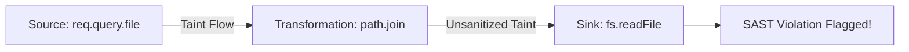
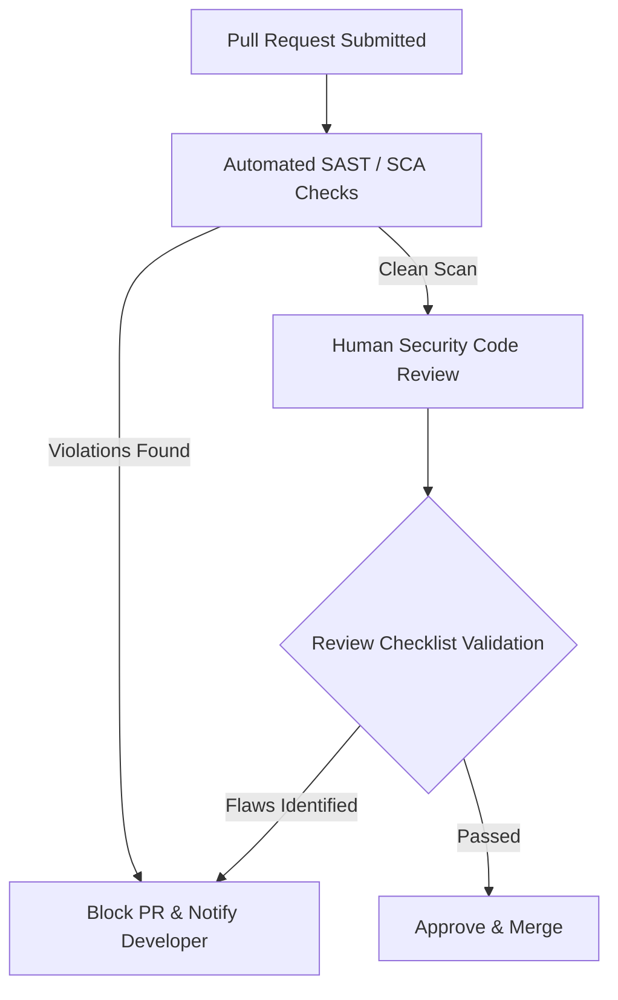

# Chapter 5: SAST & Code Review

## Static Application Security Testing (SAST) Architecture

Static Application Security Testing (SAST) analyzes application source code for security vulnerabilities without executing the binary. Unlike basic grep tools, modern SAST tools build an **Abstract Syntax Tree (AST)** and perform **Taint Analysis** to track untrusted inputs from **Sources** to vulnerable **Sinks**.



### Security Testing Spectrum

| Methodology | Timing | Coverage | Strengths | Limitations |
| :--- | :--- | :--- | :--- | :--- |
| **SAST** | Code / Build | 100% Source Lines | Fast, catches root cause in IDE | High false-positive potential |
| **SCA** | Build / CI | Dependencies | Catches known CVEs in libraries | Does not analyze custom code |
| **DAST** | Staging / Prod | Running App | Validates real exploitability | Black-box, misses code paths |
| **IAST** | QA / Runtime | Instrumented App | High precision, low false positives | Requires full runtime test suite |

---

## Semgrep Tooling Setup & Command Line Mastery

Semgrep is a lightweight, open-source static analysis engine that enforces rules based on code syntax trees.

### CLI Installation & Scans

```bash
# 1. Install Semgrep via pip or brew
pip install semgrep

# 2. Run standard OWASP Top 10 ruleset scan
semgrep scan --config "p/owasp-top-10" .

# 3. Run high-accuracy security audit ruleset
semgrep scan --config "p/security-audit" --error

# 4. Output results to SARIF format for IDE / CI integration
semgrep scan --config "p/ci" --sarif --output=semgrep-results.sarif
```

---

## Custom Semgrep Rule Authoring

Writing custom enterprise rules allows AppSec teams to enforce company-specific security boundaries (e.g., preventing raw SQL or enforcing safe path join wrappers).

### Custom Rule: Block Unsafe Path Joins in Python (`custom-path-traversal.yaml`)

```yaml
rules:
  - id: python-unsafe-path-traversal
    patterns:
      - pattern: os.path.join(..., $REQ.args.get(...), ...)
      - pattern-not: os.path.abspath(...)
    message: >
      Untrusted HTTP request parameter passed directly into os.path.join without 
      path canonicalization (os.path.abspath) or boundary validation. Risk of Path Traversal!
    severity: ERROR
    languages: [python]
    metadata:
      cwe: "CWE-22: Improper Limitation of a Pathname to a Restricted Directory"
      owasp: "A01:2021 - Broken Access Control"
```

### Custom Rule: Block Hardcoded JWT Secrets (`jwt-hardcoded-secret.yaml`)

```yaml
rules:
  - id: node-jwt-hardcoded-secret
    patterns:
      - pattern: jwt.sign(`$PAYLOAD, "$SECRET"`SECRET", ...)
    message: "Hardcoded secret string detected in JWT signing function. Move secret to secure vault/environment variable!"
    severity: CRITICAL
    languages: [javascript, typescript]
```

---

## CI/CD Pipeline & Pre-Commit Integration

### 1. GitHub Actions Workflow (`.github/workflows/semgrep.yml`)

Automate static analysis on every Pull Request and upload findings directly to GitHub Code Scanning.

```yaml
name: Security SAST Scan

on:
  push:
    branches: [ main, develop ]
  pull_request:
    branches: [ main ]

jobs:
  semgrep:
    name: Semgrep Scan
    runs-on: ubuntu-latest
    container:
      image: returntocorp/semgrep
    steps:
      - name: Checkout Code
        uses: actions/checkout@v4

      - name: Execute Semgrep Security Audit
        run: semgrep scan --config p/security-audit --sarif --output=semgrep.sarif

      - name: Upload SARIF Report to GitHub Security Tab
        uses: github/codeql-action/upload-sarif@v3
        with:
          sarif_file: semgrep.sarif
        if: always()
```

### 2. Git Pre-Commit Hook (`.pre-commit-config.yaml`)

Catch flaws locally on developer workstations *before* code is committed to Git.

```yaml
repos:
  - repo: https://github.com/returntocorp/semgrep
    rev: 'v1.68.0'
    hooks:
      - id: semgrep
        args: ['--config', 'p/ci', '--error']
```

---

## Security Code Review Checklist & Triage Methodology



### Comprehensive Security Code Review Checklist

#### 1. Input Validation & Boundaries
- [ ] Are all incoming parameters (URL, Body, Headers) validated against an **allowlist schema**?
- [ ] Is input normalized (Unicode/URL decoding) **before** validation occurs?
- [ ] Are numeric boundaries (`min`, `max`) and string length limits strictly enforced?

#### 2. Output Encoding & UI Security
- [ ] Are dynamic variables rendered in HTML/JS using context-aware escaping?
- [ ] Is rich text sanitized using vetted libraries (DOMPurify, `nh3`) instead of custom regex?
- [ ] Are strict CSP headers (`script-src 'nonce-...'`) enforced across endpoints?

#### 3. Database & SQL Access
- [ ] Are ALL database queries using **parameterized queries / prepared statements**?
- [ ] Are dynamic table/column names restricted to explicit internal string allowlists?

#### 4. File Handling & System Execution
- [ ] Are file uploads validated via **binary magic bytes** rather than extensions?
- [ ] Are uploaded filenames replaced with **random UUIDs**?
- [ ] Are file operations checked using **canonical containment checks** (`startsWith` / `Path.resolve`)?

#### 5. Errors, Logging & Secrets
- [ ] Are generic error messages returned to clients without exposing raw stack traces?
- [ ] Are credentials, PII, and session tokens scrubbed from application log outputs?
- [ ] Are all API keys and secrets loaded from environment variables/vaults?

---

> [!TIP]
> **Developer Best Practice:** Run `semgrep scan --config p/security-audit` locally before requesting code reviews. Automating static checks saves human reviewers time to focus on complex business logic and authorization flaws.
