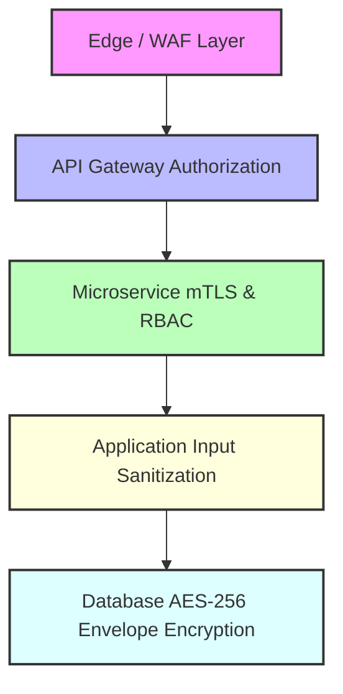

# 01 - Introduction to Architectural Security Design Principles

Security is most effective when it is woven into the fundamental fabric of an application's architecture. Retrofitting security controls onto an existing, flawed design—often described as **"bolting on security"**—is expensive, brittle, and frequently creates false assumptions of safety. Architectural security engineering focuses on **"baking in security"** from inception.

> [!IMPORTANT]
> **Architectural Paradigm:** Code-level vulnerabilities (e.g., buffer overflows, SQL injection) can often be fixed with localized patches or SAST updates. Architectural vulnerabilities (e.g., broken trust boundaries, lack of complete mediation, missing fault isolation) require systemic redesigns, breaking changes, and high engineering overhead.
>
> 🛡️ **Threat Modeling Templates & Frameworks:** Want hands-on templates and practical guides for threat modeling cloud architectures using STRIDE, PASTA, and DREAD? Check out our companion repository: [github.com/AnimeshShaw/threat-modelling-basics](https://github.com/AnimeshShaw/threat-modelling-basics).

---

## 🏛️ The Core Security Design Principles

In 1975, Jerome Saltzer and Michael Schroeder established eight foundational principles for securing computer systems. These principles remain the gold standard for software architecture and have been updated below to address modern distributed systems, microservices, and multi-cloud environments.

```
                  +-------------------------------------------------+
                  |      MODERN SECURITY DESIGN PRINCIPLES          |
                  +-------------------------------------------------+
                  |  1. Secure by Default / Default Deny            |
                  |  2. Defense in Depth (Layered Controls)         |
                  |  3. Fail Safe (Fail Securely)                   |
                  |  4. Complete Mediation (Zero Trust Verification)|
                  |  5. Open Design (Kerckhoffs's Principle)        |
                  |  6. Principle of Least Privilege (PoLP)         |
                  |  7. Economy of Mechanism (Simplicity)           |
                  |  8. Least Common Mechanism (Isolated State)     |
                  |  9. Psychological Acceptability (Usability)     |
                  | 10. Compromise Recording (Auditing & Trace)    |
                  +-------------------------------------------------+
```

### 1. Secure by Default (Default Deny)
Systems must be delivered in the most secure configuration possible without requiring user intervention. Access policies should explicitly adopt a **default deny** stance: if a permission or rule is not explicitly allowed, it must be denied.

* **Legacy Antipattern:** Exposing all internal API endpoints by default and selectively blocking unauthorized routes.
* **Modern Architectural Pattern:** Explicit ingress routing where all unlisted routes return HTTP `404 Not Found` or `403 Forbidden`, and databases require explicit authentication upon initial deployment.

### 2. Defense in Depth
Relying on a single security boundary (such as a perimeter firewall or API gateway) creates a single point of failure. Defense in depth mandates multiple redundant, overlapping security controls across different layers.



* **Production Real-World Implementation:** A web application uses Cloudflare WAF for volumetric protection, TLS 1.3 termination at ingress, OAuth2 JWT token verification at the gateway, Envoy sidecar mTLS between microservices, parameterized queries at the data layer, and field-level AES-256-GCM encryption in Postgres.

### 3. Fail Safe (Fail Securely)
When a component fails, experiences an unhandled exception, or encounters unexpected state, it must default to a state that denies access and preserves system integrity.

* **Fail-Closed vs. Fail-Open Matrix:**

| Component | Failure Condition | Fail-Closed Behavior (Secure) | Fail-Open Behavior (Vulnerable) |
| :--- | :--- | :--- | :--- |
| **Authentication Service** | Identity database times out | Deny request (`503 Service Unavailable`) | Grant access temporarily |
| **Authorization PEP** | Policy server unreachable | Reject request (`403 Forbidden`) | Bypass authorization checks |
| **Circuit Breaker** | Downstream service failing | Trip circuit, reject requests immediately | Allow requests to pile up and crash host |
| **WAF Engine** | Rule engine memory exhaustion | Drop traffic or reject connection | Pass raw uninspected HTTP payloads |

> [!WARNING]
> **Operational Nuance:** In safety-critical physical systems (e.g., automated doors during a fire alarm), systems may intentionally "fail open" for human safety. However, in digital security and data protection, systems must almost universally **fail secure**.

### 4. Complete Mediation
Every access request to every resource must be authenticated, authorized, and validated against security policy—without exception. Systems must not cache authorization decisions across distinct security contexts or rely on unchecked session state.

* **Implementation:** Instead of checking permissions once during login and relying on an unchecked long-lived token, microservices inspect short-lived JWT tokens or send gRPC request assertions to an Open Policy Agent (OPA) sidecar on **every API invocation**.

### 5. Open Design
Security must never depend on the secrecy of the system's design, source code, or algorithm implementation (**Kerckhoffs's Principle**). Cryptographic security relies entirely on secret keys, while code and architectural patterns should withstand public scrutiny and peer review.

* **Antipattern:** Obfuscating internal REST endpoint URL formats or inventing custom encryption algorithms.
* **Secure Approach:** Implementing open, peer-reviewed standards such as OAuth 2.0 (RFC 6749), JWT (RFC 7519), and AES-GCM (NIST SP 800-38D).

### 6. Principle of Least Privilege (PoLP) & Separation of Duties (SoD)
Every process, user, service account, and system component must operate using the minimum set of privileges necessary to execute its legitimate function, and for the minimum duration required.

* **Separation of Duties:** Critical tasks must require multiple authorized entities to complete (e.g., deploying to production requires Developer commit + Security Lead approval + Automated CI/CD pipeline signature).

### 7. Economy of Mechanism (KISS - Keep It Simple, Secure)
Complex architectures have large attack surfaces, hidden dependencies, and unpredictable failure modes. Security controls should be simple, small, modular, and easy to audit.

### 8. Least Common Mechanism
Minimize shared mechanisms and state between different users or execution contexts. Sharing resources creates covert channels, side-channel vulnerabilities, and privilege escalation vectors.

* **Microservice Isolation:** Disallow direct database access across microservice boundaries. Service A must never directly query Service B's database.

### 9. Psychological Acceptability (Usable Security)
Security mechanisms must be intuitive and unobtrusive. If security measures impose excessive friction, engineers and users will actively bypass, disable, or work around them.

### 10. Compromise Recording (Auditability & Accountability)
Systems must record security-relevant events in tamper-resistant, immutable logs to detect breaches, trace malicious actions, and facilitate forensic analysis.

---

## ⚡ Root Causes of Architectural Vulnerabilities

```
+-----------------------------------------------------------------------------------+
|                        ROOT CAUSES OF ARCHITECTURAL FAILURES                       |
+-----------------------------------------------------------------------------------+
| 1. Implicit Trust Boundaries: Assuming internal networks (VPC, Mesh) are safe.    |
| 2. Security Debt: Deferring security architecture during rapid MVP development.   |
| 3. Monolithic Authorization: Monolithic RBAC forced onto microservice APIs.       |
| 4. Unbounded Resource Consumption: Missing rate limiting, circuit breakers.      |
| 5. Secret Sprawl: Hardcoding credentials in code repos, environment configs.      |
+-----------------------------------------------------------------------------------+
```

---

## 📊 Industry Security Architecture Frameworks

| Framework | Focus Area | Key Architectural Guidance |
| :--- | :--- | :--- |
| **NIST SP 800-160 Vol 1** | Systems Security Engineering | Engineering trustworthy systems throughout the lifecycle. |
| **NIST SP 800-207** | Zero Trust Architecture (ZTA) | Core principles: micro-perimeters, dynamic identity validation. |
| **OWASP SAMM v2.0** | Software Assurance Maturity Model | Architecture Assessment, Design Review, Security Requirements. |
| **CIS Controls v8** | Practical Security Controls | Enterprise asset management, access control management, audit logging. |

---

> [!TIP]
> **Next Steps:** Proceed to **[02 Core Design Patterns](02-core-design-patterns.md)** to learn structural patterns such as Circuit Breakers, Token Buckets, Secure Factories, and Container Jails.
