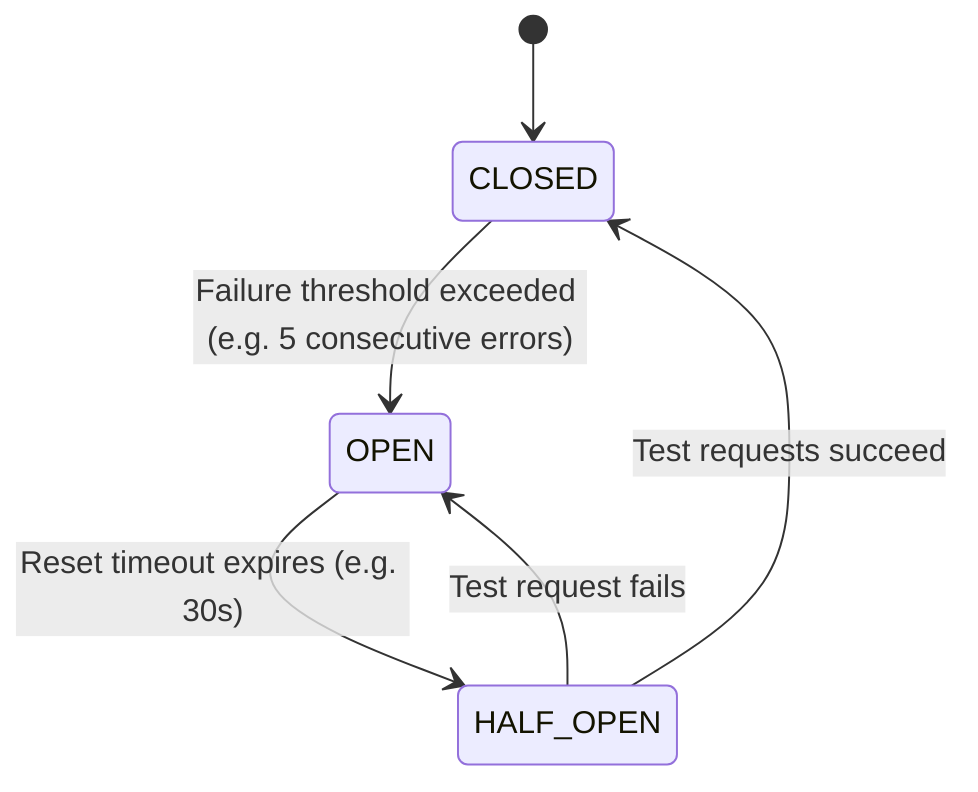

# 02 - Core Structural & Resilience Security Patterns

Architectural security requires predictable, structural design patterns that enforce resilience, access control, and isolation. This chapter details core structural patterns designed to protect applications from denial of service (DoS), cascading system failures, unauthorized state manipulation, and privilege escalation.

---

## 1. Circuit Breaker Pattern

### 🛠️ Mechanics & Architecture
The **Circuit Breaker Pattern** prevents a application from executing operations that are doomed to fail, protecting upstream services, downstream databases, and internal thread pools from resource exhaustion during outages or attack spikes.



* **CLOSED State:** All requests are passed to the remote service. Successes reset failure counters.
* **OPEN State:** Requests fail fast immediately with a local exception (e.g., `CircuitBreakerOpenException`), without attempting network I/O.
* **HALF-OPEN State:** A limited trial quota of requests is allowed through. If successful, the circuit resets to `CLOSED`; if any fail, it trips back to `OPEN`.

> [!TIP]
> **Security Impact:** Circuit breakers prevent cascading DoS vulnerabilities (Resource Exhaustion) where slow downstream timeouts consume all available web server worker threads, rendering the entire system unresponsive.

### 💻 Implementation Code (Python & Go)

=== "Python Implementation"
    ```python
    import time
    from typing import Callable, Any

    class CircuitBreakerOpenException(Exception):
        """Raised when the circuit breaker is OPEN."""
        pass

    class ProductionCircuitBreaker:
        def __init__(self, failure_threshold: int = 5, recovery_timeout: float = 30.0):
            self.failure_threshold = failure_threshold
            self.recovery_timeout = recovery_timeout
            self.state = "CLOSED"
            self.failure_count = 0
            self.last_state_change = time.time()

        def __call__(self, func: Callable, *args: Any, **kwargs: Any) -> Any:
            now = time.time()

            # State transition check: OPEN -> HALF-OPEN
            if self.state == "OPEN":
                if now - self.last_state_change > self.recovery_timeout:
                    self.state = "HALF-OPEN"
                    self.last_state_change = now
                else:
                    raise CircuitBreakerOpenException("Circuit is OPEN. Request blocked.")

            try:
                result = func(*args, **kwargs)
                # Success path
                if self.state == "HALF-OPEN":
                    self.state = "CLOSED"
                    self.failure_count = 0
                    self.last_state_change = now
                elif self.state == "CLOSED":
                    self.failure_count = 0
                return result
            except Exception as exc:
                self.failure_count += 1
                if self.failure_count >= self.failure_threshold or self.state == "HALF-OPEN":
                    self.state = "OPEN"
                    self.last_state_change = now
                raise exc
    ```

=== "Go Implementation"
    ```go
    package main

    import (
        "errors"
        "sync"
        "time"
    )

    var ErrCircuitOpen = errors.New("circuit breaker is OPEN")

    type State int

    const (
        StateClosed State = iota
        StateOpen
        StateHalfOpen
    )

    type CircuitBreaker struct {
        mu               sync.Mutex
        state            State
        failureThreshold int
        failureCount     int
        recoveryTimeout  time.Duration
        lastStateChange  time.Time
    }

    func NewCircuitBreaker(threshold int, timeout time.Duration) *CircuitBreaker {
        return &CircuitBreaker{
            state:            StateClosed,
            failureThreshold: threshold,
            recoveryTimeout:  timeout,
            lastStateChange:  time.Now(),
        }
    }

    func (cb *CircuitBreaker) Execute(req func() (interface{}, error)) (interface{}, error) {
        cb.mu.Lock()
        now := time.Now()

        if cb.state == StateOpen {
            if now.Sub(cb.lastStateChange) > cb.recoveryTimeout {
                cb.state = StateHalfOpen
                cb.lastStateChange = now
            } else {
                cb.mu.Unlock()
                return nil, ErrCircuitOpen
            }
        }
        cb.mu.Unlock()

        resp, err := req()

        cb.mu.Lock()
        defer cb.mu.Unlock()

        if err != nil {
            cb.failureCount++
            if cb.failureCount >= cb.failureThreshold || cb.state == StateHalfOpen {
                cb.state = StateOpen
                cb.lastStateChange = time.Now()
            }
            return nil, err
        }

        cb.failureCount = 0
        cb.state = StateClosed
        return resp, nil
    }
    ```

---

## 2. Token Bucket Rate Limiting Pattern

### 🛠️ Mechanics & Architecture
Rate limiting restricts the frequency of requests a client can make within a given time window. The **Token Bucket Algorithm** maintains a fixed-capacity bucket populated with tokens at a steady rate `$R`$` tokens/sec up to capacity `$`C$`. Each request consumes 1 token.

```
       +------------------------------------+
       |  Token Generator (+R tokens/sec)   |
       +------------------------------------+
                         |
                         v
       +------------------------------------+
       |      Bucket (Max Capacity C)       |
       |  [ * ] [ * ] [ * ] [ * ] [ * ]     |
       +------------------------------------+
                         |
           Incoming Request Arrives
                         |
            +------------+------------+
            | Is Token Available?     |
            +------------+------------+
             /                       \
        YES /                         \ NO
           v                           v
  [ Consume 1 Token ]         [ HTTP 429 Too Many ]
  [ Process Request ]         [ Requests (Rejected)]
```

### 💻 Production Redis/Lua Distributed Rate Limiter
In distributed systems, localized rate limiting allows bypasses via multi-instance load balancing. A atomic **Redis + Lua script** guarantees consistent rate limiting across all API gateway nodes.

```lua
-- Lua script executed inside Redis atomically
-- KEYS[1]: Rate limit key (e.g., "ratelimit:user_123")
-- ARGV[1]: Bucket capacity (C)
-- ARGV[2]: Refill rate per second (R)
-- ARGV[3]: Current timestamp (Unix epoch seconds)
-- ARGV[4]: Tokens requested (default 1)

local key = KEYS[1]
local capacity = tonumber(ARGV[1])
local refill_rate = tonumber(ARGV[2])
local now = tonumber(ARGV[3])
local requested = tonumber(ARGV[4])

local last_update = tonumber(redis.call('hget', key, 'last_update')) or now
local tokens = tonumber(redis.call('hget', key, 'tokens')) or capacity

-- Calculate refilled tokens based on elapsed time
local delta = math.max(0, now - last_update)
tokens = math.min(capacity, tokens + delta * refill_rate)

if tokens < requested then
    return 0 -- Rate limit exceeded (FALSE)
else
    tokens = tokens - requested
    redis.call('hset', key, 'tokens', tokens)
    redis.call('hset', key, 'last_update', now)
    redis.call('expire', key, 3600) -- Auto cleanup after 1 hr
    return 1 -- Request allowed (TRUE)
end
```

---

## 3. Secure Factory & Builder Pattern

### 🛠️ Mechanics & Security Purpose
Constructing complex security objects (e.g., SSL/TLS contexts, cryptographic keys, database connections, user sessions) using public constructors risks **partial initialization vulnerabilities** or insecure default options (e.g., allowing SSLv3, disabled hostname verification, or weak ciphers).

The **Secure Factory Pattern** abstracts object instantiation, enforcing strict validation, secure defaults, and immutability before returning the instance to the caller.

### 💻 Java Implementation

```java
package com.appsec.patterns;

import javax.net.ssl.SSLContext;
import java.security.NoSuchAlgorithmException;
import java.security.KeyManagementException;

public final class SecureSSLContextFactory {

    // Private constructor prevents instantiation
    private SecureSSLContextFactory() {}

    /**
     * Creates a fully hardened, TLS 1.3-only SSLContext.
     */
    public static SSLContext createHardenedSSLContext() throws NoSuchAlgorithmException, KeyManagementException {
        // Enforce modern TLS 1.3 protocol
        SSLContext sslContext = SSLContext.getInstance("TLSv1.3");
        
        // Initialize with default secure KeyManager and TrustManager implementations
        sslContext.init(null, null, new java.security.SecureRandom());
        
        return sslContext;
    }
}
```

---

## 4. Compartmentalization & Bulkhead Pattern

### 🛠️ Mechanics & Architecture
Named after the watertight partition walls in ships, the **Bulkhead Pattern** isolates system resources (e.g., connection pools, thread pools, memory limits) across different features or client tiers. A failure or exhaustion attack in one compartment cannot breach or paralyze another compartment.

```
Incoming Traffic
      |
      +---> Premium Clients Pool  [ Thread Pool A: 50 threads ] ===> Payment API
      |
      +---> Standard Clients Pool [ Thread Pool B: 20 threads ] ===> Order API
      |
      +---> Public / Guest Pool   [ Thread Pool C: 5 threads  ] ===> Search API
```

> [!WARNING]
> **Vulnerability Without Bulkheads:** If guest users launch expensive CPU-heavy search queries, they will consume 100% of the shared application server thread pool, preventing authenticated premium users from executing critical payment actions.

---

## 5. Chroot, Container Jails & MicroVM Isolation

Modern application compartmentalization relies on layered operating system isolation to restrict process visibility and mitigate compromise blast radiuses.

```
+-------------------------------------------------------------------------+
|                          ISOLATION PRIMITIVES                           |
+-------------------------------------------------------------------------+
| 1. Linux Namespaces : Isolates PID, Mount, Network, IPC, UTS, and User. |
| 2. Linux cgroups v2 : Limits CPU, Memory, Disk I/O, and PIDs.          |
| 3. Seccomp Filters  : Restricts system call interface (e.g., block      |
|                       execve, ptrace, keyctl).                          |
| 4. AppArmor/SELinux : Enforces Mandatory Access Control (MAC) policies. |
| 5. MicroVMs         : Full hardware virtualization (gVisor/Firecracker).|
+-------------------------------------------------------------------------+
```

### 💻 Secure Seccomp Profile Example (JSON)

```json
{
  "defaultAction": "SCMP_ACT_ERRNO",
  "architectures": [
    "SCMP_ARCH_X86_64",
    "SCMP_ARCH_AARCH64"
  ],
  "syscalls": [
    {
      "names": [
        "read", "write", "exit", "exit_group", "futex", "epoll_wait"
      ],
      "action": "SCMP_ACT_ALLOW"
    }
  ]
}
```

---

## 📊 Structural Design Patterns Matrix

| Pattern | Security Goal | Primary Threat Mitigated | Complexity | Performance Overhead |
| :--- | :--- | :--- | :---: | :---: |
| **Circuit Breaker** | Resilience & Availability | Cascading DoS / Remote Service Collapse | 🟡 Medium | 🟢 Negligible (&lt;1ms) |
| **Token Bucket Rate Limiting** | Traffic Governance | Brute-force, Scrapers, Volumetric DoS | 🟡 Medium | 🟡 Low (Redis RTT) |
| **Secure Factory** | Secure by Default | Insecure Initialization & Weak Options | 🟢 Low | 🟢 Zero |
| **Bulkhead** | Blast Radius Isolation | Resource Exhaustion / Starvation | 🟡 Medium | 🟢 Low |
| **Container Jail / MicroVM** | Process Containment | Host OS Takeover / Container Escape | 🔴 High | 🟡 Moderate |

---

> [!TIP]
> **Next Steps:** Advance to **[03 Secure Data Patterns](03-secure-data-patterns.md)** to explore Envelope Encryption, Tokenization, Data Sanitization Pipelines, and Immutable Logging.
