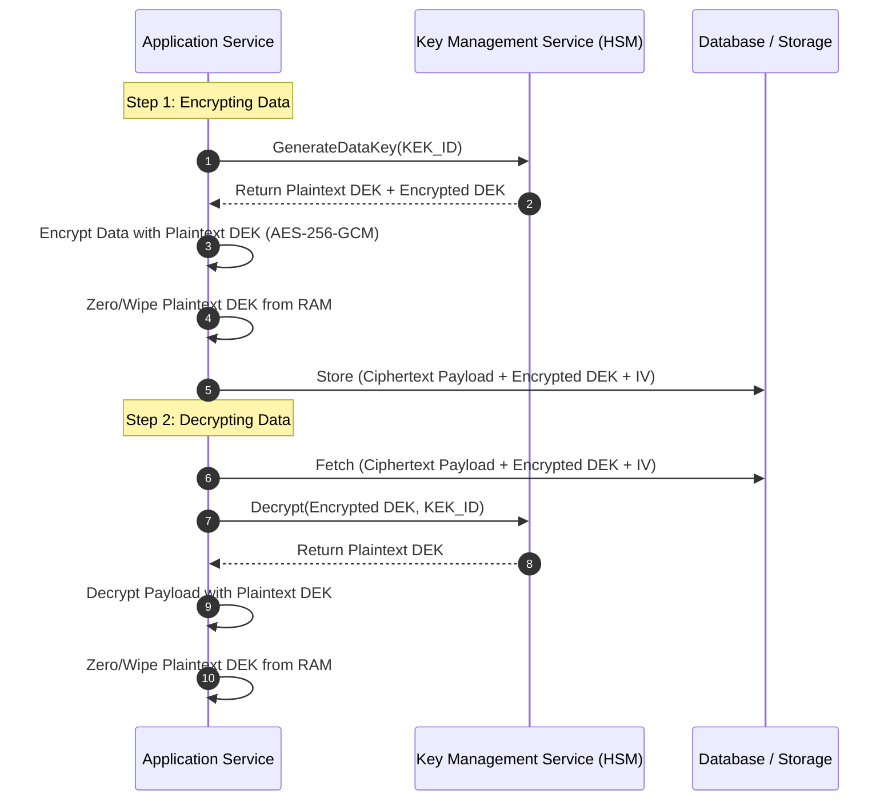
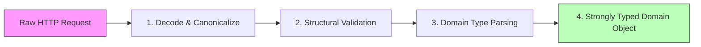

# 03 - Secure Data Patterns & Cryptography

Protecting sensitive data at rest, in transit, and during processing requires architectural patterns that go far beyond simple database column encryption. This chapter details production-grade data protection design patterns, key management strategies, tokenization, sanitization pipelines, and cryptographic auditability.

---

## 1. Envelope Encryption Pattern

### 🛠️ Mechanics & Architecture
Directly encrypting large volumes of data using a single centralized key stored in a Key Management Service (KMS) or Hardware Security Module (HSM) causes severe performance bottlenecks and network latency. **Envelope Encryption** solves this by using a two-tier key hierarchy:

* **Data Encryption Key (DEK):** A unique symmetric key (e.g., AES-256-GCM) generated locally by the application to encrypt the payload.
* **Key Encryption Key (KEK):** A master key stored securely within HSM/KMS used solely to encrypt and decrypt the DEK.



> [!IMPORTANT]
> **Key Security Rule:** The plaintext DEK must **never** touch persistent disk storage. It exists solely in volatile memory during the encryption/decryption execution window and is zeroed out immediately after.

### 💻 Production Python Implementation

```python
import os
import base64
from cryptography.hazmat.primitives.ciphers.aead import AESGCM

class SimulatedKMS:
    """Simulates AWS KMS / HashiCorp Vault KEK operations."""
    def __init__(self):
        # Master Key Encryption Key (KEK) locked inside HSM
        self._kek = AESGCM.generate_key(bit_length=256)

    def generate_data_key(self) -> tuple[bytes, bytes]:
        """Returns (plaintext_dek, encrypted_dek)."""
        plaintext_dek = AESGCM.generate_key(bit_length=256)
        aesgcm = AESGCM(self._kek)
        iv = os.urandom(12)
        encrypted_dek = iv + aesgcm.encrypt(iv, plaintext_dek, associated_data=b"KMS_CONTEXT")
        return plaintext_dek, encrypted_dek

    def decrypt_data_key(self, encrypted_dek: bytes) -> bytes:
        """Decrypts encrypted DEK using KEK."""
        iv = encrypted_dek[:12]
        ciphertext = encrypted_dek[12:]
        aesgcm = AESGCM(self._kek)
        return aesgcm.decrypt(iv, ciphertext, associated_data=b"KMS_CONTEXT")


class EnvelopeEncryptor:
    def __init__(self, kms: SimulatedKMS):
        self.kms = kms

    def encrypt(self, plaintext_data: bytes) -> dict:
        # 1. Fetch DEK pair from KMS
        plaintext_dek, encrypted_dek = self.kms.generate_data_key()

        try:
            # 2. Encrypt plaintext data locally using AES-256-GCM
            aesgcm = AESGCM(plaintext_dek)
            iv = os.urandom(12)
            ciphertext = aesgcm.encrypt(iv, plaintext_data, associated_data=None)

            # 3. Package envelope
            return {
                "ciphertext": base64.b64encode(ciphertext).decode('utf-8'),
                "encrypted_dek": base64.b64encode(encrypted_dek).decode('utf-8'),
                "iv": base64.b64encode(iv).decode('utf-8')
            }
        finally:
            # 4. Explicitly memory cleanup (best-effort zeroing)
            del plaintext_dek

    def decrypt(self, envelope: dict) -> bytes:
        ciphertext = base64.b64decode(envelope["ciphertext"])
        encrypted_dek = base64.b64decode(envelope["encrypted_dek"])
        iv = base64.b64decode(envelope["iv"])

        # 1. Unwrap DEK via KMS
        plaintext_dek = self.kms.decrypt_data_key(encrypted_dek)

        try:
            # 2. Decrypt payload
            aesgcm = AESGCM(plaintext_dek)
            return aesgcm.decrypt(iv, ciphertext, associated_data=None)
        finally:
            del plaintext_dek
```

---

## 2. Tokenization & Format-Preserving Encryption (FPE)

### 🛠️ Mechanics & Architecture
Tokenization replaces sensitive values (e.g., Primary Account Numbers (PAN), Social Security Numbers) with non-sensitive surrogates ("tokens") that retain no cryptographic mathematical relationship to the underlying data.

```
Original Data (PAN):  "4532 0156 8901 1234"
       |
       v  Tokenization Engine / FPE
       |
Vaulted Token:        "tok_live_98a7b6c5d4e3f2"
Format-Preserving:    "4532 9999 0000 1234" (Preserves BIN & Last4)
```

* **Vaulted Tokenization:** Centralized secure vault database maps tokens to raw sensitive data. High security, requires DB lookup.
* **Format-Preserving Encryption (FF1 / FF3-1):** Symmetric cipher encrypts digits while preserving length, character set, and format (e.g., credit card stays 16 digits), removing the need for a central mapping database.

### 📊 Tokenization vs. Encryption vs. Hashing

| Dimension | Encryption (AES-GCM) | Tokenization (Vaulted) | Cryptographic Hashing (Argon2id) |
| :--- | :--- | :--- | :--- |
| **Reversibility** | Reversible with Key | Reversible via Vault | Non-reversible (One-way) |
| **Output Format** | Binary / Base64 | Custom / Arbitrary | Fixed Length (e.g. 256 bits) |
| **Primary Use Case** | Data at rest & in transit | PCI-DSS Scope Reduction | Passwords, Data Integrity |
| **Key Risk** | Key compromise decrypts all | Vault compromise leaks mapping | Rainbow table attacks (if unsalted) |

---

## 3. Data Sanitization & Input Processing Pipeline

### 🛠️ Mechanics: "Parse, Don't Validate"
Modern secure data design eschews ad-hoc string filtering in favor of a structured, multi-stage **Data Pipeline**. The application enforces strict **canonicalization** before running domain validation, then parses input into type-safe domain objects.



1. **Canonicalization:** Normalize input encoding (UTF-8, URL decoding, HTML entity resolution) to eliminate evasion vectors (e.g., double-encoding `%2527`).
2. **Structural Validation:** Validate request schema, content-type headers, size limits, and allowed character sets using strict allowlists (regex).
3. **Parsing to Strongly-Typed Objects:** Convert validated strings directly into domain value objects (e.g., `UserId`, `EmailAddress`) that guarantee internal safety contracts.

---

## 4. Immutable Ledger Auditing Pattern

### 🛠️ Cryptographic Hash Chain Audit Logs
To protect security logs from post-exploitation tampering by compromised administrators or threat actors, log entries are structured as a **Cryptographic Hash Chain** (Merkle Tree concept). Each audit entry contains the SHA-256 hash of the previous log entry.

```
+---------------------+     +---------------------+     +---------------------+
| Audit Log Entry #1  |     | Audit Log Entry #2  |     | Audit Log Entry #3  |
| Event: User Login   |     | Event: Password Chg |     | Event: Admin Access |
| PrevHash: 000000000 | ==> | PrevHash: a1b2c3d4  | ==> | PrevHash: e5f6g7h8  |
| Hash: a1b2c3d4...   |     | Hash: e5f6g7h8...   |     | Hash: i9j0k1l2...   |
+---------------------+     +---------------------+     +---------------------+
```

### 💻 Python Hash-Chained Audit Logger

```python
import hashlib
import json
import time

class AuditLogError(Exception):
    pass

class CryptographicAuditLedger:
    def __init__(self):
        self.chain: list[dict] = []
        self.genesis_hash = "0" * 64

    def append_event(self, actor: str, action: str, resource: str) -> dict:
        prev_hash = self.chain[-1]["hash"] if self.chain else self.genesis_hash
        timestamp = time.time()

        event_payload = {
            "index": len(self.chain) + 1,
            "timestamp": timestamp,
            "actor": actor,
            "action": action,
            "resource": resource,
            "prev_hash": prev_hash
        }

        # Calculate current entry hash
        serialized = json.dumps(event_payload, sort_keys=True)
        event_hash = hashlib.sha256(serialized.encode('utf-8')).hexdigest()
        
        event_payload["hash"] = event_hash
        self.chain.append(event_payload)
        return event_payload

    def verify_integrity(self) -> bool:
        """Verifies entire chain for tampering."""
        for i in range(len(self.chain)):
            current = self.chain[i]
            expected_prev_hash = self.chain[i - 1]["hash"] if i > 0 else self.genesis_hash

            if current["prev_hash"] != expected_prev_hash:
                raise AuditLogError(f"Chain broken at entry #{current['index']}! Previous hash mismatch.")

            # Re-verify hash
            payload_copy = current.copy()
            entry_hash = payload_copy.pop("hash")
            recalculated_hash = hashlib.sha256(json.dumps(payload_copy, sort_keys=True).encode('utf-8')).hexdigest()

            if entry_hash != recalculated_hash:
                raise AuditLogError(f"Tampering detected in entry #{current['index']} payload!")

        return True
```

---

> [!TIP]
> **Next Steps:** Proceed to **[04 Microservice Security Patterns](04-microservice-security-patterns.md)** to learn about Envoy sidecars, API Gateways, SPIFFE/SPIRE mTLS, and RFC 8693 Token Exchange.
