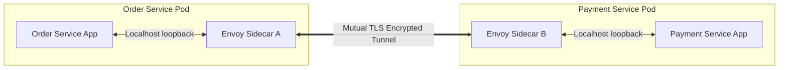
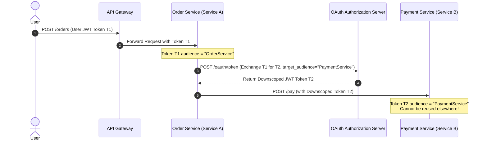

# 04 - Microservice & Distributed System Security Patterns

Securing distributed microservice ecosystems requires specialized architectural patterns to handle identity, authentication, authorization, and encrypted transport across dynamic, multi-tenant boundaries.

---

## 1. Sidecar Proxy Pattern (Envoy / Service Mesh)

### 🛠️ Mechanics & Architecture
In a microservices architecture, embedding security logic (mTLS, JWT validation, retry loops) directly into application source code creates tight coupling, code duplication across polyglot services, and version drift.

The **Sidecar Proxy Pattern** deploys a high-performance network proxy container (e.g., **Envoy Proxy**) alongside each application service container within the same pod/host namespace.



* **Control Plane (Istio/Linkerd):** Pushes security policies, TLS certificates, and routing rules.
* **Data Plane (Envoy Proxies):** Intercepts all ingress and egress traffic, enforcing policy without modifying application source code.

### 💻 Production Envoy Security Configuration (YAML)

```yaml
static_resources:
  listeners:
  - name: ingress_listener
    address:
      socket_address: { address: 0.0.0.0, port_value: 10000 }
    filter_chains:
    - transport_socket:
        name: envoy.transport_sockets.tls
        typed_config:
          "@type": type.googleapis.com/envoy.extensions.transport_sockets.tls.v3.DownstreamTlsContext
          common_tls_context:
            tls_certificates:
            - certificate_chain: { filename: "/etc/certs/tls.crt" }
              private_key: { filename: "/etc/certs/tls.key" }
            validation_context:
              trusted_ca: { filename: "/etc/certs/ca.crt" }
              require_client_certificate: true
      filters:
      - name: envoy.filters.network.http_connection_manager
        typed_config:
          "@type": type.googleapis.com/envoy.extensions.filters.network.http_connection_manager.v3.HttpConnectionManager
          stat_prefix: ingress_http
          http_filters:
          # 1. JWT Authentication Filter
          - name: envoy.filters.http.jwt_authn
            typed_config:
              "@type": type.googleapis.com/envoy.extensions.filters.http.jwt_authn.v3.JwtAuthentication
              providers:
                auth0_provider:
                  issuer: https://auth.company.com/
                  audiences: ["https://api.company.com/payment"]
                  remote_jwks:
                    http_uri:
                      uri: https://auth.company.com/.well-known/jwks.json
                      cluster: jwks_cluster
                      timeout: 1s
                    cache_duration: 300s
          # 2. Router Filter
          - name: envoy.filters.http.router
            typed_config:
              "@type": type.googleapis.com/envoy.extensions.filters.http.router.v3.Router
```

---

## 2. API Gateway Pattern

### 🛠️ Edge Security Architecture
The **API Gateway** serves as the central security control point at the network perimeter, abstracting internal microservices from direct internet exposure.

```
Client Requests (Mobile / Web)
            |
            v
+-------------------------------------------------------------------+
|                        API GATEWAY LAYER                          |
|   1. Volumetric DDoS & WAF Inspection                             |
|   2. TLS 1.3 Termination & HSTS Enforcement                       |
|   3. Global & Per-IP Rate Limiting (Redis Token Bucket)          |
|   4. User Authentication (OAuth2 / OIDC JWT Validation)           |
|   5. Header Sanitization & Context Injection                      |
+-------------------------------------------------------------------+
            |
            +------------+------------+
            | mTLS       | mTLS       | mTLS
            v            v            v
      +-----------+ +-----------+ +-----------+
      | Service A | | Service B | | Service C |
      +-----------+ +-----------+ +-----------+
```

---

## 3. OAuth 2.0 Token Exchange (RFC 8693)

### 🛠️ Problem & Architectural Mechanics
When `Service A` (Order Service) needs to call `Service B` (Payment Service) on behalf of an authenticated user, passing the original end-user JWT token directly to `Service B` violates the **Principle of Least Privilege**. If `Service B` is compromised, an attacker can reuse the user's token to call any other service in the system.

**RFC 8693 Token Exchange** allows `Service A` to exchange the incoming user token for a new downscoped token specifically intended for `Service B` (with reduced audience `aud` and scope `scp`).



### 💻 Python RFC 8693 Token Exchange Implementation

```python
import requests

def exchange_token_rfc8693(
    subject_token: str,
    target_audience: str,
    auth_server_url: str,
    client_id: str,
    client_secret: str
) -> str:
    """
    Exchanges an incoming user token for a downscoped service token per RFC 8693.
    """
    payload = {
        "grant_type": "urn:ietf:params:oauth:grant-type:token-exchange",
        "client_id": client_id,
        "client_secret": client_secret,
        "subject_token": subject_token,
        "subject_token_type": "urn:ietf:params:oauth:token-type:access_token",
        "requested_token_type": "urn:ietf:params:oauth:token-type:access_token",
        "audience": target_audience
    }

    headers = {"Content-Type": "application/x-www-form-urlencoded"}
    response = requests.post(auth_server_url, data=payload, headers=headers, timeout=5)
    response.raise_for_status()

    token_data = response.json()
    return token_data["access_token"]
```

---

## 4. Mutual TLS (mTLS) & SPIFFE/SPIRE Identity

### 🛠️ Workload Identity Attestation
In cloud-native environments (Kubernetes, AWS ECS), IP addresses are dynamic and ephemeral. Hardcoding IP allowlists is impossible. **SPIFFE (Secure Production Identity Framework for Everyone)** provides a standardized identity format for workloads.

* **SPIFFE ID URI Format:** `spiffe://cluster.local/ns/prod/sa/payment-service`
* **SVID (SPIFFE Verifiable Identity Document):** Short-lived X.509 certificate automatically issued and rotated by **SPIRE (SPIFFE Runtime Environment)** via node and workload attestation.

```
       +-----------------------------------------------------+
       |                   SPIRE SERVER                      |
       |  (Issues X.509 SVID Certificates to Workloads)      |
       +-----------------------------------------------------+
                                  ^
                                  | Workload Attestation
                                  v
       +-----------------------------------------------------+
       |                  SPIRE AGENT                        |
       |  Verifies Container Cgroups, K8s ServiceAccount     |
       +-----------------------------------------------------+
                                  |
                                  v
       +-----------------------------------------------------+
       |  Order Service Container (Issued SPIFFE ID SVID)    |
       +-----------------------------------------------------+
```

---

## 📊 Microservice Security Pattern Matrix

| Pattern | Focus Layer | Security Benefit | Primary Risk Addressed |
| :--- | :--- | :--- | :--- |
| **Sidecar Proxy** | Pod / Container | Decoupled policy & mTLS termination | Security code duplication & drift |
| **API Gateway** | Perimeter Edge | Centralized WAF, rate limits, JWT auth | Unauthorized direct internal API access |
| **RFC 8693 Token Exchange** | Inter-service Calls | Token scope reduction & actor tracking | Privilege escalation via token replay |
| **SPIFFE / SPIRE** | Identity Infrastructure | Cryptographic workload identity | IP spoofing & static key sprawl |

---

> [!TIP]
> **Next Steps:** Proceed to **[05 Threat Modeling and STRIDE](05-threat-modeling-and-stride.md)** to learn how to decompose systems using DFDs, map threats using STRIDE, and run automated threat modeling tools.
