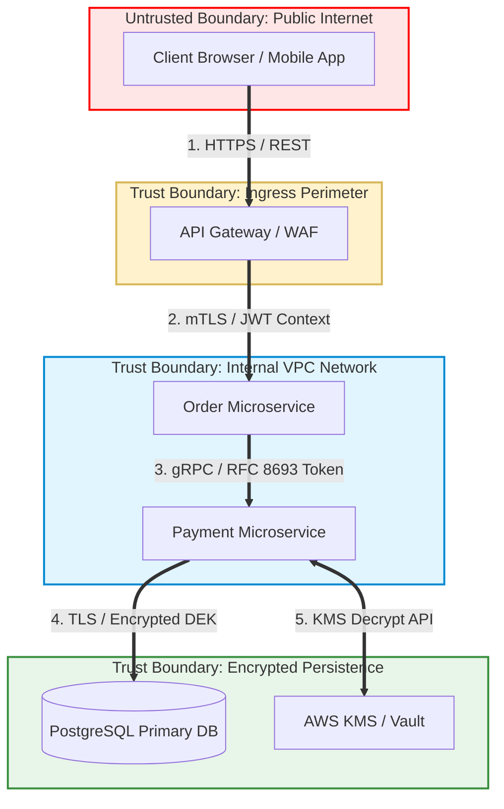

# 05 - Threat Modeling Frameworks and STRIDE

Threat modeling is a structured engineering process for identifying, quantifying, and mitigating security threats in a system's design *before* a single line of code is committed to production.

---

## 1. The STRIDE Framework

Developed at Microsoft, **STRIDE** categorizes threats according to the security property they violate:

| Threat Category | Security Property Violated | Definition & Attack Example | Architectural Countermeasure |
| :--- | :--- | :--- | :--- |
| **S**poofing | **Authenticity** | Impersonating a legitimate user, process, or system node. *Example:* Replaying a stolen JWT token. | Strong Authentication (MFA, mTLS, OAuth2, SPIFFE) |
| **T**ampering | **Integrity** | Modifying data in transit, at rest, or in memory. *Example:* Altering HTTP request parameters. | HMAC signatures, TLS 1.3, AES-GCM, Hash Chains |
| **R**epudiation | **Non-repudiation** | Denying an action performed without evidence to prove otherwise. *Example:* Deleting logs. | Cryptographic Immutable Audit Logs, WORM storage |
| **I**nformation Disclosure | **Confidentiality** | Exposing sensitive data to unauthorized parties. *Example:* Plaintext DB leak. | Envelope Encryption, FPE, TLS, Least Privilege |
| **D**enial of Service | **Availability** | Degrading or preventing legitimate access to a service. *Example:* Thread starvation. | Rate Limiting (Token Bucket), Circuit Breakers |
| **E**levation of Privilege | **Authorization** | Gaining unauthorized permissions or root access. *Example:* Parameter tampering (IDOR). | RBAC / ABAC, Complete Mediation, OPA Sidecar |

### 🎯 Element-to-STRIDE Mapping Matrix
Not all system elements are vulnerable to every STRIDE threat. Use this mapping rule during DFD reviews:

| DFD Element Type | Spoofing | Tampering | Repudiation | Information Disclosure | Denial of Service | Elevation of Privilege |
| :--- | :---: | :---: | :---: | :---: | :---: | :---: |
| **External Interactor** | ✅ | ❌ | ✅ | ❌ | ❌ | ❌ |
| **Process (Code/App)** | ✅ | ✅ | ✅ | ✅ | ✅ | ✅ |
| **Data Store (DB/S3)** | ❌ | ✅ | ✅ (Log DB) | ✅ | ✅ | ❌ |
| **Data Flow (Network)** | ❌ | ✅ | ❌ | ✅ | ✅ | ❌ |

---

## 2. Data Flow Diagrams (DFDs) & Trust Boundaries

Data Flow Diagrams visualize how data traverses system processes, data stores, and external entities across **Trust Boundaries**. A Trust Boundary is any perimeter where data moves between different levels of privilege or control.



---

## 3. PASTA & LINDDUN Methodologies

### 🍝 PASTA (Process for Attack Simulation and Threat Analysis)
PASTA is a 7-stage, risk-centric methodology that aligns technical threat analysis with business objectives:

1. **Stage 1: Define Objectives:** Identify business assets, compliance rules, and operational goals.
2. **Stage 2: Define Technical Scope:** Map software stack, boundaries, and dependencies.
3. **Stage 3: Application Decomposition:** Draw Level 0/1 DFDs and identify trust boundaries.
4. **Stage 4: Threat Analysis:** Gather threat intelligence, attack patterns (CAPEC/ATT&CK), and actor profiles.
5. **Stage 5: Vulnerability & Weakness Analysis:** Map architectural flaws using STRIDE and CWE listings.
6. **Stage 6: Attack Modeling:** Simulate attack trees and exploit paths.
7. **Stage 7: Risk & Impact Analysis:** Quantify financial/reputational risk and assign countermeasures.

### 🛡️ LINDDUN (Privacy Threat Modeling)
While STRIDE focuses on security, **LINDDUN** evaluates privacy threats: **L**inkability, **I**dentifiability, **N**on-repudiation, **D**etectability, **D**isclosure of information, **U**nawareness, and **N**on-compliance.

---

## 4. Case Study: Threat Modeling a FinTech Microservice

### Step 1: System Identification
A user initiates a money transfer via `Payment Microservice`, which queries `Account Database` and communicates with external `Stripe Payment Gateway`.

### Step 2: STRIDE Breakdown & Risk Scoring (DREAD Framework)

* **Risk Score Formula:** `Risk = (Damage + Reproducibility + Exploitability + Affected Users + Discoverability) / 5`

| ID | DFD Target | Threat Description | STRIDE | Damage (1-10) | Exploitability (1-10) | DREAD Score | Action / Mitigation |
| :--- | :--- | :--- | :---: | :---: | :---: | :---: | :--- |
| **T-01** | Data Flow: Order -> Payment | Attacker intercepts internal HTTP traffic to alter transfer amount. | **Tampering** | 9 | 4 | **6.5 (High)** | Enforce mutual TLS (mTLS) with SPIFFE workload identity. |
| **T-02** | Process: Payment Service | Attacker floods payment endpoint causing thread starvation. | **DoS** | 8 | 8 | **8.0 (Critical)** | Implement Token Bucket Rate Limiting & Circuit Breakers. |
| **T-03** | Data Store: Account DB | Attacker reads plaintext account numbers from stolen DB backup. | **Info Disclosure** | 10 | 3 | **6.8 (High)** | Apply Envelope Encryption (AES-256-GCM) with AWS KMS. |
| **T-04** | Process: Payment Service | Malicious user denies transferring funds due to lack of signatures. | **Repudiation** | 7 | 5 | **6.0 (Medium)** | Log transactions to an Immutable Hash-Chained Audit Ledger. |

---

## 5. Automated Threat Modeling as Code

Modern DevSecOps embeds threat models directly into Git repositories using declarative Python code via **PyTM**.

### 💻 PyTM Threat Model Script Example (`threatmodel.py`)

```python
from pytm import TM, Server, Datastores, Dataflow, Boundary, Actor

tm = TM("FinTech Platform Threat Model")

# Boundaries
internet = Boundary("Public Internet")
vpc = Boundary("Internal AWS VPC")

# Entities & Components
user = Actor("Customer / Mobile App")
user.inBoundary = internet

gateway = Server("API Gateway")
gateway.inBoundary = vpc

payment_service = Server("Payment Service")
payment_service.inBoundary = vpc
payment_service.isHTTP = True

account_db = Datastores("Account Database")
account_db.inBoundary = vpc
account_db.isSQL = True

# Data Flows
Dataflow(user, gateway, "HTTPS Requests")
Dataflow(gateway, payment_service, "Internal gRPC / mTLS")
Dataflow(payment_service, account_db, "SQL Queries")

if __name__ == "__main__":
    tm.resolve()
```

---

> [!TIP]
> **Next Steps:** Proceed to **[06 Hands-on Lab](06-hands-on-lab.md)** to execute a practical secure architecture refactoring on a vulnerable microservice.
