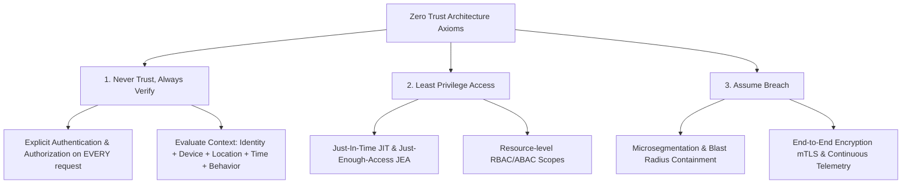

# Introduction to Zero Trust Architecture

> [!TIP]
> **Industry Alignment:** Modern enterprise Zero Trust implementations align with **NIST SP 800-207**, **CISA Zero Trust Maturity Model 2.0**, and the **DoD Zero Trust Reference Architecture**.

---

## 1. The Demise of the Perimeter (Castle-and-Moat)

Historically, enterprise security operated under the **Castle-and-Moat** paradigm. Organizations erected hard outer perimeters using firewalls, Intrusion Prevention Systems (IPS), and Virtual Private Networks (VPNs). Once an identity or payload breached the moat, it was treated as trusted, enjoying unhindered access across internal network subnets (`10.0.0.0/8` or `192.168.0.0/16`).

```
+-----------------------------------------------------------------------+
|                         UNTRUSTED INTERNET                            |
+-----------------------------------------------------------------------+
                                   |
                         [ Perimeter Firewall / VPN ]
                                   |
+----------------------------------v------------------------------------+
| IMPLICITLY TRUSTED INTERNAL NETWORK                                   |
|                                                                       |
|   [ User Workstation ] ---- (Flat Network Access) ---> [ DB Server ]  |
|          |                                                  ^         |
|          +-------- (Unrestricted Lateral Movement) ---------+         |
|                                                                       |
|   * Failure Mode: Single credential theft grants total internal access|
+-----------------------------------------------------------------------+
```

### Why the Castle-and-Moat Model Failed

1. **Perimeter Erosion**: Mobile endpoints, remote working models, and multi-cloud environments (AWS, GCP, Azure) erased single physical network borders.
2. **Implicit Trust Abuse**: Traditional firewalls rely on IP addresses, VLANs, and network location for authorization. An IP address is an indicator of network topology, **not identity or trustworthiness**.
3. **Unchecked Lateral Movement**: Attackers gaining initial access via phishing or unpatched edge appliances (e.g., VPN vulnerabilities like CVE-2023-46805) easily pivot across internal VLANs.
4. **Static Long-Lived Credentials**: Service accounts, SSH keys, and static bearer tokens remain valid indefinitely without continuous validation of posture or intent.

---

## 2. Theoretical Core Principles of Zero Trust

Zero Trust is **not a product or vendor tool**, but a holistic security strategy and architectural paradigm defined by three fundamental axioms:



### Axiom 1: Never Trust, Always Verify
Every connection attempt, API invocation, and resource access request must be explicitly authenticated and authorized regardless of origin (internal pod, VPN client, or external internet). Trust is dynamically calculated per transaction using multi-factor identity, cryptographic attestation, device compliance, and real-time risk telemetry.

### Axiom 2: Enforce Least Privilege Access
Access is restricted using **Just-In-Time (JIT)** and **Just-Enough-Access (JEA)** models:
- **JIT**: Privileges are granted dynamically for a specific temporal window (e.g., 15-minute ephemeral AWS STS credentials or SPIRE SVID certificates).
- **JEA**: Granular scoping prevents over-privileged service accounts (e.g., restricting a payment API to `POST /v1/charge` rather than full database access).

### Axiom 3: Assume Breach
Systems must be designed with the explicit assumption that internal workloads and networks are already compromised:
- Minimize the **blast radius** through L4/L7 microsegmentation.
- Encrypt all network communication in transit using **Mutual TLS (mTLS)** with modern ciphers.
- Collect, correlate, and inspect all network logs, access attempts, and process telemetry in real-time.

---

## 3. NIST SP 800-207 Architecture Breakdown

NIST Special Publication 800-207 establishes the standardized logical architecture for Zero Trust. It separates the **Control Plane** (decisions and management) from the **Data Plane** (traffic proxying and execution).

```
                      +----------------------------------+
                      |     Continuous Telemetry /       |
                      |   CDM / Threat Intel / PKI / ID  |
                      +----------------------------------+
                                       |
  ============================= CONTROL PLANE =============================
                                       |
    +----------------------------------v----------------------------------+
    |                           POLICY ENGINE (PE)                        |
    |  Evaluates enterprise policy + telemetry signals to make access decision|
    +----------------------------------+----------------------------------+
                                       | Decision (Approve / Deny)
    +----------------------------------v----------------------------------+
    |                        POLICY ADMINISTRATOR (PA)                    |
    |   Issues commands to establish/terminate communication path        |
    +----------------------------------+----------------------------------+
                                       |
  ============================== DATA PLANE ==============================
                                       | Control Signal (Open/Close Tunnel)
    +----------------                  v                  ----------------+
    | Subject /      | ====> [ POLICY ENFORCEMENT POINT ] ====> | Enterprise   |
    | Untrusted User |       (e.g. Envoy, Cloudflare,    |      | Resource     |
    +----------------        API Gateway, eBPF)         +----------------
```

### Component Breakdown

| Component | Layer | Function | Example Real-World Implementations |
| :--- | :--- | :--- | :--- |
| **Policy Engine (PE)** | Control Plane | Evaluates access requests against security policies, identity databases, threat intelligence, and risk engines to output an explicit `Allow` or `Deny`. | Open Policy Agent (OPA), Okta Adaptive Auth, AWS IAM Policy Engine |
| **Policy Administrator (PA)** | Control Plane | Communicates with the Policy Engine to issue commands to the PEP. Generates short-lived tokens, session credentials, or dynamic mTLS certs. | SPIRE Server, HashiCorp Vault, Azure AD Conditional Access Controller |
| **Policy Enforcement Point (PEP)** | Data Plane | Intercepts, inspects, and brokers connections between subjects and resources. Can allow, reject, or step-up authentication. | Envoy Proxy, NGINX Ingress, Cloudflare Access, Cilium eBPF |

---

## 4. Architectural Comparison Matrix

> [!NOTE]
> The table below illustrates the shift in security controls between legacy castle-and-moat models and production Zero Trust Architecture.

| Dimension | Legacy Perimeter Security | Zero Trust Architecture (ZTA) |
| :--- | :--- | :--- |
| **Trust Vector** | Implicit based on network location (IP subnet, VLAN) | Zero implicit trust; verified per transaction |
| **Access Granularity** | Broad network access (`10.0.0.0/8` via VPN) | App-level & API route-level micro-authorization |
| **Authentication** | One-time at session login (username/password) | Continuous authentication + step-up dynamic AuthN |
| **Workload Identity** | Static IP addresses, hardcoded API keys | Cryptographic identities (SPIFFE ID, X.509 SVIDs) |
| **Traffic Encryption** | Plaintext internally; TLS terminates at perimeter | End-to-end mTLS (L4/L7 encryption in transit) |
| **Lateral Movement** | Trivial once inside firewall | Blocked by default via default-deny microsegmentation |
| **Telemetry Focus** | Edge perimeter logs (Firewall egress/ingress) | Full-stack telemetry (eBPF, Envoy access logs, SIEM) |

---

## 5. Threat Dynamics & Common Failure Modes

### Attack Vector 1: Lateral Pivot via Stolen VPN Credentials
In traditional networks, compromising a single VPN credential grants the attacker an IP address on the internal network. The attacker uses tools like `nmap` and `BloodHound` to map internal Active Directory environments and escalate privileges.
* **Zero Trust Mitigation**: Network access is mediated by an Identity-Aware Proxy (IAP). The user connects directly to the specific authorized application protocol without acquiring an internal IP address or subnet route.

### Attack Vector 2: Kubernetes East-West Pod Compromise
An attacker exploits a Remote Code Execution (RCE) vulnerability in a public-facing web application container. In a flat Kubernetes cluster, the attacker accesses the cloud metadata service (`169.254.169.254`) or internal database services.
* **Zero Trust Mitigation**: Kubernetes NetworkPolicies and Cilium eBPF restrict container egress to explicit DNS destinations. Workloads must present valid mTLS certificates with short-lived TTLs issued via SPIFFE/SPIRE.

> [!CAUTION]
> **Implementation Anti-Pattern:** Introducing a Zero Trust proxy without removing perimeter-level implicit trust rules leads to false confidence. If legacy subnets remain unsegmented, attackers can bypass PEP proxies by targeting direct service IP addresses.

---

## 6. Key Takeaways

1. **Location $\neq$ Trust**: An internal IP address is an unreliable indicator of security posture.
2. **Decouple Access from Topography**: Zero Trust separates logical access control from physical/virtual network topology using Control Plane engines (PE/PA) and Data Plane proxies (PEP).
3. **Continuous Execution**: Verification must occur at every layer—Identity, Device, Network, Application, and Data—on every transaction.

