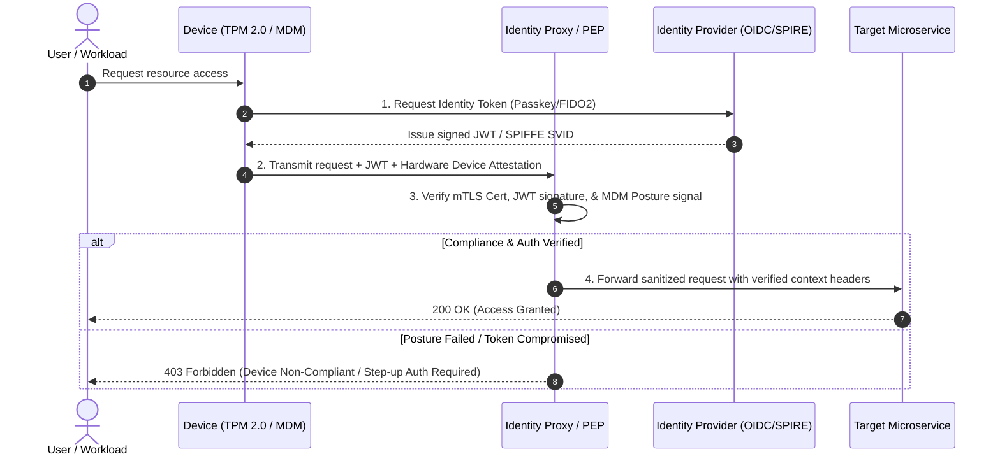

# Identity and Device Trust

> [!IMPORTANT]
> **Core Axiom:** In Zero Trust, identity is the new security perimeter. Access requests must be cryptographically bound to both a verified user identity AND a healthy, authenticated device.

---

## 1. Mechanics of Identity & Device Attestation

Identity and Device Trust replaces static network-based trust with dynamic, multi-dimensional attestation. An access request is evaluated using three distinct verification pillars:



### A. Human & User Identity
- **Passwordless AuthN**: Migration to FIDO2 / WebAuthn hardware security keys (YubiKeys, TouchID) to eliminate phishing and credential stuffing attacks.
- **Short-Lived Ephemeral Tokens**: OIDC JWT tokens with short lifespans (5–15 minutes) bound to specific client sessions.
- **Sender-Constrained Tokens**: Mitigate token theft using **OAuth 2.0 Demonstrating Proof-of-Possession (DPoP)** or **mTLS Certificate Bound Access Tokens (RFC 8705)** so stolen bearer tokens cannot be replayed from another host.

### B. Machine & Workload Identity (SPIFFE/SPIRE)
- **SPIFFE (Secure Production Identity Framework for Everyone)**: Standardizes identity issuance for microservices, containers, and serverless functions using URI-formatted identities: `spiffe://example.com/ns/production/sa/payment-service`.
- **SPIRE (SPIFFE Runtime Environment)**: Attests node and workload properties (kernel hash, Kubernetes ServiceAccount, container image digest) and issues short-lived X.509 SVID (SPIFFE Verifiable Identity Document) certificates rotated automatically every few hours.

### C. Device Posture & Hardware Root of Trust
- **TPM 2.0 / Secure Enclave**: Device keys generated inside hardware tamper-resistant security chips, guaranteeing identity keys cannot be exfiltrated.
- **MDM Posture Signals**: Real-time health attestation from endpoint platforms (Microsoft Intune, Jamf, CrowdStrike Falcon, SentinelOne):
  - OS build & security patch status
  - Disk encryption status (BitLocker / FileVault enabled)
  - EDR agent health & real-time threat score
  - Firewall and lock-screen status

---

## 2. Robust Multi-Language Code Implementations

Below are production-ready code examples demonstrating contextual Zero Trust middleware that evaluates identity claims, hardware device posture, and network attributes across four major application stack languages.

---

### Python (FastAPI): Enterprise Context-Aware Verification

```python
# zero_trust_middleware.py
import jwt
import time
from typing import Optional, Dict, Any
from fastapi import FastAPI, Request, HTTPException, Security, status
from fastapi.security import HTTPBearer, HTTPAuthorizationCredentials
from pydantic import BaseModel

app = FastAPI(title="Zero Trust Protected API")
security = HTTPBearer()

# Configuration (In production, load public keys from JWKS endpoint)
JWT_SECRET = "super-secret-key-change-in-production"
ALLOWED_ALGORITHMS = ["HS256"]
MAX_CLOCK_SKEW_SECONDS = 60

class DevicePosture(BaseModel):
    is_managed: bool
    disk_encrypted: bool
    edr_healthy: bool
    os_version_min: bool

class SecurityContext(BaseModel):
    user_id: str
    roles: list[str]
    spiffe_id: Optional[str]
    device: DevicePosture

def evaluate_device_posture(request: Request) -> DevicePosture:
    """Extracts and verifies device posture signals injected by PEP/Proxy."""
    is_managed = request.headers.get("X-Device-Managed", "").lower() == "true"
    disk_encrypted = request.headers.get("X-Device-Encrypted", "").lower() == "true"
    edr_healthy = request.headers.get("X-Device-EDR-Healthy", "").lower() == "true"
    os_valid = request.headers.get("X-Device-OS-Compliant", "").lower() == "true"
    
    return DevicePosture(
        is_managed=is_managed,
        disk_encrypted=disk_encrypted,
        edr_healthy=edr_healthy,
        os_version_min=os_valid
    )

async def verify_zero_trust_context(
    request: Request,
    credentials: HTTPAuthorizationCredentials = Security(security)
) -> SecurityContext:
    """
    Validates User Token, SPIFFE Identity, and Device Posture.
    Enforces explicit Zero Trust policy prior to request execution.
    """
    token = credentials.credentials
    
    try:
        # Decode and validate JWT payload with clock skew tolerance
        payload = jwt.decode(
            token,
            JWT_SECRET,
            algorithms=ALLOWED_ALGORITHMS,
            leeway=MAX_CLOCK_SKEW_SECONDS
        )
    except jwt.ExpiredSignatureError:
        raise HTTPException(status_code=401, detail="Token expired. Re-attestation required.")
    except jwt.InvalidTokenError:
        raise HTTPException(status_code=401, detail="Invalid identity token signature.")

    # Extract SPIFFE ID from mTLS client certificate header injected by Envoy PEP
    spiffe_id = request.headers.get("X-Forwarded-Client-Cert-Spiffe")

    # Evaluate Device Health
    posture = evaluate_device_posture(request)
    
    # Policy Enforcement: Device MUST be managed, encrypted, and running healthy EDR
    if not (posture.is_managed and posture.disk_encrypted and posture.edr_healthy):
        raise HTTPException(
            status_code=status.HTTP_403_FORBIDDEN,
            detail="Access Denied: Device posture violates security baseline."
        )

    return SecurityContext(
        user_id=payload.get("sub"),
        roles=payload.get("roles", []),
        spiffe_id=spiffe_id,
        device=posture
    )

@app.get("/api/v1/financial-records")
async def get_financial_records(ctx: SecurityContext = Security(verify_zero_trust_context)):
    if "finance_admin" not in ctx.roles:
        raise HTTPException(status_code=403, detail="Insufficient RBAC/ABAC role permissions")
        
    return {
        "status": "success",
        "user": ctx.user_id,
        "spiffe_workload": ctx.spiffe_id,
        "data": ["Q1 Revenue", "Internal Ledger 2026"]
    }
```

---

### Node.js (Express / TypeScript): Zero Trust Context Verification

```typescript
// middleware/zeroTrustAuth.ts
import { Request, Response, NextFunction } from 'express';
import jwt from 'jsonwebtoken';

interface DeviceHealth {
  isManaged: boolean;
  diskEncrypted: boolean;
  edrActive: boolean;
}

export interface ZeroTrustRequest extends Request {
  userContext?: {
    userId: string;
    roles: string[];
    spiffeId?: string;
    device: DeviceHealth;
  };
}

const JWT_PUBLIC_KEY = process.env.JWT_PUBLIC_KEY || 'secret-key';

export const zeroTrustMiddleware = (req: ZeroTrustRequest, res: Response, next: NextFunction) => {
  const authHeader = req.headers.authorization;
  if (!authHeader || !authHeader.startsWith('Bearer ')) {
    return res.status(401).json({ error: 'Missing or malformed Authorization header' });
  }

  const token = authHeader.split(' ')[1];

  try {
    const decoded = jwt.verify(token, JWT_PUBLIC_KEY) as any;

    const isManaged = req.headers['x-device-managed'] === 'true';
    const diskEncrypted = req.headers['x-device-encrypted'] === 'true';
    const edrActive = req.headers['x-device-edr-active'] === 'true';
    const spiffeId = req.headers['x-spiffe-client-id'] as string;

    const device: DeviceHealth = { isManaged, diskEncrypted, edrActive };

    // Enforce Zero Trust Device Policy
    if (!device.isManaged || !device.diskEncrypted || !device.edrActive) {
      return res.status(403).json({
        error: 'Access Denied',
        message: 'Endpoint fails enterprise health attestation compliance'
      });
    }

    req.userContext = {
      userId: decoded.sub,
      roles: decoded.roles || [],
      spiffeId: spiffeId,
      device
    };

    next();
  } catch (err) {
    return res.status(401).json({ error: 'Invalid or expired token payload' });
  }
};
```

---

### Go: Native TLS & SPIFFE SVID Middleware

```go
// main.go
package main

import (
	"crypto/tls"
	"encoding/json"
	"net/http"
	"strings"
)

type ZeroTrustClaims struct {
	UserID   string   `json:"sub"`
	Roles    []string `json:"roles"`
	SpiffeID string   `json:"spiffe_id"`
}

func zeroTrustHandler(next http.HandlerFunc) http.HandlerFunc {
	return func(w http.ResponseWriter, r *http.Request) {
		// 1. Verify TLS Client Certificate SAN (SPIFFE ID)
		if r.TLS == nil || len(r.TLS.PeerCertificates) == 0 {
			http.Error(w, "Forbidden: Client mTLS certificate required", http.StatusForbidden)
			return
		}

		clientCert := r.TLS.PeerCertificates[0]
		var spiffeID string
		if len(clientCert.URIs) > 0 {
			spiffeID = clientCert.URIs[0].String()
		}

		if !strings.HasPrefix(spiffeID, "spiffe://example.com/") {
			http.Error(w, "Forbidden: Untrusted SPIFFE trust domain", http.StatusForbidden)
			return
		}

		// 2. Validate Context Headers from Proxy
		if r.Header.Get("X-Device-Encrypted") != "true" {
			http.Error(w, "Forbidden: Device disk must be encrypted", http.StatusForbidden)
			return
		}

		w.Header().Set("Content-Type", "application/json")
		response := map[string]string{
			"message":   "Access Granted via Zero Trust mTLS",
			"spiffe_id": spiffeID,
		}
		json.NewEncoder(w).Encode(response)
	}
}

func main() {
	mux := http.NewServeMux()
	mux.HandleFunc("/api/secure-data", zeroTrustHandler(func(w http.ResponseWriter, r *http.Request) {}))

	server := &http.Server{
		Addr:    ":8443",
		Handler: mux,
		TLSConfig: &tls.Config{
			ClientAuth: tls.RequireAndVerifyClientCert,
		},
	}
	_ = server
}
```

---

### Java (Spring Security): Custom Zero Trust Filter

```java
// ZeroTrustAuthenticationFilter.java
package com.appsec.zerotrust;

import jakarta.servlet.FilterChain;
import jakarta.servlet.ServletException;
import jakarta.servlet.http.HttpServletRequest;
import jakarta.servlet.http.HttpServletResponse;
import org.springframework.security.core.context.SecurityContextHolder;
import org.springframework.web.filter.OncePerRequestFilter;
import java.io.IOException;

public class ZeroTrustAuthenticationFilter extends OncePerRequestFilter {

    @Override
    protected void doFilterInternal(HttpServletRequest request, 
                                    HttpServletResponse response, 
                                    FilterChain filterChain) throws ServletException, IOException {

        String authHeader = request.getHeader("Authorization");
        String deviceEncrypted = request.getHeader("X-Device-Encrypted");
        String deviceManaged = request.getHeader("X-Device-Managed");

        if (authHeader == null || !authHeader.startsWith("Bearer ")) {
            response.sendError(HttpServletResponse.SC_UNAUTHORIZED, "Missing identity bearer token");
            return;
        }

        // Validate Device Context Signals
        if (!"true".equalsIgnoreCase(deviceEncrypted) || !"true".equalsIgnoreCase(deviceManaged)) {
            response.sendError(HttpServletResponse.SC_FORBIDDEN, "Access Denied: Non-compliant device posture");
            return;
        }

        // Proceed down the Spring Security filter chain
        filterChain.doFilter(request, response);
    }
}
```

---

## 3. Practical Edge Cases & Mitigation Strategies

| Edge Case / Nuance | Threat / Risk | Production Mitigation Strategy |
| :--- | :--- | :--- |
| **Clock Drift Across Services** | Valid JWT tokens rejected due to `nbf` (Not Before) or `exp` mismatch. | Enforce Network Time Protocol (NTP) synchronization across nodes; set JWT leeway tolerance (`$30-60\text{ seconds}$`). |
| **Stolen Bearer Tokens** | Replay of stolen JWT tokens from non-trusted machines. | Implement **DPoP (RFC 9449)** or **mTLS Token Binding (RFC 8705)** to bind tokens to client private keys. |
| **BYOD / Unmanaged Devices** | Contractors using personal laptops needing limited app access. | Route BYOD connections through isolated **Virtual Desktop Infrastructure (VDI)** or browser-isolated proxies (RBI). |
| **CRL / OCSP Performance Bottlenecks** | Latency spikes when verifying mTLS certificate revocation status. | Use **Short-Lived Certificates** (e.g., SPIRE 1-hour SVIDs) to render revocation checks redundant. |

> [!WARNING]
> **Header Spoofing Hazard:** Never trust `X-Device-*` or `X-User-*` headers directly from client requests! Ensure all context headers are stripped at the edge proxy/PEP and re-injected ONLY after cryptographically verifying the incoming payload signature.

