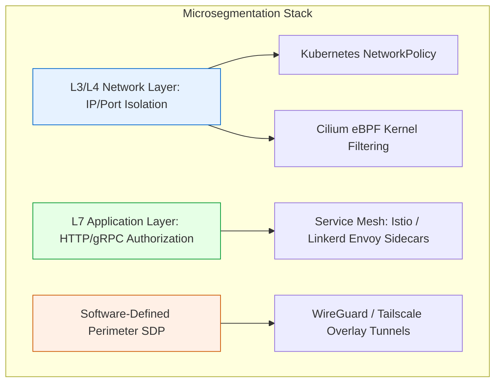

# Network Microsegmentation

> [!IMPORTANT]
> **Core Concept:** Network Microsegmentation isolates workloads down to individual microservice instances, enforcing **Default-Deny** rules to render East-West lateral movement mathematically impossible without cryptographically verified authorization.

---

## 1. Architectural Layers of Microsegmentation

Modern microsegmentation is enforced across three primary OSI stack layers:



### L3/L4 vs. L7 Segmentation Matrix

| Feature | L3/L4 Segmentation (Firewalls / K8s NP) | L7 Microsegmentation (Service Mesh / eBPF) |
| :--- | :--- | :--- |
| **Inspection Depth** | Source/Dest IP, Protocol (TCP/UDP), Port | HTTP Method, Request Path, JWT Claims, gRPC Method |
| **Identity Basis** | Ephemeral IP addresses, Pod Selectors | Cryptographic mTLS certificates (SPIFFE IDs) |
| **Performance Impact** | Near-zero (`$< 1\text{ms}`$`) | Low to moderate (`$`1-5\text{ms}$` sidecar proxy latency) |
| **Bypass Vectors** | Port reuse / HTTP smuggling over allowed port | Resilient; inspects exact HTTP payload & headers |

---

## 2. Production Security Configurations

---

### A. Kubernetes Native NetworkPolicy (L3/L4 Default Deny)

In a Zero Trust Kubernetes cluster, namespaces must start with a strict **Default-Deny-All** ingress and egress policy.

```yaml
# 01-default-deny-all.yaml
apiVersion: networking.k8s.io/v1
kind: NetworkPolicy
metadata:
  name: default-deny-all
  namespace: production
spec:
  podSelector: {}
  policyTypes:
  - Ingress
  - Egress
---
# 02-allow-frontend-to-backend.yaml
apiVersion: networking.k8s.io/v1
kind: NetworkPolicy
metadata:
  name: allow-frontend-to-backend
  namespace: production
spec:
  podSelector:
    matchLabels:
      app: backend-api
  policyTypes:
  - Ingress
  ingress:
  - from:
    - podSelector:
        matchLabels:
          app: frontend-web
    ports:
    - protocol: TCP
      port: 8080
```

---

### B. Cilium eBPF L7 Policy (Kernel-Level Micro-Authorization)

Cilium utilizes Extended Berkeley Packet Filters (eBPF) to enforce L7 security directly inside the Linux kernel without requiring sidecar proxy overhead.

```yaml
# cilium-l7-policy.yaml
apiVersion: "cilium.io/v2"
kind: CiliumNetworkPolicy
metadata:
  name: secure-payment-access
  namespace: production
spec:
  endpointSelector:
    matchLabels:
      app: payment-service
  ingress:
  - fromEndpoints:
    - matchLabels:
        app: checkout-service
    toPorts:
    - ports:
      - port: "9090"
        protocol: TCP
      rules:
        http:
        - method: "POST"
          path: "/v1/charge"
        - method: "GET"
          path: "/v1/health"
```

---

### C. Istio Service Mesh (Strict mTLS & Authorization Policy)

Istio enforces **Mutual TLS (mTLS)** using Envoy sidecar proxies, automatically encrypting and authenticating all East-West traffic.

#### 1. Global Strict mTLS Policy
```yaml
# istio-strict-mtls.yaml
apiVersion: security.istio.io/v1beta1
kind: PeerAuthentication
metadata:
  name: default
  namespace: production
spec:
  mtls:
    mode: STRICT
```

#### 2. Granular Service-to-Service Authorization Policy
```yaml
# istio-authorization-policy.yaml
apiVersion: security.istio.io/v1beta1
kind: AuthorizationPolicy
metadata:
  name: restrict-database-access
  namespace: production
spec:
  selector:
    matchLabels:
      app: customer-db
  action: ALLOW
  rules:
  - from:
    - source:
        principals: ["cluster.local/ns/production/sa/user-service-sa"]
    to:
    - operation:
        methods: ["POST", "GET"]
        ports: ["5432"]
```

---

### D. Software-Defined Perimeter (SDP / WireGuard Mesh)

For multi-cloud or hybrid environments, Software-Defined Perimeters build encrypted point-to-point tunnels (e.g., using WireGuard or Tailscale ACLs) to hide infrastructure from public port scans.

```json
// tailscale-acl.json
{
  "acls": [
    // Permit frontend nodes to access database nodes on port 5432 only
    {
      "action": "accept",
      "src": ["group:frontend-servers"],
      "dst": ["group:db-servers:5432"]
    },
    // Admin access requires step-up identity authentication
    {
      "action": "accept",
      "src": ["user:admin@company.com"],
      "dst": ["group:prod-k8s-nodes:22"]
    }
  ]
}
```

---

## 3. Implementation Nuances & Performance Edge Cases

### 1. The Sidecar Latency Tax
Deploying Envoy proxy sidecars introduces CPU/memory overhead (`$50-150\text{MB}`$` RAM per pod) and adds `$`1-3\text{ms}$` of latency per network hop.
* **Mitigation**: Move toward **Ambient Mesh** (sidecarless service meshes using eBPF ztunnels) or kernel-native Cilium eBPF for latency-critical workloads.

### 2. Legacy / Un-meshable Workloads
Legacy mainframe applications, bare-metal databases, or old Windows Server OS instances cannot run Kubernetes sidecars or eBPF kernels.
* **Mitigation**: Deploy **Egress/Ingress Gateways** (perimeter proxy appliances) that terminate mTLS tunnels on behalf of legacy workloads and bridge them into the Zero Trust network mesh.

### 3. DNS Egress Spoofing & Exfiltration
Attacking pods may bypass IP policies by attempting DNS tunneling or reaching external Command and Control (C2) servers over port 443.
* **Mitigation**: Enforce strict DNS proxy inspection using Cilium FQDN egress rules:

```yaml
# egress-fqdn-policy.yaml
apiVersion: "cilium.io/v2"
kind: CiliumNetworkPolicy
metadata:
  name: restrict-external-egress
  namespace: production
spec:
  endpointSelector:
    matchLabels:
      app: payment-service
  egress:
  - toFQDNs:
    - matchName: "api.stripe.com"
  - toPorts:
    - ports:
      - port: "443"
        protocol: TCP
```

> [!CAUTION]
> **Over-Segmentation Trap:** Creating thousands of micro-policies without centralized orchestration leads to policy drift and operational breakage. Always manage network policies declaratively via GitOps pipelines (ArgoCD / Flux).

