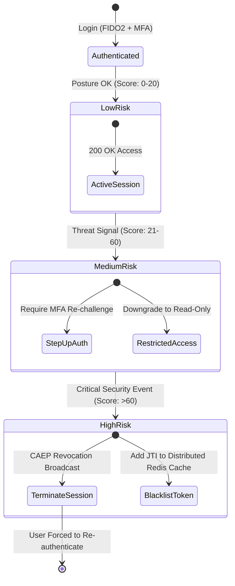

# Continuous Verification and Telemetry

> [!IMPORTANT]
> **Core Principle:** Authentication is not a one-time gateway check at initial login. Trust decays over time and must be re-evaluated continuously throughout the lifespan of every active session.

---

## 1. Mechanics of Continuous Adaptive Trust

In traditional systems, session tokens remain valid for hours regardless of contextual changes. Zero Trust introduces a **Continuous Adaptive Trust Engine** that recalculates trust dynamically whenever risk signals change.



### Risk Signal Sources & Continuous Evaluation Vectors

| Risk Vector | Telemetry Source | Signal / Metric | Automated Action |
| :--- | :--- | :--- | :--- |
| **Impossible Travel** | IdP Audit Logs | Login from London, 10 minutes later request from Tokyo | Immediate session revocation + security alert |
| **Endpoint EDR Alert** | CrowdStrike / SentinelOne | Malware execution detected on client machine | Revoke all OAuth tokens bound to device ID |
| **IP Reputation Change** | Threat Intelligence Feed | Client IP flagged as TOR exit node / Botnet IP | Trigger step-up FIDO2 re-authentication |
| **Privilege Escalation** | Admin IAM Portal | User removed from `Finance-Admins` Okta group | Revoke active access tokens via CAEP broadcast |

---

## 2. Standards: CAEP & OpenID Shared Signals (SSF)

The **Continuous Access Evaluation Protocol (CAEP)** and **RISC (Risk and Incident Sharing and Coordination)**, standardized under the OpenID Foundation **Shared Signals Framework (SSF)**, allow Identity Providers (IdPs) and Service Providers (SPs) to exchange real-time security events via **Security Event Tokens (SETs)**.

```json
// Example CAEP Security Event Token (SET)
{
  "iss": "https://idp.enterprise.com/",
  "jti": "set-evt-9948104812",
  "iat": 1774483200,
  "aud": "https://api.internal-app.com",
  "events": {
    "https://schemas.openid.net/secevent/caep/event-type/session-revocation": {
      "subject": {
        "format": "iss_sub",
        "iss": "https://idp.enterprise.com/",
        "sub": "user_891234"
      },
      "event_timestamp": 1774483195,
      "reason_admin": {
        "en": "Device posture compliance check failed: EDR disabled"
      }
    }
  }
}
```

---

## 3. Production Code Implementations

---

### Python: CAEP Event Receiver & Instant Token Revocation Engine

The code below implements an event-driven risk evaluation engine that consumes CAEP Security Event Tokens and instantly invalidates active user sessions stored in a distributed Redis cache.

```python
# continuous_risk_engine.py
import json
import redis
import jwt
from fastapi import FastAPI, Request, HTTPException, BackgroundTasks
from pydantic import BaseModel

app = FastAPI(title="Zero Trust Risk Evaluation & Revocation Engine")

# Distributed cache for active session JTI blacklisting
r = redis.Redis(host='localhost', port=6379, db=0, decode_responses=True)

IDP_PUBLIC_KEY = "idp-public-key-pem"

class SecurityEventToken(BaseModel):
    set_jwt: str

def revoke_user_sessions(user_id: str, reason: str):
    """Adds all active user session tokens to the revocation blacklist."""
    print(f"[CAEP REVOCATION] Revoking sessions for user {user_id}. Reason: {reason}")
    # Store revocation flag in Redis with TTL matching max token expiration (e.g. 3600s)
    r.setex(name=f"revoked:user:{user_id}", time=3600, value=reason)

@app.post("/events/caep/receiver")
async def receive_caep_event(event_payload: SecurityEventToken, background_tasks: BackgroundTasks):
    """
    Webhook endpoint to consume incoming OpenID CAEP Security Event Tokens (SETs).
    """
    try:
        payload = jwt.decode(event_payload.set_jwt, IDP_PUBLIC_KEY, algorithms=["RS256"])
        events = payload.get("events", {})
        
        caep_schema = "https://schemas.openid.net/secevent/caep/event-type/session-revocation"
        if caep_schema in events:
            evt_data = events[caep_schema]
            user_id = evt_data.get("subject", {}).get("sub")
            reason = evt_data.get("reason_admin", {}).get("en", "Risk Threshold Exceeded")
            
            if user_id:
                # Trigger asynchronous revocation in background
                background_tasks.add_task(revoke_user_sessions, user_id, reason)
                return {"status": "accepted", "action": "session_revocation_queued"}
                
    except jwt.PyJWTError as e:
        raise HTTPException(status_code=400, detail=f"Invalid SET Signature: {str(e)}")

    return {"status": "ignored", "detail": "Event type not handled"}

@app.get("/api/v1/protected-resource")
async def get_resource(request: Request):
    user_id = request.headers.get("X-User-Id")
    
    # CONTINUOUS VERIFICATION CHECK: Query Redis blacklist on every API call
    revocation_reason = r.get(f"revoked:user:{user_id}")
    if revocation_reason:
        raise HTTPException(
            status_code=401, 
            detail=f"Session revoked dynamically. Cause: {revocation_reason}"
        )
        
    return {"data": "Sensitive corporate data"}
```

---

### Go: OpenTelemetry (OTel) Zero Trust Telemetry Logging

```go
// logger.go
package main

import (
	"context"
	"encoding/json"
	"log"
	"net/http"
	"time"
)

type ZeroTrustAuditLog struct {
	Timestamp      string `json:"timestamp"`
	TraceID        string `json:"trace_id"`
	SubjectID      string `json:"subject_id"`
	SpiffeID       string `json:"spiffe_id"`
	ClientIP       string `json:"client_ip"`
	DeviceManaged  bool   `json:"device_managed"`
	RiskScore      int    `json:"risk_score"`
	PolicyDecision string `json:"policy_decision"`
	ResourcePath   string `json:"resource_path"`
}

func TelemetryMiddleware(next http.Handler) http.Handler {
	return http.HandlerFunc(func(w http.ResponseWriter, r *http.Request) {
		startTime := time.Now()

		// Extract security context from headers
		auditEntry := ZeroTrustAuditLog{
			Timestamp:      startTime.Format(time.RFC3339),
			TraceID:        r.Header.Get("X-Trace-Id"),
			SubjectID:      r.Header.Get("X-User-Id"),
			SpiffeID:       r.Header.Get("X-Spiffe-Client-Id"),
			ClientIP:       r.RemoteAddr,
			DeviceManaged:  r.Header.Get("X-Device-Managed") == "true",
			RiskScore:      15, // Calculated risk metric
			PolicyDecision: "ALLOW",
			ResourcePath:   r.URL.Path,
		}

		// Execute next handler
		next.ServeHTTP(w, r)

		// Emit structured JSON telemetry log for SIEM correlation
		logBytes, _ := json.Marshal(auditEntry)
		log.Println(string(logBytes))
	})
}
```

---

## 4. Nuances & Operational Edge Cases

| Challenge / Edge Case | Failure Scenario | Operational Mitigation |
| :--- | :--- | :--- |
| **Network Switching False Positives** | Executive switches from office Wi-Fi to cellular 5G, triggering an IP anomaly alert and abrupt logouts. | Configure risk engine to require **Multi-Factor Anomaly Signals** (IP shift + EDR threat + device change) before hard revocation. |
| **Redis Cache Outage** | PEP cannot verify token revocation status if distributed cache goes down. | Implement **Fail-Closed Fallback** with short local TTL memory caches (`15-30 seconds`). |
| **High-Volume Telemetry Bottleneck** | Logging every single microservice L7 call exhausts SIEM ingestion budgets. | Use eBPF sampling (e.g., Cilium Hubble) to log 100% of DENY events, but sample 5-10% of high-frequency ALLOW traffic. |

> [!TIP]
> **SIEM & SOAR Integration:** Ensure all PEP access logs include standardized correlation identifiers (`X-Trace-Id`, `X-Request-Id`) to enable instant SOAR playbook execution during an active security incident.

