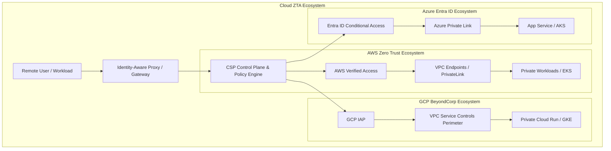

# Zero Trust Cloud Architecture

> [!IMPORTANT]
> **Cloud Paradigm:** In modern multi-cloud ecosystems, the cloud management plane is the new attack surface. Zero Trust cloud architecture enforces strict identity verification at the API control plane layer, network boundary layer, and workload data layer.

---

## 1. Cloud-Native Zero Trust Reference Matrix



### CSP Capability Deep Dive

| Cloud Provider | Identity Control Plane | Network Isolation | Access Proxy / Gateway | Data Protection |
| :--- | :--- | :--- | :--- | :--- |
| **Amazon Web Services (AWS)** | AWS IAM Identity Center, ABAC Tags, STS | VPC Endpoints, AWS PrivateLink | **AWS Verified Access (AVA)** | KMS Envelope Encryption, Macie DLP |
| **Google Cloud (GCP)** | Cloud Identity, Context-Aware Access | **VPC Service Controls (VPC SC)** | **BeyondCorp Enterprise / IAP** | Cloud KMS, Sensitive Data Protection |
| **Microsoft Azure** | **Entra ID Conditional Access**, PIM | Azure Private Link, Managed VNet | **Azure Application Proxy** | Azure Key Vault, Purview Information Protection |

---

## 2. Identity-Aware Proxies (IAPs) vs. Legacy VPNs

Traditional VPNs grant blanket L3 network connectivity to entire subnets. **Identity-Aware Proxies (IAPs)** operate at L7, evaluating identity and device context before proxying individual TCP/HTTP requests to target application instances without ever exposing an internal IP to the client.

```
LEGACY VPN APPROACH:
User Workstation === (VPN Tunnel) ===> [ Corporate VPC 10.0.0.0/16 ] ===> Unrestricted Access to ALL DBs & APIs

ZERO TRUST IAP APPROACH:
User Workstation === (TLS + FIDO2 + Device Token) ===> [ Identity-Aware Proxy ]
                                                             |
                                           +-----------------+-----------------+
                                           | Policy Engine: Allow GET /api/v1?  |
                                           +-----------------+-----------------+
                                                             | (Allowed Request Only)
                                                             v
                                               [ Isolated Microservice A Only ]
```

---

## 3. Terraform Infrastructure-as-Code (AWS Verified Access ZTA)

The following Terraform module provisions a native AWS Zero Trust environment using **AWS Verified Access (AVA)**, routing user traffic securely through OIDC identity evaluation without exposing public IPv4 addresses.

```hcl
# main.tf - AWS Verified Access Zero Trust Architecture

resource "aws_verifiedaccess_instance" "zta_instance" {
  description = "Production Zero Trust Access Instance"
  tags = {
    Environment = "production"
    ManagedBy   = "Terraform"
  }
}

# Attach OIDC Identity Provider (Okta / Entra ID) to Policy Engine
resource "aws_verifiedaccess_trust_provider" "oidc_provider" {
  description              = "Okta Enterprise IdP Trust Provider"
  trust_type               = "user"
  user_trust_provider_type = "oidc"

  oidc_options {
    issuer                 = "https://enterprise.okta.com/oauth2/default"
    authorization_endpoint = "https://enterprise.okta.com/oauth2/v1/authorize"
    token_endpoint         = "https://enterprise.okta.com/oauth2/v1/token"
    user_endpoint          = "https://enterprise.okta.com/oauth2/v1/userinfo"
    client_id              = var.okta_client_id
    client_secret          = var.okta_client_secret
    scope                  = "openid profile email groups"
  }
}

# Create Verified Access Group with Cedar Policy
resource "aws_verifiedaccess_group" "finance_access_group" {
  verifiedaccess_instance_id = aws_verifiedaccess_instance.zta_instance.id
  description                = "Finance Application Access Group"

  # Cedar Policy Language enforcing Identity + Group + MFA
  policy_document = <<EOF
permit(principal, action, resource)
when {
    context.identity.groups.contains("Finance-Admins") &&
    context.identity.mfa_authenticated == true
};
EOF
}

# Create Endpoint mapping to internal ALB in private VPC subnet
resource "aws_verifiedaccess_endpoint" "finance_app_endpoint" {
  verifiedaccess_group_id = aws_verifiedaccess_group.finance_access_group.id
  endpoint_type           = "load_balancer"
  attachment_type         = "vpc"
  domain_name             = "finance-internal.company.com"
  endpoint_domain_prefix  = "finance"

  load_balancer_options {
    load_balancer_arn = aws_lb.internal_alb.arn
    port              = 443
    protocol          = "https"
    subnet_ids        = var.private_subnet_ids
  }

  security_group_ids = [aws_security_group.ava_sg.id]
}
```

---

## 4. Cloud ZTA Nuances & Multi-Cloud Edge Cases

### 1. Cross-Cloud Identity Synchronization Delay
When federating identity across Okta, AWS IAM Identity Center, and Azure Entra ID, SCIM provisioning delays (`$5-15\text{ minutes}$`) can allow recently terminated employees to retain access to cross-cloud resources.
* **Mitigation**: Enforce **Direct OIDC JWT Validation** at the API Gateway layer rather than relying solely on synced cloud IAM user objects.

### 2. Cloud Metadata Service (IMDSv2) Exfiltration
Attacking containers executing SSRF vulnerabilities query `http://169.254.169.254` to steal temporary IAM role credentials.
* **Mitigation**: Enforce **AWS IMDSv2** (requiring token PUT header) with `http_put_response_hop_limit = 1` to block container metadata exfiltration, and restrict egress using Kubernetes NetworkPolicies.

### 3. Public API Endpoint Blindspots
Exposing serverless functions (AWS Lambda, GCP Cloud Functions) via public API Gateways without identity proxies exposes workloads to unauthenticated Denial-of-Wallet attacks.
* **Mitigation**: Protect Cloud Functions using GCP IAP or AWS API Gateway **IAM / OIDC Authorizers** coupled with WAF rate limiting.

> [!WARNING]
> **VPC Service Control Bypass:** In GCP, enabling public IPs on Cloud SQL or BigQuery instances allows workloads to bypass VPC SC perimeter boundaries. Always enforce `Private IP Only` configurations via Organization Policies.

