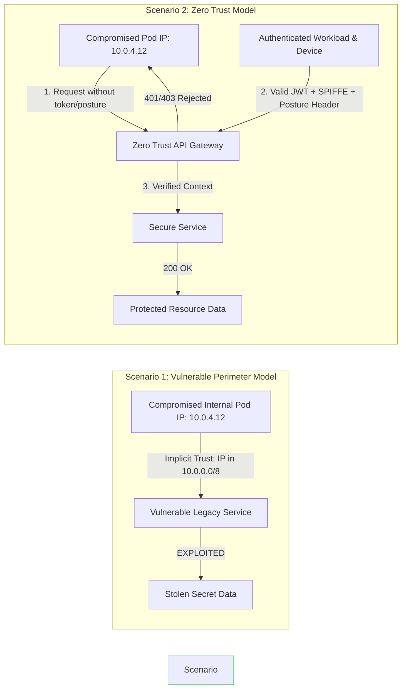

# Hands-on Lab: Transforming Perimeter Trust to Zero Trust Architecture

> [!IMPORTANT]
> **Lab Goal:** Experience firsthand how traditional IP-based implicit trust leads to severe security breaches, and step-by-step refactor a vulnerable service into a production-grade Zero Trust application.

---

## 1. Lab Architecture Overview



---

## 2. Step 1: Vulnerable Implementation (Perimeter Trust)

The vulnerable service trusts any request that originates from an internal IPv4 address range (`10.0.0.0/8`), assuming the perimeter firewall guarantees security.

```python
# vulnerable_app.py
import ipaddress
from fastapi import FastAPI, Request, HTTPException

app = FastAPI(title="Vulnerable Legacy Financial Microservice")

INTERNAL_SUBNET = ipaddress.ip_network("10.0.0.0/8")

@app.get("/admin/v1/ledger")
async def get_financial_ledger(request: Request):
    client_ip_str = request.client.host
    try:
        client_ip = ipaddress.ip_address(client_ip_str)
    except ValueError:
        raise HTTPException(status_code=400, detail="Invalid IP format")

    # VULNERABILITY: Implicit trust based on network topology
    if client_ip not in INTERNAL_SUBNET:
        raise HTTPException(
            status_code=403, 
            detail="Forbidden: External network access denied."
        )

    # IMPLICIT TRUST GRANTED: No identity or device posture checks performed
    return {
        "status": "SUCCESS",
        "confidential_ledger": [
            {"account": "ACC-9921", "balance": "$4,500,000 USD"},
            {"account": "ACC-1049", "balance": "$12,800,000 USD"}
        ]
    }
```

---

## 3. Step 2: Exploit Proof-of-Concept Script

An attacker compromises a low-privileged container or VPN client on the internal network (`10.0.4.12`). They pivot laterally to query the admin service without credentials.

```python
# exploit_lab.py
import sys
import requests

VULNERABLE_SERVICE_URL = "http://localhost:8000/admin/v1/ledger"

def run_exploit():
    print("[*] Launching Lateral Movement Attack from Internal IP Subnet...")
    
    # Simulate request originating from internal IP 10.0.4.12
    headers = {
        "X-Forwarded-For": "10.0.4.12"
    }

    try:
        response = requests.get(VULNERABLE_SERVICE_URL, headers=headers, timeout=5)
        print(f"[*] HTTP Status Code: {response.status_code}")
        
        if response.status_code == 200:
            print("\n[!] CRITICAL EXPLOIT SUCCESSFUL!")
            print("[!] Implicit trust allowed unauthorized ledger exfiltration:")
            print(response.json())
        else:
            print("[-] Exploit failed:", response.text)
            
    except Exception as e:
        print(f"[-] Connection failed: {e}")

if __name__ == "__main__":
    run_exploit()
```

---

## 4. Step 3: Secure Implementation (Zero Trust Architecture)

The secure service eliminates IP-based authorization and requires explicit **JWT Identity Attestation**, **SPIFFE Workload ID**, and **Device Health Posture Verification**.

```python
# secure_app.py
import time
import jwt
from typing import Optional
from fastapi import FastAPI, Request, HTTPException, Security, status
from fastapi.security import HTTPBearer, HTTPAuthorizationCredentials
from pydantic import BaseModel

app = FastAPI(title="Secure Zero Trust Microservice")
security = HTTPBearer()

JWT_SECRET = "zero-trust-lab-secret-key-2026"
ALLOWED_ALGORITHMS = ["HS256"]

class DeviceContext(BaseModel):
    is_managed: bool
    disk_encrypted: bool
    edr_active: bool

class ZeroTrustPrincipal(BaseModel):
    user_id: str
    roles: list[str]
    spiffe_id: Optional[str]
    device: DeviceContext

def evaluate_device_compliance(request: Request) -> DeviceContext:
    """Evaluates posture signals injected by trusted PEP proxy."""
    return DeviceContext(
        is_managed=request.headers.get("X-Device-Managed", "").lower() == "true",
        disk_encrypted=request.headers.get("X-Device-Encrypted", "").lower() == "true",
        edr_active=request.headers.get("X-Device-EDR-Active", "").lower() == "true"
    )

async def verify_zero_trust_policy(
    request: Request,
    credentials: HTTPAuthorizationCredentials = Security(security)
) -> ZeroTrustPrincipal:
    """
    Zero Trust Verification Engine:
    1. Authenticates User Token (Signature, Expiration, Claims).
    2. Validates SPIFFE Workload mTLS Client Identity.
    3. Enforces Device Health Posture Baseline.
    """
    token = credentials.credentials
    try:
        payload = jwt.decode(token, JWT_SECRET, algorithms=ALLOWED_ALGORITHMS)
    except jwt.ExpiredSignatureError:
        raise HTTPException(status_code=401, detail="Token expired")
    except jwt.InvalidTokenError:
        raise HTTPException(status_code=401, detail="Invalid token signature")

    spiffe_id = request.headers.get("X-Spiffe-Client-Id")
    device_posture = evaluate_device_compliance(request)

    # ENFORCE DEVICE POSTURE BASELINE
    if not (device_posture.is_managed and device_posture.disk_encrypted and device_posture.edr_active):
        raise HTTPException(
            status_code=status.HTTP_403_FORBIDDEN,
            detail="Access Denied: Device fails enterprise security posture baseline."
        )

    return ZeroTrustPrincipal(
        user_id=payload.get("sub"),
        roles=payload.get("roles", []),
        spiffe_id=spiffe_id,
        device=device_posture
    )

@app.get("/admin/v1/ledger")
async def get_financial_ledger_secure(principal: ZeroTrustPrincipal = Security(verify_zero_trust_policy)):
    if "ledger_admin" not in principal.roles:
        raise HTTPException(status_code=403, detail="Forbidden: Insufficient role permissions")

    return {
        "status": "SUCCESS",
        "authenticated_user": principal.user_id,
        "verified_workload": principal.spiffe_id,
        "confidential_ledger": [
            {"account": "ACC-9921", "balance": "$4,500,000 USD"},
            {"account": "ACC-1049", "balance": "$12,800,000 USD"}
        ]
    }
```

---

## 5. Step 4: Automated Lab Verification Suite

Run this test runner script to verify that your Zero Trust controls successfully withstand all attack vectors.

```python
# verify_lab.py
import jwt
import requests

SECURE_SERVICE_URL = "http://localhost:8000/admin/v1/ledger"
JWT_SECRET = "zero-trust-lab-secret-key-2026"

def generate_valid_jwt(roles=["ledger_admin"]):
    payload = {
        "sub": "user_sec_ops_99",
        "roles": roles,
        "iat": 1774483200,
        "exp": 1774486800
    }
    return jwt.encode(payload, JWT_SECRET, algorithm="HS256")

def test_suite():
    print("=== STARTING ZERO TRUST VERIFICATION TEST SUITE ===")

    # Test 1: Unauthenticated request from internal IP (Should fail 401)
    res = requests.get(SECURE_SERVICE_URL, headers={"X-Forwarded-For": "10.0.4.12"})
    assert res.status_code == 403 or res.status_code == 401, f"Test 1 Failed: Got status {res.status_code}"
    print("[PASS] Test 1: Implicit internal IP access blocked successfully.")

    # Test 2: Valid token, Non-compliant device posture (Should fail 403)
    valid_token = generate_valid_jwt()
    headers_bad_device = {
        "Authorization": f"Bearer {valid_token}",
        "X-Device-Managed": "true",
        "X-Device-Encrypted": "false" # Unencrypted disk!
    }
    res = requests.get(SECURE_SERVICE_URL, headers=headers_bad_device)
    assert res.status_code == 403, f"Test 2 Failed: Got status {res.status_code}"
    print("[PASS] Test 2: Non-compliant device posture request blocked successfully.")

    # Test 3: Fully verified identity + compliant device posture (Should succeed 200)
    headers_good = {
        "Authorization": f"Bearer {valid_token}",
        "X-Spiffe-Client-Id": "spiffe://example.com/ns/prod/sa/admin-app",
        "X-Device-Managed": "true",
        "X-Device-Encrypted": "true",
        "X-Device-EDR-Active": "true"
    }
    res = requests.get(SECURE_SERVICE_URL, headers=headers_good)
    assert res.status_code == 200, f"Test 3 Failed: Got status {res.status_code}"
    print("[PASS] Test 3: Fully authenticated & attested request granted access successfully.")

    print("\n[🎉] ALL ZERO TRUST VERIFICATION TESTS PASSED PERFECTLY!")

if __name__ == "__main__":
    test_suite()
```

---

## 6. Step 5: Docker Compose Orchestration

To run the entire lab environment in Docker:

```yaml
# docker-compose.yml
version: '3.8'

services:
  secure-zero-trust-app:
    build: .
    command: uvicorn secure_app:app --host 0.0.0.0 --port 8000
    ports:
      - "8000:8000"
    environment:
      - JWT_SECRET=zero-trust-lab-secret-key-2026
```

> [!TIP]
> **Lab Exercises:** Try modifying `verify_lab.py` to test impossible travel scenarios or dynamic token revocation via the Redis engine built in Chapter 04!

