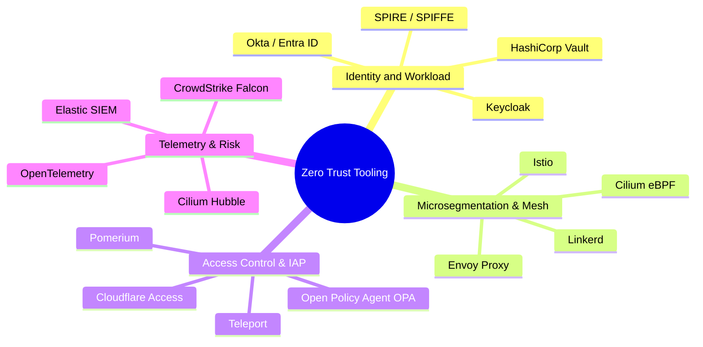

# Zero Trust Architecture References & Standards

> [!NOTE]
> This reference manual consolidates foundational standards, RFC specifications, real-world security incident analyses, and industry-standard open-source tooling for implementing Zero Trust Architecture across enterprise ecosystems.

---

## 1. Governance & Standards Frameworks

* **NIST SP 800-207 (Zero Trust Architecture)**
  * *Publisher*: National Institute of Standards and Technology (NIST)
  * *Overview*: Defines the core logical architecture, Policy Engine (PE), Policy Administrator (PA), and Policy Enforcement Point (PEP) deployment models.
  * *Link*: [NIST SP 800-207 Specification](https://csrc.nist.gov/publications/detail/sp/800-207/final)

* **CISA Zero Trust Maturity Model (ZTMM) Version 2.0**
  * *Publisher*: Cybersecurity and Infrastructure Security Agency (CISA)
  * *Overview*: Establishes four maturity stages (Traditional, Initial, Advanced, Optimal) across five core pillars: Identity, Devices, Networks, Applications/Workloads, and Data.
  * *Link*: [CISA ZTMM 2.0 Guide](https://www.cisa.gov/zero-trust-maturity-model)

* **DoD Zero Trust Reference Architecture v2.0**
  * *Publisher*: U.S. Department of Defense (DoD) CIO
  * *Overview*: Enterprise execution guide outlining 45 core capabilities required to achieve target and advanced Zero Trust readiness.
  * *Link*: [DoD Zero Trust Strategy](https://defense.gov/)

* **Google BeyondCorp Enterprise Vision & Research Papers**
  * *Publisher*: Google Security Engineering (2014–2020)
  * *Overview*: Foundational academic papers (BeyondCorp 1 through 6) detailing Google's shift from VPNs to identity-aware access proxies and continuous device posture evaluation.
  * *Link*: [Google BeyondCorp Research](https://cloud.google.com/beyondcorp)

---

## 2. Technical RFCs & Protocol Specifications

| Standard / RFC | Title / Subject | Key Security Mechanism Introduced |
| :--- | :--- | :--- |
| **RFC 8705** | OAuth 2.0 Mutual-TLS Client Auth & Certificate-Bound Tokens | Cryptographically binds OAuth access tokens to client X.509 certificates to prevent token replay attacks. |
| **RFC 9449** | OAuth 2.0 Demonstrating Proof-of-Possession (DPoP) | Application-layer proof-of-possession mechanism preventing stolen bearer token misuse without requiring TLS layer changes. |
| **OpenID SSF / CAEP** | Continuous Access Evaluation Protocol (CAEP) Specification | Standardizes Security Event Tokens (SETs) for real-time risk sharing and instant cross-system session revocation. |
| **SPIFFE Spec** | Secure Production Identity Framework for Everyone | CNCF standard for issuing URI SPIFFE IDs (`spiffe://`) and short-lived X.509 SVID workloads certificates. |
| **FIDO2 / WebAuthn** | W3C Web Authentication Specification | Hardware-backed public key cryptography standard eliminating passwords and phishing vectors. |

---

## 3. Real-World Breach Case Studies (Perimeter Failures)

### Case Study 1: SolarWinds Supply Chain Pivoting (2020)
* **Root Cause**: Attackers breached build infrastructure and used compromised internal credentials to move laterally across Active Directory subnets and pivot unhindered into Microsoft 365 cloud tenants (Golden SAML attack).
* **Zero Trust Mitigation**: Short-lived SPIFFE/SPIRE workload identities, hardware-bound tokens (mTLS/DPoP), and microsegmentation blocking build servers from reaching cloud management APIs.

### Case Study 2: Colonial Pipeline Ransomware Breach (2021)
* **Root Cause**: A single compromised legacy VPN credential without Multi-Factor Authentication allowed attackers initial entry into the internal network, leading to operational shutdown.
* **Zero Trust Mitigation**: Replacement of perimeter VPNs with Identity-Aware Proxies (IAP), mandatory FIDO2 hardware MFA, and continuous session risk verification.

### Case Study 3: Okta / Lapsus$ Social Engineering Attack (2022)
* **Root Cause**: Compromise of a third-party support contractor's remote desktop session allowed attackers to bypass initial identity checks.
* **Zero Trust Mitigation**: Continuous Access Evaluation Protocol (CAEP) auto-revoking sessions when endpoint posture signals change, and device-bound passkeys.

---

## 4. Open Source & Enterprise Tooling Directory

### Tooling Breakdown

* **Identity & Workload Attestation**:
  * [SPIRE (SPIFFE Runtime Environment)](https://spiffe.io/): CNCF graduated tool for workload identity attestation and SVID issuance.
  * [HashiCorp Vault](https://www.vaultproject.io/): Secrets management and dynamic short-lived cloud credentials engine.
* **Microsegmentation & Networking**:
  * [Cilium](https://cilium.io/): eBPF-driven L3/L4/L7 networking, security, and observability for Kubernetes.
  * [Istio Service Mesh](https://istio.io/): Enterprise mTLS encryption, traffic management, and L7 authorization policy engine.
* **Identity-Aware Proxies & Software Defined Perimeter**:
  * [Pomerium](https://www.pomerium.com/): Open-source identity-aware proxy providing context-aware access control to internal HTTP services.
  * [Teleport](https://goteleport.com/): Identity-aware access plane for SSH servers, Kubernetes clusters, and databases.
  * [Open Policy Agent (OPA)](https://www.openpolicyagent.org/): General-purpose policy engine for fine-grained authorization policies written in Rego.

