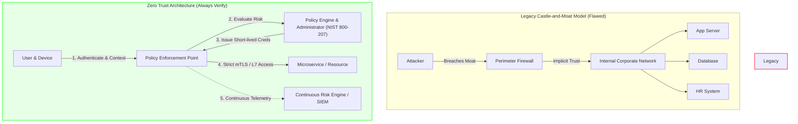

# Zero Trust Architecture (ZTA)

> [!IMPORTANT]
> **Paradigm Shift:** In a Zero Trust model, network location no longer implies trust. Every request—whether originating from an internal workstation, a cloud microservice, or an external mobile client—must be explicitly authenticated, authorized within context, and continuously validated before access is granted.

---

## Executive Overview

Modern enterprise environments are no longer confined within corporate physical boundaries. With the rapid adoption of multi-cloud infrastructure, remote work, SaaS platforms, and mobile endpoints, the traditional "castle-and-moat" security perimeter is dead.

**Zero Trust Architecture (ZTA)** is an enterprise cybersecurity strategy built on the principle that threat actors exist both inside and outside traditional network boundaries. ZTA eliminates implicit trust and enforces strict access controls based on **Identity**, **Device Posture**, **Network Context**, and **Data Sensitivity**.

---

## Core Pillars of Zero Trust

| Pillar | Core Focus | Key Technologies & Mechanisms |
| :--- | :--- | :--- |
| **Identity Trust** | Strong AuthN, least-privilege AuthZ, short-lived credentials | OIDC, OAuth 2.0, SAML 2.0, SPIFFE/SPIRE, FIDO2 WebAuthn |
| **Device Trust** | Endpoint posture evaluation, health attestation | MDM (Intune/Jamf), TPM 2.0, Secure Enclave, EDR integration |
| **Network Microsegmentation** | Restrict lateral movement, software-defined perimeters | Service Mesh (Istio/Linkerd), Cilium eBPF, WireGuard, SDP |
| **Application & Workload** | Microservice-to-microservice trust, API gateway security | Mutual TLS (mTLS), JWT claims validation, Envoy Proxy |
| **Data Protection** | Data classification, encryption at rest/transit, DLP | KMS, Envelope Encryption, DRM, Automated Data Tagging |
| **Telemetry & Automation** | Real-time risk scoring, automated incident response | eBPF, OpenTelemetry, SIEM/SOAR, OpenID CAEP / SSF |

---

## Learning Objectives

By completing this comprehensive guide, you will master:

1. **Theoretical Foundations**: Understand NIST SP 800-207 control plane architectures (PE, PA, PEP) and the decay of implicit trust.
2. **Identity & Device Attestation**: Implement context-aware access policies combining hardware-backed device keys with IdP signals.
3. **Microsegmentation Enforcement**: Configure production-ready Kubernetes NetworkPolicies, Cilium eBPF rules, and Istio mTLS authorization policies.
4. **Continuous Adaptive Trust**: Implement Continuous Access Evaluation Protocol (CAEP) and risk-based dynamic session revocation engines.
5. **Cloud-Native ZTA**: Design enterprise cloud topologies using AWS Verified Access, GCP BeyondCorp, and Azure Conditional Access.
6. **Practical Implementation**: Deploy, exploit, and remediate a fully functional Zero Trust hands-on lab environment.

---

## Navigation & Module Roadmap

| Chapter | Description | Primary Topics | Estimated Time |
| :--- | :--- | :--- | :--- |
| [**01 Introduction**](01-introduction.md) | Architectural foundations & threat dynamics | Castle-and-Moat vs. ZTA, NIST SP 800-207, Root Causes, Lateral Movement | 20 mins |
| [**02 Identity & Device Trust**](02-identity-and-device-trust.md) | Identity-centric security & context evaluation | SPIFFE/SPIRE, WebAuthn, TPM attestation, Python/Node/Go/Java code patterns | 35 mins |
| [**03 Network Microsegmentation**](03-network-microsegmentation.md) | Isolating east-west microservice traffic | Istio mTLS, Cilium L7 eBPF policies, SDP WireGuard topologies | 30 mins |
| [**04 Continuous Verification**](04-continuous-verification-and-telemetry.md) | Real-time telemetry & session lifecycle | CAEP/SSF, risk engines, session revocation, OpenTelemetry logging | 25 mins |
| [**05 Cloud ZTA Architecture**](05-zero-trust-cloud-architecture.md) | Multi-cloud deployment patterns | AWS Verified Access, GCP BeyondCorp, Azure Entra ID, IaC Terraform | 30 mins |
| [**06 Hands-on Lab**](06-hands-on-lab.md) | Practical laboratory & exploit script | Vulnerable perimeter app vs Secure ZTA app, Docker Compose, exploit script | 45 mins |
| [**07 References**](07-references.md) | Standards, CVEs & tool index | NIST 800-207, CISA ZTMM, real-world breaches, SPIRE/Istio documentation | 15 mins |

---

> [!TIP]
> **Recommended Path:** If you are building application-level security controls, begin with **Chapter 02** and **Chapter 03** before tackling the **Chapter 06 Hands-on Lab**. Infrastructure engineers should pay special attention to **Chapter 03** and **Chapter 05**.
