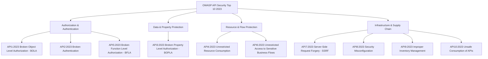

# 01. Overview & OWASP API Top 10

APIs (Application Programming Interfaces) serve as the digital glue connecting modern application ecosystems—powering Single-Page Applications (SPAs), mobile apps, cloud microservices, partner integrations, and IoT devices. While traditional web applications rely on server-side rendering to return rendered HTML pages, modern API-driven architectures directly expose raw business logic and backend database objects over structured formats like JSON, Protocol Buffers, or XML.

This architectural shift fundamentally alters the threat surface: security cannot rely on user interface controls or hidden navigation paths. Every exposed API endpoint represents a direct, programmatically scriptable interface into backend databases and internal microservices.

---

> [!IMPORTANT]
> **Core Principle:** Modern frontend applications (React, Angular, iOS, Android) are untrusted clients. All security boundaries—authentication, fine-grained object-level authorization, input validation, rate limiting, and business logic checks—must be strictly enforced on the server-side within the API logic or at the API Gateway layer.

---

## 1. API vs. Traditional Web App Attack Surface

Understanding the operational paradigm shift between traditional HTML-rendering applications and headless API backend architectures is critical for security auditing and defense.

```
Traditional Server-Rendered Web Application:
┌──────────┐   HTTP GET /profile   ┌────────────────────────────────────────┐
│ Browser  │ ────────────────────► │ Monolithic Web Server                  │
│ Client   │ ◄──────────────────── │ (Queries DB, Renders HTML, Strips Data)│
└──────────┘      HTML Page        └────────────────────────────────────────┘
                                     │ Security enforced during HTML render:
                                     │ Private fields never sent to browser.

Modern Decoupled API Architecture:
┌──────────┐   HTTP GET /api/v1/user/102   ┌─────────────────────────────────┐
│ SPA /    │ ────────────────────────────► │ API Gateway / Microservice      │
│ Mobile   │ ◄──────────────────────────── │ (Queries DB, Returns Raw JSON)  │
└──────────┘      Raw JSON Payload         └─────────────────────────────────┘
                                             │ Exposure: Raw DB objects sent!
                                             │ Client filters UI, but attacker
                                             │ intercepts complete JSON object.
```

### Key Differences & Attack Implications

| Dimension | Traditional Web Application | API-Driven Architecture | Security Risk |
| :--- | :--- | :--- | :--- |
| **Data Format** | Server-side rendered HTML | Raw JSON / XML / Protocol Buffers | APIs often expose entire database objects, relying on client-side JS to render specific fields. |
| **Authentication** | Stateful Session Cookies (`JSESSIONID`, `PHPSESSID`) | Stateless Bearer Tokens (`JWT`), OAuth2, API Keys | Tokens are vulnerable to algorithm manipulation, key confusion, and lack of server-side revocation. |
| **Authorization** | Centralized Role-Based Access Control (RBAC) in web framework | Granular Object & Function-Level Authorization (BOLA/BFLA) | Context missing in microservices leads to broken object-level authorization (BOLA). |
| **Discovery & Automation** | Requires crawling HTML links and submitting forms | Machine-readable schemas (OpenAPI/Swagger, WSDL, GraphQL Introspection) | Attackers can easily discover hidden endpoints, internal parameters, and schema types. |
| **Traffic Patterns** | Human browser navigation | High-frequency programmatic requests | API abuse, credential stuffing, and data scraping can blend in with legitimate mobile/integration traffic. |

---

## 2. OWASP API Security Top 10 (2023 vs. 2019)

The OWASP Foundation updated the API Security Top 10 in 2023 to reflect the evolving threat landscape, consolidating property-level access control and introducing emerging risks such as business flow abuse and third-party API consumption risks.



### OWASP API Top 10 Matrix & Mapping

| Rank (2023) | Vulnerability Category | Core Vulnerability Mechanics | Key 2019 -> 2023 Changes |
| :--- | :--- | :--- | :--- |
| **API1:2023** | **Broken Object Level Authorization (BOLA)** | Accessing objects owned by other users by altering identifiers (`/orders/1001` -> `/orders/1002`). | Remains **#1 risk**. Expanded to cover complex object structures and tenant isolation failures. |
| **API2:2023** | **Broken Authentication** | Weak password policies, unverified JWT signatures, missing token expiration, missing rate limits on auth endpoints. | Formerly API2:2019. Emphasizes token handling, OAuth flaws, and missing MFA. |
| **API3:2023** | **Broken Property Level Authorization (BOPLA)** | Exposing sensitive internal fields in JSON responses or allowing unauthorized object updates via Mass Assignment. | **Merged** Mass Assignment (API6:2019) and Excessive Data Exposure (API3:2019) into a single property-level category. |
| **API4:2023** | **Unrestricted Resource Consumption** | Missing or weak limits on request rates, payload sizes, execution depth, or memory usage causing DoS. | Formerly Lack of Resources & Rate Limiting. Expanded to cover compute, execution timeouts, and storage consumption. |
| **API5:2023** | **Broken Function Level Authorization (BFLA)** | Regular users executing privileged administrative endpoints (`POST /api/v1/admin/users/delete`). | Shifted to #5. Highlights flaws in RBAC/ABAC role check implementation. |
| **API6:2023** | **Unrestricted Access to Sensitive Business Flows** | Automation bots exploiting legitimate business workflows (e.g., ticket scalping, seat holding, gift card checks). | **NEW in 2023**. Focuses on logic abuse rather than technical input flaws. |
| **API7:2023** | **Server-Side Request Forgery (SSRF)** | API endpoints fetching data from user-supplied URLs without validation, targeting internal cloud metadata. | **NEW in 2023**. Exposes internal services (`169.254.169.254`, Kubernetes API) via API request parameters. |
| **API8:2023** | **Security Misconfiguration** | Unhardened HTTP headers, permissive CORS policies (`Access-Control-Allow-Origin: *`), verbose stack traces, unpatched services. | Re-ordered. Includes unencrypted transport (HTTP vs HTTPS) and improper TLS settings. |
| **API9:2023** | **Improper Inventory Management** | Exposed shadow APIs (`/v1/`, `/staging/`, `/internal/`) and zombie APIs running outdated code without security patches. | Formerly Improper Assets Management. Focuses on API contract drift and undocumented routes. |
| **API10:2023**| **Unsafe Consumption of APIs** | Backend services trusting third-party API data without strict sanitization, dynamic query parameter binding, or validation. | **NEW in 2023**. Addresses supply-chain and integrations risks in API-to-API communication. |

---

## 3. Architectural Root Causes of API Vulnerabilities

Why do APIs consistently suffer from severe security flaws despite modern development frameworks? Five core architectural factors contribute:

```
┌─────────────────────────────────────────────────────────────────────────────┐
│                   ARCHITECTURAL ROOT CAUSES OF API FLAWS                    │
├─────────────────────────────────────────────────────────────────────────────┤
│ 1. Decoupled Architecture   ──► Server loses UI state, must validate auth  │
│                                 on EVERY single request and DB lookup.      │
│ 2. Implicit Object Binding  ──► Object Relational Mappers (ORMs) auto-bind │
│                                 JSON inputs directly into database entities.│
│ 3. Distributed Microservices ──► Auth validation delegated to Edge Gateway,  │
│                                 leaving internal APIs unauthenticated.      │
│ 4. Contract Drift           ──► Code changes faster than documentation,     │
│                                 leaving legacy endpoints unmonitored.       │
│ 5. API-to-API Blind Trust   ──► Microservices implicitly trust internal    │
│                                 service calls without sanitization.         │
└─────────────────────────────────────────────────────────────────────────────┘
```

1. **Decoupling of Authorization Logic**: Traditional web apps validate permissions when rendering links or processing forms. In APIs, backend endpoints receive standalone HTTP requests without UI state context. Developers frequently check *authentication* (`Is user logged in?`) but omit *object-level authorization* (`Does user 102 own document 881?`).
2. **Dynamic Serialization and ORM Auto-Binding**: Frameworks like Rails, Spring, Express, and Django provide convenient methods to update database models directly from incoming HTTP request bodies (`User.update(req.body)`). This introduces Mass Assignment vulnerabilities when users supply internal properties (`is_admin`, `tenant_id`, `balance`).
3. **Microservice Perimeter Reliance**: Organizations often enforce authentication at the perimeter API Gateway (e.g., Kong, Nginx) but pass unauthenticated header contexts (`X-User-ID: 102`) to downstream internal microservices. If an attacker bypasses the gateway or exploits SSRF, internal microservices accept requests without verification.

---

## 4. Real-World Breach Case Studies

API security vulnerabilities have led to some of the largest data exfiltrations in history. Evaluating real-world attacks provides critical context for defense design.

### Case Study 1: Optus Data Breach (2022) — Unauthenticated BOLA
- **Mechanism**: Optus exposed an unauthenticated customer identity verification API (`/api/v1/customer/...`). The endpoint identified customer records using a simple sequential integer ID.
- **Impact**: Attackers enumerated customer IDs from `1` to `10,000,000`, exfiltrating sensitive personal data (names, birth dates, phone numbers, passport numbers, and driver's license numbers) for over 9.8 million users.
- **Root Cause**: Total absence of authentication and object-level authorization on API lookup endpoints, combined with predictable sequential identifiers.

### Case Study 2: Twitter Contact Discovery API Scraping (2022) — BOLA / API1
- **Mechanism**: Twitter's phone number and email address lookup API suffered from a BOLA vulnerability. An attacker could submit arbitrary phone numbers or email addresses to the endpoint, which returned the corresponding Twitter User ID and account profile details.
- **Impact**: 5.4 million account records (linking private email addresses and phone numbers to public handles) were scraped and leaked on dark web forums.
- **Root Cause**: Lack of rate limiting on sensitive identity resolution flows, coupled with unrestricted property exposure in API responses.

### Case Study 3: T-Mobile Data Exfiltration (2021 & 2023) — Shadow APIs & BFLA
- **Mechanism**: Attackers identified exposed, undocumented testing endpoints (`/v1/...`) that lacked administrative function-level authorization controls.
- **Impact**: Over 37 million customer records were stolen in 2023, following an 50 million record breach in 2021.
- **Root Cause**: Improper Inventory Management (API9) and Broken Function Level Authorization (API5) on legacy/shadow microservice environments.

---

## 5. API Discovery & Inventory Management

You cannot secure what you do not know exists. API inventory management requires continuous discovery of public, private, internal, and deprecated endpoints.

```
                  ┌─────────────────────────────────────────┐
                  │          API DISCOVERY ENGINE           │
                  └────────────────────┬────────────────────┘
                                       │
        ┌──────────────────────────────┼──────────────────────────────┐
        ▼                              ▼                              ▼
┌──────────────────┐       ┌──────────────────────┐       ┌──────────────────────┐
│ Passive Traffic  │       │ eBPF Kernel Tracing  │       │ Active Discovery     │
│ Inspection       │       │ (Cilium, Pixie)      │       │ (Kiterunner, OWASP   │
│ (WAF, Gateway)   │       │ Detects unmapped POD │       │  ZAP API Scan)       │
└────────┬─────────┘       └──────────┬───────────┘       └──────────┬───────────┘
         │                            │                              │
         └────────────────────────────┼──────────────────────────────┘
                                      ▼
                        ┌────────────────────────────┐
                        │ OpenAPI Contract Drift &   │
                        │ Shadow/Zombie API Matrix   │
                        └────────────────────────────┘
```

### Types of Unmonitored API Assets

1. **Shadow APIs**: Endpoints built by developers for new features, staging, or testing that are deployed to production without registration in the API Gateway or security monitoring catalog.
2. **Zombie APIs**: Old versions of APIs (e.g., `/v1/users`) left running after `/v2/users` is launched. Zombie APIs frequently retain deprecated, vulnerable code paths and lack updated security patches.
3. **Orphaned APIs**: Endpoints whose originating microservices or teams no longer maintain them, leading to unpatched security flaws over time.

> [!TIP]
> **Production Discovery Strategy:** Combine continuous passive traffic analysis (inspecting API gateway logs and eBPF network flows) with active contract validation. Compare live HTTP endpoints against approved OpenAPI/Swagger specifications to automatically flag schema drift and unregistered endpoints.

---

## 6. Hands-On CLI Discovery Command Example

Below is a practical `curl` and `Kiterunner` workflow to perform context-aware discovery of hidden API endpoints:

```bash
# 1. Inspect OpenAPI Spec for exposed routes
curl -s -k https://api.target-app.local/v1/openapi.json | jq '.paths | keys'

# 2. Run Kiterunner to discover hidden API endpoints using API route dictionary
kr scan https://api.target-app.local/ -w routes-large.kite --sc 200,301,302,401,403 -o json

# 3. Probe for version fallback (Zombie API check)
curl -i -X GET https://api.target-app.local/v1/admin/users \
  -H "Authorization: Bearer <user_token>"
```

---

*Next Chapter: [02. BOLA & BFLA Masterclass →](02-bola-and-bfla.md)*
