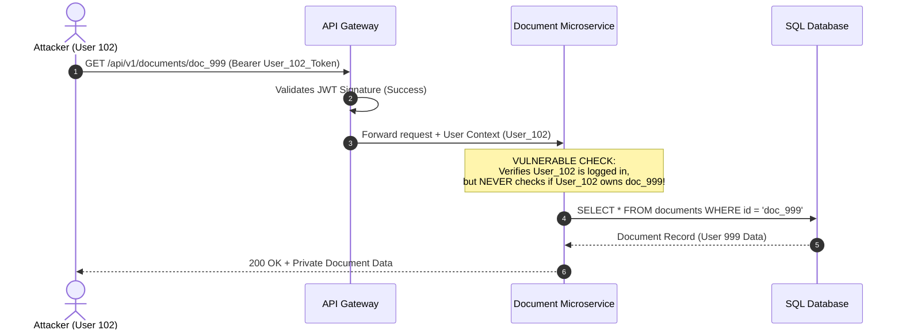

# 02. BOLA & BFLA Masterclass

Broken Object Level Authorization (**BOLA / API1**), Broken Function Level Authorization (**BFLA / API5**), and Broken Property Level Authorization (**BOPLA / API3**) consistently account for over 50% of critical security findings in modern API security assessments.

This chapter provides a deep-dive technical mechanics breakdown, exploit payloads, and robust side-by-side vulnerable vs. secure production code examples across **Node.js, Python, Go, and Java**.

---

## 1. BOLA (Broken Object Level Authorization)

### Technical Mechanics

BOLA (historically known as Insecure Direct Object Reference or IDOR) occurs when an API endpoint accepts an object identifier in the request URL, headers, or body, and accesses or modifies the target database resource **without verifying that the requesting user has explicit ownership or access rights to that specific resource**.

```
Attacker Request (User ID: 102):
GET /api/v1/documents/doc_8841 HTTP/1.1
Host: api.bank.com
Authorization: Bearer <User_102_JWT>

Vulnerable API Server Logic:
1. Decode JWT -> Authenticated as User 102.
2. Query DB: SELECT * FROM documents WHERE id = 'doc_8841';
3. Return document object! (FAIL: Document doc_8841 belongs to User 999!)
```



### Common BOLA Vectors & Edge Cases

1. **Predictable Identifiers**: Auto-incrementing integer IDs (`/users/1001`, `/users/1002`). Attackers enumerate all users via automated scripts.
2. **UUID Misconception**: Replacing integer IDs with random UUIDv4 identifiers (`/users/550e8400-e29b-41d4-a716-446655440000`) does **not** fix BOLA. UUIDs frequently leak in secondary API responses, audit logs, public forum posts, or WebSocket events.
3. **Nested Resource Paths**: Developers often check parent object authorization but forget child object authorization:
   - Request: `GET /api/v1/tenants/tenant_A/documents/doc_B`
   - If `doc_B` belongs to `tenant_B`, the server may return `doc_B` because it verified access to `tenant_A` without checking if `doc_B` belongs to `tenant_A`.
4. **Verb Tampering**: BOLA on mutating operations (`PUT /api/v1/orders/102`, `DELETE /api/v1/orders/102`) allows attackers to alter or erase data belonging to third parties.

---

### BOLA Code Implementation Matrix

#### A. Node.js (Express & Prisma / Mongoose)

❌ **Vulnerable (Express)**
```javascript
// VULNERABLE: Retrieves invoice directly by ID parameter without ownership filtering
app.get('/api/v1/invoices/:invoiceId', verifyJWT, async (req, res) => {
  const invoice = await prisma.invoice.findUnique({
    where: { id: req.params.invoiceId }
  });
  
  if (!invoice) return res.status(404).json({ error: "Invoice not found" });
  res.json(invoice);
});
```

✅ **Secure (Express)**
```javascript
// SECURE: Binds both invoiceId AND req.user.id into database query boundary
app.get('/api/v1/invoices/:invoiceId', verifyJWT, async (req, res) => {
  const invoice = await prisma.invoice.findFirst({
    where: {
      id: req.params.invoiceId,
      userId: req.user.id // Strict ownership boundary check
    }
  });

  if (!invoice) {
    // Return 404 to avoid leaking existence of objects owned by others
    return res.status(404).json({ error: "Invoice not found" });
  }
  res.json(invoice);
});
```

#### B. Python (Flask & SQLAlchemy)

❌ **Vulnerable (Flask)**
```python
# VULNERABLE: Queries object directly by URL parameter
@app.route('/api/v1/accounts/<account_id>', methods=['GET'])
@jwt_required()
def get_account(account_id):
    account = Account.query.get(account_id)
    if not account:
        return jsonify({"error": "Account not found"}), 404
    return jsonify(account.to_dict())
```

✅ **Secure (Flask)**
```python
# SECURE: Explicit Filter by authenticated user identity
@app.route('/api/v1/accounts/<account_id>', methods=['GET'])
@jwt_required()
def get_account_secure(account_id):
    current_user_id = get_jwt_identity()
    
    account = Account.query.filter_by(
        id=account_id,
        user_id=current_user_id # Explicit ownership enforcement
    ).first()

    if not account:
        return jsonify({"error": "Account not found"}), 404
        
    return jsonify(account.to_dict())
```

#### C. Go (Gin & GORM)

❌ **Vulnerable (Go)**
```go
// VULNERABLE: Fetches order using URL ID parameter only
func GetOrder(c *gin.Context) {
    orderID := c.Param("id")
    var order Order
    
    if err := db.First(&order, "id = ?", orderID).Error; err != nil {
        c.JSON(404, gin.H{"error": "Order not found"})
        return
    }
    c.JSON(200, order)
}
```

✅ **Secure (Go)**
```go
// SECURE: Enforces userID from context in GORM query
func GetOrderSecure(c *gin.Context) {
    orderID := c.Param("id")
    userID, _ := c.Get("userID") // Set by AuthMiddleware

    var order Order
    err := db.Where("id = ? AND user_id = ?", orderID, userID).First(&order).Error
    if err != nil {
        c.JSON(404, gin.H{"error": "Order not found"})
        return
    }
    c.JSON(200, order)
}
```

#### D. Java (Spring Boot & JPA Repository)

❌ **Vulnerable (Java)**
```java
// VULNERABLE: Retrieves object directly from repository using path variable
@GetMapping("/api/v1/reports/{id}")
public ResponseEntity<Report> getReport(@PathVariable String id) {
    return reportRepository.findById(id)
            .map(ResponseEntity::ok)
            .orElse(ResponseEntity.notFound().build());
}
```

✅ **Secure (Java)**
```java
// SECURE: Queries repository with combined ID and User Principal
@GetMapping("/api/v1/reports/{id}")
public ResponseEntity<Report> getReportSecure(
        @PathVariable String id, 
        Principal principal) {
    
    String currentUserId = principal.getName();
    
    return reportRepository.findByIdAndUserId(id, currentUserId)
            .map(ResponseEntity::ok)
            .orElse(ResponseEntity.notFound().build());
}
```

---

## 2. BFLA (Broken Function Level Authorization)

### Technical Mechanics

BFLA occurs when sensitive administrative endpoints or privileged functional operations fail to enforce proper Role-Based Access Control (RBAC) or Attribute-Based Access Control (ABAC) permissions.

```
Regular User Request:
DELETE /api/v1/admin/users/usr_999 HTTP/1.1
Host: api.enterprise.com
Authorization: Bearer <Regular_User_JWT>

Vulnerable Middleware Chain:
[ Authenticate Token ] ──► OK (Valid user token!)
[ Check User Role ]   ──► MISSING / BYPASSED!
[ Execute Action ]    ──► Deletes Userusr_999!
```

### Common BFLA Attack Vectors

1. **URL Path Traversal / Case Sensitivity**:
   - Authorized: `GET /api/v1/user/profile` (Allowed for Regular Users)
   - Attack Payload: `POST /api/v1/Admin/deleteUser` or `POST /api/v1/user/../admin/deleteUser`
2. **HTTP Method Swapping**:
   - `GET /api/v1/users` (Allowed to list public profiles)
   - `DELETE /api/v1/users` (Admin action exposed on same path due to missing method verb permission check).
3. **Administrative Header Injection**:
   - Injecting headers like `X-Original-URL: /admin/export` or `X-Admin-Role: true` to trick proxy gateways.

---

### BFLA Code Implementation Matrix

#### A. Node.js (Express Middleware)

❌ **Vulnerable (Express)**
```javascript
// VULNERABLE: Only verifies if user is authenticated, does not check role!
app.delete('/api/v1/admin/users/:id', verifyJWT, async (req, res) => {
  await db.user.delete({ where: { id: req.params.id } });
  res.json({ message: "User deleted" });
});
```

✅ **Secure (Express)**
```javascript
// SECURE: Role verification middleware step
const requireRole = (requiredRole) => {
  return (req, res, next) => {
    if (!req.user || req.user.role !== requiredRole) {
      return res.status(403).json({ error: "Forbidden: Insufficient privileges" });
    }
    next();
  };
};

app.delete('/api/v1/admin/users/:id', verifyJWT, requireRole('ADMIN'), async (req, res) => {
  await db.user.delete({ where: { id: req.params.id } });
  res.json({ message: "User deleted successfully" });
});
```

#### B. Python (Flask Decorators)

❌ **Vulnerable (Flask)**
```python
# VULNERABLE: Login required but no role check
@app.route('/api/v1/admin/export', methods=['POST'])
@login_required
def export_database():
    return send_file(generate_db_dump())
```

✅ **Secure (Flask)**
```python
# SECURE: Fine-grained RBAC decorator
def require_roles(*roles):
    def decorator(f):
        @wraps(f)
        def decorated_function(*args, **kwargs):
            if current_user.role not in roles:
                return jsonify({"error": "Forbidden: Access denied"}), 403
            return f(*args, **kwargs)
        return decorated_function
    return decorator

@app.route('/api/v1/admin/export', methods=['POST'])
@login_required
@require_roles('ADMIN', 'SYSTEM_AUDITOR')
def export_database_secure():
    return send_file(generate_db_dump())
```

#### C. Go (Gin Middleware)

❌ **Vulnerable (Go)**
```go
// VULNERABLE: Group route lacks role verification
adminGroup := r.Group("/api/v1/admin")
adminGroup.Use(AuthMiddleware()) // Only checks authentication
adminGroup.DELETE("/users/:id", DeleteUserHandler)
```

✅ **Secure (Go)**
```go
// SECURE: RequireRole middleware checks user claim
func RequireRole(requiredRole string) gin.HandlerFunc {
    return func(c *gin.Context) {
        userRole, exists := c.Get("userRole")
        if !exists || userRole.(string) != requiredRole {
            c.JSON(403, gin.H{"error": "Forbidden: Requires " + requiredRole + " role"})
            c.Abort()
            return
        }
        c.Next()
    }
}

adminGroup := r.Group("/api/v1/admin")
adminGroup.Use(AuthMiddleware(), RequireRole("ADMIN"))
adminGroup.DELETE("/users/:id", DeleteUserHandler)
```

#### D. Java (Spring Security PreAuthorize)

❌ **Vulnerable (Java)**
```java
// VULNERABLE: No method-level security annotation
@RestController
@RequestMapping("/api/v1/admin")
public class AdminController {
    @DeleteMapping("/users/{id}")
    public ResponseEntity<Void> deleteUser(@PathVariable String id) {
        userService.deleteUser(id);
        return ResponseEntity.noContent().build();
    }
}
```

✅ **Secure (Java)**
```java
// SECURE: Spring Security @PreAuthorize role enforcement
@RestController
@RequestMapping("/api/v1/admin")
public class AdminController {
    @DeleteMapping("/users/{id}")
    @PreAuthorize("hasRole('ROLE_ADMIN')") // Strict Role Check
    public ResponseEntity<Void> deleteUserSecure(@PathVariable String id) {
        userService.deleteUser(id);
        return ResponseEntity.noContent().build();
    }
}
```

---

## 3. BOPLA (Broken Property Level Authorization) & Mass Assignment

### Technical Mechanics

BOPLA (OWASP API3:2023) unifies **Mass Assignment** and **Excessive Data Exposure**. It occurs when an API allows users to read or modify properties of an object that they should not have access to.

```
Attacker Request (Attempting Privilege Escalation):
PUT /api/v1/profile HTTP/1.1
Host: api.target.com
Content-Type: application/json
Authorization: Bearer <User_Token>

{
  "username": "attacker_bob",
  "email": "bob@evil.com",
  "is_admin": true,          <-- MASS ASSIGNMENT ATTACK FIELD
  "account_balance": 999999   <-- MASS ASSIGNMENT ATTACK FIELD
}
```

```
Vulnerable Server Processing:
user.update(req.body); // Automatically binds ALL JSON keys to User database model!
```

---

### BOPLA / Mass Assignment Code Implementation Matrix

#### A. Node.js (DTO / Allowlist Pattern)

❌ **Vulnerable (Express)**
```javascript
// VULNERABLE: Over-binds request body into DB update
app.put('/api/v1/profile', verifyJWT, async (req, res) => {
  const updatedUser = await prisma.user.update({
    where: { id: req.user.id },
    data: req.body // DANGEROUS! Accepts is_admin, role, balance
  });
  res.json(updatedUser);
});
```

✅ **Secure (Express with Zod Schema Validation DTO)**
```javascript
import { z } from 'zod';

// SECURE: Define strict Data Transfer Object (DTO) schema
const UpdateProfileSchema = z.object({
  username: z.string().min(3).max(30).optional(),
  bio: z.string().max(500).optional(),
  phoneNumber: z.string().optional()
}).strict(); // Reject unexpected properties!

app.put('/api/v1/profile', verifyJWT, async (req, res) => {
  const result = UpdateProfileSchema.safeParse(req.body);
  if (!result.success) {
    return res.status(400).json({ error: "Invalid payload properties" });
  }

  const updatedUser = await prisma.user.update({
    where: { id: req.user.id },
    data: result.data // Only allowlisted properties updated!
  });
  
  res.json(updatedUser);
});
```

#### B. Python (Flask Allowlisting)

❌ **Vulnerable (Flask)**
```python
# VULNERABLE: Dynamic setattr on User model
@app.route('/api/v1/profile', methods=['PUT'])
@login_required
def update_profile():
    data = request.get_json()
    for key, value in data.items():
        setattr(current_user, key, value) # Dangerous!
    db.session.commit()
    return jsonify(current_user.to_dict())
```

✅ **Secure (Flask Allowlist)**
```python
# SECURE: Explicit field extraction
ALLOWED_FIELDS = {'username', 'bio', 'phone_number'}

@app.route('/api/v1/profile', methods=['PUT'])
@login_required
def update_profile_secure():
    data = request.get_json() or {}
    
    for field in ALLOWED_FIELDS:
        if field in data:
            setattr(current_user, field, data[field])
            
    db.session.commit()
    return jsonify(current_user.to_public_dict()) # Excludes password_hash, is_admin
```

#### C. Go (Gin Struct Tags)

❌ **Vulnerable (Go)**
```go
// VULNERABLE: Binding directly to main DB Struct
type User struct {
    ID       uint   `json:"id"`
    Username string `json:"username"`
    IsAdmin  bool   `json:"is_admin"` // Exposed to JSON binding!
}

func UpdateProfile(c *gin.Context) {
    var user User
    c.ShouldBindJSON(&user) // Binds is_admin if present in JSON!
    db.Model(&user).Updates(user)
}
```

✅ **Secure (Go Separate DTO Struct)**
```go
// SECURE: Separate input DTO without sensitive fields
type UpdateProfileDTO struct {
    Username string `json:"username" binding:"omitempty,min=3,max=30"`
    Bio      string `json:"bio" binding:"omitempty,max=500"`
}

func UpdateProfileSecure(c *gin.Context) {
    userID, _ := c.Get("userID")
    var dto UpdateProfileDTO
    
    if err := c.ShouldBindJSON(&dto); err != nil {
        c.JSON(400, gin.H{"error": err.Error()})
        return
    }

    db.Model(&User{}).Where("id = ?", userID).Updates(map[string]interface{}{
        "username": dto.Username,
        "bio":      dto.Bio,
    })
    c.JSON(200, gin.H{"message": "Profile updated successfully"})
}
```

#### D. Java (Spring Jackson Views / Dedicated DTOs)

❌ **Vulnerable (Java)**
```java
// VULNERABLE: Direct entity binding in RequestBody
@PutMapping("/api/v1/profile")
public ResponseEntity<User> updateProfile(@RequestBody User userPayload, Principal principal) {
    User currentUser = userService.findByUsername(principal.getName());
    BeanUtils.copyProperties(userPayload, currentUser, "id"); // Overwrites isAdmin!
    userService.save(currentUser);
    return ResponseEntity.ok(currentUser);
}
```

✅ **Secure (Java DTO Mapping)**
```java
// SECURE: Dedicated Request DTO class
public record UpdateProfileRequest(
    @NotBlank @Size(min = 3, max = 30) String username,
    @Size(max = 500) String bio
) {}

@PutMapping("/api/v1/profile")
public ResponseEntity<UserProfileResponse> updateProfileSecure(
        @Valid @RequestBody UpdateProfileRequest request, 
        Principal principal) {
        
    User currentUser = userService.findByUsername(principal.getName());
    currentUser.setUsername(request.username());
    currentUser.setBio(request.bio());
    
    User saved = userService.save(currentUser);
    return ResponseEntity.ok(UserProfileResponse.fromEntity(saved));
}
```

---

## 4. Summary Checklist for BOLA, BFLA & BOPLA Defense

> [!CHECKLIST]
> - [ ] **Enforce Ownership Boundaries**: Never rely on `req.params.id` alone. Query database with `WHERE id = :id AND user_id = :auth_user_id`.
> - [ ] **Implement Centralized RBAC/ABAC**: Apply explicit role check decorators or middleware on every sensitive endpoint.
> - [ ] **Use Strict DTOs**: Never bind incoming HTTP JSON bodies directly to ORM models.
> - [ ] **Never Rely on Client-Side Hiding**: API endpoints must filter returned object fields on the server-side before serializing JSON.
> - [ ] **Return 404 Instead of 403 on BOLA**: Avoid revealing whether an object ID exists when an unauthorized user queries it.

---

*Next Chapter: [03. GraphQL & gRPC Security →](03-graphql-and-grpc-security.md)*
