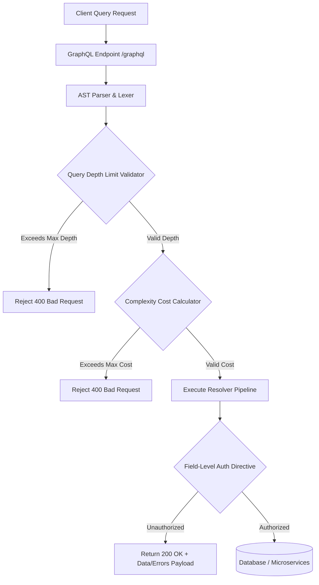

# 03. GraphQL & gRPC Security

As engineering teams adopt **GraphQL** for flexible data querying and **gRPC** for low-latency microservice communications, security models must adapt beyond traditional REST HTTP verb and endpoint patterns. Both protocols introduce unique architectural attack surfaces that require protocol-specific hardening.

---

## 1. GraphQL Security Architecture

Unlike REST APIs that expose discrete endpoints (`/api/v1/users`, `/api/v1/orders`), GraphQL operates through a single endpoint (typically `/graphql`), processing flexible query payloads against a unified Abstract Syntax Tree (AST).



---

### A. Introspection Disclosure & Schema Hardening

GraphQL introspection enables clients to query `__schema` and `__type` meta-fields, retrieving the complete object schema, input parameters, hidden admin fields, and deprecated queries.

#### GraphQL Introspection Exploit Payload
```graphql
# Introspection Query to map complete backend schema
query IntrospectSchema {
  __schema {
    queryType { name }
    mutationType { name }
    types {
      name
      kind
      fields {
        name
        type { name kind }
        args { name type { name } }
      }
    }
  }
}
```

> [!WARNING]
> While introspection is invaluable during development, leaving it enabled in production exposes internal data structures, administrative mutations, and unreleased feature flags to adversaries.

#### Production Introspection Disabling Code

##### Node.js (Apollo Server v4)
```javascript
import { ApolloServer } from '@apollo/server';
import { ApolloServerPluginDisableIntrospection } from '@apollo/server/plugin/disableIntrospection';

const server = new ApolloServer({
  typeDefs,
  resolvers,
  // Disable introspection conditionally in production
  plugins: process.env.NODE_ENV === 'production' 
    ? [ApolloServerPluginDisableIntrospection()] 
    : [],
});
```

##### Python (Strawberry GraphQL / FastAPI)
```python
from strawberry.fastapi import GraphQLRouter
import strawberry

@strawberry.type
class Query:
    @strawberry.field
    def hello(self) -> str:
        return "Hello World"

schema = strawberry.Schema(query=Query)

# Disable introspection in production environment
graphql_app = GraphQLRouter(
    schema,
    introspection=process.env.get("ENV") != "production"
)
```

##### Go (gqlgen)
```go
package main

import (
    "github.com/99designs/gqlgen/graphql/handler"
    "github.com/99designs/gqlgen/graphql/handler/extension"
)

func NewGraphQLHandler(es graphql.ExecutableSchema, isProd bool) *handler.Server {
    srv := handler.NewDefaultServer(es)
    if isProd {
        // Introspection is enabled by default in gqlgen; remove or block plugin
        // Do not add srv.Use(extension.Introspection{}) in production!
    } else {
        srv.Use(extension.Introspection{})
    }
    return srv
}
```

##### Java (Spring Boot GraphQL)
```yaml
# application.yml - Disable Introspection in Production
spring:
  graphql:
    schema:
      introspection:
        enabled: false # Set to false for production profile
```

---

### B. Query Depth & Complexity DoS Attacks

Because GraphQL fields can be recursively nested, an attacker can submit a deeply nested query causing server CPU and memory exhaustion:

```graphql
# Recursive Query Depth DoS Payload
query RecursiveDoS {
  user {
    friends {
      friends {
        friends {
          friends {
            friends {
              name
            }
          }
        }
      }
    }
  }
}
```

#### Query Depth & Cost Calculation Solutions

1. **Depth Limiting**: Restricts the maximum nesting level of a query (e.g., max depth = 5).
2. **Complexity Analysis**: Assigns a numeric cost to each field (e.g., scalar fields = 1, collection fields = 10 multiplied by `first`/`limit` arguments).

##### Node.js Depth Limiting (`graphql-depth-limit`)
```javascript
import depthLimit from 'graphql-depth-limit';
import { ApolloServer } from '@apollo/server';

const server = new ApolloServer({
  typeDefs,
  resolvers,
  validationRules: [
    depthLimit(5, { ignore: ['_id'] }) // Enforce maximum depth of 5
  ]
});
```

##### Go Depth & Complexity Limiting (`gqlgen`)
```go
import (
    "github.com/99designs/gqlgen/graphql/handler"
    "github.com/99designs/gqlgen/graphql/handler/extension"
)

func ConfigureServer(es graphql.ExecutableSchema) *handler.Server {
    srv := handler.NewDefaultServer(es)
    
    // 1. Enforce Max Query Depth
    srv.Use(extension.FixedComplexityLimit(200)) // Max cost score
    
    return srv
}
```

##### Python Complexity Guard (`graphene-django` / `strawberry`)
```python
from strawberry.extensions import MaxTokensLimiter, MaxAliasesLimiter

schema = strawberry.Schema(
    query=Query,
    extensions=[
        MaxTokensLimiter(max_tokens=1000),
        MaxAliasesLimiter(max_aliases=10),
    ]
)
```

---

### C. GraphQL Batching Attacks

GraphQL supports query batching via **HTTP Array Batching** or **Alias Batching**. Attackers use batching to execute hundreds of operations in a single HTTP request, effectively bypassing IP-based rate limiters and Web Application Firewalls (WAFs).

```
Traditional REST Auth Request:
1 HTTP Request = 1 Login Attempt (Trigger Rate Limiter after 5 attempts)

GraphQL Alias Batching Attack:
1 HTTP Request = 1,000 Login Attempts (Bypasses IP Rate Limiting!)
```

```graphql
# Alias Batching Attack Payload - Bypassing Rate Limits
mutation BruteForceMFA {
  attempt1: verifyMFA(code: "0001") { success token }
  attempt2: verifyMFA(code: "0002") { success token }
  attempt3: verifyMFA(code: "0003") { success token }
  # ... Up to 1,000 aliases in a single HTTP POST request
}
```

> [!CAUTION]
> **Mitigation for Batching Attacks:**
> 1. Disable HTTP Array Batching at the API Gateway or GraphQL engine middleware.
> 2. Enforce a strict **Max Alias Limit** (e.g., maximum 5 aliases per query).
> 3. Enforce cost analysis that multiplies complexity per alias executed.

---

## 2. gRPC & Protocol Buffers Security

gRPC uses **HTTP/2** as its transport protocol and **Protocol Buffers (Protobuf)** as its binary serialization mechanism, offering performance advantages over REST/JSON. However, HTTP/2 framing and binary serialization present unique security considerations.

```
┌─────────────────────────────────────────────────────────────────────────────┐
│                           gRPC SECURITY STACK                               │
├─────────────────────────────────────────────────────────────────────────────┤
│ Application Layer  ──► Protobuf Messages (Field validation, sanitization)   │
│ Context / Auth     ──► Metadata Interceptors (JWT Bearer Token / OAuth2)    │
│ Transport Layer    ──► HTTP/2 Framing (Multiplexing, Flow Control, Headers) │
│ Encryption Layer   ──► Mutual TLS (mTLS) with SAN / SPIFFE Verification    │
└─────────────────────────────────────────────────────────────────────────────┘
```

---

### A. gRPC Metadata Authentication Interceptors

In gRPC, authorization credentials (such as OAuth2 access tokens or JWTs) are transmitted inside **gRPC Metadata** (HTTP/2 header key-value pairs). Servers must enforce unary and streaming server interceptors to validate tokens before handling requests.

#### Go gRPC Unary Server Interceptor
```go
package interceptors

import (
    "context"
    "strings"
    "google.golang.org/grpc"
    "google.golang.org/grpc/codes"
    "google.golang.org/grpc/metadata"
    "google.golang.org/grpc/status"
)

// UnaryAuthInterceptor validates JWT in gRPC incoming metadata
func UnaryAuthInterceptor(
    ctx context.Context,
    req interface{},
    info *grpc.UnaryServerInfo,
    handler grpc.UnaryHandler,
) (interface{}, error) {
    
    md, ok := metadata.FromIncomingContext(ctx)
    if !ok {
        return nil, status.Errorf(codes.Unauthenticated, "Missing metadata context")
    }

    values := md["authorization"]
    if len(values) == 0 {
        return nil, status.Errorf(codes.Unauthenticated, "Missing authorization token")
    }

    tokenStr := strings.TrimPrefix(values[0], "Bearer ")
    userClaims, err := validateJWTToken(tokenStr)
    if err != nil {
        return nil, status.Errorf(codes.Unauthenticated, "Invalid or expired token: %v", err)
    }

    // Attach validated claims to context for downstream handlers
    newCtx := context.WithValue(ctx, "userClaims", userClaims)
    return handler(newCtx, req)
}
```

#### Java gRPC ServerInterceptor (Spring Boot / gRPC Java)
```java
package com.appsec.grpc.interceptor;

import io.grpc.*;
import io.jsonwebtoken.Claims;
import io.jsonwebtoken.Jwts;

public class JwtServerInterceptor implements ServerInterceptor {

    private static final Metadata.Key<String> AUTHORIZATION_METADATA_KEY =
            Metadata.Key.of("authorization", Metadata.ASCII_STRING_MARSHALLER);

    @Override
    public <ReqT, RespT> ServerCall.Listener<ReqT> interceptCall(
            ServerCall<ReqT, RespT> call,
            Metadata headers,
            ServerCallHandler<ReqT, RespT> next) {

        String authHeader = headers.get(AUTHORIZATION_METADATA_KEY);
        if (authHeader == null || !authHeader.startsWith("Bearer ")) {
            call.close(Status.UNAUTHENTICATED.withDescription("Missing Bearer token"), headers);
            return new ServerCall.Listener<ReqT>() {};
        }

        String token = authHeader.substring(7);
        try {
            Claims claims = validateToken(token);
            Context context = Context.current().withValue(USER_CLAIMS_KEY, claims);
            return Contexts.interceptCall(context, call, headers, next);
        } catch (Exception e) {
            call.close(Status.UNAUTHENTICATED.withDescription("Invalid JWT Token"), headers);
            return new ServerCall.Listener<ReqT>() {};
        }
    }
}
```

---

### B. Mutual TLS (mTLS) for gRPC Channels

Because gRPC relies heavily on inter-service microservice communication, enforcing **Mutual TLS (mTLS)** ensures that both client and server authenticate each other's X.509 certificates before initiating gRPC streams.

#### Go gRPC Server with mTLS Configuration
```go
package main

import (
    "crypto/tls"
    "crypto/x509"
    "os"
    "google.golang.org/grpc"
    "google.golang.org/grpc/credentials"
)

func LoadTLSCredentials() (credentials.TransportCredentials, error) {
    // 1. Load Server Certificate & Key
    serverCert, err := tls.LoadX509KeyPair("server.crt", "server.key")
    if err != nil {
        return nil, err
    }

    // 2. Load CA Certificate to verify client certs
    pemClientCA, err := os.ReadFile("ca.crt")
    if err != nil {
        return nil, err
    }

    certPool := x509.NewCertPool()
    if !certPool.AppendCertsFromPEM(pemClientCA) {
        return nil, err
    }

    // 3. Create TLS config requiring Mutual TLS (RequireAndVerifyClientCert)
    config := &tls.Config{
        Certificates: []tls.Certificate{serverCert},
        ClientAuth:   tls.RequireAndVerifyClientCert,
        ClientCAs:    certPool,
        MinVersion:   tls.VersionTLS13, // Enforce TLS 1.3
    }

    return credentials.NewTLS(config), nil
}

func main() {
    creds, _ := LoadTLSCredentials()
    grpcServer := grpc.NewServer(grpc.Creds(creds))
    // Register gRPC services...
}
```

---

### C. HTTP/2 Specific Vector: Rapid Reset (CVE-2023-44487)

gRPC servers are vulnerable to HTTP/2 stream attacks, such as the **HTTP/2 Rapid Reset** vulnerability. Attackers send a stream of `RST_STREAM` frames immediately after opening `HEADERS` frames, causing high server CPU utilization without triggering traditional concurrent stream limiters.

> [!IMPORTANT]
> **HTTP/2 Mitigation:**
> - Upgrade gRPC runtime libraries (`grpc-go`, `grpc-java`, `grpc-node`) to versions released after October 2023.
> - Configure `MAX_CONCURRENT_STREAMS` and limit the rate of incoming reset frames at the ingress load balancer (Envoy, Nginx, or AWS ALB).

---

*Next Chapter: [04. Rate Limiting, Throttling & Auth →](04-rate-limiting-and-throttling.md)*
