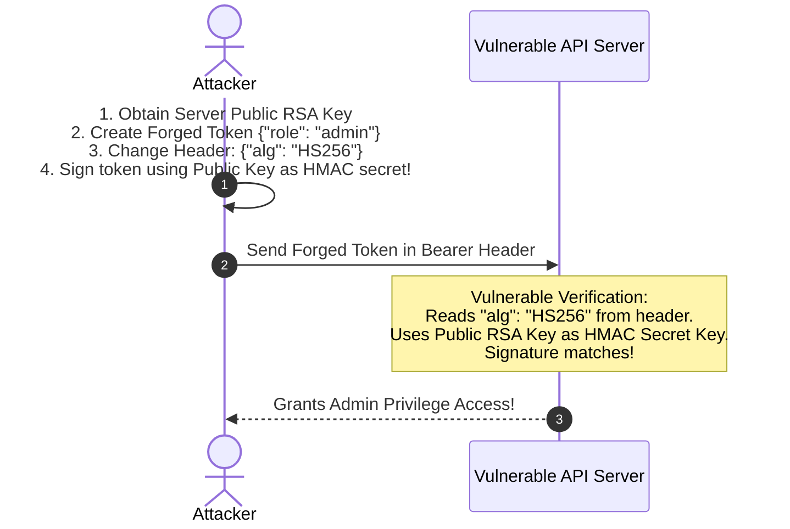
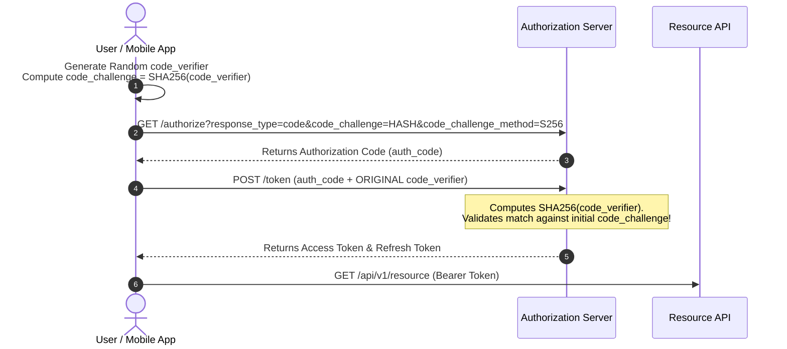

# 04. Rate Limiting, Throttling & Auth

Unrestricted resource consumption (**OWASP API4:2023**) and broken authentication (**OWASP API2:2023**) allow adversaries to execute brute-force credential stuffing, API scraping, service degradation, and token tampering attacks.

This chapter covers algorithm trade-offs, atomic distributed rate-limiting implementations using **Redis and Lua scripts**, JWT exploitation mechanics, and OAuth2 security patterns across **Node.js, Python, Go, and Java**.

---

## 1. Rate Limiting Algorithm Comparison

Selecting the right rate-limiting algorithm requires balancing memory consumption, computational overhead, and precision requirements.

```
                     ┌──────────────────────────────────────┐
                     │     RATE LIMITING ALGORITHMS         │
                     └──────────────────┬───────────────────┘
                                        │
      ┌─────────────────┬───────────────┴───────────────┬─────────────────┐
      ▼                 ▼                               ▼                 ▼
┌──────────────┐  ┌──────────────┐              ┌──────────────┐   ┌──────────────┐
│ Token Bucket │  │ Leaky Bucket │              │ Fixed Window │   │ Sliding      │
│ (Allows      │  │ (Smooths out │              │ (Simple, risk│   │ Window Log / │
│  bursts)     │  │  bursts)     │              │  of spike)   │   │ Counter      │
└──────────────┘  └──────────────┘              └──────────────┘   └──────────────┘
```

| Algorithm | Mechanism | Burst Handling | Memory Overhead | Precision | Recommended Use Case |
| :--- | :--- | :--- | :--- | :--- | :--- |
| **Token Bucket** | Tokens added to bucket at constant rate. Request consumes 1 token. | Excellent (up to max capacity) | Low (`$O(1)$` per key) | High | General API Gateway rate limiting (Kong, Envoy). |
| **Leaky Bucket** | Requests enter FIFO queue and process at a fixed constant rate. | Smooths out bursts into steady stream | Medium (`$O(N)$` queue size) | High | Background job processing, payment gateway calls. |
| **Fixed Window** | Counts requests in fixed time frames (e.g., 00:00-00:01). | Poor (2x burst traffic at boundary) | Very Low (`$O(1)$` integer counter) | Low | Basic IP throttling for public static assets. |
| **Sliding Window Log**| Stores timestamp logs of every request in sorted set (`ZSET`). | Perfect (Eliminates boundary spikes) | High (`$O(N)$` request logs stored) | Maximum | High-security financial APIs, login endpoints. |
| **Sliding Window Counter**| Combines previous and current window counts via weighted ratio. | Good (Smooths boundary spikes) | Low (`$O(1)$` per key) | High | Enterprise distributed API rate limiters. |

---

## 2. Distributed Sliding Window Rate Limiting (Redis + Lua)

### The Race Condition Problem

A common mistake is performing non-atomic operations in application code:
```python
# VULNERABLE: Race condition in concurrent multi-threaded environments!
count = redis.get(key)
if count > 100:
    return 429
redis.incr(key) # Thread interleaving causes count to exceed limit!
```

### Production Atomic Redis Lua Script

Using a Redis Lua script guarantees **atomicity** on the Redis single-threaded execution model, preventing race conditions.

```lua
-- atomic_sliding_window.lua
-- KEYS[1]: Rate limit key (e.g., "rate_limit:user_102")
-- ARGV[1]: Current timestamp in milliseconds
-- ARGV[2]: Window size in milliseconds (e.g., 60000 for 1 minute)
-- ARGV[3]: Maximum allowed requests in window (e.g., 100)

local key = KEYS[1]
local now = tonumber(ARGV[1])
local window_start = now - tonumber(ARGV[2])
local max_limit = tonumber(ARGV[3])

-- 1. Remove expired timestamps outside window
redis.call('ZREMRANGEBYSCORE', key, 0, window_start)

-- 2. Count requests in current window
local current_requests = redis.call('ZCARD', key)

if current_requests >= max_limit then
    return 0 -- Rejected (Rate limit exceeded)
end

-- 3. Add current request timestamp to ZSET
redis.call('ZADD', key, now, now)

-- 4. Set TTL on key to auto-expire
redis.call('PEXPIRE', key, ARGV[2])

return 1 -- Allowed
```

---

### Implementation Code Matrix (Redis Sliding Window)

#### A. Node.js (Redis ioredis)
```javascript
import Redis from 'ioredis';
const redis = new Redis(process.env.REDIS_URL);

const LUA_SLIDING_WINDOW = `
  local key = KEYS[1]
  local now = tonumber(ARGV[1])
  local window_start = now - tonumber(ARGV[2])
  local max_limit = tonumber(ARGV[3])

  redis.call('ZREMRANGEBYSCORE', key, 0, window_start)
  local current_requests = redis.call('ZCARD', key)

  if current_requests >= max_limit then
    return 0
  end

  redis.call('ZADD', key, now, now)
  redis.call('PEXPIRE', key, ARGV[2])
  return 1
`;

export async function checkRateLimit(userId, maxRequests = 100, windowMs = 60000) {
  const key = `ratelimit:${userId}`;
  const now = Date.now();
  
  const allowed = await redis.eval(LUA_SLIDING_WINDOW, 1, key, now, windowMs, maxRequests);
  return allowed === 1;
}
```

#### B. Python (redis-py)
```python
import time
import redis

r = redis.Redis.from_url(os.environ.get("REDIS_URL"))

LUA_SCRIPT = """
local key = KEYS[1]
local now = tonumber(ARGV[1])
local window_start = now - tonumber(ARGV[2])
local max_limit = tonumber(ARGV[3])

redis.call('ZREMRANGEBYSCORE', key, 0, window_start)
local current_requests = redis.call('ZCARD', key)

if current_requests >= max_limit then
    return 0
end

redis.call('ZADD', key, now, now)
redis.call('PEXPIRE', key, ARGV[2])
return 1
"""

rate_limit_lua = r.register_script(LUA_SCRIPT)

def is_rate_limited(user_id: str, max_requests: int = 100, window_ms: int = 60000) -> bool:
    key = f"ratelimit:{user_id}"
    now_ms = int(time.time() * 1000)
    allowed = rate_limit_lua(keys=[key], args=[now_ms, window_ms, max_requests])
    return allowed == 0
```

#### C. Go (go-redis)
```go
package main

import (
	"context"
	"github.com/redis/go-redis/v9"
	"time"
)

var luaSlidingWindow = redis.NewScript(`
	local key = KEYS[1]
	local now = tonumber(ARGV[1])
	local window_start = now - tonumber(ARGV[2])
	local max_limit = tonumber(ARGV[3])

	redis.call('ZREMRANGEBYSCORE', key, 0, window_start)
	local current_requests = redis.call('ZCARD', key)

	if current_requests >= max_limit then
		return 0
	end

	redis.call('ZADD', key, now, now)
	redis.call('PEXPIRE', key, ARGV[2])
	return 1
`)

func IsAllowed(ctx context.Context, rdb *redis.Client, key string, limit int, windowMs int64) bool {
	nowMs := time.Now().UnixNano() / int64(time.Millisecond)
	res, err := luaSlidingWindow.Run(ctx, rdb, []string{key}, nowMs, windowMs, limit).Int()
	if err != nil {
		return false
	}
	return res == 1
}
```

> [!CAUTION]
> **IP Spoofing Warning:** When rate-limiting by client IP behind reverse proxies (Cloudflare, Nginx, AWS ALB), do **NOT** blindly trust `req.headers['x-forwarded-for']`. Attackers can send arbitrary spoofed IPs in the header (`X-Forwarded-For: 1.1.1.1`). Only read IP headers from trusted proxy CIDR blocks configured in your web server.

---

## 3. JWT Security & Key Confusion Attacks

JSON Web Tokens (JWT) are widely used for stateless API authentication. However, improper token verification implementation leads to catastrophic security flaws.

```
JWT Structure: Header . Payload . Signature
eyJhbGciOiJIUzI1NiIsInR5cCI6IkpXVCJ9.eyJzdWIiOiIxMDIiLCJyb2xlIjoidXNlciJ9.sIgN...
```

---

### Attack 1: `alg: none` Vulnerability

Some JWT libraries allow tokens with `"alg": "none"` in the header. Attackers modify the token payload (e.g., changing `"role": "user"` to `"role": "admin"`), strip the signature portion, and set `"alg": "none"`.

#### ❌ Vulnerable Python Code
```python
import jwt

# VULNERABLE: Disables signature verification!
def verify_token_bad(token):
    return jwt.decode(token, options={"verify_signature": False})
```

#### ✅ Secure Python Code
```python
import jwt

# SECURE: Explicit algorithm allowlist and signature enforcement
def verify_token_secure(token, secret_key):
    return jwt.decode(
        token, 
        secret_key, 
        algorithms=["HS256"], # Explicit allowlist prevents alg:none and key confusion
        options={"verify_signature": True, "require": ["exp", "iss", "sub"]}
    )
```

---

### Attack 2: HMAC vs RSA Algorithm Confusion (`HS256` vs `RS256`)

In an Algorithm Confusion Attack, an API server expects tokens signed with an asymmetric algorithm (`RS256` using a private key), but the attacker modifies the token header to `"alg": "HS256"` (symmetric HMAC).

If the server relies on a generic `jwt.verify(token, key)` function that accepts the server's **Public RSA Key** string, the library treats the Public Key string as an HMAC symmetric secret key. The attacker signs a forged token locally using the server's publicly available RSA Public Key via HMAC-SHA256!



#### Secure Algorithm Enforcement Code Matrix

##### Node.js (jsonwebtoken)
```javascript
import jwt from 'jsonwebtoken';
import fs from 'fs';

const RSA_PUBLIC_KEY = fs.readFileSync('./public.pem', 'utf8');

// SECURE: Enforce RS256 algorithm explicitly
export function verifyJWT(token) {
  return jwt.verify(token, RSA_PUBLIC_KEY, {
    algorithms: ['RS256'], // BLOCKS HS256 algorithm confusion!
    issuer: 'https://auth.company.com',
  });
}
```

##### Java (Spring Security JWT)
```java
import org.springframework.security.oauth2.jwt.NimbusJwtDecoder;

// SECURE: Bind decoder strictly to RSA Public Key
public JwtDecoder jwtDecoder(RSAPublicKey publicKey) {
    return NimbusJwtDecoder.withPublicKey(publicKey)
            .signatureAlgorithm(SignatureAlgorithm.RS256) // Rigid algorithm binding
            .build();
}
```

---

## 4. OAuth 2.0 PKCE (Proof Key for Code Exchange)

For public clients (native mobile apps, SPAs), the standard Authorization Code Grant is vulnerable to Authorization Code Interception Attacks. **PKCE (RFC 7636)** resolves this by introducing a dynamically generated cryptographic secret pair: `code_verifier` and `code_challenge`.



> [!IMPORTANT]
> **PKCE Enforcement Rule:** All modern OAuth2 / OpenID Connect implementations (including web applications, mobile apps, and single-page apps) **MUST** mandate PKCE. Reject all authorization code requests that omit `code_challenge`.

---

*Next Chapter: [05. API Gateway & Defense Patterns →](05-defenses-and-gateway-patterns.md)*
