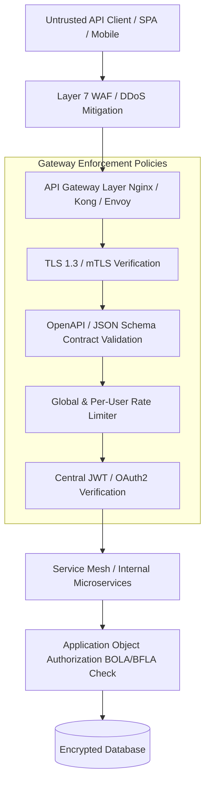

# 05. API Gateway & Defense Patterns

Enforcing security controls exclusively within individual application microservices leads to inconsistent security coverage, configuration drift, and duplicate logic. A resilient security architecture adopts a **Defense-in-Depth** model: offloading central traffic policies, schema validation, rate limiting, and mTLS to an **API Gateway Tier** before requests reach backend application microservices.



---

## 1. Gateway Schema Validation (OpenAPI 3.1 Contract Enforcement)

Validating incoming JSON request payloads against strict OpenAPI specs at the gateway layer drops malformed, extra-property, or unexpected parameter attacks **before** they reach backend microservices, neutralizing Mass Assignment vectors at the perimeter.

### Production OpenAPI Schema (`user_request_schema.json`)
```json
{
  "$schema": "https://json-schema.org/draft/2020-12/schema",
  "type": "object",
  "properties": {
    "email": {
      "type": "string",
      "format": "email",
      "maxLength": 100
    },
    "username": {
      "type": "string",
      "pattern": "^[a-zA-Z0-9_]{3,30}$"
    },
    "age": {
      "type": "integer",
      "minimum": 18,
      "maximum": 120
    }
  },
  "required": ["email", "username"],
  "additionalProperties": false
}
```

> [!IMPORTANT]
> **Key Schema Rule:** Setting `"additionalProperties": false` is vital. It instructs the schema validator to reject payloads containing unexpected internal fields like `"is_admin": true` or `"role": "superuser"`.

---

## 2. Hardened Production Gateway Configurations

### A. Hardened Nginx API Gateway Configuration (`nginx.conf`)

```nginx
# nginx_api_gateway.conf
user nginx;
worker_processes auto;
error_log /var/log/nginx/error.log warn;
pid /var/run/nginx.pid;

events {
    worker_connections 2048;
}

http {
    include /etc/nginx/mime.types;
    default_type application/octet-stream;

    # Hide Nginx version banner
    server_tokens off;

    # Rate Limiting Zone (10 requests/sec per IP, 10MB zone memory)
    limit_req_zone $binary_remote_addr zone=api_ip_limit:10m rate=10r/s;
    limit_req_status 429;

    # Request Body Size Limitation (Prevent DoS buffer overflow)
    client_max_body_size 1M;
    client_body_buffer_size 16k;
    client_header_buffer_size 1k;
    large_client_header_buffers 4 8k;

    # Timeout limits to prevent Slowloris attacks
    client_body_timeout 10s;
    client_header_timeout 10s;
    keepalive_timeout 15s;
    send_timeout 10s;

    # Upstream Microservice Cluster
    upstream backend_api_cluster {
        server 10.0.1.50:8080 max_fails=3 fail_timeout=10s;
        server 10.0.1.51:8080 max_fails=3 fail_timeout=10s;
        keepalive 32;
    }

    server {
        listen 443 ssl http2;
        server_name api.company.com;

        # TLS Hardening (TLS 1.2 & 1.3 only, strong ciphers)
        ssl_certificate /etc/ssl/certs/api_gateway.crt;
        ssl_certificate_key /etc/ssl/private/api_gateway.key;
        ssl_protocols TLSv1.2 TLSv1.3;
        ssl_ciphers ECDHE-ECDSA-AES128-GCM-SHA256:ECDHE-RSA-AES128-GCM-SHA256:ECDHE-ECDSA-AES256-GCM-SHA384:ECDHE-RSA-AES256-GCM-SHA384;
        ssl_prefer_server_ciphers off;
        ssl_session_cache shared:SSL:10m;
        ssl_session_timeout 1d;

        # Security Headers
        add_header X-Content-Type-Options "nosniff" always;
        add_header X-Frame-Options "DENY" always;
        add_header X-XSS-Protection "0" always;
        add_header Content-Security-Policy "default-src 'none';" always;
        add_header Strict-Transport-Security "max-age=31536000; includeSubDomains; preload" always;

        # CORS Policy (Restrict to authorized client origins)
        location / {
            if ($request_method = 'OPTIONS') {
                add_header 'Access-Control-Allow-Origin' 'https://app.company.com' always;
                add_header 'Access-Control-Allow-Methods' 'GET, POST, PUT, DELETE, OPTIONS' always;
                add_header 'Access-Control-Allow-Headers' 'Authorization, Content-Type, X-Requested-With' always;
                add_header 'Access-Control-Max-Age' 86400;
                add_header 'Content-Length' 0;
                return 204;
            }

            add_header 'Access-Control-Allow-Origin' 'https://app.company.com' always;
            add_header 'Access-Control-Allow-Credentials' 'true' always;

            # Enforce Rate Limiting
            limit_req zone=api_ip_limit burst=20 nodelay;

            # Proxy Headers & Forwarding
            proxy_pass http://backend_api_cluster;
            proxy_http_version 1.1;
            proxy_set_header Connection "";
            proxy_set_header Host $host;
            proxy_set_header X-Real-IP $remote_addr;
            proxy_set_header X-Forwarded-For $proxy_add_x_forwarded_for;
            proxy_set_header X-Forwarded-Proto https;
        }
    }
}
```

---

### B. Kong Declarative Gateway Security Configuration (`kong.yml`)

```yaml
_format_version: "3.0"

services:
  - name: user-service
    url: http://user-service.internal:8080
    routes:
      - name: user-routes
        paths:
          - /v1/users
        strip_path: false

plugins:
  # 1. Global Rate Limiting Plugin
  - name: rate-limiting
    config:
      minute: 100
      hour: 5000
      policy: redis
      redis_host: redis.internal
      redis_port: 6379
      fault_tolerant: false

  # 2. JWT Authentication Plugin
  - name: jwt
    config:
      claims_to_verify:
        - exp
      key_claim_name: iss
      secret_is_base64: false

  # 3. CORS Hardening Plugin
  - name: cors
    config:
      origins:
        - https://app.company.com
      methods:
        - GET
        - POST
        - PUT
        - DELETE
      headers:
        - Authorization
        - Content-Type
      credentials: true
      max_age: 3600

  # 4. Request Size Limiting Plugin
  - name: request-size-limiting
    config:
      allowed_payload_size: 1 # Max 1MB
```

---

### C. Envoy Proxy Configuration for gRPC & mTLS (`envoy.yaml`)

```yaml
static_resources:
  listeners:
  - name: grpc_listener
    address:
      socket_address:
        address: 0.0.0.0
        port_value: 10000
    filter_chains:
    - transport_socket:
        name: envoy.transport_sockets.tls
        typed_config:
          "@type": type.googleapis.com/envoy.extensions.transport_sockets.tls.v3.DownstreamTlsContext
          common_tls_context:
            tls_certificates:
            - certificate_chain: { filename: "/etc/envoy/certs/server.crt" }
              private_key: { filename: "/etc/envoy/certs/server.key" }
            validation_context:
              trusted_ca: { filename: "/etc/envoy/certs/ca.crt" }
              # Require and verify client certificate (mTLS)
              require_client_certificate: true
      filters:
      - name: envoy.filters.network.http_connection_manager
        typed_config:
          "@type": type.googleapis.com/envoy.extensions.filters.network.http_connection_manager.v3.HttpConnectionManager
          stat_prefix: grpc_json
          codec_type: AUTO
          route_config:
            name: local_route
            virtual_hosts:
            - name: grpc_service
              domains: ["*"]
              routes:
              - match: { prefix: "/" }
                route: { cluster: internal_grpc_service }
          http_filters:
          - name: envoy.filters.http.router
            typed_config:
              "@type": type.googleapis.com/envoy.extensions.filters.http.router.v3.Router

  clusters:
  - name: internal_grpc_service
    type: STRICT_DNS
    lb_policy: ROUND_ROBIN
    http2_protocol_options: {}
    load_assignment:
      cluster_name: internal_grpc_service
      endpoints:
      - lb_endpoints:
        - endpoint:
            address:
              socket_address:
                address: 127.0.0.1
                port_value: 50051
```

---

## 3. CORS Security & Common Misconfigurations

Cross-Origin Resource Sharing (CORS) is a browser enforcement mechanism that dictates whether web applications hosted on one origin can read responses from another origin.

> [!WARNING]
> CORS is **NOT** an API security control against automated scripts or `curl` attacks. It is purely a **browser policy** to protect browser users from cross-origin data theft.

### Dangerous CORS Misconfigurations

1. **Arbitrary Origin Reflection with Credentials**:
   ```nginx
   # VULNERABLE: Reflects any incoming Origin header back to client with credentials!
   add_header Access-Control-Allow-Origin $http_origin;
   add_header Access-Control-Allow-Credentials 'true';
   ```
   *Exploit*: An attacker tricks a logged-in user into visiting `evil.com`. JavaScript on `evil.com` sends a `fetch('https://api.company.com/user/data', {credentials: 'include'})`. The server reflects `Access-Control-Allow-Origin: https://evil.com`, allowing `evil.com` to read private user responses!

2. **Trusting `null` Origin**:
   ```nginx
   # VULNERABLE: Trusting 'null' origin
   add_header Access-Control-Allow-Origin 'null';
   ```
   *Exploit*: Attackers execute requests from sandboxed `<iframe>` tags or local file origins (`file://`), which emit `Origin: null`.

---

## 4. Defense-in-Depth Layering Matrix

| Security Layer | Responsible Component | Key Security Controls Applied |
| :--- | :--- | :--- |
| **1. Edge Network** | WAF / CDN (Cloudflare, AWS Shield) | DDoS mitigation, IP Reputation, Bot score management, Geo-blocking. |
| **2. API Gateway** | Nginx / Kong / Envoy | TLS termination, mTLS, OpenAPI schema validation, global rate limiting, CORS. |
| **3. Identity Provider** | Keycloak / Auth0 / Okta | OAuth2 token issuance, MFA, SAML, PKCE code challenge verification. |
| **4. App Microservice** | Application Middleware | Fine-grained BOLA checks (`user_id = auth_id`), BFLA RBAC decorators, DTO binding. |
| **5. Database Tier** | DB / ORM | Encrypted storage, parameterized queries (SQLi prevention), column-level access controls. |

---

*Next Chapter: [06. Hands-On Vulnerability Lab →](06-hands-on-lab.md)*
