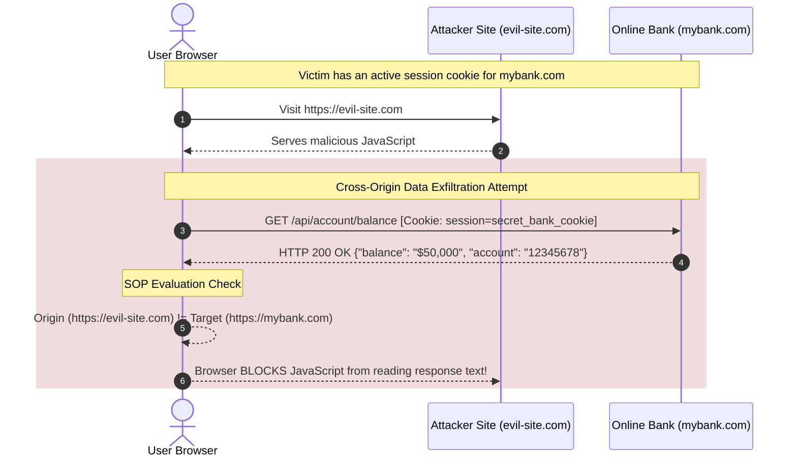

# 01 - Introduction to Same-Origin Policy (SOP)

The Same-Origin Policy (SOP) is the core security mechanism enforced by modern web browsers to isolate potentially malicious documents and scripts loaded from one website from interacting with sensitive resources on another website.

> [!IMPORTANT]
> **Client-Side Enforcement:** SOP is enforced exclusively by the client (web browser), not by backend servers. When a web browser executes JavaScript that requests a cross-origin resource, the HTTP request is transmitted to and processed by the target server. The browser evaluates origin boundaries upon receiving the response to determine whether the calling script is permitted to read the response payload.

---

## 1. Deconstructing the Web Origin

According to **RFC 6454**, a web **Origin** is defined by a mandatory three-tuple consisting of:
1. **Scheme (Protocol):** The transport protocol (e.g., `http`, `https`, `wss`).
2. **Host (Domain / IP):** The fully qualified domain name (FQDN) or IP address (e.g., `example.com`, `api.example.com`, `192.168.1.100`).
3. **Port:** The networking port number (e.g., `80`, `443`, `8080`).

```
                    https://app.example.com:8443/v1/users?id=100
                    └─┬─┘   └──────┬──────┘ └─┬┘ └────────┬────────┘
                      │            │          │           │
                   SCHEME         HOST       PORT       PATH & QUERY
                   └─────────────────────────┘
                                │
                          THE ORIGIN TUPLE
                 ("https", "app.example.com", 8443)
```

Two URLs possess the **Same Origin** if and only if all three tuple components match exactly. If any single component differs, the URLs are considered **Cross-Origin**.

### Origin Evaluation Matrix

Base Reference URL: `https://www.example.com:443/dashboard/index.html` (Implicit Port: `443`)

| Target URL | Evaluation | Root Cause / Mismatch |
| :--- | :--- | :--- |
| `https://www.example.com/profile/settings.html` | **Same Origin** | Scheme (`https`), Host (`www.example.com`), and Port (`443`) match. Path differences are ignored. |
| `https://www.example.com:443/api/v1/data` | **Same Origin** | Identical tuple. Explicit port 443 equals implicit default TLS port. |
| `http://www.example.com/dashboard/index.html` | **CROSS-ORIGIN** | Scheme mismatch (`http` vs `https`). |
| `https://api.example.com/dashboard/index.html` | **CROSS-ORIGIN** | Host mismatch (`api.example.com` vs `www.example.com`). Subdomains are distinct hosts. |
| `https://example.com/dashboard/index.html` | **CROSS-ORIGIN** | Host mismatch (Apex domain vs `www` subdomain). |
| `https://www.example.com:8443/dashboard/` | **CROSS-ORIGIN** | Port mismatch (`8443` vs `443`). |
| `https://192.168.1.10/index.html` | **CROSS-ORIGIN** | IP address vs Domain name is treated as a host mismatch even if DNS resolves to that IP. |
| `https://www.example.com.attacker.com/index.html` | **CROSS-ORIGIN** | Entire domain suffix differs (`attacker.com` vs `example.com`). |

> [!NOTE]
> **Legacy Browser Edge Cases:** Historical versions of Internet Explorer (IE) contained two major deviations from RFC 6454: IE ignored port numbers when computing origins for SOP, and allowed trusted domains (such as Intranet Zone sites) to bypass origin checks entirely. Modern Evergreen browsers (Chrome, Firefox, Safari, Edge) strictly adhere to RFC 6454.

---

## 2. Browser SOP Enforcement & Threat Model

The fundamental problem that SOP solves is **Ambient Authority**. Web browsers automatically append user authentication state (such as `Cookie` headers, TLS client certificates, and HTTP Basic Auth credentials) to outgoing HTTP requests targeting a domain, regardless of which website initiated the request.

Without SOP, visiting a malicious website while logged into your online bank would allow the malicious website's scripts to make background requests to the bank API and exfiltrate private financial data.



### SOP Inter-Origin Interaction Rules

SOP categorizes cross-origin interactions into three distinct operational behaviors: **Writes**, **Embeds**, and **Reads**.

```
┌──────────────────────────────────────────────────────────────────────────┐
│                      SOP INTER-ORIGIN BEHAVIOR RULES                     │
├────────────────────────────────┬─────────────────────────────────────────┤
│ Interaction Category           │ SOP Enforcement Policy                  │
├────────────────────────────────┼─────────────────────────────────────────┤
│ Cross-Origin WRITES            │ GENERALLY ALLOWED                       │
│ (HTTP POST, Links, Redirects)  │ Browsers send requests and forms across  │
│                                │ origins. Mitigation requires CSRF tokens│
│                                │ or SameSite cookie attributes.          │
├────────────────────────────────┼─────────────────────────────────────────┤
│ Cross-Origin EMBEDS            │ GENERALLY ALLOWED                       │
│ (Scripts, CSS, Images, Frames) │ HTML tags like , <script>, <iframe> │
│                                │ render content. Execution scope matches │
│                                │ the embedding document origin.          │
├────────────────────────────────┼─────────────────────────────────────────┤
│ Cross-Origin READS             │ GENERALLY RESTRICTED                    │
│ (Fetch, XMLHttpRequest, Canvas)│ Browsers block JavaScript from reading  │
│                                │ response data across origins unless     │
│                                │ explicitly authorized via CORS headers. │
└────────────────────────────────┴─────────────────────────────────────────┘
```

1. **Cross-Origin Writes:** Writing data across origins is permitted by default. A script running on `evil.com` can submit an HTML `<form>` or send a `POST` request to `mybank.com/transfer`. While the browser sends the request (which can lead to Cross-Site Request Forgery / CSRF), SOP prevents `evil.com` from **reading** the HTTP response.
2. **Cross-Origin Embeds:** Embedding resources across origins is permitted by default. Examples include:
   - `<script src="https://cdn.example.com/lib.js"></script>` (executes within the embedding origin's context).
   - `<link rel="stylesheet" href="https://cdn.example.com/style.css">`.
   - ``.
   - `<iframe src="https://example.com/frame.html"></iframe>`.
3. **Cross-Origin Reads:** Reading data programmatically across origins via JavaScript (`fetch()`, `XMLHttpRequest`) or reading pixel data from cross-origin canvas images (`canvas.toDataURL()`) is **strictly forbidden by default**.

---

## 3. The Need for CORS (Cross-Origin Resource Sharing)

While SOP provides security isolation, modern web applications require legitimate cross-origin interactions:
- **Decoupled Single Page Applications (SPAs):** A React frontend hosted at `https://app.company.com` needs to execute API queries against `https://api.company.com`.
- **Multi-Tenant SaaS Platforms:** Customer dashboards hosted at `https://customer.saas.com` need to access shared asset servers at `https://assets.saas.com`.
- **Third-Party API Integrations:** A web application fetching public maps, payment gateway tokens, or analytics endpoints.

To permit these legitimate architectures without disabling SOP globally, browser vendors and the W3C introduced **Cross-Origin Resource Sharing (CORS)**. CORS allows backend servers to issue HTTP headers that instruct the browser to selectively relax SOP restrictions for approved cross-origin requests.

---

## 4. Threat Landscape & OWASP Mapping

CORS misconfigurations occur when developers improperly configure CORS response headers, causing the browser to waive SOP protections for unauthorized external origins.

```
┌─────────────────────────────────────────────────────────────────────────────┐
│                        CORS SECURITY THREAT MATRIX                          │
├────────────────────────────────┬────────────────────────────────────────────┤
│ OWASP Category                 │ Threat Manifestation                       │
├────────────────────────────────┼────────────────────────────────────────────┤
│ A01:2021 - Broken Access       │ Insecure CORS headers allow malicious      │
│ Control                        │ external domains to bypass SOP and read    │
│                                │ authenticated user data, tokens, and PII.  │
├────────────────────────────────┼────────────────────────────────────────────┤
│ A05:2021 - Security            │ Using dynamic origin reflection, wildcard   │
│ Misconfiguration               │ `*` with credentials, or unanchored regex   │
│                                │ in server-side CORS middleware.            │
├────────────────────────────────┼────────────────────────────────────────────┤
│ A07:2021 - Identification &    │ Exfiltrating session tokens or CSRF tokens │
│ Authentication Failures        │ via cross-origin fetch reads, enabling     │
│                                │ account takeover.                          │
└────────────────────────────────┴────────────────────────────────────────────┘
```

### Risk Severity & Impact Analysis

- **Confidentiality Loss:** Attackers can read sensitive REST API responses (credit card details, medical records, private messages).
- **Session Hijacking:** If JWTs or custom authorization tokens are exposed via API endpoints accessible through misconfigured CORS, attackers can steal active credentials.
- **Intranet Reconnaissance & Pivoting:** Malicious websites visited by employees can query internal corporate microservices (`http://intranet.internal`) if internal endpoints lack strict CORS allowlists.
