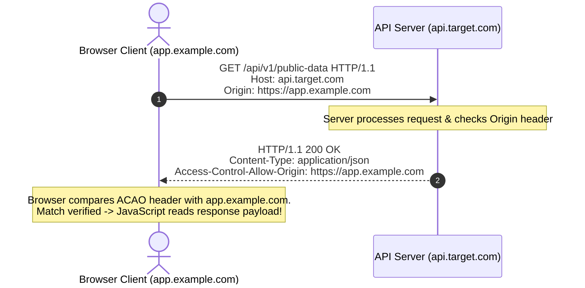
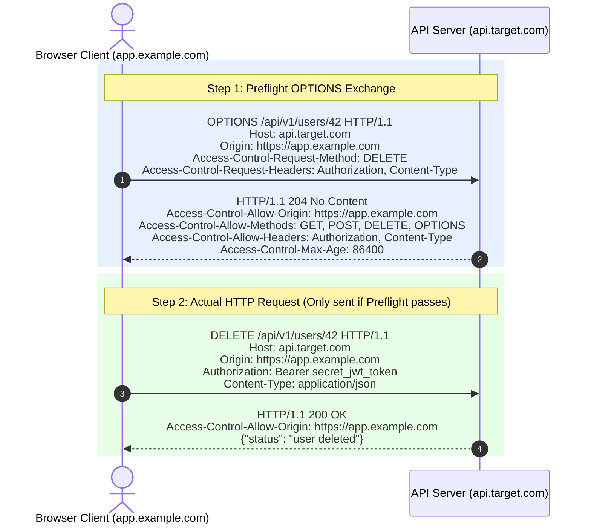

# 02 - CORS Mechanics & Protocol Specification

Cross-Origin Resource Sharing (CORS) is a browser-enforced HTTP-header-based mechanism that enables backend servers to declare which external origins are authorized to read response data or execute non-simple HTTP requests.

---

## 1. CORS Request Categories

The W3C Fetch Specification categorizes cross-origin HTTP requests into three types: **Simple Requests**, **Preflighted Requests**, and **Credentialed Requests**.

```
                           OUTGOING CROSS-ORIGIN REQUEST
                                         │
                   ┌─────────────────────┴─────────────────────┐
                   ▼                                           ▼
       Is request method GET, HEAD,                     Does it contain custom
         or POST with safelisted                          headers, PUT/DELETE,
         Content-Type?                                    or JSON payload?
                   │                                           │
          YES ┌────┴────┐ NO                          YES ┌────┴────┐ NO
              │         │                                 │         │
              ▼         ▼                                 ▼         ▼
        ┌───────────┐ ┌───────────┐                 ┌───────────┐ ┌───────────┐
        │  SIMPLE   │ │ PREFLIGHT │                 │ PREFLIGHT │ │  SIMPLE   │
        │  REQUEST  │ │ REQUIRED  │                 │ REQUIRED  │ │  REQUEST  │
        └───────────┘ └───────────┘                 └───────────┘ └───────────┘
```

---

### A. Simple Requests

A cross-origin request is classified as a **Simple Request** if it satisfies **all** of the following conditions:

1. **HTTP Method:** Must be one of `GET`, `HEAD`, or `POST`.
2. **HTTP Headers:** Must only contain CORS-safelisted headers:
   - `Accept`
   - `Accept-Language`
   - `Content-Language`
   - `Content-Type`
   - `Range`
3. **Content-Type Value:** If `Content-Type` is set, it must strictly be one of:
   - `application/x-www-form-urlencoded`
   - `multipart/form-data`
   - `text/plain`
4. **No Event Listeners / ReadableStreams:** No `XMLHttpRequestUpload` event listeners are registered.

#### Simple Request Protocol Flow



> [!NOTE]
> **Side Effects Warning:** Even for Simple Requests, the browser transmits the HTTP request to the backend server **before** evaluating CORS headers. Server-side mutations triggered by `GET` or `POST` requests will execute regardless of whether the browser subsequently blocks JavaScript from reading the response.

---

### B. Preflighted Requests (`OPTIONS`)

If a request fails to meet any Simple Request criteria—such as using `Content-Type: application/json`, sending custom headers (e.g., `Authorization`, `X-API-Key`), or using methods like `PUT`, `DELETE`, or `PATCH`—the browser MUST issue an automated **Preflight Request** prior to sending the actual payload.

The preflight request uses the HTTP `OPTIONS` method to ask the target server for explicit permission to transmit the main request.

#### Preflighted Request Protocol Flow



---

### C. Credentialed Requests

By default, cross-origin requests initiated via `fetch()` or `XMLHttpRequest` do NOT transmit sensitive client credentials (such as HTTP cookies, TLS client certificates, or HTTP Basic Authentication headers).

To attach credentials to a cross-origin request, the client script must set:
- **Fetch API:** `credentials: 'include'`
- **XMLHttpRequest:** `xhr.withCredentials = true`

#### The Cardinal Rule of Credentialed CORS

> [!CAUTION]
> **Strict Prohibition:** If a client sends a credentialed request, the target server MUST NOT return a wildcard asterisk (`Access-Control-Allow-Origin: *`). 
> 
> Browsers will strictly throw a CORS violation error and refuse to expose the response if:
> 1. `Access-Control-Allow-Credentials: true` is present, AND
> 2. `Access-Control-Allow-Origin` is set to `*`.
> 
> To permit credentialed cross-origin requests, the server MUST return an explicit, exact origin in the `Access-Control-Allow-Origin` header (e.g., `Access-Control-Allow-Origin: https://app.example.com`).

---

## 2. Complete Header Specification Matrix

The CORS protocol relies on two sets of HTTP headers: **Request Headers** (sent by the browser to specify parameters) and **Response Headers** (returned by the server to grant permissions).

### Request Headers (Browser -> Server)

| Header Name | Usage Scenario | Description & Example |
| :--- | :--- | :--- |
| `Origin` | All CORS Requests | Indicates the origin tuple initiating the request.<br/>`Origin: https://app.example.com` |
| `Access-Control-Request-Method` | Preflight `OPTIONS` | Informs the server which HTTP method will be used in the actual request.<br/>`Access-Control-Request-Method: PUT` |
| `Access-Control-Request-Headers` | Preflight `OPTIONS` | Comma-separated list of custom headers the client intends to send.<br/>`Access-Control-Request-Headers: Authorization, X-Correlation-ID` |

### Response Headers (Server -> Browser)

| Header Name | Value Syntax | Security Impact & Description |
| :--- | :--- | :--- |
| `Access-Control-Allow-Origin` | `<origin>` \| `*` | Grants access to specified origin or wildcard (`*`). Must equal exact origin if credentials are enabled. |
| `Access-Control-Allow-Credentials` | `true` | Indicates whether the browser should expose response data to JavaScript when credentials (`cookies`) are included. |
| `Access-Control-Allow-Methods` | `<method>, ...` | List of allowed HTTP methods for preflight authorization (`GET, POST, PUT, DELETE, OPTIONS`). |
| `Access-Control-Allow-Headers` | `<header>, ...` | List of custom headers allowed in actual request (`Authorization, Content-Type, X-API-Key`). |
| `Access-Control-Expose-Headers` | `<header>, ...` | Whitelists response headers that frontend JavaScript is allowed to access beyond basic response headers. |
| `Access-Control-Max-Age` | `<seconds>` | Maximum duration (in seconds) the browser is allowed to cache the preflight response. |

---

## 3. Exposing Custom Response Headers (`Access-Control-Expose-Headers`)

By default, JavaScript executing in a cross-origin context can only access **CORS-safelisted response headers**:
- `Cache-Control`
- `Content-Language`
- `Content-Length`
- `Content-Type`
- `Expires`
- `Last-Modified`
- `Pragma`

If an API returns custom response headers—such as pagination metadata (`X-Total-Count`), authorization refresh tokens (`X-Refresh-Token`), or rate limit information (`X-RateLimit-Remaining`)—frontend JavaScript CANNOT read them unless the server explicitly lists them in `Access-Control-Expose-Headers`.

```http
HTTP/1.1 200 OK
Access-Control-Allow-Origin: https://app.example.com
Access-Control-Expose-Headers: X-Total-Count, X-Refresh-Token
X-Total-Count: 1450
X-Refresh-Token: eyJhbGciOi...
```

---

## 4. Modern Extensions & Edge Cases

### A. The Necessity of the `Vary: Origin` Header

When a backend server dynamically reflects the `Origin` header (or returns different CORS headers based on the caller), it MUST include the `Vary: Origin` HTTP response header.

> [!WARNING]
> **CDN & Cache Poisoning Risk:** Without `Vary: Origin`, intermediate caching proxies, CDNs (e.g., Cloudflare, Akamai), or browser HTTP caches may store a response generated for Origin A (`https://app.example.com`) and serve that cached response to Origin B (`https://evil.com`), leading to cross-site data exposure or global Denial of Service (DoS).

```http
HTTP/1.1 200 OK
Access-Control-Allow-Origin: https://app.example.com
Access-Control-Allow-Credentials: true
Vary: Origin
```

---

### B. Private Network Access (PNA)

**Private Network Access (PNA)**—formerly known as CORS-RFC1918—is a W3C specification designed to prevent public websites from pivoting into private local networks (intranets) via browser client requests.

Under PNA, when a public website (`https://public-website.com`) attempts to fetch resources from a private network IP address (`http://192.168.1.1` or `http://localhost:8080`), the browser sends a special preflight request:

```http
OPTIONS /device/status HTTP/1.1
Host: 192.168.1.1
Origin: https://public-website.com
Access-Control-Request-Private-Network: true
```

The internal device MUST respond with:
```http
HTTP/1.1 204 No Content
Access-Control-Allow-Origin: https://public-website.com
Access-Control-Allow-Private-Network: true
```

If `Access-Control-Allow-Private-Network: true` is missing, the browser blocks the connection to the internal IP address.

---

### C. Interactions with Cookie `SameSite` Attributes

CORS enforcement operates independently of HTTP cookie `SameSite` rules:

```
┌──────────────────────────────────────────────────────────────────────────┐
│                   COOKIE SAMESITE vs CORS INTERACTION                    │
├─────────────────┬────────────────────────────────────────────────────────┤
│ Cookie Attribute│ Browser Behavior on Cross-Origin Fetch/XHR             │
├─────────────────┼────────────────────────────────────────────────────────┤
│ SameSite=Strict │ Cookie is NEVER sent on cross-origin requests, regardless│
│                 │ of CORS headers returned by the server.                │
├─────────────────┼────────────────────────────────────────────────────────┤
│ SameSite=Lax    │ Cookie is sent ONLY for top-level navigation (GET).    │
│                 │ Blocked for cross-origin Fetch/XHR POST requests.      │
├─────────────────┼────────────────────────────────────────────────────────┤
│ SameSite=None   │ Cookie IS sent for cross-origin requests if           │
│ (Requires Secure│ withCredentials=true, subject to CORS ACAO/ACAC rules. │
└─────────────────┴────────────────────────────────────────────────────────┘
```
