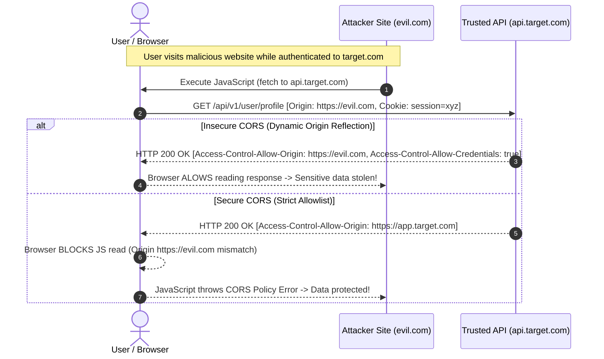

# CORS & Same-Origin Policy Security Masterclass

> [!IMPORTANT]
> **Core Security Principle:** The Same-Origin Policy (SOP) is the cornerstone of client-side browser security. Cross-Origin Resource Sharing (CORS) is **not a security feature that blocks requests**; rather, it is a mechanism that **relaxes SOP restrictions** to allow trusted cross-origin access. Misconfiguring CORS introduces severe data exfiltration vulnerabilities across modern web and API applications.

---

## Guide Overview

This masterclass provides an exhaustive, production-grade security analysis of the Same-Origin Policy (SOP) and Cross-Origin Resource Sharing (CORS). Designed for application security engineers, security architects, and backend developers, this guide covers standard browser security boundaries, preflight mechanics, dangerous misconfigurations, exploit payloads, multi-language implementations, automated scanning, and a self-contained hands-on lab.

| Attribute | Details |
| :--- | :--- |
| **Domain** | Web & API Security (`02-web-and-api`) |
| **Target Audience** | Security Engineers, Penetration Testers, API Developers, Security Architects |
| **Skill Level** | Intermediate to Advanced |
| **Prerequisites** | HTTP Protocol (Headers, Methods), JavaScript (Fetch / XHR), REST API Architecture |
| **Lab Framework** | Python (Flask / FastAPI), Node.js (Express), Go, Java (Spring Boot) |
| **Compliance Mapping** | OWASP Top 10 (A01:2021 - Broken Access Control, A05:2021 - Security Misconfiguration), NIST SP 800-53 |

---

## Learning Objectives

Upon completing this guide, you will be able to:
1. **Deconstruct Origin Computation:** Formally calculate web origins using scheme, host, and port tuples according to RFC 6454.
2. **Analyze SOP Boundaries:** Distinguish between cross-origin writes, embeds, and reads to evaluate browser isolation rules.
3. **Master CORS Protocol Mechanics:** Trace simple, preflighted (`OPTIONS`), and credentialed HTTP request flows step-by-step.
4. **Identify & Exploit CORS Flaws:** Weaponize origin reflection, wildcard credentialing, regex bypasses, `null` origin trust, and subdomain XSS pivoting.
5. **Implement Secure Allowlists:** Build production-grade, strict CORS configurations across Express.js, FastAPI, Flask, Go, Java Spring Boot, and Nginx.
6. **Audit & Scan Infrastructure:** Utilize `cURL`, Burp Suite, CORStest, Nuclei, and custom Semgrep SAST rules to identify CORS misconfigurations in CI/CD pipelines.
7. **Deploy Hands-On Mitigations:** Execute a full vulnerability-to-remediation lab cycle with automated verification scripts.

---

## High-Level Architecture Flow

---

## Masterclass Navigation & Chapter Index

This guide is structured into 7 comprehensive chapters:

1. **[01 - Introduction to Same-Origin Policy (SOP)](01-introduction.md)**
   - Theoretical foundations, `(Scheme, Host, Port)` origin tuple mathematics, SOP read/write/embed rules, ambient authority threat model, and OWASP mapping.
2. **[02 - CORS Mechanics & Protocol Specification](02-cors-mechanics-and-headers.md)**
   - W3C/Fetch spec request classification (Simple vs Preflighted vs Credentialed), complete `Access-Control-*` header matrix, cache poisoning (`Vary: Origin`), and Private Network Access (PNA).
3. **[03 - CORS Misconfigurations and Attack Vectors](03-cors-misconfigurations-and-exploits.md)**
   - In-depth attack vectors: Arbitrary origin reflection, regex/prefix/suffix bypasses, `null` origin exploitation via sandboxed iframe, subdomain XSS escalation, and intranet pivoting.
4. **[04 - Secure CORS Implementation](04-secure-cors-implementation.md)**
   - Production-grade secure allowlist implementations in Node.js (Express), Python (FastAPI & Flask), Go (Gin / `net/http`), Java (Spring Boot), Nginx, and Apache.
5. **[05 - CORS Auditing & Security Tooling](05-cors-auditing-tools.md)**
   - Manual `cURL` test suites, Burp Suite CORS scanner, CORStest, custom Python multi-threaded auditing scripts, and Semgrep SAST detection rules for CI/CD integration.
6. **[06 - Hands-On Lab: Exploiting and Remediating CORS](06-hands-on-lab.md)**
   - Self-contained, runnable lab featuring a vulnerable Flask API, automated HTML/JS exfiltration exploit PoC, production secure fix, and a Python automated verification test suite.
7. **[07 - References & Standards](07-references.md)**
   - WHATWG Fetch specifications, RFC 6454, OWASP cheat sheets, USENIX security research papers, real-world CVE case studies, and authoritative documentation.
