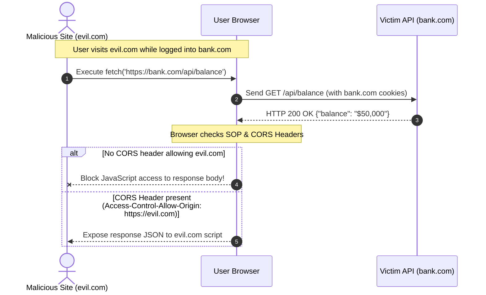

# 01. Introduction to Frontend Security & Threat Modeling

Modern web applications execute a massive portion of their logic inside the end-user's web browser. Shifted away from isolated backend servers, user interfaces now manage client-side routing, state persistence, data transformation, and dynamic rendering. This architectural evolution has redefined the web attack surface: **the client browser is an open, untrusted, and inherently hostile execution environment**.

This chapter establishes the core theoretical models, browser security boundaries, architectural paradigms, and fundamental threat vectors that underpin frontend application security.

---

## 1. The Browser as a Hostile Execution Environment

Unlike backend server infrastructure—where operators control the operating system, runtime, memory space, and network telemetry—frontend code executes inside an environment fully controlled by the end user or a potential attacker.

```
┌─────────────────────────────────────────────────────────────────────────────┐
│                      CLIENT-SIDE HOSTILE ENVIRONMENT                        │
├─────────────────────────────────────────────────────────────────────────────┤
│  Attacker Control Capabilities:                                            │
│  • Full access to Chrome DevTools / Firefox Developer Tools                 │
│  • Arbitrary JavaScript injection & runtime monkey-patching                 │
│  • Inspection of network traffic, HTTP headers, payloads, and WebSocket frames  │
│  • Extraction of browser storage (LocalStorage, SessionStorage, IndexedDB)  │
│  • Execution of malicious browser extensions & man-in-the-middle proxies    │
└─────────────────────────────────────────────────────────────────────────────┘
```

> [!CAUTION]
> **The Golden Rule of Frontend Security:** Never trust client-side validation, client-side security checks, or client-stored state for authorization decisions. Anything running in the browser can be modified, bypassed, or forged by an attacker.

---

## 2. Same-Origin Policy (SOP) Mechanics

The **Same-Origin Policy (SOP)** is the foundational security boundary enforced by modern web browsers. It isolates documents and scripts loaded from different origins to prevent malicious sites from reading sensitive data from legitimate applications.

### A. Defining an Origin
An origin is strictly defined by a tuple consisting of three components: **Protocol (Scheme)**, **Hostname (Domain)**, and **Port**.

| Target URL | Base URL: `https://example.com:443/app/index.html` | Same Origin? | Reason |
| :--- | :--- | :--- | :--- |
| `https://example.com/app/dashboard.html` | `https://example.com:443/app/index.html` | **Yes** | Same protocol (`https`), host (`example.com`), and port (`443`). |
| `http://example.com/app/index.html` | `https://example.com:443/app/index.html` | **No** | Protocol mismatch (`http` vs `https`). |
| `https://api.example.com/app/index.html` | `https://example.com:443/app/index.html` | **No** | Hostname mismatch (`api.example.com` vs `example.com`). |
| `https://example.com:8443/app/index.html` | `https://example.com:443/app/index.html` | **No** | Port mismatch (`8443` vs `443`). |

### B. SOP Access Rules: Read vs Write vs Embed
SOP does **not** block all cross-origin interactions. It distinguishes between three interaction types:

1. **Cross-Origin Writes:** Allowed by default. A site can submit forms (`POST`) or issue links (`GET`) to another origin.
2. **Cross-Origin Embedding:** Allowed by default. A site can embed resources like images (``), scripts (`<script>`), stylesheets (`<link rel="stylesheet">`), and frames (`<iframe>`).
3. **Cross-Origin Reads:** **Blocked by default.** A site cannot read responses from cross-origin HTTP requests (via `fetch` or `XMLHttpRequest`) unless explicitly permitted by **Cross-Origin Resource Sharing (CORS)** response headers (`Access-Control-Allow-Origin`).



---

## 3. DOM Architecture & Source-to-Sink Data Flow

The **Document Object Model (DOM)** is an object-oriented representation of the web page structured as a node tree. Frontend vulnerabilities—most notably DOM-based Cross-Site Scripting (DOM XSS)—arise when data flows unsafely from an untrusted **Source** to an execution **Sink**.

```mermaid
flowchart LR
    subgraph Sources ["Untrusted Sources"]
        S1["location.search / hash"]
        S2["document.referrer"]
        S3["window.name"]
        S4["postMessage data"]
        S5["LocalStorage / Cookies"]
    end

    subgraph SinkProcess ["DOM Execution Engine"]
        SP["Unsanitized Data Pass-Through"]
    end

    subgraph Sinks ["Dangerous Sinks"]
        K1["element.innerHTML"]
        K2["document.write()"]
        K3["eval() / setTimeout()"]
        K4["location.href"]
    end

    Sources --> SinkProcess --> Sinks
    
    style Sources fill:#f9f2f4,stroke:#c7254e
    style Sinks fill:#f2dede,stroke:#a94442
```



### A. What is a Source?
A **Source** is a JavaScript property or browser API that accepts user-controllable input from an attacker.

- **URL Sources:** `location.search`, `location.hash`, `location.href`, `document.URL`.
- **Browser State Sources:** `document.referrer`, `window.name`, `document.cookie`, `localStorage`, `sessionStorage`.
- **Inter-Window Sources:** `window.postMessage()` event data, `MessageChannel`.

### B. What is a Sink?
A **Sink** is a browser function or DOM element property that executes code or renders HTML markup if provided with unescaped text.

- **HTML Execution Sinks:** `element.innerHTML`, `element.outerHTML`, `document.write()`, `document.writeln()`.
- **JavaScript Code Sinks:** `eval()`, `Function()`, `setTimeout(string)`, `setInterval(string)`.
- **Navigation/URL Sinks:** `location.href`, `location.assign()`, `location.replace()`, `window.open()`, `iframe.src`.

---

## 4. Threat Modeling Across Frontend Architectures

Modern web development spans several architectural patterns, each introducing distinct security characteristics.

### A. Single Page Applications (SPAs)
- **Frameworks:** React, Vue.js, Angular, Svelte.
- **Mechanics:** Initial HTML bundle loaded; client-side JS handles page routing, state management, and rendering via client API calls.
- **Primary Threats:**
  - Exposure of client-side application logic and internal API routes via unminified JS source maps.
  - Insecure storage of OAuth tokens in `LocalStorage`.
  - DOM XSS through unescaped client component rendering.

### B. Server-Side Rendering (SSR) & Static Site Generation (SSG)
- **Frameworks:** Next.js, Nuxt.js, SvelteKit, Remix.
- **Mechanics:** HTML rendered on the server per request (or generated at build time), sent to client, and then "hydrated" by client JavaScript.
- **Primary Threats:**
  - **Hydration Vulnerabilities:** Mismatch between server-rendered HTML and client-hydrated DOM leading to unescaped injection.
  - **SSR Memory Context Leaks:** Sharing global variables across multiple concurrent user requests on the Node.js server.
  - **Remote Code Execution (RCE):** Prototype pollution vulnerabilities affecting server-side node modules during rendering.

### C. Micro-Frontends
- **Mechanics:** Multiple independent frontend applications running concurrently in the same browser window, often loaded dynamically.
- **Primary Threats:**
  - **Global Scope Pollution:** A compromised micro-frontend monkey-patching `window.fetch` or `prototype` methods across all sibling modules.
  - **DOM Interference:** Unisolated CSS or DOM mutations hijacking controls in other micro-frontend components.

---

## 5. OWASP Top 10 Mapping for Frontend Security

Client-side vulnerabilities directly impact critical categories of the OWASP Web Top 10 and OWASP API Security Top 10.

| OWASP Category | Frontend Failure Mode | Real-World Impact |
| :--- | :--- | :--- |
| **A03:2021 - Injection** | DOM XSS via unescaped `innerHTML` or `dangerouslySetInnerHTML` | Arbitrary JavaScript execution, cookie/token exfiltration, session hijacking |
| **A01:2021 - Broken Access Control** | Enforcing user role permissions purely via UI hidden buttons without backend API validation | Low-privileged user calling administrative endpoints directly |
| **A07:2021 - Identification & Auth Failures** | Storing JWTs in `LocalStorage` where XSS payloads can extract them | Permanent account takeover without needing credentials |
| **A08:2021 - Software & Data Integrity** | Loading third-party scripts from CDNs without SRI hashes or strict CSP | Supply chain compromise (e.g., Magecart skimming scripts) |
| **A05:2021 - Security Misconfiguration** | Missing security response headers (`Content-Security-Policy`, `X-Frame-Options`, `X-Content-Type-Options`) | Vulnerability to clickjacking, MIME sniffing, and unconstrained script execution |

---
