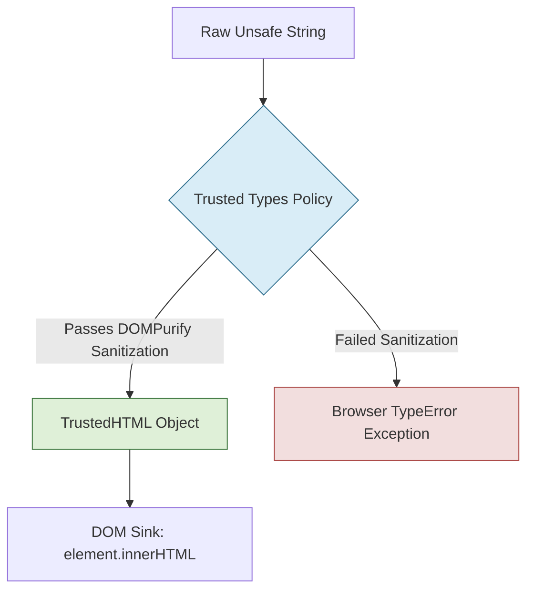

# 02. Modern Framework Security & DOM-Based Vulnerabilities

Modern JavaScript frameworks (React, Vue.js, Angular, Svelte) dramatically reduce Cross-Site Scripting (XSS) risks by automatically escaping dynamic variable interpolations before rendering them into the Document Object Model (DOM). However, every major framework includes intentional "escape hatches" for rendering raw HTML or interacting directly with DOM APIs. When misconfigured or misused, these escape hatches expose applications to severe DOM-based vulnerabilities.

This chapter dissects framework-specific security mechanics, dangerous code anti-patterns, Client-Side Prototype Pollution, and modern browser-level defenses like the **Trusted Types API**.

---

## 1. React Security Mechanics & Escape Hatches

### A. Automatic Escaping & The `$$typeof` Protection
React automatically escapes string values embedded within JSX curly braces (`{userInput}`).

```jsx
// SAFE: React converts userInput string into plain text nodes.
// Input: "<script>alert(1)</script>"
// Rendered DOM: &lt;script&gt;alert(1)&lt;/script&gt;
<div>{userInput}</div>
```

To prevent attackers from injecting malformed JSON objects that simulate React components, React attaches a `Symbol.for('react.element')` tag to the `$$typeof` property of every valid `ReactElement`. Because JSON payloads parsed from `JSON.parse()` cannot transmit native JavaScript `Symbol` primitives, React will reject injected JSON component objects.

### B. Escape Hatch 1: `dangerouslySetInnerHTML`
When an application must render rich formatted text (e.g., user blog posts or markdown), developers often bypass auto-escaping using `dangerouslySetInnerHTML`.

#### 🔴 Vulnerable React Component
```jsx
import React from 'react';

export function VulnerableArticle({ userHtml }) {
  // VULNERABLE: Direct injection of untrusted HTML string into DOM sink
  return (
    <div className="article-body">
      <h2>Article View</h2>
      <div dangerouslySetInnerHTML={{ __html: userHtml }} />
    </div>
  );
}
```

#### 🟢 Secure React Component (DOMPurify Sanitization)
```jsx
import React from 'react';
import DOMPurify from 'dompurify';

export function SecureArticle({ userHtml }) {
  // SECURE: Sanitize untrusted HTML before passing to dangerouslySetInnerHTML
  const sanitizedHtml = DOMPurify.sanitize(userHtml, {
    ALLOWED_TAGS: ['b', 'i', 'em', 'strong', 'a', 'p', 'ul', 'li'],
    ALLOWED_ATTR: ['href', 'title', 'target']
  });

  return (
    <div className="article-body">
      <h2>Article View</h2>
      <div dangerouslySetInnerHTML={{ __html: sanitizedHtml }} />
    </div>
  );
}
```

### C. Escape Hatch 2: Dynamic Attribute Injection (`javascript:` URIs)
React auto-escaping does **not** protect against unsafe protocol handling in URL attributes such as `href` or `src`.

#### 🔴 Vulnerable Code
```jsx
// VULNERABLE: If userProfile.website is "javascript:alert(document.cookie)"
<a href={userProfile.website}>Visit User Website</a>
```

#### 🟢 Secure Code
```jsx
function sanitizeUrl(url) {
  try {
    const parsed = new URL(url, window.location.href);
    if (['http:', 'https:', 'mailto:'].includes(parsed.protocol)) {
      return parsed.href;
    }
  } catch (e) {
    // Invalid URL
  }
  return '#'; // Safe fallback
}

<a href={sanitizeUrl(userProfile.website)} rel="noopener noreferrer">
  Visit User Website
</a>
```

---

## 2. Vue.js Security Mechanics & Escape Hatches

### A. Template Interpolation vs `v-html`
Vue automatically escapes strings inside mustache templates (`{{ userContent }}`). However, the `v-html` directive inserts raw HTML into the element's `innerHTML` property.

#### 🔴 Vulnerable Vue Component
```vue
<template>
  <!-- VULNERABLE: Untrusted user input rendered directly into v-html sink -->
  <div class="user-bio" v-html="userBio"></div>
</template>

<script>
export default {
  props: ['userBio']
}
</script>
```

#### 🟢 Secure Vue Component
```vue
<template>
  <!-- SECURE: Clean computed property sanitized via DOMPurify -->
  <div class="user-bio" v-html="sanitizedBio"></div>
</template>

<script>
import DOMPurify from 'dompurify';

export default {
  props: ['userBio'],
  computed: {
    sanitizedBio() {
      return DOMPurify.sanitize(this.userBio);
    }
  }
}
</script>
```

### B. Vue In-Browser Template Compilation Risks
If a Vue application uses runtime template compilation (`Vue.compile()`) and allows user input inside the template string itself, an attacker can execute arbitrary JavaScript.

```javascript
// VULNERABLE: User input parsed as Vue template syntax
// Payload: {{ _Vue.prototype.constructor('alert(1)')() }}
const res = Vue.compile(`<div>${userInput}</div>`);
```

---

## 3. Angular Security Mechanics & Escape Hatches

Angular treats all values as untrusted by default and enforces contextual sanitization across four security contexts: **HTML**, **Style**, **URL**, and **ResourceURL**.

### A. The `DomSanitizer` Anti-Pattern
Angular developers sometimes hit compiler security errors and bypass them using `DomSanitizer` methods. These methods explicitly mark untrusted strings as safe, disabling Angular's built-in sanitization.

```
┌─────────────────────────────────────────────────────────────────────────────┐
│                    ANGULAR DOMSANITIZER BYPASS DANGER                       │
├─────────────────────────────────────────────────────────────────────────────┤
│ Method                                  │ Dangerous Risk                    │
├─────────────────────────────────────────┼───────────────────────────────────┤
│ bypassSecurityTrustHtml(value)          │ Bypasses HTML XSS filtering       │
│ bypassSecurityTrustScript(value)        │ Allows raw JavaScript execution    │
│ bypassSecurityTrustUrl(value)           │ Allows javascript: protocol URIs  │
│ bypassSecurityTrustResourceUrl(value)   │ Allows untrusted script/iframe src│
└─────────────────────────────────────────┴───────────────────────────────────┘
```

#### 🔴 Vulnerable Angular Component
```typescript
import { Component, Input, OnInit } from '@angular/core';
import { DomSanitizer, SafeHtml } from '@angular/platform-browser';

@Component({
  selector: 'app-user-profile',
  template: `<div [innerHTML]="trustedBio"></div>`
})
export class UserProfileComponent implements OnInit {
  @Input() rawBio: string = '';
  trustedBio!: SafeHtml;

  constructor(private sanitizer: DomSanitizer) {}

  ngOnInit() {
    // VULNERABLE: Disables Angular's built-in HTML sanitizer completely
    this.trustedBio = this.sanitizer.bypassSecurityTrustHtml(this.rawBio);
  }
}
```

#### 🟢 Secure Angular Component
```typescript
import { Component, Input } from '@angular/core';

@Component({
  selector: 'app-user-profile',
  // SECURE: Angular automatically sanitizes rawBio in [innerHTML] binding
  template: `<div [innerHTML]="rawBio"></div>`
})
export class UserProfileComponent {
  @Input() rawBio: string = '';
}
```

---

## 4. Svelte Security Mechanics

Svelte escapes variable interpolations using `{variable}`. Its raw HTML escape hatch is the `{@html variable}` directive.

#### 🔴 Vulnerable Svelte Component
```svelte
<script>
  export let userComment;
</script>

<!-- VULNERABLE: Direct injection of raw HTML -->
<div>{@html userComment}</div>
```

#### 🟢 Secure Svelte Component
```svelte
<script>
  import DOMPurify from 'dompurify';
  export let userComment;

  $: cleanComment = DOMPurify.sanitize(userComment);
</script>

<!-- SECURE: Sanitized before directive execution -->
<div>{@html cleanComment}</div>
```

---

## 5. Client-Side Prototype Pollution

**Client-Side Prototype Pollution** occurs when an attacker corrupts standard JavaScript object prototypes (such as `Object.prototype`) by injecting properties like `__proto__`, `constructor.prototype`, or `prototype`.

### A. How Pollution Works
When utility functions perform recursive deep-merge or object-extend operations without proper property filtering, an attacker can modify global object behaviors across the entire application runtime.

```javascript
// Vulnerable recursive merge implementation
function merge(target, source) {
  for (let key in source) {
    if (typeof target[key] === 'object' && typeof source[key] === 'object') {
      merge(target[key], source[key]);
    } else {
      target[key] = source[key];
    }
  }
  return target;
}

// Malicious JSON payload received from user input or URL query params:
const maliciousPayload = JSON.parse('{"__proto__": {"polluted": true, "innerHTML": ""}}');

merge({}, maliciousPayload);

console.log({}.polluted); // true! Prototype is now corrupted application-wide.
```

### B. Prototype Gadgets to DOM XSS
If a library or application component later reads an uninitialized configuration property from an object, it falls back to checking `Object.prototype`.

```javascript
// Third-party library component:
const config = fetchConfig() || {};

// If config.innerHTML is undefined on the instance, JS looks up the prototype chain.
// Because Object.prototype.innerHTML was polluted, this sink executes XSS!
document.getElementById('widget').innerHTML = config.innerHTML || 'Default Text';
```

### C. Mitigation Strategies
1. **Freeze the Object Prototype:**
   ```javascript
   Object.freeze(Object.prototype);
   ```
2. **Use Prototype-less Objects for Dictionaries:**
   ```javascript
   const safeMap = Object.create(null);
   ```
3. **Use Native `Map` and `Set` Data Structures:**
   ```javascript
   const safeKeyStore = new Map();
   ```
4. **Sanitize Keys in Merge/Clone Utilities:** Strip `__proto__`, `constructor`, and `prototype` keys during object operations.

---

## 6. The Trusted Types API

The **Trusted Types API** is a browser-level defense (supported in Chrome, Edge, and modern Chromium engines) that eliminates DOM-based XSS by locking down dangerous browser sinks.

When Trusted Types are enforced, the browser forbids passing raw strings to sinks like `element.innerHTML`, `location.href`, or `eval()`. Developers must pass a typed object (`TrustedHTML`, `TrustedScript`, or `TrustedScriptURL`).



### A. Creating and Applying a Trusted Types Policy
```javascript
// Step 1: Feature detection and policy creation
if (window.trustedTypes && trustedTypes.createPolicy) {
  const escapePolicy = trustedTypes.createPolicy('dompurifyPolicy', {
    createHTML: (string) => DOMPurify.sanitize(string),
    createScriptURL: (string) => {
      const url = new URL(string, document.baseURI);
      if (url.origin === window.location.origin) {
        return url.href;
      }
      throw new Error('TrustedTypes: Cross-origin script URLs disallowed');
    }
  });

  // Step 2: Use policy to generate a TrustedHTML object
  const cleanTrustedHTML = escapePolicy.createHTML('<p>User input text</p>');

  // Step 3: Assign to sink (Browser accepts TrustedHTML object)
  document.getElementById('content').innerHTML = cleanTrustedHTML;
  
  // Step 4: Attempting to assign a plain string will throw a TypeError!
  // document.getElementById('content').innerHTML = "<p>Plain string</p>"; // Throws TypeError
}
```

### B. Enforcing Trusted Types via CSP Response Header
To mandate Trusted Types browser-wide, set the HTTP response header:

```http
Content-Security-Policy: require-trusted-types-for 'script'; trusted-types dompurifyPolicy default;
```

---
